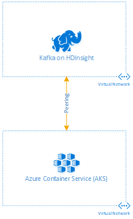
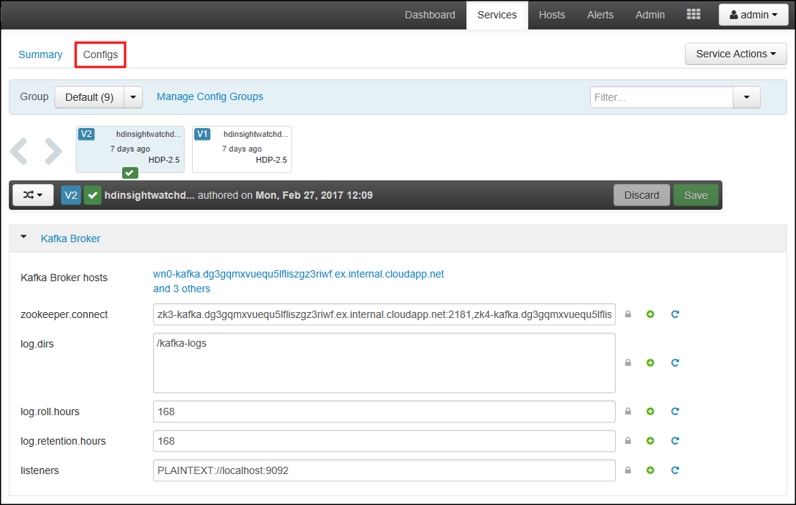
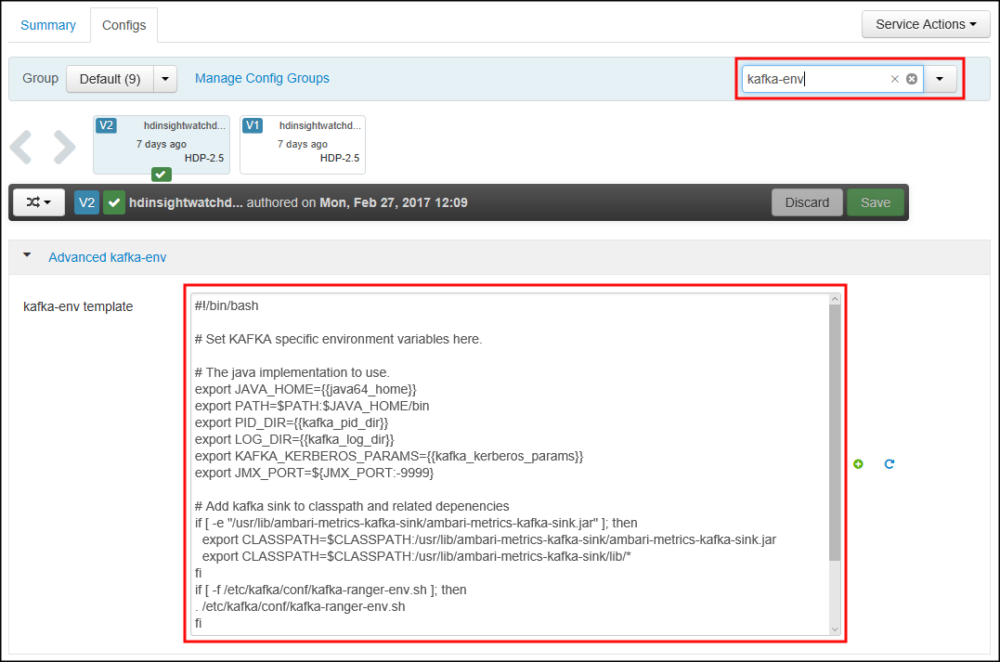

# Use Azure Kubernetes Service with Kafka on HDInsight

Learn how to use Azure Kubernetes Service (AKS) with Kafka on HDInsight cluster. The steps in this document use a Node.js application hosted in AKS to verify connectivity with Kafka. This application uses the [kafka-node](https://www.npmjs.com/package/kafka-node) package to communicate with Kafka. It uses [Socket.io](https://socket.io/) for event driven messaging between the browser client and the back-end hosted in AKS.

[Apache Kafka](https://kafka.apache.org) is an open-source distributed streaming platform that can be used to build real-time streaming data pipelines and applications. Azure Kubernetes Service manages your hosted Kubernetes environment, and makes it quick and easy to deploy containerized applications. Using an Azure Virtual Network, you can connect the two services.

> [!NOTE]
> The focus of this document is on the steps required to enable Azure Kubernetes Service to communicate with Kafka on HDInsight. The example itself is just a basic Kafka client to demonstrate that the configuration works.

## Prerequisites

* [Azure CLI](https://docs.microsoft.com/cli/azure/install-azure-cli?view=azure-cli-latest)
* An Azure subscription

This document assumes that you are familiar with creating and using the following Azure services:

* Kafka on HDInsight
* Azure Kubernetes Service
* Azure Virtual Networks

This document also assumes that you have walked through the [Azure Kubernetes Service tutorial](../../aks/tutorial-kubernetes-prepare-app.md). This tutorial creates a container service, creates a Kubernetes cluster, a container registry, and configures the `kubectl` utility.

## Architecture

### Network topology

Both HDInsight and AKS use an Azure Virtual Network as a container for compute resources. To enable communication between HDInsight and AKS, you must enable communication between their networks. The steps in this document use Virtual Network Peering to the networks. Other connections, such as VPN, should also work. For more information on peering, see the [Virtual network peering](../../virtual-network/virtual-network-peering-overview.md) document.


The following diagram illustrates the network topology used in this document:



> [!IMPORTANT]
> Name resolution is not enabled between the peered networks, so IP addressing is used. By default, Kafka on HDInsight is configured to return host names instead of IP addresses when clients connect. The steps in this document modify Kafka to use IP advertising instead.

## Create an Azure Kubernetes Service (AKS)

If you do not already have an AKS cluster, use one of the following documents to learn how to create one:

* [Deploy an Azure Kubernetes Service (AKS) cluster - Portal](../../aks/kubernetes-walkthrough-portal.md)
* [Deploy an Azure Kubernetes Service (AKS) cluster - CLI](../../aks/kubernetes-walkthrough.md)

> [!NOTE]
> AKS creates a virtual network during installation. This network is peered to the one created for HDInsight in the next section.

## Configure virtual network peering

1. From the [Azure portal](https://portal.azure.com), select __Resource groups__, and then find the resource group that contains the virtual network for your AKS cluster. The resource group name is `MC_<resourcegroup>_<akscluster>_<location>`. The `resourcegroup` and `akscluster` entries are the name of the resource group you created the cluster in, and the name of the cluster. The `location` is the location that the cluster was created in.

2. In the resource group, select the __Virtual network__ resource.

3. Select __Address space__. Note the address space listed.

4. To create a virtual network for HDInsight, select __+ Create a resource__, __Networking__, and then __Virtual network__.

    > [!IMPORTANT]
    > When entering the values for the new virtual network, you must use an address space that does not overlap the one used by the AKS cluster network.

    Use the same __Location__ for the virtual network that you used for the AKS cluster.

    Wait until the virtual network has been created before going to the next step.

5. To configure the peering between the HDInsight network and the AKS cluster network, select the virtual network and then select __Peerings__. Select __+ Add__ and use the following values to populate the form:

    * __Name__: Enter a unique name for this peering configuration.
    * __Virtual network__: Use this field to select the virtual network for the **AKS cluster**.

    Leave all other fields at the default value, then select __OK__ to configure the peering.

6. To configure the peering between the AKS cluster network and the HDInsight network, select the __AKS cluster virtual network__, and then select __Peerings__. Select __+ Add__ and use the following values to populate the form:

    * __Name__: Enter a unique name for this peering configuration.
    * __Virtual network__: Use this field to select the virtual network for the __HDInsight cluster__.

    Leave all other fields at the default value, then select __OK__ to configure the peering.

## Install Kafka on HDInsight

When creating the Kafka on HDInsight cluster, you must join the virtual network created earlier for HDInsight. For more information on creating a Kafka cluster, see the [Create a Kafka cluster](apache-kafka-get-started.md) document.

> [!IMPORTANT]
> When creating the cluster, you must use the __Advanced settings__ to join the virtual network that you created for HDInsight.

## Configure Kafka IP Advertising

Use the following steps to configure Kafka to advertise IP addresses instead of domain names:

1. Using a web browser, go to https://CLUSTERNAME.azurehdinsight.net. Replace __CLUSTERNAME__ with the name of the Kafka on HDInsight cluster.

    When prompted, use the HTTPS user name and password for the cluster. The Ambari Web UI for the cluster is displayed.

2. To view information on Kafka, select __Kafka__ from the list on the left.

    

3. To view Kafka configuration, select __Configs__ from the top middle.

    

4. To find the __kafka-env__ configuration, enter `kafka-env` in the __Filter__ field on the upper right.

    

5. To configure Kafka to advertise IP addresses, add the following text to the bottom of the __kafka-env-template__ field:

    ```
    # Configure Kafka to advertise IP addresses instead of FQDN
    IP_ADDRESS=$(hostname -i)
    echo advertised.listeners=$IP_ADDRESS
    sed -i.bak -e '/advertised/{/advertised@/!d;}' /usr/hdp/current/kafka-broker/conf/server.properties
    echo "advertised.listeners=PLAINTEXT://$IP_ADDRESS:9092" >> /usr/hdp/current/kafka-broker/conf/server.properties
    ```

6. To configure the interface that Kafka listens on, enter `listeners` in the __Filter__ field on the upper right.

7. To configure Kafka to listen on all network interfaces, change the value in the __listeners__ field to `PLAINTEXT://0.0.0.0:9092`.

8. To save the configuration changes, use the __Save__ button. Enter a text message describing the changes. Select __OK__ once the changes have been saved.

    

9. To prevent errors when restarting Kafka, use the __Service Actions__ button and select __Turn On Maintenance Mode__. Select OK to complete this operation.

    

10. To restart Kafka, use the __Restart__ button and select __Restart All Affected__. Confirm the restart, and then use the __OK__ button after the operation has completed.

    

11. To disable maintenance mode, use the __Service Actions__ button and select __Turn Off Maintenance Mode__. Select **OK** to complete this operation.

## Test the configuration

At this point, Kafka and Azure Kubernetes Service are in communication through the peered virtual networks. To test this connection, use the following steps:

1. Create a Kafka topic that is used by the test application. For information on creating Kafka topics, see the [Create a Kafka cluster](apache-kafka-get-started.md) document.

2. Download the example application from [https://github.com/Blackmist/Kafka-AKS-Test](https://github.com/Blackmist/Kafka-AKS-Test).

3. Edit the `index.js` file and change the following lines:

    * `var topic = 'mytopic'`: Replace `mytopic` with the name of the Kafka topic used by this application.
    * `var brokerHost = '176.16.0.13:9092`: Replace `176.16.0.13` with the internal IP address of one of the broker hosts for your cluster.

        To find the internal IP address of the broker hosts (workernodes) in the cluster, see the [Ambari REST API](../hdinsight-hadoop-manage-ambari-rest-api.md#example-get-the-internal-ip-address-of-cluster-nodes) document. Pick IP address of one of the entries where the domain name begins with `wn`.

4. From a command line in the `src` directory, install dependencies and use Docker to build an image for deployment:

    ```bash
    docker build -t kafka-aks-test .
    ```

    > [!NOTE]
    > Packages required by this application are checked into the repository, so you do not need to use the `npm` utility to install them.

5. Log in to your Azure Container Registry (ACR) and find the loginServer name:

    ```bash
    az acr login --name <acrName>
    az acr list --resource-group myResourceGroup --query "[].{acrLoginServer:loginServer}" --output table
    ```

    > [!NOTE]
    > If you don't know your Azure Container Registry name, or are unfamiliar with using the Azure CLI to work with the Azure Kubernetes Service, see the [AKS tutorials](../../aks/tutorial-kubernetes-prepare-app.md).

6. Tag the local `kafka-aks-test` image with the loginServer of your ACR. Also add `:v1` to the end to indicate the image version:

    ```bash
    docker tag kafka-aks-test <acrLoginServer>/kafka-aks-test:v1
    ```

7. Push the image to the registry:

    ```bash
    docker push <acrLoginServer>/kafka-aks-test:v1
    ```
    This operation takes several minutes to complete.

8. Edit the Kubernetes manifest file (`kafka-aks-test.yaml`) and replace `microsoft` with the ACR loginServer name retrieved in step 4.

9. Use the following command to deploy the application settings from the manifest:

    ```bash
    kubectl create -f kafka-aks-test.yaml
    ```

10. Use the following command to watch for the `EXTERNAL-IP` of the application:

    ```bash
    kubectl get service kafka-aks-test --watch
    ```

    Once an external IP address is assigned, use __CTRL + C__ to exit the watch

11. Open a web browser and enter the external IP address for the service. You arrive at a page similar to the following image:

    

12. Enter text into the field and then select the __Send__ button. The data is sent to Kafka. Then the Kafka consumer in the application reads the message and adds it to the __Messages from Kafka__ section.

    > [!WARNING]
    > You may receive multiple copies of a message. This problem usually happens when you refresh your browser after connecting, or open multiple browser connections to the application.

## Next steps

Use the following links to learn how to use Apache Kafka on HDInsight:

* [Get started with Kafka on HDInsight](apache-kafka-get-started.md)

* [Use MirrorMaker to create a replica of Kafka on HDInsight](apache-kafka-mirroring.md)

* [Use Apache Storm with Kafka on HDInsight](../hdinsight-apache-storm-with-kafka.md)

* [Use Apache Spark with Kafka on HDInsight](../hdinsight-apache-spark-with-kafka.md)

* [Connect to Kafka through an Azure Virtual Network](apache-kafka-connect-vpn-gateway.md)
