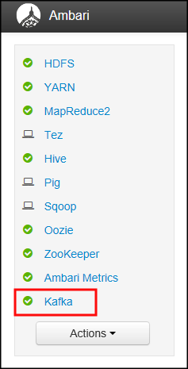
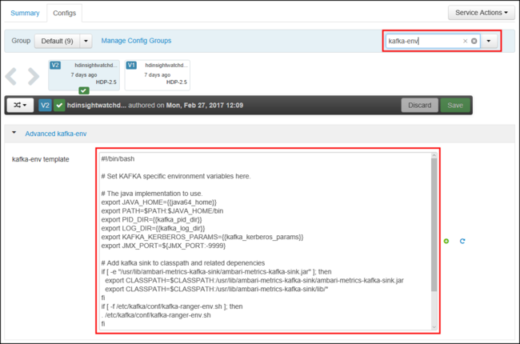
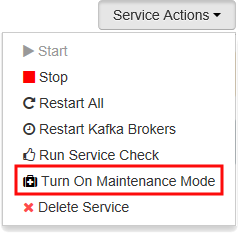
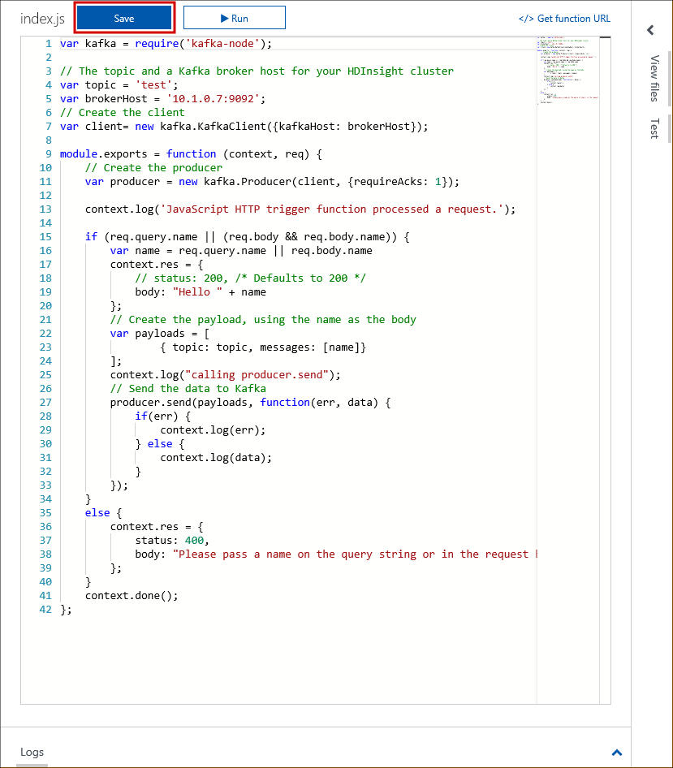
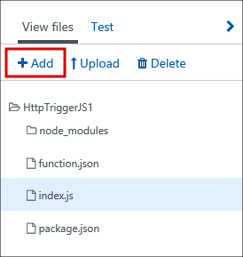
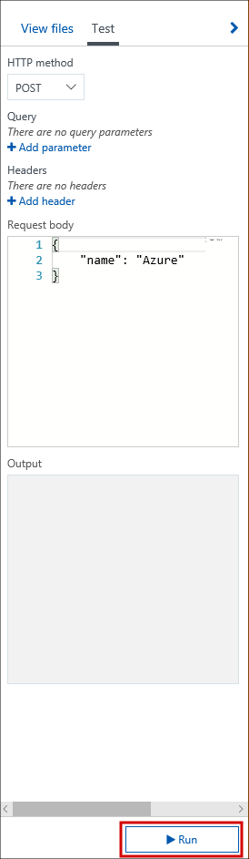
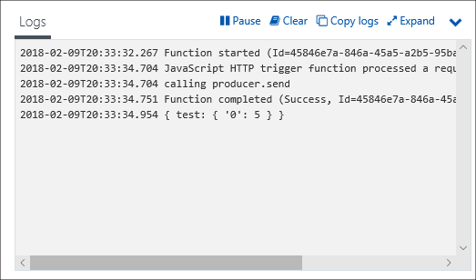

# Use Kafka on HDInsight from an Azure Function app

Learn how to create an Azure Function app that sends data to Kafka on HDInsight.

[Azure Functions](https://docs.microsoft.com/azure/azure-functions/) is a serverless compute service. It enables you to run code on-demand without having to explicitly provision or manage infrastructure.

[Apache Kafka](https://kafka.apache.org) is an open-source distributed streaming platform that can be used to build real-time streaming data pipelines and applications. Kafka also provides message broker functionality similar to a message queue, where you can publish and subscribe to named data streams. Kafka on HDInsight provides you with a managed, highly scalable, and highly available service in the Microsoft Azure cloud.

Kafka on HDInsight does not provide an API on the public internet. To publish or consume data from Kafka, you must connect to the Kafka cluster using an Azure Virtual Network. Azure Functions provides a convenient way to create a public endpoint that pushes data into Kafka on HDInsight through a Virtual Network gateway.

> [!NOTE]
> The focus of this document is on the steps required to enable Azure Functions to communicate with Kafka on HDInsight. The example itself is just a basic Kafka producer to demonstrate that the configuration works.

## Prerequisites

* An Azure Function app. For more information, see the [Create your first function](../../azure-functions/functions-create-first-azure-function.md) documentation.

* An Azure Virtual Network. To work with Azure Functions, the virtual network must use one of the following IP ranges:

    * 10.0.0.0-10.255.255.255
    * 172.16.0.0-172.31.255.255
    * 192.168.0.0-192.168.255.255

    For more information, see the [Integrate your app with an Azure Virtual Network](../../app-service/web-sites-integrate-with-vnet.md) document.

* A Kafka on HDInsight cluster. For information on creating a Kafka on HDInsight cluster, see the [Create a Kafka cluster](apache-kafka-get-started.md) document.

    > [!IMPORTANT]
    > During cluster configuration, you must use the __Advanced settings__ step to select the Azure Virtual Network and subnet that HDInsight uses. Select the virtual network and subnet created in the previous step.

    For more information on Kafka and virtual networks, see the [Connect to Kafka through a virtual network](apache-kafka-connect-vpn-gateway.md) document.

## Architecture

Kafka on HDInsight is contained in an Azure Virtual Network. Azure Functions can communicate with the virtual network by using a Point-to-Site gateway. The following image is a diagram of this network topology:


## Configure Kafka

The information in this section prepares the Kafka cluster to accept data from the Azure Function. It covers the following configuration actions:

* IP Advertising
* Gathering Kafka Broker IP addresses
* Creating a Kafka topic

### Configure Kafka for IP advertising

By default, Zookeeper returns the domain name of the Kafka brokers to clients. This configuration does not work without a DNS server, as the client (Azure Functions) cannot resolve names for the virtual network. For this configuration, use the following steps to configure Kafka to advertise IP addresses instead of domain names:

1. Using a web browser, go to https://CLUSTERNAME.azurehdinsight.net. Replace __CLUSTERNAME__ with the name of the Kafka on HDInsight cluster.

    When prompted, use the HTTPS user name and password for the cluster. The Ambari Web UI for the cluster is displayed.

2. To view information on Kafka, select __Kafka__ from the list on the left.

    

3. To view Kafka configuration, select __Configs__ from the top middle.

    

4. To find the __kafka-env__ configuration, enter `kafka-env` in the __Filter__ field on the upper right.

    

5. To configure Kafka to advertise IP addresses, add the following text to the bottom of the __kafka-env-template__ field:

    ```
    # Configure Kafka to advertise IP addresses instead of FQDN
    IP_ADDRESS=$(hostname -i)
    echo advertised.listeners=$IP_ADDRESS
    sed -i.bak -e '/advertised/{/advertised@/!d;}' /usr/hdp/current/kafka-broker/conf/server.properties
    echo "advertised.listeners=PLAINTEXT://$IP_ADDRESS:9092" >> /usr/hdp/current/kafka-broker/conf/server.properties
    ```

6. To configure the interface that Kafka listens on, enter `listeners` in the __Filter__ field on the upper right.

7. To configure Kafka to listen on all network interfaces, change the value in the __listeners__ field to `PLAINTEXT://0.0.0.0:9092`.

8. To save the configuration changes, use the __Save__ button. Enter a text message describing the changes. Select __OK__ once the changes have been saved.

    

9. To prevent errors when restarting Kafka, use the __Service Actions__ button and select __Turn On Maintenance Mode__. Select OK to complete this operation.

    

10. To restart Kafka, use the __Restart__ button and select __Restart All Affected__. Confirm the restart, and then use the __OK__ button after the operation has completed.

    

11. To disable maintenance mode, use the __Service Actions__ button and select __Turn Off Maintenance Mode__. Select **OK** to complete this operation.

### Get the Kafka broker IP address

Use one of the following methods to retrieve the fully qualified domain name (FQDN) and IP addresses of the nodes in the Kafka cluster:

```powershell
$resourceGroupName = "The resource group that contains the virtual network used with HDInsight"

$clusterNICs = Get-AzureRmNetworkInterface -ResourceGroupName $resourceGroupName | where-object {$_.Name -like "*node*"}

$nodes = @()
foreach($nic in $clusterNICs) {
    $node = new-object System.Object
    $node | add-member -MemberType NoteProperty -name "Type" -value $nic.Name.Split('-')[1]
    $node | add-member -MemberType NoteProperty -name "InternalIP" -value $nic.IpConfigurations.PrivateIpAddress
    $node | add-member -MemberType NoteProperty -name "InternalFQDN" -value $nic.DnsSettings.InternalFqdn
    $nodes += $node
}
$nodes | sort-object Type
```

```azurecli
az network nic list --resource-group <resourcegroupname> --output table --query "[?contains(name,'node')].{NICname:name,InternalIP:ipConfigurations[0].privateIpAddress,InternalFQDN:dnsSettings.internalFqdn}"
```

This command assumes that `<resourcegroupname>` is the name of the Azure resource group that contains the virtual network.

From the list of names returned, select the IP address of a workernode. The internal fully qualified domain name of the node begins with the letters `wn`. This IP address is used by the function to communicate with Kafka.

### Create a Kafka topic

Kafka stores data in __topics__. Before sending data to Kafka from an Azure Function, you need to create the function.

To create a topic, use the steps in the [Create a Kafka cluster](apache-kafka-get-started.md) document.

## Create a function that sends to Kafka

> [!NOTE]
> The steps in this section create a JavaScript function that uses the [kafka-node](https://www.npmjs.com/package/kafka-node) package to publish data to Kafka:

1. Create a new __WebHook + API__ function, and select __JavaScript__ as the language. For more information on creating new functions, see the [Create your first function](../../azure-functions/functions-create-first-azure-function.md#create-function) document.

2. Use the following code as the body of the function:

    ```javascript
    var kafka = require('kafka-node');

    // The topic and a Kafka broker host for your HDInsight cluster
    var topic = 'test';
    var brokerHost = '10.1.0.7:9092';
    // Create the client
    var client= new kafka.KafkaClient({kafkaHost: brokerHost});

    module.exports = function (context, req) {
        // Create the producer
        var producer = new kafka.Producer(client, {requireAcks: 1});

        context.log('JavaScript HTTP trigger function processed a request.');

        if (req.query.name || (req.body && req.body.name)) {
            var name = req.query.name || req.body.name
            context.res = {
                // status: 200, /* Defaults to 200 */
                body: "Hello " + name
            };
            // Create the payload, using the name as the body
            var payloads = [
                    { topic: topic, messages: [name]}
            ];
            context.log("calling producer.send");
            // Send the data to Kafka
            producer.send(payloads, function(err, data) {
                if(err) {
                    context.log(err);
                } else {
                    context.log(data);
                }
            });
        }
        else {
            context.res = {
                status: 400,
                body: "Please pass a name on the query string or in the request body"
            };
        }
        context.done();
    };
    ```

    Replace `'test'` with the name of the Kafka topic you created on your HDInsight cluster.

    Replace `10.1.0.7` with the IP address you retrieved earlier. Leave the `:9092` value. 9092 is the port that Kafka listens on.

    Use the __Save__ button to save the changes.

    

3. From the right of the function editor, select __View files__. Select __+ Add__ and add a new file named `package.json`. This file is used to specify the dependency on the `kafka-node` package.

    

4. To edit the new file, select `package.json` from the __View files__ list. Use the following text as the contents of the file:

    ```json
    {
    "name": "kafkatest",
    "version": "1.0.0",
    "description": "",
    "main": "index.js",
    "author": "",
    "license": "ISC",
    "dependencies": {
            "kafka-node": "^2.4.1"
        }
    }
    ```

    Use the __Save__ button to save the changes.

5. To install the `kafka-node` package, use the _Node version and package management_ section of the [Azure Functions JavaScript developer guide](../../azure-functions/functions-reference-node.md#node-version-and-package-management).

    > [!NOTE]
    > You may receive several errors as the kafka-node package is installed. You can safely ignore these errors.

## Run the function

From the right of the function editor, select __Test__. Leave the default settings for the test, and then select __Run__. As the test runs, it passes a `name` parameter to the function. This parameter contains a value of `Azure`, which the function inserts into Kafka.



To view information logged by the function while the test runs, select __Logs__ at the bottom of the page. Run the test again to generate log information.



## Verify the data is in Kafka

To verify that the data arrived in the Kafka topic, use the information in the _Produce and consume records_ section of the [Create a Kafka cluster](apache-kafka-get-started.md#produce-and-consume-records) document. The `kafka-console-consumer` reads data from the topic and displays a list of messages stored in the topic.

## Next steps

Use the following links to learn how to use Apache Kafka on HDInsight:

* [Get started with Kafka on HDInsight](apache-kafka-get-started.md)

* [Use MirrorMaker to create a replica of Kafka on HDInsight](apache-kafka-mirroring.md)

* [Use Apache Storm with Kafka on HDInsight](../hdinsight-apache-storm-with-kafka.md)

* [Use Apache Spark with Kafka on HDInsight](../hdinsight-apache-spark-with-kafka.md)

* [Connect to Kafka through an Azure Virtual Network](apache-kafka-connect-vpn-gateway.md)