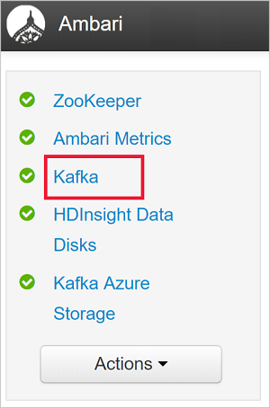
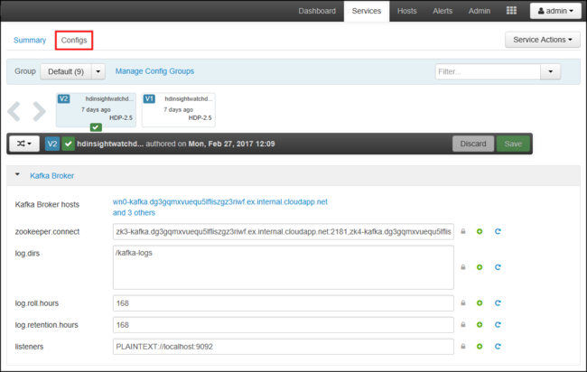

# Connect to Kafka on HDInsight through an Azure Virtual Network

Learn how to directly connect to Kafka on HDInsight through an Azure Virtual Network. This document provides information on connecting to Kafka using the following configurations:

* From resources in an on-premises network. This connection is established by using a VPN device (software or hardware) on your local network.
* From a development environment using a VPN software client.

## Architecture and planning

HDInsight does not allow direct connection to Kafka over the public internet. Instead, Kafka clients (producers and consumers) must use one of the following connection methods:

* Run the client in the same virtual network as Kafka on HDInsight. This configuration is used in the [Start with Apache Kafka on HDInsight](apache-kafka-get-started.md) document. The client runs directly on the HDInsight cluster nodes or on another virtual machine in the same network.

* Connect a private network, such as your on-premises network, to the virtual network. This configuration allows clients in your on-premises network to directly work with Kafka. To enable this configuration, perform the following tasks:

    1. Create a virtual network.
    2. Create a VPN gateway that uses a site-to-site configuration. The configuration used in this document connects to a VPN gateway device in your on-premises network.
    3. Create a DNS server in the virtual network.
    4. Configure forwarding between the DNS server in each network.
    5. Install Kafka on HDInsight into the virtual network.

    For more information, see the [Connect to Kafka from an on-premises network](#on-premises) section. 

* Connect individual machines to the virtual network using a VPN gateway and VPN client. To enable this configuration, perform the following tasks:

    1. Create a virtual network.
    2. Create a VPN gateway that uses a point-to-site configuration. This configuration can be used with both Windows and MacOS clients.
    3. Install Kafka on HDInsight into the virtual network.
    4. Configure Kafka for IP advertising. This configuration allows the client to connect using IP addressing instead of domain names.
    5. Download and use the VPN client on the development system.

    For more information, see the [Connect to Kafka with a VPN client](#vpnclient) section.

    > [!WARNING]
    > This configuration is only recommended for development purposes because of the following limitations:
    >
    > * Each client must connect using a VPN software client.
    > * The VPN client does not pass name resolution requests to the virtual network, so you must use IP addressing to communicate with Kafka. IP communication requires additional configuration on the Kafka cluster.

For more information on using HDInsight in a virtual network, see [Extend HDInsight by using Azure Virtual Networks](../hdinsight-extend-hadoop-virtual-network.md).

## <a id="on-premises"></a> Connect to Kafka from an on-premises network

To create a Kafka cluster that communicates with your on-premises network, follow the steps in the [Connect HDInsight to your on-premises network](./../connect-on-premises-network.md) document.

> [!IMPORTANT]
> When creating the HDInsight cluster, select the __Kafka__ cluster type.

These steps create the following configuration:

* Azure Virtual Network
* Site-to-site VPN gateway
* Azure Storage account (used by HDInsight)
* Kafka on HDInsight

To verify that a Kafka client can connect to the cluster from on-premises, use the steps in the [Example: Python client](#python-client) section.

## <a id="vpnclient"></a> Connect to Kafka with a VPN client

Use the steps in this section to create the following configuration:

* Azure Virtual Network
* Point-to-site VPN gateway
* Azure Storage Account (used by HDInsight)
* Kafka on HDInsight

1. Follow the steps in the [Working with self-signed certificates for Point-to-site connections](../../vpn-gateway/vpn-gateway-certificates-point-to-site.md) document. This document creates the certificates needed for the gateway.

2. Open a PowerShell prompt and use the following code to log in to your Azure subscription:

    ```powershell
    Connect-AzureRmAccount
    # If you have multiple subscriptions, uncomment to set the subscription
    #Select-AzureRmSubscription -SubscriptionName "name of your subscription"
    ```

3. Use the following code to create variables that contain configuration information:

    ```powershell
    # Prompt for generic information
    $resourceGroupName = Read-Host "What is the resource group name?"
    $baseName = Read-Host "What is the base name? It is used to create names for resources, such as 'net-basename' and 'kafka-basename':"
    $location = Read-Host "What Azure Region do you want to create the resources in?"
    $rootCert = Read-Host "What is the file path to the root certificate? It is used to secure the VPN gateway."

    # Prompt for HDInsight credentials
    $adminCreds = Get-Credential -Message "Enter the HTTPS user name and password for the HDInsight cluster" -UserName "admin"
    $sshCreds = Get-Credential -Message "Enter the SSH user name and password for the HDInsight cluster" -UserName "sshuser"

    # Names for Azure resources
    $networkName = "net-$baseName"
    $clusterName = "kafka-$baseName"
    $storageName = "store$baseName" # Can't use dashes in storage names
    $defaultContainerName = $clusterName
    $defaultSubnetName = "default"
    $gatewaySubnetName = "GatewaySubnet"
    $gatewayPublicIpName = "GatewayIp"
    $gatewayIpConfigName = "GatewayConfig"
    $vpnRootCertName = "rootcert"
    $vpnName = "VPNGateway"

    # Network settings
    $networkAddressPrefix = "10.0.0.0/16"
    $defaultSubnetPrefix = "10.0.0.0/24"
    $gatewaySubnetPrefix = "10.0.1.0/24"
    $vpnClientAddressPool = "172.16.201.0/24"

    # HDInsight settings
    $HdiWorkerNodes = 4
    $hdiVersion = "3.6"
    $hdiType = "Kafka"
    ```

4. Use the following code to create the Azure resource group and virtual network:

    ```powershell
    # Create the resource group that contains everything
    New-AzureRmResourceGroup -Name $resourceGroupName -Location $location

    # Create the subnet configuration
    $defaultSubnetConfig = New-AzureRmVirtualNetworkSubnetConfig -Name $defaultSubnetName `
        -AddressPrefix $defaultSubnetPrefix
    $gatewaySubnetConfig = New-AzureRmVirtualNetworkSubnetConfig -Name $gatewaySubnetName `
        -AddressPrefix $gatewaySubnetPrefix

    # Create the subnet
    New-AzureRmVirtualNetwork -Name $networkName `
        -ResourceGroupName $resourceGroupName `
        -Location $location `
        -AddressPrefix $networkAddressPrefix `
        -Subnet $defaultSubnetConfig, $gatewaySubnetConfig

    # Get the network & subnet that were created
    $network = Get-AzureRmVirtualNetwork -Name $networkName `
        -ResourceGroupName $resourceGroupName
    $gatewaySubnet = Get-AzureRmVirtualNetworkSubnetConfig -Name $gatewaySubnetName `
        -VirtualNetwork $network
    $defaultSubnet = Get-AzureRmVirtualNetworkSubnetConfig -Name $defaultSubnetName `
        -VirtualNetwork $network

    # Set a dynamic public IP address for the gateway subnet
    $gatewayPublicIp = New-AzureRmPublicIpAddress -Name $gatewayPublicIpName `
        -ResourceGroupName $resourceGroupName `
        -Location $location `
        -AllocationMethod Dynamic
    $gatewayIpConfig = New-AzureRmVirtualNetworkGatewayIpConfig -Name $gatewayIpConfigName `
        -Subnet $gatewaySubnet `
        -PublicIpAddress $gatewayPublicIp

    # Get the certificate info
    # Get the full path in case a relative path was passed
    $rootCertFile = Get-ChildItem $rootCert
    $cert = New-Object System.Security.Cryptography.X509Certificates.X509Certificate2($rootCertFile)
    $certBase64 = [System.Convert]::ToBase64String($cert.RawData)
    $p2sRootCert = New-AzureRmVpnClientRootCertificate -Name $vpnRootCertName `
        -PublicCertData $certBase64

    # Create the VPN gateway
    New-AzureRmVirtualNetworkGateway -Name $vpnName `
        -ResourceGroupName $resourceGroupName `
        -Location $location `
        -IpConfigurations $gatewayIpConfig `
        -GatewayType Vpn `
        -VpnType RouteBased `
        -EnableBgp $false `
        -GatewaySku Standard `
        -VpnClientAddressPool $vpnClientAddressPool `
        -VpnClientRootCertificates $p2sRootCert
    ```

    > [!WARNING]
    > It can take several minutes for this process to complete.

5. Use the following code to create the Azure Storage Account and blob container:

    ```powershell
    # Create the storage account
    New-AzureRmStorageAccount `
        -ResourceGroupName $resourceGroupName `
        -Name $storageName `
        -Type Standard_GRS `
        -Location $location

    # Get the storage account keys and create a context
    $defaultStorageKey = (Get-AzureRmStorageAccountKey -ResourceGroupName $resourceGroupName `
        -Name $storageName)[0].Value
    $storageContext = New-AzureStorageContext -StorageAccountName $storageName `
        -StorageAccountKey $defaultStorageKey

    # Create the default storage container
    New-AzureStorageContainer -Name $defaultContainerName `
        -Context $storageContext
    ```

6. Use the following code to create the HDInsight cluster:

    ```powershell
    # Create the HDInsight cluster
    New-AzureRmHDInsightCluster `
        -ResourceGroupName $resourceGroupName `
        -ClusterName $clusterName `
        -Location $location `
        -ClusterSizeInNodes $hdiWorkerNodes `
        -ClusterType $hdiType `
        -OSType Linux `
        -Version $hdiVersion `
        -HttpCredential $adminCreds `
        -SshCredential $sshCreds `
        -DefaultStorageAccountName "$storageName.blob.core.windows.net" `
        -DefaultStorageAccountKey $defaultStorageKey `
        -DefaultStorageContainer $defaultContainerName `
        -DisksPerWorkerNode 2 `
        -VirtualNetworkId $network.Id `
        -SubnetName $defaultSubnet.Id
    ```

  > [!WARNING]
  > This process takes around 15 minutes to complete.

### Configure Kafka for IP advertising

By default, Zookeeper returns the domain name of the Kafka brokers to clients. This configuration does not work with the VPN software client, as it cannot use name resolution for entities in the virtual network. For this configuration, use the following steps to configure Kafka to advertise IP addresses instead of domain names:

1. Using a web browser, go to https://CLUSTERNAME.azurehdinsight.net. Replace __CLUSTERNAME__ with the name of the Kafka on HDInsight cluster.

    When prompted, use the HTTPS user name and password for the cluster. The Ambari Web UI for the cluster is displayed.

2. To view information on Kafka, select __Kafka__ from the list on the left.

    

3. To view Kafka configuration, select __Configs__ from the top middle.

    

4. To find the __kafka-env__ configuration, enter `kafka-env` in the __Filter__ field on the upper right.

    

5. To configure Kafka to advertise IP addresses, add the following text to the bottom of the __kafka-env-template__ field:

    ```
    # Configure Kafka to advertise IP addresses instead of FQDN
    IP_ADDRESS=$(hostname -i)
    echo advertised.listeners=$IP_ADDRESS
    sed -i.bak -e '/advertised/{/advertised@/!d;}' /usr/hdp/current/kafka-broker/conf/server.properties
    echo "advertised.listeners=PLAINTEXT://$IP_ADDRESS:9092" >> /usr/hdp/current/kafka-broker/conf/server.properties
    ```

6. To configure the interface that Kafka listens on, enter `listeners` in the __Filter__ field on the upper right.

7. To configure Kafka to listen on all network interfaces, change the value in the __listeners__ field to `PLAINTEXT://0.0.0.0:9092`.

8. To save the configuration changes, use the __Save__ button. Enter a text message describing the changes. Select __OK__ once the changes have been saved.

    

9. To prevent errors when restarting Kafka, use the __Service Actions__ button and select __Turn On Maintenance Mode__. Select OK to complete this operation.

    

10. To restart Kafka, use the __Restart__ button and select __Restart All Affected__. Confirm the restart, and then use the __OK__ button after the operation has completed.

    

11. To disable maintenance mode, use the __Service Actions__ button and select __Turn Off Maintenance Mode__. Select **OK** to complete this operation.

### Connect to the VPN gateway

To connect to the VPN gateway, use the __Connect to Azure__ section of the [Configure a Point-to-Site connection](../../vpn-gateway/vpn-gateway-howto-point-to-site-rm-ps.md#connect) document.

## <a id="python-client"></a> Example: Python client

To validate connectivity to Kafka, use the following steps to create and run a Python producer and consumer:

1. Use one of the following methods to retrieve the fully qualified domain name (FQDN) and IP addresses of the nodes in the Kafka cluster:

    ```powershell
    $resourceGroupName = "The resource group that contains the virtual network used with HDInsight"

    $clusterNICs = Get-AzureRmNetworkInterface -ResourceGroupName $resourceGroupName | where-object {$_.Name -like "*node*"}

    $nodes = @()
    foreach($nic in $clusterNICs) {
        $node = new-object System.Object
        $node | add-member -MemberType NoteProperty -name "Type" -value $nic.Name.Split('-')[1]
        $node | add-member -MemberType NoteProperty -name "InternalIP" -value $nic.IpConfigurations.PrivateIpAddress
        $node | add-member -MemberType NoteProperty -name "InternalFQDN" -value $nic.DnsSettings.InternalFqdn
        $nodes += $node
    }
    $nodes | sort-object Type
    ```

    ```azurecli
    az network nic list --resource-group <resourcegroupname> --output table --query "[?contains(name,'node')].{NICname:name,InternalIP:ipConfigurations[0].privateIpAddress,InternalFQDN:dnsSettings.internalFqdn}"
    ```

    This script assumes that `$resourceGroupName` is the name of the Azure resource group that contains the virtual network.

    Save the returned information for use in the next steps.

2. Use the following to install the [kafka-python](http://kafka-python.readthedocs.io/) client:

        pip install kafka-python

3. To send data to Kafka, use the following Python code:

  ```python
  from kafka import KafkaProducer
  # Replace the `ip_address` entries with the IP address of your worker nodes
  # NOTE: you don't need the full list of worker nodes, just one or two.
  producer = KafkaProducer(bootstrap_servers=['kafka_broker_1','kafka_broker_2'])
  for _ in range(50):
      producer.send('testtopic', b'test message')
  ```

    Replace the `'kafka_broker'` entries with the addresses returned from step 1 in this section:

    * If you are using a __Software VPN client__, replace the `kafka_broker` entries with the IP address of your worker nodes.

    * If you have __enabled name resolution through a custom DNS server__, replace the `kafka_broker` entries with the FQDN of the worker nodes.

    > [!NOTE]
    > This code sends the string `test message` to the topic `testtopic`. The default configuration of Kafka on HDInsight is to create the topic if it does not exist.

4. To retrieve the messages from Kafka, use the following Python code:

   ```python
   from kafka import KafkaConsumer
   # Replace the `ip_address` entries with the IP address of your worker nodes
   # Again, you only need one or two, not the full list.
   # Note: auto_offset_reset='earliest' resets the starting offset to the beginning
   #       of the topic
   consumer = KafkaConsumer(bootstrap_servers=['kafka_broker_1','kafka_broker_2'],auto_offset_reset='earliest')
   consumer.subscribe(['testtopic'])
   for msg in consumer:
     print (msg)
   ```

    Replace the `'kafka_broker'` entries with the addresses returned from step 1 in this section:

    * If you are using a __Software VPN client__, replace the `kafka_broker` entries with the IP address of your worker nodes.

    * If you have __enabled name resolution through a custom DNS server__, replace the `kafka_broker` entries with the FQDN of the worker nodes.

## Next steps

For more information on using HDInsight with a virtual network, see the [Extend Azure HDInsight using an Azure Virtual Network](../hdinsight-extend-hadoop-virtual-network.md) document.

For more information on creating an Azure Virtual Network with Point-to-Site VPN gateway, see the following documents:

* [Configure a Point-to-Site connection using the Azure portal](../../vpn-gateway/vpn-gateway-howto-point-to-site-resource-manager-portal.md)

* [Configure a Point-to-Site connection using Azure PowerShell](../../vpn-gateway/vpn-gateway-howto-point-to-site-rm-ps.md)

For more information on working with Kafka on HDInsight, see the following documents:

* [Get started with Kafka on HDInsight](apache-kafka-get-started.md)
* [Use mirroring with Kafka on HDInsight](apache-kafka-mirroring.md)
