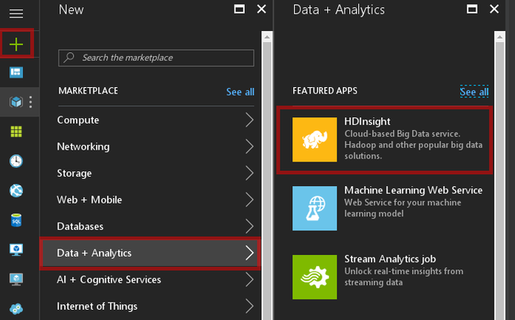
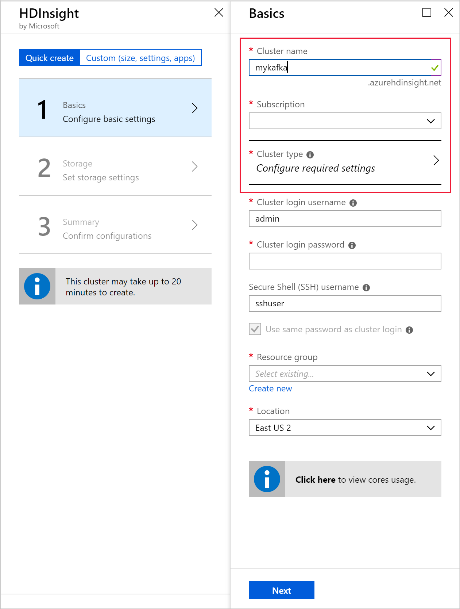
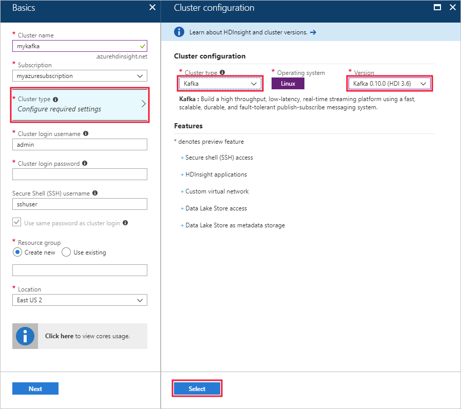
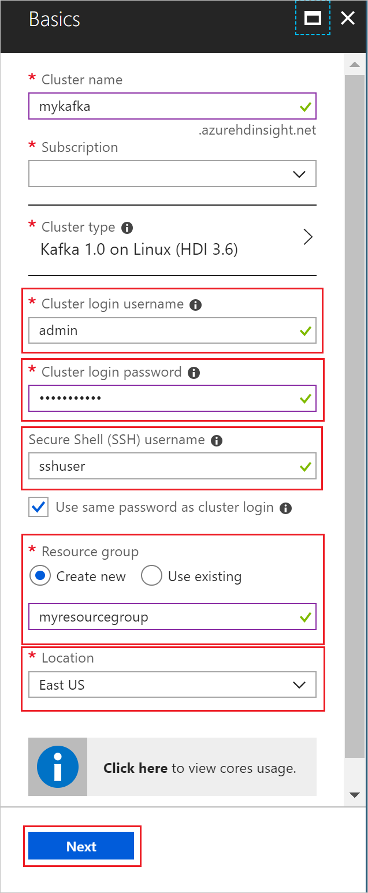
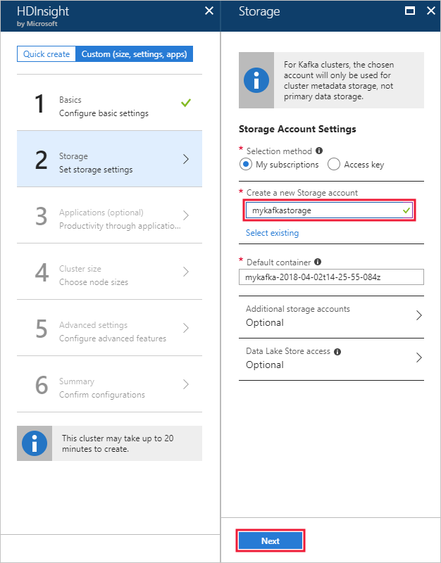
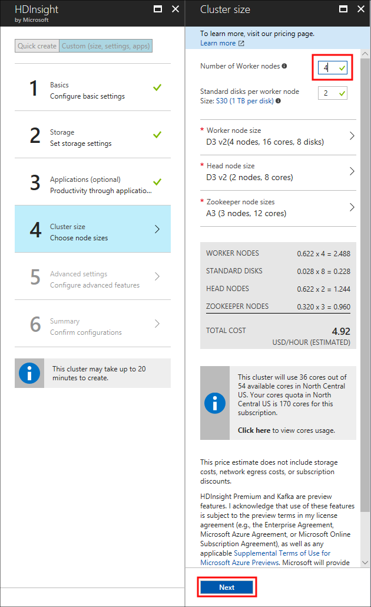
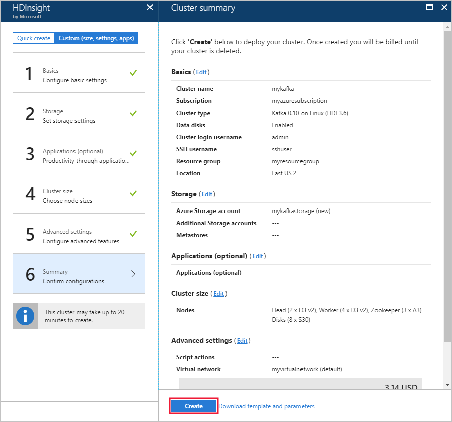

# Quickstart: Create a Kafka on HDInsight cluster

Kafka is an open-source, distributed streaming platform. It's often used as a message broker, as it provides functionality similar to a publish-subscribe message queue. 

In this quickstart, you learn how to create an [Apache Kafka](https://kafka.apache.org) cluster using the Azure portal. You also learn how to use included utilities to send and receive messages using Kafka.

[!INCLUDE [delete-cluster-warning](../../../includes/hdinsight-delete-cluster-warning.md)]

> [!IMPORTANT]
> The Kafka API can only be accessed by resources inside the same virtual network. In this quickstart, you access the cluster directly using SSH. To connect other services, networks, or virtual machines to Kafka, you must first create a virtual network and then create the resources within the network.
>
> For more information, see the [Connect to Kafka using a virtual network](apache-kafka-connect-vpn-gateway.md) document.

## Prerequisites

* An Azure subscription. If you don’t have an Azure subscription, create a [free account](https://azure.microsoft.com/free/?WT.mc_id=A261C142F) before you begin.

* An SSH client. The steps in this document use SSH to connect to the cluster.

    The `ssh` command is provided by default on Linux, Unix, and macOS systems. On Windows 10, use one of the following methods to install the `ssh` command:

    * Use the [Azure Cloud Shell](https://docs.microsoft.com/azure/cloud-shell/quickstart). The cloud shell provides the `ssh` command, and can be configured to use either Bash or PowerShell as the shell environment.

    * [Install the Windows Subsystem for Linux](https://docs.microsoft.com/windows/wsl/install-win10). The Linux distributions available through the Microsoft Store provide the `ssh` command.

    > [!IMPORTANT]
    > The steps in this document assume that you are using one of the SSH clients mentioned above. If you are using a different SSH client and encounter problems, please consult the documentation for your SSH client.
    >
    > For more information, see the [Use SSH with HDInsight](../hdinsight-hadoop-linux-use-ssh-unix.md) document.

## Create a Kafka cluster

To create a Kafka on HDInsight cluster, use the following steps:

1. From the [Azure portal](https://portal.azure.com), select **+ Create a resource**, **Data + Analytics**, and then select **HDInsight**.
   
    

2. From **Basics**, enter or select the following information:

    | Setting | Value |
    | --- | --- |
    | Cluster Name | A unique name for the HDInsight cluster. |
    | Subscription | Select your subscription. |
    
    Select __Cluster Type__ to display the **Cluster configuration**.

    

3. From the __Cluster configuration__, select the following values:

    | Setting | Value |
    | --- | --- |
    | Cluster Type | Kafka |
    | Version | Kafka 1.1.0 (HDI 3.6) |

    Use the **Select** button to save the cluster type settings and return to __Basics__.

    

4. From __Basics__, enter or select the following information:

    | Setting | Value |
    | --- | --- |
    | Cluster login username | The login name when accessing web services or REST APIs hosted on the cluster. Keep the default value (admin). |
    | Cluster login password | The login password when accessing web services or REST APIs hosted on the cluster. |
    | Secure Shell (SSH) username | The login used when accessing the cluster over SSH. By default the password is the same as the cluster login password. |
    | Resource Group | The resource group to create the cluster in. |
    | Location | The Azure region to create the cluster in. |

    > [!TIP]
    > Each Azure region (location) provides _fault domains_. A fault domain is a logical grouping of underlying hardware in an Azure data center. Each fault domain shares a common power source and network switch. The virtual machines and managed disks that implement the nodes within an HDInsight cluster are distributed across these fault domains. This architecture limits the potential impact of physical hardware failures.
    >
    > For high availability of data, select a region (location) that contains __three fault domains__. For information on the number of fault domains in a region, see the [Availability of Linux virtual machines](../../virtual-machines/windows/manage-availability.md#use-managed-disks-for-vms-in-an-availability-set) document.

    

    Use the __Next__ button to finish basic configuration.

5. From **Storage**, select or create a Storage account. For the steps in this document, leave the other fields at the default values. Use the __Next__ button to save storage configuration. For more information on using Data Lake Storage Gen2, see [Quickstart: Set up clusters in HDInsight](../../storage/data-lake-storage/quickstart-create-connect-hdi-cluster.md).

    

6. From __Applications (optional)__, select __Next__ to continue with the default settings.

7. From __Cluster size__, select __Next__ to continue with the default settings.

    > [!IMPORTANT]
    > To guarantee availability of Kafka on HDInsight, the __number of worker nodes__ entry must be set to 3 or greater. The default value is 4.
    
    > [!TIP]
    > The **disks per worker node** entry configures the scalability of Kafka on HDInsight. Kafka on HDInsight uses the local disk of the virtual machines in the cluster to store data. Kafka is I/O heavy, so [Azure Managed Disks](../../virtual-machines/windows/managed-disks-overview.md) are used to provide high throughput and more storage per node. The type of managed disk can be either __Standard__ (HDD) or __Premium__ (SSD). The type of disk depends on the VM size used by the worker nodes (Kafka brokers). Premium disks are used automatically with DS and GS series VMs. All other VM types use standard.

    

8. From __Advanced settings__, select __Next__ to continue with the default settings.

9. From the **Summary**, review the configuration for the cluster. Use the __Edit__ links to change any settings that are incorrect. Finally, use the__Create__ button to create the cluster.
   
    
   
    > [!NOTE]
    > It can take up to 20 minutes to create the cluster.

## Connect to the cluster

1. To connect to the primary head node of the Kafka cluster, use the following command. Replace `sshuser` with the SSH user name. Replace `mykafka` with the name of your Kafka cluster

    ```bash
    ssh sshuser@mykafka-ssh.azurehdinsight.net
    ```

2. When you first connect to the cluster, your SSH client may display a warning that the authenticity of the host can't be established. When prompted type __yes__, and then press __Enter__ to add the host to your SSH client's trusted server list.

3. When prompted, enter the password for the SSH user.

Once connected, you see information similar to the following text:

```text
Authorized uses only. All activity may be monitored and reported.
Welcome to Ubuntu 16.04.4 LTS (GNU/Linux 4.13.0-1011-azure x86_64)

 * Documentation:  https://help.ubuntu.com
 * Management:     https://landscape.canonical.com
 * Support:        https://ubuntu.com/advantage

  Get cloud support with Ubuntu Advantage Cloud Guest:
    http://www.ubuntu.com/business/services/cloud

83 packages can be updated.
37 updates are security updates.


Welcome to Kafka on HDInsight.

Last login: Thu Mar 29 13:25:27 2018 from 108.252.109.241
ssuhuser@hn0-mykafk:~$
```

## <a id="getkafkainfo"></a>Get the Zookeeper and Broker host information

When working with Kafka, you must know the *Zookeeper* and *Broker* hosts. These hosts are used with the Kafka API and many of the utilities that ship with Kafka.

In this section, you get the host information from the Ambari REST API on the cluster.

1. From the SSH connection to the cluster, use the following command to install the `jq` utility. This utility is used to parse JSON documents, and is useful in retrieving the host information:
   
    ```bash
    sudo apt -y install jq
    ```

2. To set an environment variable to the cluster name, use the following command:

    ```bash
    read -p "Enter the Kafka on HDInsight cluster name: " CLUSTERNAME
    ```

    When prompted, enter the name of the Kafka cluster.

3. To set an environment variable with Zookeeper host information, use the following command:
    
    ```bash
    export KAFKAZKHOSTS=`curl -sS -u admin -G http://headnodehost:8080/api/v1/clusters/$CLUSTERNAME/services/ZOOKEEPER/components/ZOOKEEPER_SERVER | jq -r '["\(.host_components[].HostRoles.host_name):2181"] | join(",")' | cut -d',' -f1,2`
    ```

    > [!TIP]
    > This command directly queries the Ambari service on the cluster head node. You can also access ambari using the public address of `https://$CLUSTERNAME.azurehdinsight.net:80/`. Some network configurations can prevent access to the public address. For example, using Network Security Groups (NSG) to restrict access to HDInsight in a virtual network.

    When prompted, enter the password for the cluster login account (not the SSH account).

    > [!NOTE]
    > This command retrieves all Zookeeper hosts, then returns only the first two entries. This is because you want some redundancy in case one host is unreachable.

4. To verify that the environment variable is set correctly, use the following command:

    ```bash
     echo '$KAFKAZKHOSTS='$KAFKAZKHOSTS
    ```

    This command returns information similar to the following text:

    `zk0-kafka.eahjefxxp1netdbyklgqj5y1ud.ex.internal.cloudapp.net:2181,zk2-kafka.eahjefxxp1netdbyklgqj5y1ud.ex.internal.cloudapp.net:2181`

5. To set an environment variable with Kafka broker host information, use the following command:

    ```bash
    export KAFKABROKERS=`curl -sS -u admin -G http://headnodehost:8080/api/v1/clusters/$CLUSTERNAME/services/KAFKA/components/KAFKA_BROKER | jq -r '["\(.host_components[].HostRoles.host_name):9092"] | join(",")' | cut -d',' -f1,2`
    ```

    When prompted, enter the password for the cluster login account (not the SSH account).

6. To verify that the environment variable is set correctly, use the following command:

    ```bash   
    echo '$KAFKABROKERS='$KAFKABROKERS
    ```

    This command returns information similar to the following text:
   
    `wn1-kafka.eahjefxxp1netdbyklgqj5y1ud.cx.internal.cloudapp.net:9092,wn0-kafka.eahjefxxp1netdbyklgqj5y1ud.cx.internal.cloudapp.net:9092`

## Manage Kafka topics

Kafka stores streams of data in *topics*. You can use the `kafka-topics.sh` utility to manage topics.

* **To create a topic**, use the following command in the SSH connection:

    ```bash
    /usr/hdp/current/kafka-broker/bin/kafka-topics.sh --create --replication-factor 3 --partitions 8 --topic test --zookeeper $KAFKAZKHOSTS
    ```

    This command connects to Zookeeper using the host information stored in `$KAFKAZKHOSTS`. It then creates a Kafka topic named **test**. 

    * Data stored in this topic is partitioned across eight partitions.

    * Each partition is replicated across three worker nodes in the cluster.

        > [!IMPORTANT]
        > If you created the cluster in an Azure region that provides three fault domains, use a replication factor of 3. Otherwise, use a replication factor of 4.
        
        In regions with three fault domains, a replication factor of 3 allows replicas to be spread across the fault domains. In regions with two fault domains, a replication factor of four spreads the replicas evenly across the domains.
        
        For information on the number of fault domains in a region, see the [Availability of Linux virtual machines](../../virtual-machines/windows/manage-availability.md#use-managed-disks-for-vms-in-an-availability-set) document.

        > [!IMPORTANT] 
        > Kafka is not aware of Azure fault domains. When creating partition replicas for topics, it may not distribute replicas properly for high availability.

        To ensure high availability, use the [Kafka partition rebalance tool](https://github.com/hdinsight/hdinsight-kafka-tools). This tool must be ran from an SSH connection to the head node of your Kafka cluster.

        For the highest availability of your Kafka data, you should rebalance the partition replicas for your topic when:

        * You create a new topic or partition

        * You scale up a cluster

* **To list topics**, use the following command:

    ```bash
    /usr/hdp/current/kafka-broker/bin/kafka-topics.sh --list --zookeeper $KAFKAZKHOSTS
    ```

    This command lists the topics available on the Kafka cluster.

* **To delete a topic**, use the following command:

    ```bash
    /usr/hdp/current/kafka-broker/bin/kafka-topics.sh --delete --topic topicname --zookeeper $KAFKAZKHOSTS
    ```

    This command deletes the topic named `topicname`.

    > [!WARNING]
    > If you delete the `test` topic created earlier, then you must recreate it. It is used by steps later in this document.

For more information on the commands available with the `kafka-topics.sh` utility, use the following command:

```bash
/usr/hdp/current/kafka-broker/bin/kafka-topics.sh
```

## Produce and consume records

Kafka stores *records* in topics. Records are produced by *producers*, and consumed by *consumers*. Producers and consumers communicate with the *Kafka broker* service. Each worker node in your HDInsight cluster is a Kafka broker host.

To store records into the test topic you created earlier, and then read them using a consumer, use the following steps:

1. To write records to the topic, use the `kafka-console-producer.sh` utility from the SSH connection:
   
    ```bash
    /usr/hdp/current/kafka-broker/bin/kafka-console-producer.sh --broker-list $KAFKABROKERS --topic test
    ```
   
    After this command, you arrive at an empty line.

2. Type a text message on the empty line and hit enter. Enter a few messages this way, and then use **Ctrl + C** to return to the normal prompt. Each line is sent as a separate record to the Kafka topic.

3. To read records from the topic, use the `kafka-console-consumer.sh` utility from the SSH connection:
   
    ```bash
    /usr/hdp/current/kafka-broker/bin/kafka-console-consumer.sh --bootstrap-server $KAFKABROKERS --topic test --from-beginning
    ```
   
    This command retrieves the records from the topic and displays them. Using `--from-beginning` tells the consumer to start from the beginning of the stream, so all records are retrieved.

    > [!NOTE]
    > If you are using an older version of Kafka, replace `--bootstrap-server $KAFKABROKERS` with `--zookeeper $KAFKAZKHOSTS`.

4. Use __Ctrl + C__ to stop the consumer.

You can also programmatically create producers and consumers. For an example of using this API, see the [Kafka Producer and Consumer API with HDInsight](apache-kafka-producer-consumer-api.md) document.

## Clean up resources

To clean up the resources created by this quickstart, you can delete the resource group. Deleting the resource group also deletes the associated HDInsight cluster, and any other resources associated with the resource group.

To remove the resource group using the Azure portal:

1. In the Azure portal, expand the menu on the left side to open the menu of services, and then choose __Resource Groups__ to display the list of your resource groups.
2. Locate the resource group to delete, and then right-click the __More__ button (...) on the right side of the listing.
3. Select __Delete resource group__, and then confirm.

> [!WARNING]
> HDInsight cluster billing starts once a cluster is created and stops when the cluster is deleted. Billing is pro-rated per minute, so you should always delete your cluster when it is no longer in use.
> 
> Deleting a Kafka on HDInsight cluster deletes any data stored in Kafka.

## Next steps

> [!div class="nextstepaction"]
> [Use Apache Spark with Kafka](../hdinsight-apache-kafka-spark-structured-streaming.md)

