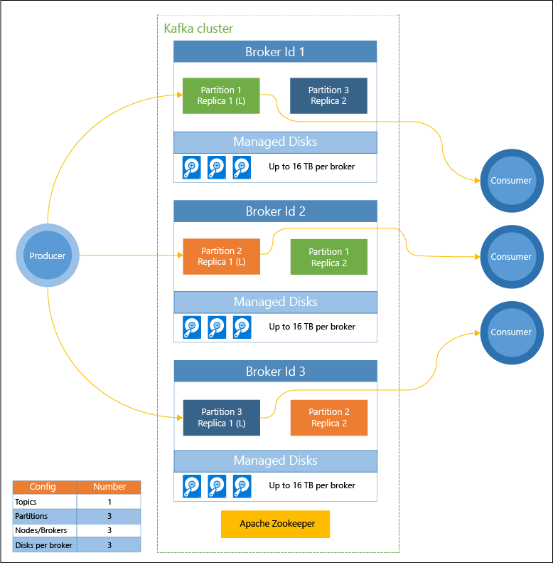

# What is Apache Kafka on HDInsight?

[Apache Kafka](https://kafka.apache.org) is an open-source distributed streaming platform that can be used to build real-time streaming data pipelines and applications. Kafka also provides message broker functionality similar to a message queue, where you can publish and subscribe to named data streams. Kafka on HDInsight provides you with a managed, highly scalable, and highly available service in the Microsoft Azure cloud. 

## Why use Kafka on HDInsight?

Kafka on HDInsight provides the following features:

* __99.9% Service Level Agreement (SLA) on Kafka uptime__: For more information, see the [SLA information for HDInsight](https://azure.microsoft.com/support/legal/sla/hdinsight/v1_0/) document.

* __Fault-tolerance__: Kafka was designed with a single dimensional view of a rack, which works well on some environments. However on environments such as Azure, a rack is separated out into two dimensions - Update Domains (UDs) and Fault Domains (FDs). Microsoft provides tools that can rebalance Kafka partitions and replicas across UDs and FDs. 

    For more information, see [High availability with Kafka on HDInsight](apache-kafka-high-availability.md).

* **Integration with Azure Managed Disks**: Managed disks provide higher scale and throughput for the disks used by Kafka on HDInsight, up to 16 TB per node in the cluster.

    For information on configuring managed disks with Kafka on HDInsight, see [Increase scalability of Kafka on HDInsight](apache-kafka-scalability.md).

    For more information on managed disks, see [Azure Managed Disks](../../virtual-machines/windows/managed-disks-overview.md).

* **Alerting, monitoring, and predictive maintenance**: Azure Log Analytics can be used to monitor Kafka on HDInsight. Log Analytics surfaces virtual machine level information, such as disk and NIC metrics, and JMX metrics from Kafka.

    For more information, see [Analyze logs for Kafka on HDInsight](apache-kafka-log-analytics-operations-management.md).

* **Replication of Kafka data**: Kafka provides the MirrorMaker utility, which replicates data between Kafka clusters.

    For information on using MirrorMaker, see [Replicate Kafka topics with Kafka on HDInsight](apache-kafka-mirroring.md).

* **Cluster scaling**: HDInsight allows you to change the number of worker nodes (which host the Kafka-broker) after cluster creation. Scaling can be performed from the Azure portal, Azure PowerShell, and other Azure management interfaces. For Kafka, you should rebalance partition replicas after scaling operations. Rebalancing partitions allows Kafka to take advantage of the new number of worker nodes.

    For more information, see [High availability with Kafka on HDInsight](apache-kafka-high-availability.md).

* **Publish-subscribe messaging pattern**: Kafka provides a Producer API for publishing records to a Kafka topic. The Consumer API is used when subscribing to a topic.

    For more information, see [Start with Kafka on HDInsight](apache-kafka-get-started.md).

* **Stream processing**: Kafka is often used with Apache Storm or Spark for real-time stream processing. Kafka 0.10.0.0 (HDInsight version 3.5 and 3.6) introduced a streaming API that allows you to build streaming solutions without requiring Storm or Spark.

    For more information, see [Start with Kafka on HDInsight](apache-kafka-get-started.md).

* **Horizontal scale**: Kafka partitions streams across the nodes in the HDInsight cluster. Consumer processes can be associated with individual partitions to provide load balancing when consuming records.

    For more information, see [Start with Kafka on HDInsight](apache-kafka-get-started.md).

* **In-order delivery**: Within each partition, records are stored in the stream in the order that they were received. By associating one consumer process per partition, you can guarantee that records are processed in-order.

    For more information, see [Start with Kafka on HDInsight](apache-kafka-get-started.md).

## Use cases

* **Messaging**: Since it supports the publish-subscribe message pattern, Kafka is often used as a message broker.

* **Activity tracking**: Since Kafka provides in-order logging of records, it can be used to track and re-create activities. For example, user actions on a web site or within an application.

* **Aggregation**: Using stream processing, you can aggregate information from different streams to combine and centralize the information into operational data.

* **Transformation**: Using stream processing, you can combine and enrich data from multiple input topics into one or more output topics.

## Architecture

This diagram shows a typical Kafka configuration that uses consumer groups, partitioning, and replication to offer parallel reading of events with fault tolerance. Apache ZooKeeper is built for concurrent, resilient, and low-latency transactions, as it manages the state of the Kafka cluster. Kafka stores records in *topics*. Records are produced by *producers*, and consumed by *consumers*. Producers retrieve records from Kafka *brokers*. Each worker node in your HDInsight cluster is a Kafka broker. One partition is created for each consumer, allowing parallel processing of the streaming data. Replication is employed to spread the partitions across nodes, protecting against node (broker) outages. A partition denoted with an *(L)* is the leader for the given partition. Producer traffic is routed to the leader of each node, using the state managed by ZooKeeper.

Each Kafka broker uses Azure Managed Disks. The number of disks is user-defined, and can provide up to 16 TB of storage per broker.

> [!IMPORTANT]
> Kafka is not aware of the underlying hardware (rack) in the Azure data center. To ensure that partitions are correctly balanced across the underlying hardware, see the [Configure high availability of data (Kafka)](apache-kafka-high-availability.md) document.

## Next steps

Use the following links to learn how to use Apache Kafka on HDInsight:

* [Quickstart: Create Kafka on HDInsight](apache-kafka-get-started.md)

* [Tutorial: Use Apache Spark with Kafka on HDInsight](../hdinsight-apache-spark-with-kafka.md)

* [Tutorial: Use Apache Storm with Kafka on HDInsight](../hdinsight-apache-storm-with-kafka.md)