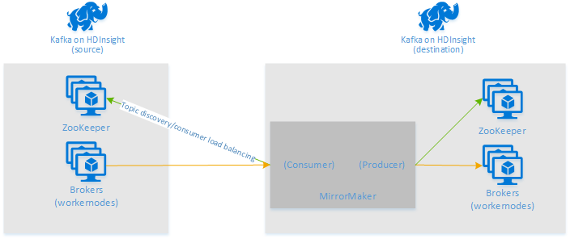
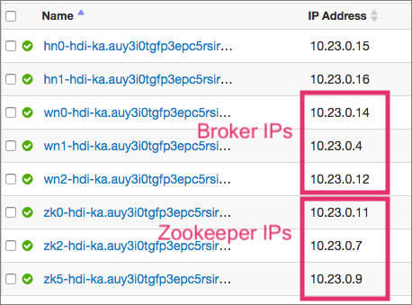

# Use MirrorMaker to replicate Apache Kafka topics with Kafka on HDInsight

Learn how to use Apache Kafka's mirroring feature to replicate topics to a secondary cluster. Mirroring can be ran as a continuous process, or used intermittently as a method of migrating data from one cluster to another.

In this example, mirroring is used to replicate topics between two HDInsight clusters. Both clusters are in different virtual networks in different datacenters.

> [!WARNING]  
> Mirroring should not be considered as a means to achieve fault-tolerance. The offset to items within a topic are different between the primary and secondary clusters, so clients cannot use the two interchangeably.
>
> If you are concerned about fault tolerance, you should set replication for the topics within your cluster. For more information, see [Get started with Apache Kafka on HDInsight](apache-kafka-get-started.md).

## How Apache Kafka mirroring works

Mirroring works by using the [MirrorMaker](https://cwiki.apache.org/confluence/pages/viewpage.action?pageId=27846330) tool (part of Apache Kafka) to consume records from topics on the primary cluster and then create a local copy on the secondary cluster. MirrorMaker uses one (or more) *consumers* that read from the primary cluster, and a *producer* that writes to the local (secondary) cluster.

The following diagram illustrates the Mirroring process:



Apache Kafka on HDInsight does not provide access to the Kafka service over the public internet. Kafka producers or consumers must be in the same Azure virtual network as the nodes in the Kafka cluster. For this example, both the Kafka primary and secondary clusters are located in an Azure virtual network. The following diagram shows how communication flows between the clusters:


The primary and secondary clusters can be different in the number of nodes and partitions, and offsets within the topics are different also. Mirroring maintains the key value that is used for partitioning, so record order is preserved on a per-key basis.

### Mirroring across network boundaries

If you need to mirror between Kafka clusters in different networks, there are the following additional considerations:

* **Gateways**: The networks must be able to communicate at the TCP/IP level.

* **Server addressing**: You can choose to address your cluster nodes using their IP addresses or fully qualified domain names.

    * **IP addresses**: If you configure your Kafka clusters to use IP address advertising, you can proceed with the mirroring setup using the IP addresses of the broker nodes and zookeeper nodes.
    
    * **Domain names**: If you don't configure your Kafka clusters for IP address advertising, the clusters must be able to connect to each other by using hostnames. This may require a Domain Name System (DNS) server in each network that is configured to forward requests to the other networks. When creating an Azure Virtual Network, instead of using the automatic DNS provided with the network, you must specify a custom DNS server and the IP address for the server. After the Virtual Network has been created, you must then create an Azure Virtual Machine that uses that IP address, then install and configure DNS software on it.

    > [!WARNING]  
    > Create and configure the custom DNS server before installing HDInsight into the Virtual Network. There is no additional configuration required for HDInsight to use the DNS server configured for the Virtual Network.

For more information on connecting two Azure Virtual Networks, see [Configure a VNet-to-VNet connection](../../vpn-gateway/vpn-gateway-vnet-vnet-rm-ps.md).

## Mirroring architecture

This architecture features two clusters in different resource groups and virtual networks: a **primary** and **secondary**.

### Creation steps

1. Create two new resource groups **kafka-primary-rg** in **Central US** and **kafka-secondary-rg** in **North Central US**
1. Create a new virtual network **kafka-primary-vnet** in **kafka-primary-rg**. Leave the default settings.
1. Create a new virtual network **kafka-secondary-vnet** in **kafka-secondary-rg**
1. Create a new Kafka cluster **kafka-primary-cluster** in the **kafka-primary-rg** resource group, using the **kafka-primary-vnet** virtual network. Create a new storage account **kafkaprimarystorage**.
1. Create a second Kafka cluster **kafka-secondary-cluster** in the **kafka-secondary-rg** resource group, using the **kafka-secondary-vnet** virtual network. Create a new storage account **kafkasecondarystorage**.
1. Create virtual network peerings. This step will create two peerings: one from **kafka-primary-vnet** to **kafka-secondary-vnet** and one back from **kafka-secondary-vnet** to **kafka-primary-vnet**.
    1. Select the **kafka-primary-vnet** virtual network.
    1. Click **Peerings** under **Settings**.
    1. Click **Add**.
    1. On the **Add peering** screen, enter the details as shown in the screenshot below.

        

1. Configure IP advertising:
    1. Go to the Ambari dashboard for the primary cluster: `https://PRIMARYCLUSTERNAME.azurehdinsight.net`.
    1. Click **Services** > **Kafka** > **Configs**.
    1. Add the following config lines to the bottom **kafka-env template** section. Click **Save**.
    
        ```
        # Configure Kafka to advertise IP addresses instead of FQDN
        IP_ADDRESS=$(hostname -i)
        echo advertised.listeners=$IP_ADDRESS
        sed -i.bak -e '/advertised/{/advertised@/!d;}' /usr/hdp/current/kafka-broker/conf/server.properties
        echo "advertised.listeners=PLAINTEXT://$IP_ADDRESS:9092" >> /usr/hdp/current/kafka-broker/conf/server.properties
        ```

    1. Enter a note on the **Save Configuration** screen and click **Save**.
    1. Click **Ok** on the **Save Configuration Changes**.
    1. Click **Restart** > **Resart All Affected** in the **Restart Required** notification. Click **Confirm Restart All**.

        

1. Configure Kafka to listen on all network interfaces.
    1. In the **Kafka Broker** section set the **listeners** property to `PLAINTEXT://0.0.0.0:9092`.
    1. Click **Save**.
    1. Click **Restart**, and **Confirm Restart All**.

1. Record Broker IP addresses and Zookeeper addresses for primary cluster.
    1. Click **Hosts** on the Ambari dashboard.
    1. Make a note of the IP Addresses for the Brokers and Zookeepers.

        

1. Repeat the previous three steps for the second cluster **kafka-secondary-cluster**: configure IP advertising, set listeners and make a note of the Broker and Zookeeper IP addresses.

## Create topics

1. Connect to the **primary** cluster using SSH:

    ```bash
    ssh sshuser@PRIMARYCLUSTER-ssh.azurehdinsight.net
    ```

    Replace **sshuser** with the SSH user name used when creating the cluster. Replace **BASENAME** with the base name used when creating the cluster.

    For information, see [Use SSH with HDInsight](../hdinsight-hadoop-linux-use-ssh-unix.md).

2. Use the following commands to find the Apache Zookeeper hosts for the primary cluster:

    ```bash
    # Install jq if it is not installed
    sudo apt -y install jq
    # get the zookeeper hosts for the primary cluster
    export SOURCE_ZKHOSTS=`curl -sS -u admin -G https://$CLUSTERNAME.azurehdinsight.net/api/v1/clusters/$CLUSTERNAME/services/ZOOKEEPER/components/ZOOKEEPER_SERVER | jq -r '["\(.host_components[].HostRoles.host_name):2181"] | join(",")' | cut -d',' -f1,2`
    ```

    Replace `$CLUSTERNAME` with the name of the primary cluster. When prompted, enter the password for the cluster login (admin) account.

3. To create a topic named `testtopic`, use the following command:

    ```bash
    /usr/hdp/current/kafka-broker/bin/kafka-topics.sh --create --replication-factor 2 --partitions 8 --topic testtopic --zookeeper $SOURCE_ZKHOSTS
    ```

3. Use the following command to verify that the topic was created:

    ```bash
    /usr/hdp/current/kafka-broker/bin/kafka-topics.sh --list --zookeeper $SOURCE_ZKHOSTS
    ```

    The response contains `testtopic`.

4. Use the following to view the Zookeeper host information for this (the **primary**) cluster:

    ```bash
    echo $SOURCE_ZKHOSTS
    ```

    This returns information similar to the following text:

    `zk0-source.aazwc2onlofevkbof0cuixrp5h.gx.internal.cloudapp.net:2181,zk1-source.aazwc2onlofevkbof0cuixrp5h.gx.internal.cloudapp.net:2181`

    Save this information. It is used in the next section.

## Configure mirroring

1. Connect to the **secondary** cluster using a different SSH session:

    ```bash
    ssh sshuser@SECONDARYCLUSTER-ssh.azurehdinsight.net
    ```

    Replace **sshuser** with the SSH user name used when creating the cluster. Replace **BASENAME** with the base name used when creating the cluster.

    For information, see [Use SSH with HDInsight](../hdinsight-hadoop-linux-use-ssh-unix.md).

2. A `consumer.properties` file is used to configure communication with the **primary** cluster. To create the file, use the following command:

    ```bash
    nano consumer.properties
    ```

    Use the following text as the contents of the `consumer.properties` file:

    ```yaml
    zookeeper.connect=SOURCE_ZKHOSTS
    group.id=mirrorgroup
    ```

    Replace **SOURCE_ZKHOSTS** with the Zookeeper hosts information from the **primary** cluster.

    This file describes the consumer information to use when reading from the primary Kafka cluster. For more information consumer configuration, see [Consumer Configs](https://kafka.apache.org/documentation#consumerconfigs) at kafka.apache.org.

    To save the file, use **Ctrl + X**, **Y**, and then **Enter**.

3. Before configuring the producer that communicates with the secondary cluster, you must find the broker hosts for the **secondary** cluster. Use the following commands to retrieve this information:

    ```bash
    sudo apt -y install jq
    DEST_BROKERHOSTS=`curl -sS -u admin -G https://$CLUSTERNAME.azurehdinsight.net/api/v1/clusters/$CLUSTERNAME/services/KAFKA/components/KAFKA_BROKER | jq -r '["\(.host_components[].HostRoles.host_name):9092"] | join(",")' | cut -d',' -f1,2`
    echo $DEST_BROKERHOSTS
    ```

    Replace `$CLUSTERNAME` with the name of the secondary cluster. When prompted, enter the password for the cluster login (admin) account.

    The `echo` command returns information similar to the following text:

        wn0-dest.aazwc2onlofevkbof0cuixrp5h.gx.internal.cloudapp.net:9092,wn1-dest.aazwc2onlofevkbof0cuixrp5h.gx.internal.cloudapp.net:9092

4. A `producer.properties` file is used to communicate the __secondary__ cluster. To create the file, use the following command:

    ```bash
    nano producer.properties
    ```

    Use the following text as the contents of the `producer.properties` file:

    ```yaml
    bootstrap.servers=DEST_BROKERS
    compression.type=none
    ```

    Replace **DEST_BROKERS** with the broker information from the previous step.

    For more information producer configuration, see [Producer Configs](https://kafka.apache.org/documentation#producerconfigs) at kafka.apache.org.

5. Use the following commands to find the Zookeeper hosts for the secondary cluster:

    ```bash
    # Install jq if it is not installed
    sudo apt -y install jq
    # get the zookeeper hosts for the primary cluster
    export DEST_ZKHOSTS=`curl -sS -u admin -G https://$CLUSTERNAME.azurehdinsight.net/api/v1/clusters/$CLUSTERNAME/services/ZOOKEEPER/components/ZOOKEEPER_SERVER | jq -r '["\(.host_components[].HostRoles.host_name):2181"] | join(",")' | cut -d',' -f1,2`
    ```

    Replace `$CLUSTERNAME` with the name of the secondary cluster. When prompted, enter the password for the cluster login (admin) account.

7. The default configuration for Kafka on HDInsight does not allow the automatic creation of topics. You must use one of the following options before starting the Mirroring process:

    * **Create the topics on the secondary cluster**: This option also allows you to set the number of partitions and the replication factor.

        You can create topics ahead of time by using the following command:

        ```bash
        /usr/hdp/current/kafka-broker/bin/kafka-topics.sh --create --replication-factor 2 --partitions 8 --topic testtopic --zookeeper $DEST_ZKHOSTS
        ```

        Replace `testtopic` with the name of the topic to create.

    * **Configure the cluster for automatic topic creation**: This option allows MirrorMaker to automatically create topics, however it may create them with a different number of partitions or replication factor than the primary topic.

        To configure the secondary cluster to automatically create topics, perform these steps:

        1. From the [Azure portal](https://portal.azure.com), select the secondary Kafka cluster.
        2. From the cluster overview, select __Cluster dashboard__. Then select __HDInsight cluster dashboard__. When prompted, authenticate using the login (admin) credentials for the cluster.
        3. Select the __Kafka__ service from the list on the left of the page.
        4. Select __Configs__ in the middle of the page.
        5. In the __Filter__ field, enter a value of `auto.create`. This filters the list of properties and displays the `auto.create.topics.enable` setting.
        6. Change the value of `auto.create.topics.enable` to true, and then select __Save__. Add a note, and then select __Save__ again.
        7. Select the __Kafka__ service, select __Restart__, and then select __Restart all affected__. When prompted, select __Confirm restart all__.

## Start MirrorMaker

1. From the SSH connection to the **secondary** cluster, use the following command to start the MirrorMaker process:

    ```bash
    /usr/hdp/current/kafka-broker/bin/kafka-run-class.sh kafka.tools.MirrorMaker --consumer.config consumer.properties --producer.config producer.properties --whitelist testtopic --num.streams 4
    ```

    The parameters used in this example are:

    * **--consumer.config**: Specifies the file that contains consumer properties. These properties are used to create a consumer that reads from the *primary* Kafka cluster.

    * **--producer.config**: Specifies the file that contains producer properties. These properties are used to create a producer that writes to the *secondary* Kafka cluster.

    * **--whitelist**: A list of topics that MirrorMaker replicates from the primary cluster to the secondary.

    * **--num.streams**: The number of consumer threads to create.

   On startup, MirrorMaker returns information similar to the following text:

    ```json
    {metadata.broker.list=wn1-source.aazwc2onlofevkbof0cuixrp5h.gx.internal.cloudapp.net:9092,wn0-source.aazwc2onlofevkbof0cuixrp5h.gx.internal.cloudapp.net:9092, request.timeout.ms=30000, client.id=mirror-group-3, security.protocol=PLAINTEXT}{metadata.broker.list=wn1-source.aazwc2onlofevkbof0cuixrp5h.gx.internal.cloudapp.net:9092,wn0-source.aazwc2onlofevkbof0cuixrp5h.gx.internal.cloudapp.net:9092, request.timeout.ms=30000, client.id=mirror-group-0, security.protocol=PLAINTEXT}
    metadata.broker.list=wn1-source.aazwc2onlofevkbof0cuixrp5h.gx.internal.cloudapp.net:9092,wn0-kafka.aazwc2onlofevkbof0cuixrp5h.gx.internal.cloudapp.net:9092, request.timeout.ms=30000, client.id=mirror-group-2, security.protocol=PLAINTEXT}
    metadata.broker.list=wn1-source.aazwc2onlofevkbof0cuixrp5h.gx.internal.cloudapp.net:9092,wn0-source.aazwc2onlofevkbof0cuixrp5h.gx.internal.cloudapp.net:9092, request.timeout.ms=30000, client.id=mirror-group-1, security.protocol=PLAINTEXT}
    ```

2. From the SSH connection to the **primary** cluster, use the following command to start a producer and send messages to the topic:

    ```bash
    SOURCE_BROKERHOSTS=`curl -sS -u admin -G https://$CLUSTERNAME.azurehdinsight.net/api/v1/clusters/$CLUSTERNAME/services/KAFKA/components/KAFKA_BROKER | jq -r '["\(.host_components[].HostRoles.host_name):9092"] | join(",")' | cut -d',' -f1,2`
    /usr/hdp/current/kafka-broker/bin/kafka-console-producer.sh --broker-list $SOURCE_BROKERHOSTS --topic testtopic
    ```

    Replace `$CLUSTERNAME` with the name of the primary cluster. When prompted, enter the password for the cluster login (admin) account.

     When you arrive at a blank line with a cursor, type in a few text messages. The messages are sent to the topic on the **primary** cluster. When done, use **Ctrl + C** to end the producer process.

3. From the SSH connection to the **secondary** cluster, use **Ctrl + C** to end the MirrorMaker process. It may take several seconds to end the process. To verify that the messages were replicated to the secondary, use the following command:

    ```bash
    /usr/hdp/current/kafka-broker/bin/kafka-console-consumer.sh --zookeeper $DEST_ZKHOSTS --topic testtopic --from-beginning
    ```

    Replace `$CLUSTERNAME` with the name of the secondary cluster. When prompted, enter the password for the cluster login (admin) account.

    The list of topics now includes `testtopic`, which is created when MirrorMaster mirrors the topic from the primary cluster to the secondary. The messages retrieved from the topic are the same as entered on the primary cluster.

## Delete the cluster

[!INCLUDE [delete-cluster-warning](../../../includes/hdinsight-delete-cluster-warning.md)]

The steps in this document created clusters in different Azure resource groups. To delete all of the resources created, you can delete the two resource groups created: **kafka-primary-rg** and **kafka-secondary_rg**. Deleting the resource groups removes all of the resources created by following this document, including clusters, virtual networks, and storage accounts.

## Next Steps

In this document, you learned how to use [MirrorMaker](https://cwiki.apache.org/confluence/pages/viewpage.action?pageId=27846330) to create a replica of an [Apache Kafka](https://kafka.apache.org/) cluster. Use the following links to discover other ways to work with Kafka:

* [Apache Kafka MirrorMaker documentation](https://cwiki.apache.org/confluence/pages/viewpage.action?pageId=27846330) at cwiki.apache.org.
* [Get started with Apache Kafka on HDInsight](apache-kafka-get-started.md)
* [Use Apache Spark with Apache Kafka on HDInsight](../hdinsight-apache-spark-with-kafka.md)
* [Use Apache Storm with Apache Kafka on HDInsight](../hdinsight-apache-storm-with-kafka.md)
* [Connect to Apache Kafka through an Azure Virtual Network](apache-kafka-connect-vpn-gateway.md)
