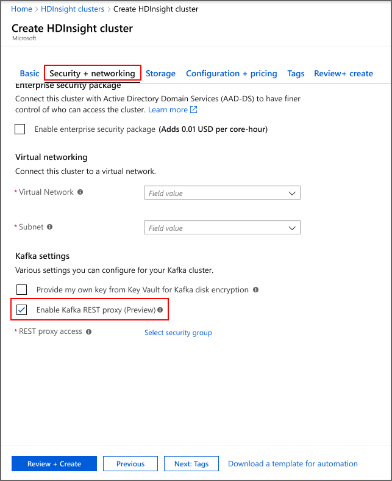

# Interact with Apache Kafka clusters using a REST proxy

The Kafka REST Proxy enables you to interact with your Kafka cluster via a REST API over HTTP. This means that your Kafka clients can be outside of the virtual network. Additionally, clients can make simple HTTP calls to send and receive messages to the Kafka cluster, instead of relying on Kafka libraries.  

## Concepts

### Architecture

Without a REST proxy, Kafka clients need to be in the same VNet as the Kafka cluster or a peered VNet. The REST proxy enables you to connect data producers or consumers located anywhere. Deploying the REST proxy creates a new public endpoint for your cluster, which you can find in your portal settings.

### Security

Access to the Kafka REST proxy is managed with Azure Active Directory security groups. See [documentation on AAD groups](https://docs.microsoft.com/azure/active-directory/fundamentals/active-directory-manage-groups), for more information.

When creating the Kafka cluster with the REST proxy enabled, you will provide the AAD security group that should have access to the REST endpoint. The Kafka clients (applications) that need access to the REST proxy should be registered to this group by the group owner. The group owner can do this via the Portal or via Powershell.

Before making requests to the REST proxy endpoint, the client application should get an OAuth token to verify membership of the right security group. Follow AAD documentation on how to get this token Add link to AAD Documentation [Provide HDInsight REST proxy specific parameters that need to provided to get token, such as ServiceName]

Once the client application has the OAuth token, they must pass that token in the HTTP request made to the REST proxy.

## Setting up your REST proxy

### Registering an app with AAD

The Security group owner can add applications to the security group associated with the REST-enabled Kafka cluster.

There are multiple ways to create groups. You can [create groups through the Azure portal](https://docs.microsoft.com/azure/active-directory/fundamentals/active-directory-groups-create-azure-portal) or [create groups using PowerShell](https://docs.microsoft.com/powershell/module/azuread/?view=azureadps-2.0).

### Deploy Kafka cluster with REST proxy

1. During the Kafka cluster creation workflow, in the “Security + networking” tab, check the “Enable Kafka REST proxy” option.
     
2. Click **Select Security Group**.
3. From the list of security groups, select the security group that you want to have access to the REST proxy. You can use the search box to find the appropriate security groups. Click the **Primary** button at the bottom.
     
4. Complete the remaining steps to create your cluster as described in [Create Apache Kafka cluster in Azure HDInsight using Azure portal](https://docs.microsoft.com/azure/hdinsight/kafka/apache-kafka-get-started).
5. Once the cluster is created, go to the cluster properties to record the Kafka REST proxy URL.
     

### Get OAuth token for your app

[Link to AAD documentation] You can use any application framework to interact with the REST proxy. For the purposes of this tutorial, we will use the sample python application located [here link to sample with Anushree’s python file]. Download this in your developer environment that has python installed.

### Send messages from application to Kafka via REST proxy

Replace the placeholders in the code with information relevant for your application. Run the sample python code. You will see that it fetches the OAuth token from AAD, creates the topic specified, sends messages to that topic and consumes messages from that topic.

## Next steps