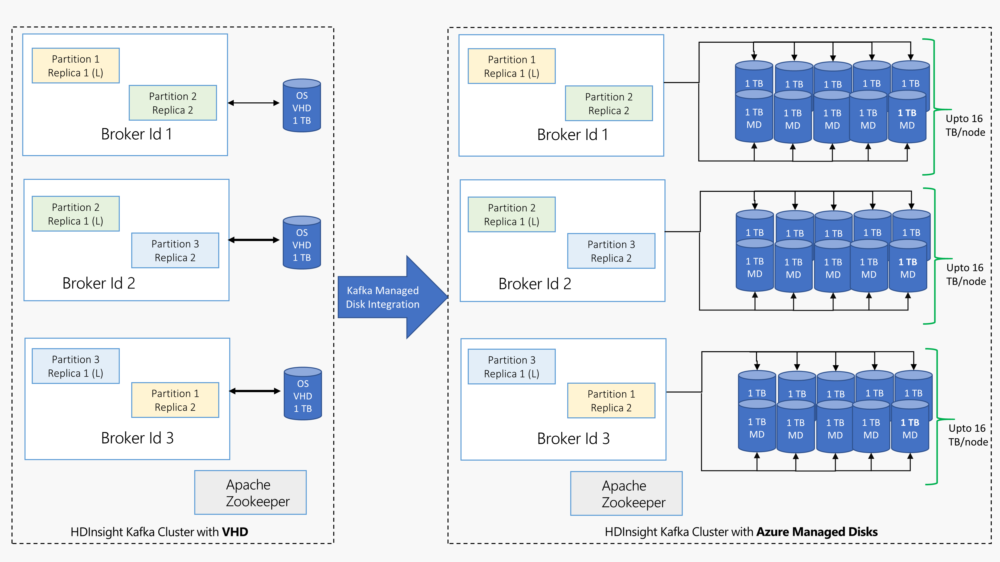

# Configure storage and scalability for Apache Kafka on HDInsight

Learn how to configure the number of managed disks used by [Apache Kafka](https://kafka.apache.org/) on HDInsight.

Kafka on HDInsight uses the local disk of the virtual machines in the HDInsight cluster. Since Kafka is very I/O heavy, [Azure Managed Disks](../../virtual-machines/windows/managed-disks-overview.md) is used to provide high throughput and provide more storage per node. If traditional virtual hard drives (VHD) were used for Kafka, each node is limited to 1 TB. With managed disks, you can use multiple disks to achieve 16 TB for each node in the cluster.

The following diagram provides a comparison between Kafka on HDInsight before managed disks, and Kafka on HDInsight with managed disks:



## Configure managed disks: Azure portal

1. Follow the steps in the [Create an HDInsight cluster](../hdinsight-hadoop-create-linux-clusters-portal.md) to understand the common steps to create a cluster using the portal. Do not complete the portal creation process.

2. From the __Cluster size__ section, use the __Disks per worker node__ field to configure the number of disks.

    > [!NOTE]  
    > The type of managed disk can be either __Standard__ (HDD) or __Premium__ (SSD). Premium disks are used with DS and GS series VMs. All other VM types use standard.

    

## Configure managed disks: Resource Manager template

To control the number of disks used by the worker nodes in a Kafka cluster, use the following section of the template:

```json
"dataDisksGroups": [
    {
        "disksPerNode": "[variables('disksPerWorkerNode')]"
    }
    ],
```

You can find a complete template that demonstrates how to configure managed disks at [https://hditutorialdata.blob.core.windows.net/armtemplates/create-linux-based-kafka-mirror-cluster-in-vnet-v2.1.json](https://hditutorialdata.blob.core.windows.net/armtemplates/create-linux-based-kafka-mirror-cluster-in-vnet-v2.1.json).

## Next steps

For more information on working with Apache Kafka on HDInsight, see the following documents:

* [Use MirrorMaker to create a replica of Apache Kafka on HDInsight](apache-kafka-mirroring.md)
* [Use Apache Storm with Apache Kafka on HDInsight](../hdinsight-apache-storm-with-kafka.md)
* [Use Apache Spark with Apache Kafka on HDInsight](../hdinsight-apache-spark-with-kafka.md)
* [Connect to Apache Kafka through an Azure Virtual Network](apache-kafka-connect-vpn-gateway.md)

* [HDInsight blog on managed disks with Apache Kafka](https://azure.microsoft.com/blog/announcing-public-preview-of-apache-kafka-on-hdinsight-with-azure-managed-disks/)
