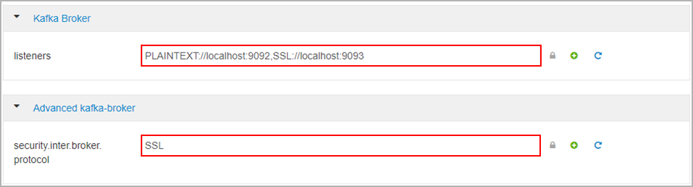
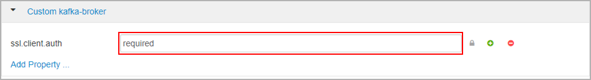

# Set up Secure Sockets Layer (SSL) encryption and authentication for Apache Kafka in Azure HDInsight

This article shows you how to set up SSL encryption between Apache Kafka clients and Apache Kafka brokers. It also shows you how to set up authentication of clients (sometimes referred to as two-way SSL).

> [!Important]
> There are two clients which you can use for Kafka applications: a Java client and a console client. Only the Java client `ProducerConsumer.java` can use SSL for both producing and consuming. The console producer client `console-producer.sh` does not work with SSL.

## Apache Kafka Broker setup

The Kafka SSL broker setup will use four HDInsight cluster VMs in the following way:

* headnode 0 - Certificate Authority (CA)
* worker node 0, 1, and 2 - brokers

> [!Note] 
> This guide will use self-signed certificates, but the most secure solution is to use certificates issued by trusted CAs.

The summary of the broker setup process is as follows:

1. The following steps are repeated on each of the three worker nodes:

    1. Generate a certificate.
    1. Create a cert signing request.
    1. Send the cert signing request to the Certificate Authority (CA).
    1. Sign in to the CA and sign the request.
    1. SCP the signed certificate back to the worker node.
    1. SCP the public certificate of the CA to the worker node.

1. Once you have all of the certificates, put the certs into the cert store.
1. Go to Ambari and change the configurations.

Use the following detailed instructions to complete the broker setup:

> [!Important]
> In the following code snippets wnX is an abbreviation for one of the three worker nodes and should be substituted with `wn0`, `wn1` or `wn2` as appropriate. `WorkerNode0_Name` and `HeadNode0_Name` should be substituted with the names of the respective machines, such as `wn0-abcxyz` or `hn0-abcxyz`.

1. Perform initial setup on head node 0, which for HDInsight will fill the role of the Certificate Authority (CA).

    ```bash
    # Create a new directory 'ssl' and change into it
    mkdir ssl
    cd ssl
    ```

1. Perform the same initial setup on each of the brokers (worker nodes 0, 1 and 2).

    ```bash
    # Create a new directory 'ssl' and change into it
    mkdir ssl
    cd ssl
    ```

1. On each of the worker nodes, execute the following steps using the code snippet below.
    1. Create a keystore and populate it with a new private certificate.
    1. Create a certificate signing request.
    1. SCP the certificate signing request to the CA (headnode0)

    ```bash
    keytool -genkey -keystore kafka.server.keystore.jks -validity 365 -storepass "MyServerPassword123" -keypass "MyServerPassword123" -dname "CN=FQDN_WORKER_NODE" -storetype pkcs12
    keytool -keystore kafka.server.keystore.jks -certreq -file cert-file -storepass "MyServerPassword123" -keypass "MyServerPassword123"
    scp cert-file sshuser@HeadNode0_Name:~/ssl/wnX-cert-sign-request
    ```

1. Change to the CA machine and sign all of the received cert signing requests:

    ```bash
    openssl x509 -req -CA ca-cert -CAkey ca-key -in wn0-cert-sign-request -out wn0-cert-signed -days 365 -CAcreateserial -passin pass:"MyServerPassword123"
    openssl x509 -req -CA ca-cert -CAkey ca-key -in wn1-cert-sign-request -out wn1-cert-signed -days 365 -CAcreateserial -passin pass:"MyServerPassword123"
    openssl x509 -req -CA ca-cert -CAkey ca-key -in wn2-cert-sign-request -out wn2-cert-signed -days 365 -CAcreateserial -passin pass:"MyServerPassword123"
    ```

1. Send the signed certificates back to the worker nodes from the CA (headnode0).

    ```bash
    scp wn0-cert-signed sshuser@WorkerNode0_Name:~/ssl/cert-signed
    scp wn1-cert-signed sshuser@WorkerNode1_Name:~/ssl/cert-signed
    scp wn2-cert-signed sshuser@WorkerNode2_Name:~/ssl/cert-signed
    ```

1. Send the public certificate of the CA to each worker node.

    ```bash
    scp ca-cert sshuser@WorkerNode0_Name:~/ssl/ca-cert
    scp ca-cert sshuser@WorkerNode1_Name:~/ssl/ca-cert
    scp ca-cert sshuser@WorkerNode2_Name:~/ssl/ca-cert
    ```

1. On each worker node, add the CAs public certificate to the truststore and keystore. Then add the worker node's own signed certificate to the keystore

    ```bash
    keytool -keystore kafka.server.truststore.jks -alias CARoot -import -file ca-cert -storepass "MyServerPassword123" -keypass "MyServerPassword123" -noprompt
    keytool -keystore kafka.server.keystore.jks -alias CARoot -import -file ca-cert -storepass "MyServerPassword123" -keypass "MyServerPassword123" -noprompt
    keytool -keystore kafka.server.keystore.jks -import -file cert-signed -storepass "MyServerPassword123" -keypass "MyServerPassword123" -noprompt

    ```

## Update Kafka configuration to use SSL and restart brokers

You have now set up each Kafka broker with a keystore and truststore, and imported the correct certificates. Next, modify related Kafka configuration properties using Ambari and then restart the Kafka brokers.

To complete the configuration modification, do the following steps:

1. Sign in to the Azure portal and select your Azure HDInsight Apache Kafka cluster.
1. Go to the Ambari UI by clicking **Ambari home** under **Cluster dashboards**.
1. Under **Kafka Broker** set the **listeners** property to `PLAINTEXT://localhost:9092,SSL://localhost:9093`
1. Under **Advanced kafka-broker** set the **security.inter.broker.protocol** property to `SSL`

    

1. Under **Custom kafka-broker** set the **ssl.client.auth** property to `required`. This step is only required if you are setting up authentication and encryption.

    

1. Add configuration properties to the Kafka `server.properties` file to advertise IP addresses instead of the Fully Qualified Domain Name (FQDN).

    ```bash
    IP_ADDRESS=$(hostname -i)
    echo advertised.listeners=$IP_ADDRESS
    sed -i.bak -e '/advertised/{/advertised@/!d;}' /usr/hdp/current/kafka-broker/conf/server.properties
    echo "advertised.listeners=PLAINTEXT://$IP_ADDRESS:9092,SSL://$IP_ADDRESS:9093" >> /usr/hdp/current/kafka-broker/conf/server.properties
    echo "ssl.keystore.location=/home/sshuser/ssl/kafka.server.keystore.jks" >> /usr/hdp/current/kafka-broker/conf/server.properties
    echo "ssl.keystore.password=MyServerPassword123" >> /usr/hdp/current/kafka-broker/conf/server.properties
    echo "ssl.key.password=MyServerPassword123" >> /usr/hdp/current/kafka-broker/conf/server.properties
    echo "ssl.truststore.location=/home/sshuser/ssl/kafka.server.truststore.jks" >> /usr/hdp/current/kafka-broker/conf/server.properties
    echo "ssl.truststore.password=MyServerPassword123" >> /usr/hdp/current/kafka-broker/conf/server.properties
    ```

1. To verify that the previous changes have been made correctly, you can optionally check that the following lines are present in the Kafka `server.properties` file.

    ```bash
    advertised.listeners=PLAINTEXT://10.0.0.11:9092,SSL://10.0.0.11:9093
    ssl.keystore.location=/home/sshuser/ssl/kafka.server.keystore.jks
    ssl.keystore.password=MyServerPassword123
    ssl.key.password=MyServerPassword123
    ssl.truststore.location=/home/sshuser/ssl/kafka.server.truststore.jks
    ssl.truststore.password=MyServerPassword123
    ```

1. Restart all Kafka brokers.
1. Start the admin client with producer and consumer options to verify that both producers and consumers are working on port 9093.

## Client setup (with authentication)

> [!Note]
> The following steps are required only if you are setting up both SSL encryption **and** authentication. If you are only setting up encryption, please proceed to [Client setup without authentication](apache-kafka-ssl-encryption-authentication.md#client-setup-without-authentication)

Complete the following steps to finish the client setup:

1. Sign in to the client machine (hn1).
1. Create a java keystore and get a signed certificate for the broker. Then copy the certificate to the VM where the CA is running.
1. Switch to the CA machine (hn0) to sign the client certificate.
1. Go to the client machine (hn1) and navigate to the `~/ssl` folder. Copy the signed cert to client machine.

```bash
cd ssl

# Create a java keystore and get a signed certificate for the broker. Then copy the certificate to the VM where the CA is running.

keytool -genkey -keystore kafka.client.keystore.jks -validity 365 -storepass "MyClientPassword123" -keypass "MyClientPassword123" -dname "CN=mylaptop1" -alias my-local-pc1 -storetype pkcs12

keytool -keystore kafka.client.keystore.jks -certreq -file client-cert-sign-request -alias my-local-pc1 -storepass "MyClientPassword123" -keypass "MyClientPassword123"

# Copy the cert to the CA
scp client-cert-sign-request3 sshuser@HeadNode0_Name:~/tmp1/client-cert-sign-request

# Switch to the CA machine (hn0) to sign the client certificate.
cd ssl
openssl x509 -req -CA ca-cert -CAkey ca-key -in /tmp1/client-cert-sign-request -out /tmp1/client-cert-signed -days 365 -CAcreateserial -passin pass:MyServerPassword123

# Return to the client machine (hn1), navigate to ~/ssl folder and copy signed cert from the CA (hn0) to client machine
scp -i ~/kafka-security.pem sshuser@HeadNode0_Name:/tmp1/client-cert-signed

# Import CA cert to trust store
keytool -keystore kafka.client.truststore.jks -alias CARoot -import -file ca-cert -storepass "MyClientPassword123" -keypass "MyClientPassword123" -noprompt

# Import CA cert to key store
keytool -keystore kafka.client.keystore.jks -alias CARoot -import -file ca-cert -storepass "MyClientPassword123" -keypass "MyClientPassword123" -noprompt

# Import signed client (cert client-cert-signed1) to keystore
keytool -keystore kafka.client.keystore.jks -import -file client-cert-signed -alias my-local-pc1 -storepass "MyClientPassword123" -keypass "MyClientPassword123" -noprompt
```

Lastly, view the file `client-ssl-auth.properties` with the command `cat client-ssl-auth.properties`. It should have the following lines:

```bash
security.protocol=SSL
ssl.truststore.location=/home/sshuser/ssl/kafka.client.truststore.jks
ssl.truststore.password=MyClientPassword123
ssl.keystore.location=/home/sshuser/ssl/kafka.client.keystore.jks
ssl.keystore.password=MyClientPassword123
ssl.key.password=MyClientPassword123
```

## Client setup (without authentication)

If you don't need authentication, the steps to set up only SSL encryption are:

1. Sign in to the client machine (hn1) and navigate to the `~/ssl` folder
1. Copy the signed cert to client machine from the CA machine (wn0).
1. Import the CA cert to the truststore
1. Import the CA cert to the keystore

These steps are shown in the following code snippet.

```bash
cd ssl

# Copy signed cert to client machine
scp -i ~/kafka-security.pem sshuser@wn0-umakaf:/home/sshuser/ssl/ca-cert .

# Import CA cert to truststore
keytool -keystore kafka.client.truststore.jks -alias CARoot -import -file ca-cert -storepass "MyClientPassword123" -keypass "MyClientPassword123" -noprompt

# Import CA cert to keystore
keytool -keystore kafka.client.keystore.jks -alias CARoot -import -file cert-signed -storepass "MyClientPassword123" -keypass "MyClientPassword123" -noprompt
```

Finally, view the file `client-ssl-auth.properties` with the command `cat client-ssl-auth.properties`. It should have the following lines:

```bash
security.protocol=SSL
ssl.truststore.location=/home/sshuser/ssl/kafka.client.truststore.jks
ssl.truststore.password=MyClientPassword123
```

## Next steps

* [What is Apache Kafka on HDInsight?](apache-kafka-introduction.md)
