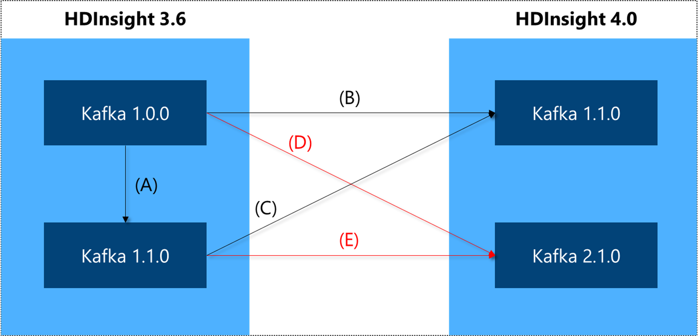
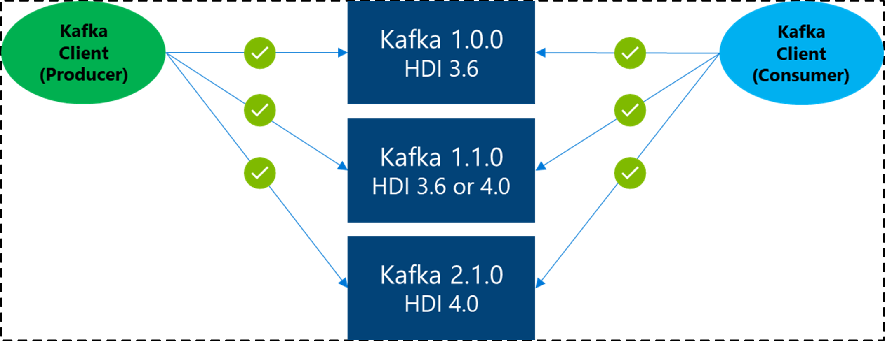
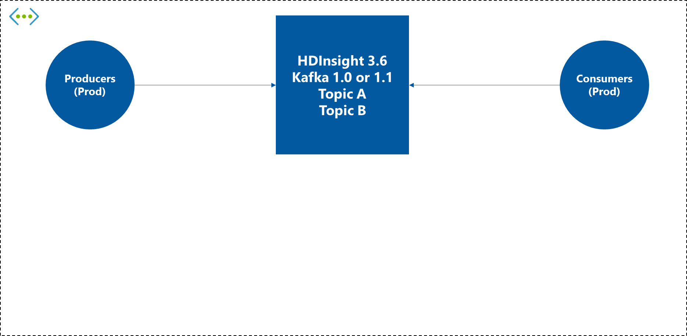
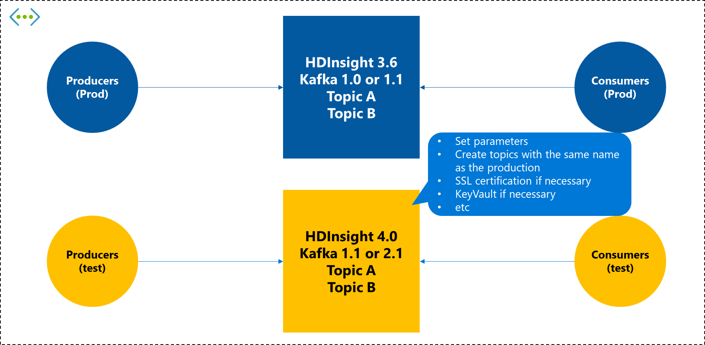
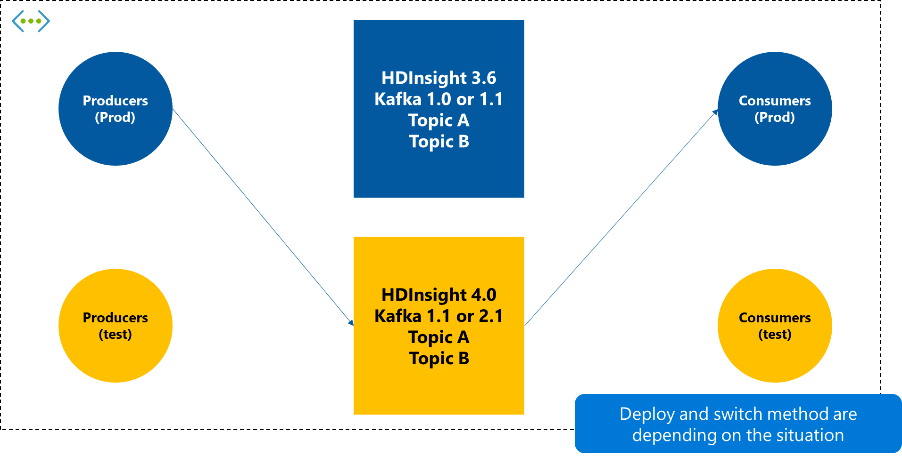

# Migrate Apache Kafka workloads to Azure HDInsight 4.0

Azure HDInsight 4.0 offers the latest open-source components with significant enhancements in performance, connectivity, and security. This document explains how to migrate Apache Kafka workloads on HDInsight 3.6 to HDInsight 4.0. After migrating your workloads to HDInsight 4.0, you can use many of the new features that aren't available on HDInsight 3.6.

## HDInsight 3.6 Kafka migration paths

HDInsight 3.6 supports two versions of Kafka: 1.0.0 and 1.1.0. HDInsight 4.0 supports versions 1.1.0 and 2.1.0. Depending on which version of Kafka and which version of HDInsight you would like to run, there are multiple supported migration paths. These paths are explained below and illustrated in the following diagram.

* **Run both Kafka and HDInsight on latest versions (recommended)**: Migrate an HDInsight 3.6 and Kafka 1.0.0 or 1.1.0 application to HDInsight 4.0 with Kafka 2.1.0 (paths D and E below).
* **Run HDInsight on the latest version, but Kafka only on a more recent version**: Migrate an HDInsight 3.6 and Kafka 1.0.0 application to HDInsight 4.0 with Kafka 1.1.0 (path B below).
* **Run HDInsight on the latest version, retain Kafka version**: Migrate an HDInsight 3.6 and Kafka 1.1.0 application to HDInsight 4.0 with Kafka 1.1.0 (path C below).
* **Run Kafka on a more recent version, retain HDInsight version**: Migrate a Kafka 1.0.0 application to 1.1.0 and stay on HDInsight 3.6 (path A below). Note that this option will still require deploying a new cluster. Upgrading the Kafka version on an existing cluster is not supported. After you create a cluster with the version you want, migrate your Kafka clients to use the new cluster.

## Apache Kafka versions

### Kafka 1.1.0
  
If you migrate from Kafka 1.0.0 to 1.1.0 you can take advantage of the following new features:

* Improvements to the Kafka controller speed up controlled shutdown, so you can restart brokers and recover from issues faster. 
* Improvements in the [FetchRequests logic](https://issues.apache.org/jira/browse/KAFKA-6254) which enable you to have more partitions (and hence more topics) on the cluster. 
* Kafka Connect supports [record headers](https://issues.apache.org/jira/browse/KAFKA-5142) and [regular expressions](https://issues.apache.org/jira/browse/KAFKA-3073) for topics. 

For a complete list of updates, see [Apache Kafka 1.1 release notes](https://archive.apache.org/dist/kafka/1.1.0/RELEASE_NOTES.html).

### Apache Kafka 2.1.0

If you migrate to Kafka 2.1, you can take advantage of the following features:

* Better broker resiliency due to an improved replication protocol.
* New functionality in the KafkaAdminClient API.
* Configurable quota management.
* Support for Zstandard compression.

For a complete list of updates, see [Apache Kafka 2.0 release notes](https://archive.apache.org/dist/kafka/2.0.0/RELEASE_NOTES.html) and [Apache Kafka 2.1 release notes](https://archive.apache.org/dist/kafka/2.1.0/RELEASE_NOTES.html).

## Kafka client compatibility

New Kafka brokers support older clients. [KIP-35 - Retrieving protocol version](https://cwiki.apache.org/confluence/display/KAFKA/KIP-35+-+Retrieving+protocol+version) introduced a mechanism for dynamically determining the functionality of a Kafka broker and [KIP-97: Improved Kafka Client RPC Compatibility Policy](https://cwiki.apache.org/confluence/display/KAFKA/KIP-97%3A+Improved+Kafka+Client+RPC+Compatibility+Policy) introduced a new compatibility policy and guarantees for the Java client. Previously, a Kafka client had to interact with a broker of the same version or a newer version. Now, newer versions of the Java clients and other clients that support KIP-35 such as `librdkafka` can fall back to older request types or throw appropriate errors if functionality isn't available.

Note that it does not mean that the client supports older brokers.  For more information, see [Compatibility Matrix](https://cwiki.apache.org/confluence/display/KAFKA/Compatibility+Matrix).

## General migration process

The following migration guidance assumes an Apache Kafka 1.0.0 or 1.1.0 cluster deployed on HDInsight 3.6 in a single virtual network. The existing broker has some topics and is being actively used by producers and consumers.

To complete the migration, do the following steps:

1. **Deploy a new HDInsight 4.0 cluster and clients for test.** Deploy a new HDInsight 4.0 Kafka cluster. If multiple Kafka cluster versions can be selected, it's recommended to select the latest version. After deployment, set some parameters as needed and create a topic with the same name as your existing environment. Also, set TLS and bring-your-own-key (BYOK) encryption as needed. Then check if it works correctly with the new cluster.

    

1. **Switch the cluster for the producer application, and wait until all the queue data is consumed by the current consumers.** When the new HDInsight 4.0 Kafka cluster is ready, switch the existing producer destination to the new cluster. Leave it as it is until the existing Consumer app has consumed all the data from the existing cluster.

    

1. **Switch the cluster on the consumer application.** After confirming that the existing consumer application has finished consuming all data from the existing cluster, switch the connection to the new cluster.

    

1. **Remove the old cluster and test applications as needed.** Once the switch is complete and working properly, remove the old HDInsight 3.6 Kafka cluster and the producers and consumers used in the test as needed.

## Next steps

* [Performance optimization for Apache Kafka HDInsight clusters](apache-kafka-performance-tuning.md)
* [Quickstart: Create Apache Kafka cluster in Azure HDInsight using Azure portal](apache-kafka-get-started.md)
