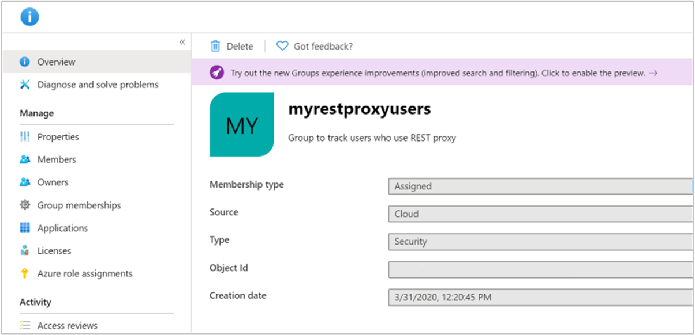
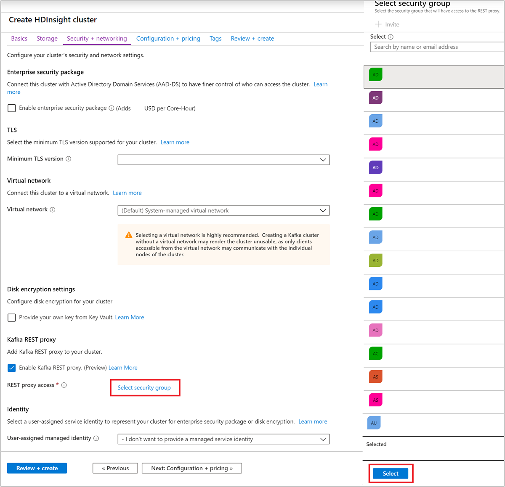

# Interact with Apache Kafka clusters in Azure HDInsight using a REST proxy

Kafka REST Proxy enables you to interact with your Kafka cluster via a REST API over HTTP. This action means that your Kafka clients can be outside of your virtual network. Clients can make simple HTTP calls to the Kafka cluster, instead of relying on Kafka libraries. This article will show you how to create a REST proxy enabled Kafka cluster. Also provides a sample code that shows how to make calls to REST proxy.

## REST API reference

For operations supported by the Kafka REST API, see [HDInsight Kafka REST Proxy API Reference](https://docs.microsoft.com/rest/api/hdinsight-kafka-rest-proxy).

## Background


For the full specification of operations supported by the API, see [Apache Kafka REST Proxy API](https://docs.microsoft.com/rest/api/hdinsight-kafka-rest-proxy).

### REST Proxy endpoint

Creating an HDInsight Kafka cluster with REST proxy creates a new public endpoint for your cluster, which you can find in your HDInsight cluster **Properties** on the Azure portal.

### Security

Access to the Kafka REST proxy is managed with Azure Active Directory security groups. When creating the Kafka cluster, provide the Azure AD security group with REST endpoint access. Kafka clients that need access to the REST proxy should be registered to this group by the group owner. The group owner can register via the Portal or via PowerShell.

For REST proxy endpoint requests, client applications should get an OAuth token. The token is used to verify security group membership. Find a [Client application sample](#client-application-sample) below that shows how to get an OAuth token. The client application passes the OAuth token in the HTTP request to the REST proxy.

> [!NOTE]
> See [Manage app and resource access using Azure Active Directory groups](../../active-directory/fundamentals/active-directory-manage-groups.md), to learn more about AAD security groups. For more information on how OAuth tokens work, see [Authorize access to Azure Active Directory web applications using the OAuth 2.0 code grant flow](../../active-directory/develop/v1-protocols-oauth-code.md).

## Kafka REST proxy with Network Security Groups
If you bring your own VNet and control network traffic with network security groups, allow **inbound** traffic on port **9400** in addition to port 443. This will ensure that Kafka REST proxy server is reachable.

## Prerequisites

1. Register an application with Azure AD. The client applications that you write to interact with the Kafka REST proxy will use this application's ID and secret to authenticate to Azure.

1. Create an Azure AD security group. Add the application that you've registered with Azure AD to the security group as a **member** of the group. This security group will be used to control which applications are allowed to interact with the REST proxy. For more information on creating Azure AD groups, see [Create a basic group and add members using Azure Active Directory](../../active-directory/fundamentals/active-directory-groups-create-azure-portal.md).

    Validate the group is of type **Security**.
    

    Validate that application is member of Group.
    

## Create a Kafka cluster with REST proxy enabled

The steps below use the Azure portal. For an example using Azure CLI, see [Create Apache Kafka REST proxy cluster using Azure CLI](tutorial-cli-rest-proxy.md).

1. During the Kafka cluster creation workflow, in the **Security + networking** tab, check the **Enable Kafka REST proxy** option.

     

1. Click **Select Security Group**. From the list of security groups, select the security group that you want to have access to the REST proxy. You can use the search box to find the appropriate security group. Click the **Select** button at the bottom.

     

1. Complete the remaining steps to create your cluster as described in [Create Apache Kafka cluster in Azure HDInsight using Azure portal](https://docs.microsoft.com/azure/hdinsight/kafka/apache-kafka-get-started).

1. Once the cluster is created, go to the cluster properties to record the Kafka REST proxy URL.

     

## Client application sample

You can use the python code below to interact with the REST proxy on your Kafka cluster. To use the code sample, follow these steps:

1. Save the sample code on a machine with Python installed.
1. Install required python dependencies by executing `pip3 install msal`.
1. Modify the code section **Configure these properties** and update the following properties for your environment:

    |Property |Description |
    |---|---|
    |Tenant ID|The Azure tenant where your subscription is.|
    |Client ID|The ID for the application that you registered in the security group.|
    |Client Secret|The secret for the application that you registered in the security group.|
    |Kafkarest_endpoint|Get this value from the **Properties** tab in the cluster overview as described in the [deployment section](#create-a-kafka-cluster-with-rest-proxy-enabled). It should be in the following format – `https://<clustername>-kafkarest.azurehdinsight.net`|

1. From the command line, execute the python file by executing `sudo python3 <filename.py>`

This code does the following action:

1. Fetches an OAuth token from Azure AD.
1. Shows how to make a request to Kafka REST proxy.

For more information on getting OAuth tokens in python, see [Python AuthenticationContext class](https://docs.microsoft.com/python/api/adal/adal.authentication_context.authenticationcontext?view=azure-python). You might see a delay while `topics` that aren't created or deleted through the Kafka REST proxy are reflected there. This delay is because of cache refresh.

```python
#Required python packages
#pip3 install msal

import msal

#--------------------------Configure these properties-------------------------------#
# Tenant ID for your Azure Subscription
tenant_id = 'ABCDEFGH-1234-1234-1234-ABCDEFGHIJKL'
# Your Client Application Id
client_id = 'XYZABCDE-1234-1234-1234-ABCDEFGHIJKL'
# Your Client Credentials
client_secret = 'password'
# kafka rest proxy -endpoint
kafkarest_endpoint = "https://<clustername>-kafkarest.azurehdinsight.net"
#--------------------------Configure these properties-------------------------------#

# Scope
scope = 'https://hib.azurehdinsight.net/.default'
#Authority
authority = 'https://login.microsoftonline.com/' + tenant_id

# Create a preferably long-lived app instance which maintains a token cache.
app = msal.ConfidentialClientApplication(
    client_id , client_secret, authority,
    #cache - For details on how look at this example: https://github.com/Azure-Samples/ms-identity-python-webapp/blob/master/app.py
    )

# The pattern to acquire a token looks like this.
result = None

result = app.acquire_token_for_client(scopes=[scope])

print(result)
accessToken = result['access_token']

# relative url
getstatus = "/v1/metadata/topics"
request_url = kafkarest_endpoint + getstatus

# sending get request and saving the response as response object
response = requests.get(request_url, headers={'Authorization': accessToken})
print(response.content)
```

Find below another sample on how to get a token from Azure for REST proxy using a curl command. **Notice that we need the `scope=https://hib.azurehdinsight.net/.default` specified while getting a token.**

```cmd
curl -X POST -H "Content-Type: application/x-www-form-urlencoded" -d 'client_id=<clientid>&client_secret=<clientsecret>&grant_type=client_credentials&scope=https://hib.azurehdinsight.net/.default' 'https://login.microsoftonline.com/<tenantid>/oauth2/v2.0/token'
```

## Next steps

* [Kafka REST proxy API reference documents](https://docs.microsoft.com/rest/api/hdinsight-kafka-rest-proxy/)
