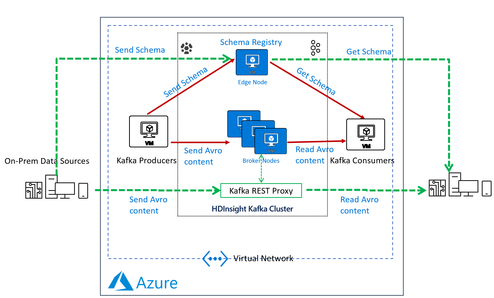

# Apache Kafka with Confluent Schema Registry in Azure HDInsight

Kafka Schema Registry provides serializers that plug into Apache Kafka clients that handle message schema storage and retrieval for Kafka messages that are sent in the Avro format. It used to be an OSS project by Confluent, but is now under the [Confluent community license](https://www.confluent.io/blog/license-changes-confluent-platform/). The Schema Registry additionally serves the below purposes:

* Store and retrieve schemas for producers and consumers.
* Enforce backward/forward /full compatibility on Topics.
* Decrease the size of the payload sent to Kafka.

In an HDInsight Managed Kafka cluster, the Schema Registry is typically deployed on an Edge node to allow compute separation from Head nodes.

Below is a representative architecture of how the Schema Registry is deployed on an HDInsight cluster. The Schema Registry natively exposes a REST API for operations on it.  Producers and consumers can interact with the Schema Registry from within the VNet or using the [Kafka REST Proxy](rest-proxy.md).



## Deploy an HDInsight managed Kafka with Confluent Schema Registry

In this section, we deploy an HDInsight Managed Kafka cluster with an Edge Node inside a virtual network and then install the Confluent Schema Registry on the Edge Node.  

1. Select the **Deploy to Azure** button below to sign in to Azure and open the Resource Manager template.

    <a href="https://portal.azure.com/#create/Microsoft.Template/uri/https%3A%2F%2Fraw.githubusercontent.com%2Farnabganguly%2FKafkaschemaregistry%2Fmaster%2Fazuredeploy.json" target="_blank"></a>

1. On the Custom deployment template, populate the fields as described below:

    |Property |Description |
    |---|---|
    |Subscription|From the drop-down list, select the Azure subscription that's used for the cluster.|
    |Resource group|From the drop-down list, select your existing resource group, or select **Create new**.|
    |Region|From the drop-down list, select a region where the cluster is created.|
    |Cluster Name|Enter a globally unique name. Or leave as-is to use the default name.|
    |Cluster Login User Name|Provide the username, default is **admin**.|
    |Cluster Login Password|Provide the password.|
    |Ssh User Name|Provide the username, default is **sshuser**.|
    |Ssh Password|Provide the password.|

    Leave the other fields as-is. Select **Review + create** to continue.

1. Review the deployment details, then select **Create** to initialize the deployment. The deployment may take 45 minutes to complete.

## Configure the Confluent Schema Registry

In this section, we configure the Confluent Kafka Schema Registry that we installed on the edge node. The confluent schema registry is located at  `/etc/schema-registry/schema-registry.properties` and the mechanisms to start and stop service executables are located at the  `/usr/bin/` folder.

The Schema Register needs to know the Zookeeper service can interact with HDInsight Kafka cluster. Follow the below steps to get the details of the Zookeeper Quorum.

1. Use [ssh command](../hdinsight-hadoop-linux-use-ssh-unix.md) to connect to your cluster edge node. Edit the command below by replacing CLUSTERNAME with the name of your cluster, and then enter the command:

    ```cmd
    ssh sshuser@schema-registry.CLUSTERNAME-ssh.azurehdinsight.net
    ```

1. Set up password variable. Replace PASSWORD with the cluster login password, then enter the command:

    ```bash
    export password='PASSWORD'
    ```

1. Extract the correctly cased cluster name. Execute the following command:

    ```bash
    export clusterName=$(curl -u admin:$password -sS -G "http://headnodehost:8080/api/v1/clusters" | jq -r '.items[].Clusters.cluster_name')
    ```

1. Extract the Kafka Zookeeper hosts. Execute the following command:

    ```bash
    export KAFKAZKHOSTS=$(curl -sS -u admin:$password -G https://$clusterName.azurehdinsight.net/api/v1/clusters/$clusterName/services/ZOOKEEPER/components/ZOOKEEPER_SERVER | jq -r '["\(.host_components[].HostRoles.host_name):2181"] | join(",")' | cut -d',' -f1,2);

    echo $KAFKAZKHOSTS
    ```

    Make a note of this value as it will be used later.

1. Extract the Kafka broker hosts. Execute the following command:

    ```bash
    export KAFKABROKERS=$(curl -sS -u admin:$password -G https://$clusterName.azurehdinsight.net/api/v1/clusters/$clusterName/services/KAFKA/components/KAFKA_BROKER | jq -r '["\(.host_components[].HostRoles.host_name):9092"] | join(",")' | cut -d',' -f1,2);

    echo $KAFKABROKERS
    ```

1. Open the Schema Registry properties files in edit mode. Execute the following command:

    ```bash
    sudo nano /etc/schema-registry/schema-registry.properties
    ```

    1. Update the value for `kafkastore.connection.url` with the Zookeeper string identified earlier.
    1. Update the value for `debug` to `true`.

    The properties file now looks similar to:  

    ```
    listeners=http://0.0.0.0:8081
    kafkastore.connection.url=zk1-ag4kaf.q2hwzr1xkxjuvobkaagmjjkhta.gx.internal.cloudapp.net:2181,zk2-ag4kaf.q2hwzr1xkxjuvobkaagmjjkhta.gx.internal.cloudapp.net:2181
    kafkastore.topic=_schemas
    debug=true
    ```

1. To save the file, use **Ctrl + X**, **Y**, and then **Enter**.

1. Start the Schema Registry and point it to use the updated Schema Registry properties file. Execute the following commands:

    ```bash
    cd /bin
    sudo schema-registry-start /etc/schema-registry/schema-registry.properties
    ```

1. With the Schema Registry running in one SSH session, launch another SSH window.  Register a new version of a schema under the subject "Kafka-key" and note the output:

    ```cmd
    curl -X POST -i -H "Content-Type: application/vnd.schemaregistry.v1+json" \
        --data '{"schema": "{\"type\": \"string\"}"}'
    ```

    ```output
       HTTP/1.1 200 OK
    Date: Sun, 22 Mar 2020 16:33:04 GMT
    Content-Type: application/vnd.schemaregistry.v1+json
    Content-Length: 9
    Server: Jetty(9.2.24.v20180105)
    ```

1. Register a new version of a schema under the subject "Kafka-value" and note the output:

    ```cmd
    curl -X POST -i -H "Content-Type: application/vnd.schemaregistry.v1+json" \
        --data '{"schema": "{\"type\": \"string\"}"}' \
    ```

    ```output
    HTTP/1.1 200 OK
    Date: Sun, 22 Mar 2020 16:34:18 GMT
    Content-Type: application/vnd.schemaregistry.v1+json
    Content-Length: 9
    Server: Jetty(9.2.24.v20180105)
    ```

1. List all subjects and check the output:

    ```cmd
    curl -X GET -i -H "Content-Type: application/vnd.schemaregistry.v1+json" \
        http://localhost:8081/subjects
    ```

    ```output
    HTTP/1.1 200 OK
    Date: Sun, 22 Mar 2020 16:34:39 GMT
    Content-Type: application/vnd.schemaregistry.v1+json
    Content-Length: 27
    Server: Jetty(9.2.24.v20180105)

    ["Kafka-value","Kafka-key"]
    ```

You may want to try some other [advanced commands listed here](https://docs.confluent.io/1.0/schema-registry/docs/intro.html#quickstart).

## Send and consume Avro data from Kafka using schema registry

In this section, we'll read data from standard input and write it to a Kafka topic in a format. We'll then read the data from the Kafka Topics using a consumer with an Avro formatter to transform that data into readable format.

1. Create a Kafka topic `agkafkaschemareg`.

    ```bash
    /usr/hdp/current/kafka-broker/bin/kafka-topics.sh --create --replication-factor 3 --partitions 8 --topic agkafkaschemareg --zookeeper $KAFKAZKHOSTS
    ```

1. Use the **Kafka Avro Console Producer** to create a schema, assign the schema to the topic, and start sending data to the topic in Avro format. Ensure that the Kafka Topic in the previous step is successfully created and that **$KAFKABROKERS** has a value in it.

    The schema we're sending is a Key: Value Pair

    ```
    Value
    {
      "type": "record",
      "name": "example_schema",
      "namespace": "com.example",
      "fields": [
        {
          "name": "cust_id",
          "type": "int",
          "doc": "Id of the customer account"
        },
        {
          "name": "year",
          "type": "int",
          "doc": "year of expense"
        },
        {
          "name": "expenses",
          "type": {
            "type": "array",
            "items": "float"
          },
          "doc": "Expenses for the year"
        }
      ],
      "doc:": "A basic schema for storing messages"
    }
    ```

    Use the below command to start the **Kafka Avro Console Producer**:

    ```bash
    /usr/bin/kafka-avro-console-producer     --broker-list $KAFKABROKERS     --topic agkafkaschemareg     --property parse.key=true --property key.schema='{"type" : "int", "name" : "id"}'     --property value.schema='{ "type" : "record", "name" : "example_schema", "namespace" : "com.example", "fields" : [ { "name" : "cust_id", "type" : "int", "doc" : "Id of the customer account" }, { "name" : "year", "type" : "int", "doc" : "year of expense" }, { "name" : "expenses", "type" : {"type": "array", "items": "float"}, "doc" : "Expenses for the year" } ], "doc:" : "A basic schema for storing messages" }'
    ```

1. When the producer is ready to accept messages, start sending the messages in the predefined Avro schema format. Use the Tab key to create spacing between the Key and Value.

    ```
    1 TAB {"cust_id":1313131, "year":2012, "expenses":[1313.13, 2424.24]}
    2 TAB {"cust_id":3535353, "year":2011, "expenses":[761.35, 92.18, 14.41]}
    3 TAB {"cust_id":7979797, "year":2011, "expenses":[4489.00]}
    ```

1. Try entering random non-schema data into the console producer to see how the producer does now allow any data that doesn't conform to predefined Avro schema.

    ```
    1       {"cust_id":1313131, "year":2012, "expenses":[1313.13, 2424.24]}
    2       {"cust_id":1313131,"cust_age":34 "year":2012, "expenses":[1313.13, 2424.24,34.212]}
    org.apache.kafka.common.errors.SerializationException: Error deserializing json {"cust_id":1313131,"cust_age":34 "year":2012, "expenses":[1313.13, 2424.24,34.212]} to Avro of schema {"type":"record","name":"example_schema","namespace":"com.example","fields":[{"name":"cust_id","type":"int","doc":"Id of the customer account"},{"name":"year","type":"int","doc":"year of expense"},{"name":"expenses","type":{"type":"array","items":"float"},"doc":"Expenses for the year"}],"doc:":"A basic schema for storing messages"}
    Caused by: org.codehaus.jackson.JsonParseException: Unexpected character ('"' (code 34)): was expecting comma to separate OBJECT entries
     at [Source: java.io.StringReader@3561c410; line: 1, column: 35]
            at org.codehaus.jackson.JsonParser._constructError(JsonParser.java:1433)
            at org.codehaus.jackson.impl.JsonParserMinimalBase._reportError(JsonParserMinimalBase.java:521)
            at org.codehaus.jackson.impl.JsonParserMinimalBase._reportUnexpectedChar(JsonParserMinimalBase.java:442)
            at org.codehaus.jackson.impl.ReaderBasedParser.nextToken(ReaderBasedParser.java:406)
            at org.apache.avro.io.JsonDecoder.getVaueAsTree(JsonDecoder.java:549)
            at org.apache.avro.io.JsonDecoder.doAction(JsonDecoder.java:474)
            at org.apache.avro.io.parsing.Parser.advance(Parser.java:88)
            at org.apache.avro.io.JsonDecoder.advance(JsonDecoder.java:139)
            at org.apache.avro.io.JsonDecoder.readInt(JsonDecoder.java:166)
            at org.apache.avro.io.ValidatingDecoder.readInt(ValidatingDecoder.java:83)
            at org.apache.avro.generic.GenericDatumReader.readInt(GenericDatumReader.java:511)
            at org.apache.avro.generic.GenericDatumReader.readWithoutConversion(GenericDatumReader.java:182)
            at org.apache.avro.generic.GenericDatumReader.read(GenericDatumReader.java:152)
            at org.apache.avro.generic.GenericDatumReader.readField(GenericDatumReader.java:240)
            at org.apache.avro.generic.GenericDatumReader.readRecord(GenericDatumReader.java:230)
            at org.apache.avro.generic.GenericDatumReader.readWithoutConversion(GenericDatumReader.java:174)
            at org.apache.avro.generic.GenericDatumReader.read(GenericDatumReader.java:152)
            at org.apache.avro.generic.GenericDatumReader.read(GenericDatumReader.java:144)
            at io.confluent.kafka.formatter.AvroMessageReader.jsonToAvro(AvroMessageReader.java:213)
            at io.confluent.kafka.formatter.AvroMessageReader.readMessage(AvroMessageReader.java:200)
            at kafka.tools.ConsoleProducer$.main(ConsoleProducer.scala:59)
            at kafka.tools.ConsoleProducer.main(ConsoleProducer.scala)
    
    ```

1. In a different screen, start the Kafka Avro Console Consumer

    ```bash
    sudo /usr/bin/kafka-avro-console-consumer --bootstrap-server $KAFKABROKERS --topic agkafkaschemareg --from-beginning
    ```

    You should start seeing the below output:

    ```output
    {"cust_id":1313131,"year":2012,"expenses":[1313.13,2424.24]}
    {"cust_id":7979797,"year":2011,"expenses":[4489.0]}
    {"cust_id":3535353,"year":2011,"expenses":[761.35,92.18,14.41]}
    ```

## Next steps

* [Use the Apache Kafka Producer and Consumer APIs](apache-kafka-producer-consumer-api.md)