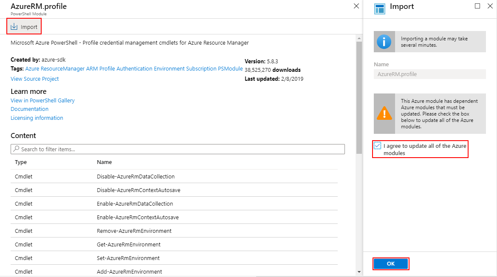
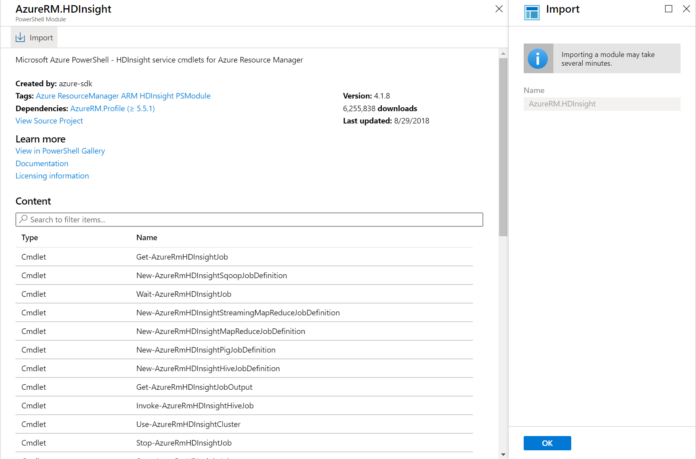
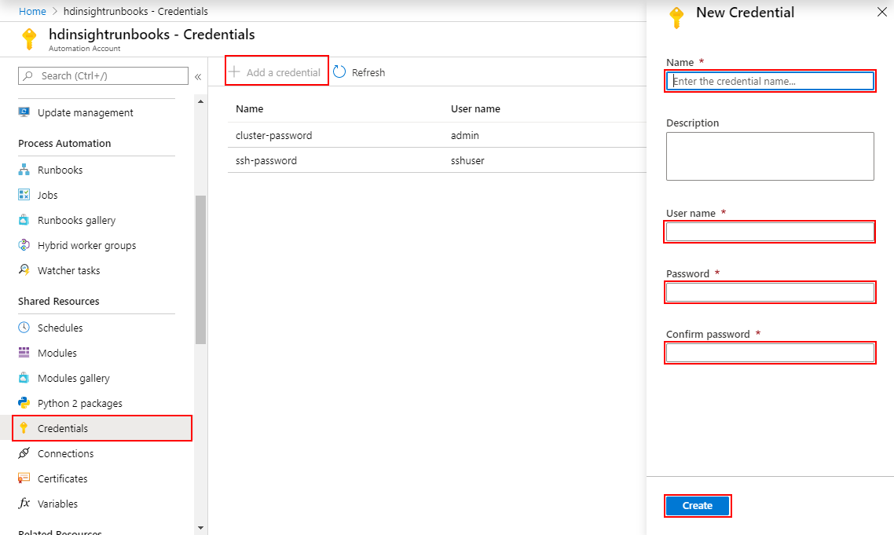
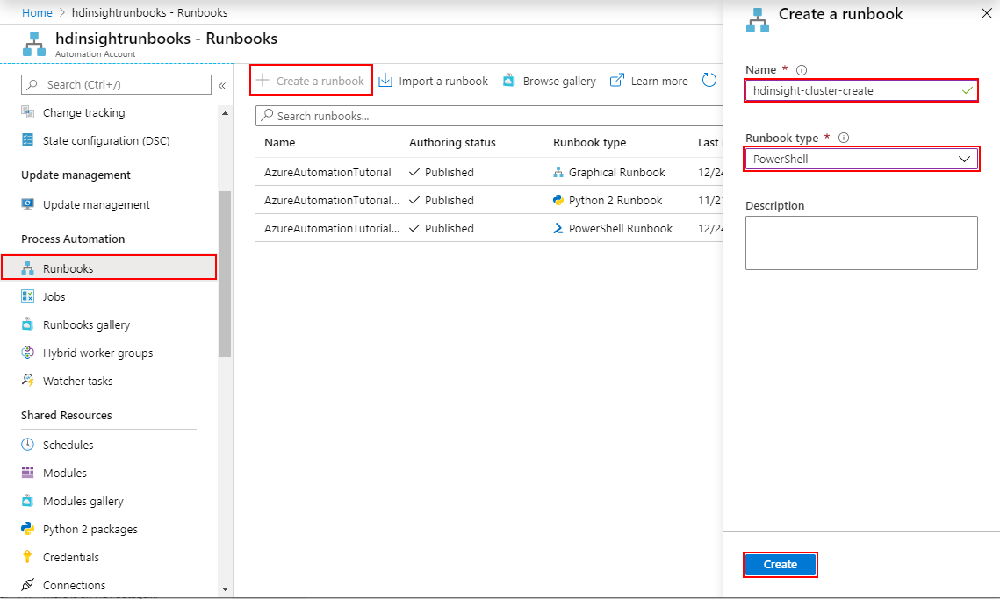
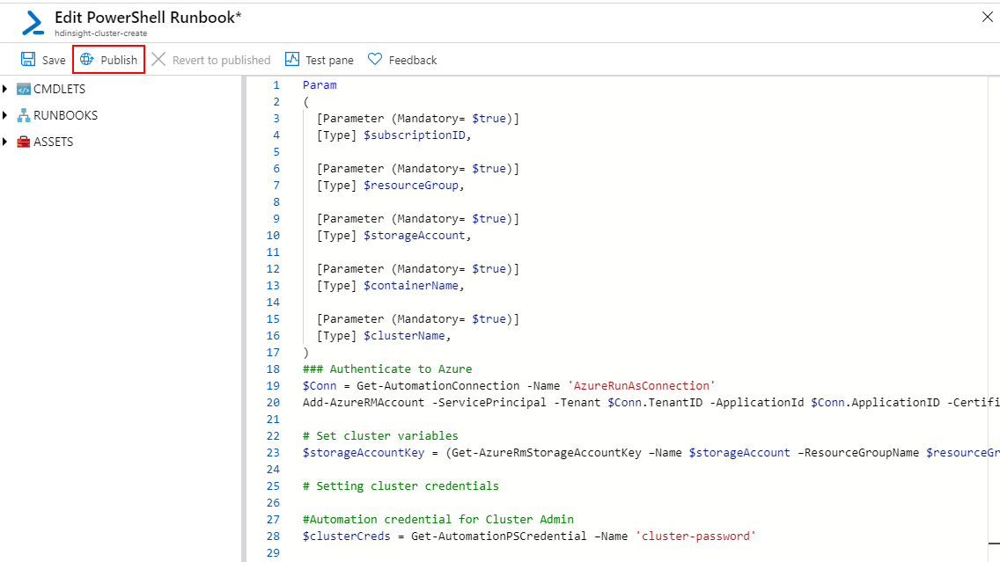
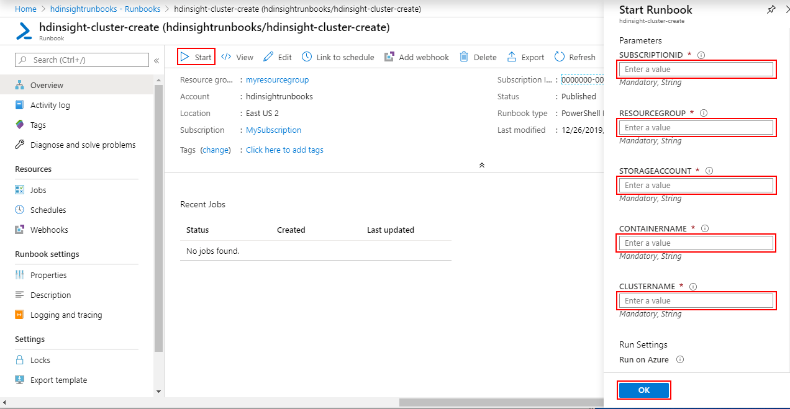

# Tutorial: Create HDInsight clusters with Azure Automation

Azure Automation allows you to create scripts to automatically manage Azure resources. This article describes how to create a PowerShell runbook to create and delete HDInsight clusters.

In this tutorial, you learn how to:

> [!div class="checklist"]
> * Install modules necessary for interacting with HDInsight.
> * Create and store credentials needed during cluster creation.
> * Create a new Azure Automation runbook to create an HDInsight cluster.

If you don’t have an Azure subscription, create a [free account](https://azure.microsoft.com/free/?WT.mc_id=A261C142F) before you begin.

## Prerequisites

1. An existing [Azure Automation account](../automation/automation-quickstart-create-account.md).
1. An existing [Azure Storage account](../storage/common/storage-account-create.md), which will be used as cluster storage.

## Install HDInsight modules

1. Sign in to the the [Azure portal](https://portal.azure.com).
1. Select your Azure Automation Accounts.
1. Select **Modules gallery** under **Shared Resources**.
1. Type **AzureRM.Profile** in the box and hit enter to search. Select the available search result.
1. On the **AzureRM.profile** screen Select **Import**. Check the box to update Azure modules and then Select **OK**.

    

1. Return to the modules gallery by Selecting **Modules gallery** under **Shared Resources**.
1. Type **HDInsight**. Select **AzureRM.HDInsight**.

    

1. On the **AzureRM.HDInsight** panel, Select **Import** and **OK**.

    

## Create credentials

1. Under **Shared Resources**, Select **Credentials**.
1. Select **Add a credential**.
1. Enter the required information on the **New Credential** panel. This credential is to store the cluster password, which will enable you to log in to Ambari.

    | Property | Value |
    | --- | --- |
    | Name | `cluster-password` |
    | User name | `admin` |
    | Password | `SECURE_PASSWORD` |
    | Confirm password | `SECURE_PASSWORD` |

1. Select **Create**
1. Repeat the same process for a new credential `ssh-password` with username `sshuser` and a password of your choice. Select **Create**. This credential is to store the SSH password for your cluster.

    

## Create a runbook to create a cluster

1. Select **Runbooks** under **Process Automation**.
1. Select **Create a runbook**.
1. On the **Create a runbook** panel, enter a name for the runbook, such as `hdinsight-cluster-create`. Select **Powershell** from the **Runbook type** dropdown.
1. Select **Create**.

    

1. Enter the following code on the **Edit PowerShell Runbook** screen and Select **Publish**:

    

    ```powershell
    Param
    (
      [Parameter (Mandatory= $true)]
      [String] $subscriptionID,
    
      [Parameter (Mandatory= $true)]
      [String] $resourceGroup,
    
      [Parameter (Mandatory= $true)]
      [String] $storageAccount,
    
      [Parameter (Mandatory= $true)]
      [String] $containerName,
    
      [Parameter (Mandatory= $true)]
      [String] $clusterName
    )
    ### Authenticate to Azure 
    $Conn = Get-AutomationConnection -Name 'AzureRunAsConnection'
    Add-AzureRMAccount -ServicePrincipal -Tenant $Conn.TenantID -ApplicationId $Conn.ApplicationID -CertificateThumbprint $Conn.CertificateThumbprint
    
    # Set cluster variables
    $storageAccountKey = (Get-AzureRmStorageAccountKey –Name $storageAccount –ResourceGroupName $resourceGroup)[0].value 
    
    # Setting cluster credentials
    
    #Automation credential for Cluster Admin
    $clusterCreds = Get-AutomationPSCredential –Name 'cluster-password'
    
    #Automation credential for user to SSH into cluster
    $sshCreds = Get-AutomationPSCredential –Name 'ssh-password' 
    
    $clusterType = "Hadoop" #Use any supported cluster type (Hadoop, HBase, Storm, etc.)
    $clusterOS = "Linux"
    $clusterWorkerNodes = 3
    $clusterNodeSize = "Standard_D3_v2"
    $location = Get-AzureRmStorageAccount –StorageAccountName $storageAccount –ResourceGroupName $resourceGroup | %{$_.Location}
    
    ### Provision HDInsight cluster
    New-AzureRmHDInsightCluster –ClusterName $clusterName –ResourceGroupName $resourceGroup –Location $location –DefaultStorageAccountName "$storageAccount.blob.core.windows.net" –DefaultStorageAccountKey $storageAccountKey -DefaultStorageContainer $containerName –ClusterType $clusterType –OSType $clusterOS –Version “3.6” –HttpCredential $clusterCreds –SshCredential $sshCreds –ClusterSizeInNodes $clusterWorkerNodes –HeadNodeSize $clusterNodeSize –WorkerNodeSize $clusterNodeSize
    ```

## Create a runbook to delete a cluster

1. Select **Runbooks** under **Process Automation**.
1. Select **Create a runbook**.
1. On the **Create a runbook** panel, enter a name for the runbook, such as `hdinsight-cluster-delete`. Select **Powershell** from the **Runbook type** dropdown.
1. Select **Create**.
1. Enter the following code on the **Edit PowerShell Runbook** screen and Select **Publish**:

    ```powershell
    Param
    (
      [Parameter (Mandatory= $true)]
      [String] $clusterName
    )
    
    ### Authenticate to Azure 
    $Conn = Get-AutomationConnection -Name 'AzureRunAsConnection'
    Add-AzureRMAccount -ServicePrincipal -Tenant $Conn.TenantID -ApplicationId $Conn.ApplicationID -CertificateThumbprint $Conn.CertificateThumbprint
    
    Remove-AzureRmHDInsightCluster -ClusterName $clusterName
    ```

## Execute Runbooks

### Create a cluster

1. View the list of Runbooks for your Automation account, by selecting **Runbooks** under **Process Automation**.
1. Select `hdinsight-cluster-create`, or the name that you used when creating your cluster creation runbook.
1. Select **Start** to execute the runbook immediately. You can also schedule runbooks to run periodically. See [Scheduling a runbook in Azure Automation](../automation/shared-resources/schedules.md)
1. Enter the required parameters for the script and select **OK**. This will create a new HDInsight cluster with the name that you specified in the **CLUSTERNAME** parameter.

    

### Delete a cluster

Delete the cluster by selecting the `hdinsight-cluster-delete` runbook that you created. Select **Start**, enter the **CLUSTERNAME** parameter and Select **OK**.

## Clean up resources

When no longer needed, delete the Azure Automation Account that was created to avoid unintended charges. To do so, navigate to the Azure portal, select the resource group where you created the Azure Automation Account, Select the Automation Account and then Select **Delete**.

## Next steps

> [!div class="nextstepaction"]
> [Manage Apache Hadoop clusters in HDInsight by using Azure PowerShell](hdinsight-administer-use-powershell.md)