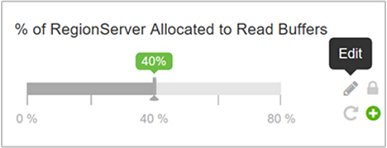
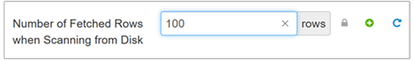
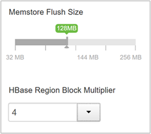
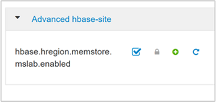

# Optimize Apache HBase with Apache Ambari in Azure HDInsight

Apache Ambari is a web interface to manage and monitor HDInsight clusters. For an introduction to Ambari Web UI, see [Manage HDInsight clusters by using the Apache Ambari Web UI](hdinsight-hadoop-manage-ambari.md).

Apache HBase configuration is modified from the **HBase Configs** tab. The following sections describe  some of the important configuration settings that affect HBase performance.

## Set HBASE_HEAPSIZE

The HBase heap size specifies the maximum amount of heap to be used in megabytes by *region* and *master* servers. The default value is 1,000 MB. This value should be tuned for the cluster workload.

1. To modify, navigate to the **Advanced HBase-env** pane in the HBase **Configs** tab, and then find the `HBASE_HEAPSIZE` setting.

1. Change the default value to 5,000 MB.

    

## Optimize read-heavy workloads

The following configurations are important to improve the performance of read-heavy workloads.

### Block cache size

The block cache is the read cache. Its size is controlled by the `hfile.block.cache.size` parameter. The default value is 0.4, which is 40 percent of the total region server memory. The larger the block cache size, the faster the random reads will be.

1. To modify this parameter, navigate to the **Settings** tab in the HBase **Configs** tab, and then locate **% of RegionServer Allocated to Read Buffers**.

    

1. To change the value, select the **Edit** icon.

### Memstore size

All edits are stored in the memory buffer, called a *Memstore*. This buffer increases the total amount of data that can be written to disk in a single operation. It also speeds access to the recent edits. The Memstore size is defined by the following two parameters:

* `hbase.regionserver.global.memstore.UpperLimit`: Defines the maximum percentage of the region server that Memstore combined can use.

* `hbase.regionserver.global.memstore.LowerLimit`: Defines the minimum percentage of the region server that Memstore combined can use.

To optimize for random reads, you can reduce the Memstore upper and lower limits.

### Number of rows fetched when scanning from disk

The `hbase.client.scanner.caching` setting defines the number of rows read from disk when the `next` method is called on a scanner.  The default value is 100. The higher the number, the fewer the remote calls made from the client to the region server, resulting in faster scans. However, this setting will also increase memory pressure on the client.

> [!IMPORTANT]  
> Do not set the value such that the time between invocation of the next method on a scanner is greater than the scanner timeout. The scanner timeout duration is defined by the `hbase.regionserver.lease.period` property.

## Optimize write-heavy workloads

The following configurations are important to improve the performance of write-heavy workloads.

### Maximum region file size

HBase stores  data in an internal file format, called *HFile*. The property `hbase.hregion.max.filesize` defines the size of a single HFile for a region.  A region is split into two regions if the sum of all HFiles in a region is greater than this setting.

The larger the region file size, the smaller the number of splits. You can increase the file size  to determine a value that results in the maximum write performance.

### Avoid update blocking

* The property `hbase.hregion.memstore.flush.size` defines the size at which Memstore is flushed to disk. The default size is 128 MB.

* The HBase region block multiplier is defined by `hbase.hregion.memstore.block.multiplier`. The default value is 4. The maximum allowed is 8.

* HBase blocks updates if the Memstore is (`hbase.hregion.memstore.flush.size` * `hbase.hregion.memstore.block.multiplier`) bytes.

    With the default values of flush size and block multiplier, updates are blocked when Memstore is  128 * 4 = 512 MB in size. To reduce the update blocking count, increase the value of `hbase.hregion.memstore.block.multiplier`.

## Define Memstore size

Memstore size is defined by the `hbase.regionserver.global.memstore.UpperLimit` and `hbase.regionserver.global.memstore.LowerLimit` parameters. Setting these values equal to each other reduces pauses during writes (also causing more frequent flushing) and results in increased write performance.

## Set Memstore local allocation buffer

Memstore local allocation buffer usage is determined by the property `hbase.hregion.memstore.mslab.enabled`. When enabled (true), this setting prevents heap fragmentation during heavy write operation. The default value is true.

## Next steps

* [Manage HDInsight clusters with the Apache Ambari web UI](hdinsight-hadoop-manage-ambari.md)
* [Apache Ambari REST API](hdinsight-hadoop-manage-ambari-rest-api.md)
* [Optimize clusters](./hdinsight-changing-configs-via-ambari.md)
* [Optimize Apache Hive](./optimize-hive-ambari.md)
* [Optimize Apache Pig](./optimize-pig-ambari.md)
