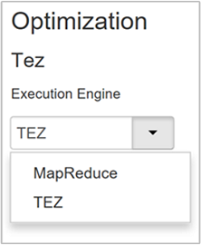
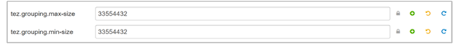
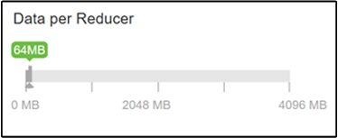
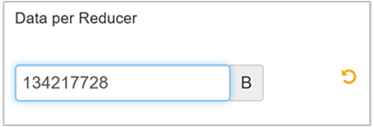
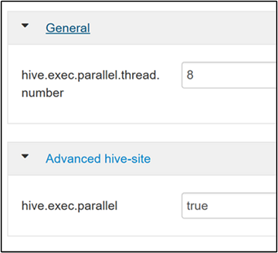
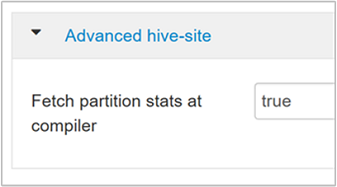

# Optimize Apache Hive with Apache Ambari in Azure HDInsight

Apache Ambari is a web interface to manage and monitor HDInsight clusters. For an introduction to Ambari Web UI, see [Manage HDInsight clusters by using the Apache Ambari Web UI](hdinsight-hadoop-manage-ambari.md).

The following sections describe configuration options for optimizing overall Apache Hive performance.

1. To modify Hive configuration parameters, select **Hive** from the Services sidebar.
1. Navigate to the **Configs** tab.

## Set the Hive execution engine

Hive provides two execution engines: Apache Hadoop MapReduce and Apache TEZ. Tez is faster than MapReduce. HDInsight Linux clusters have Tez as the default execution engine. To change the execution engine:

1. In the Hive **Configs** tab, type **execution engine** in the filter box.

    

1. The **Optimization** property's default value is **Tez**.

    

## Tune mappers

Hadoop tries to split (*map*) a single file into multiple files and process the resulting files in parallel. The number of mappers depends on the number of splits. The following two configuration parameters drive the number of splits for the Tez execution engine:

* `tez.grouping.min-size`: Lower limit on the size of a grouped split, with a default value of 16 MB (16,777,216 bytes).
* `tez.grouping.max-size`: Upper limit on the size of a grouped split, with a default value of 1 GB (1,073,741,824 bytes).

As a performance guideline, lower both of these parameters to improve latency, increase for more throughput.

For example, to set four mapper tasks for a data size of 128 MB, you would set both parameters to 32 MB each (33,554,432 bytes).

1. To modify the limit parameters, navigate to the **Configs** tab of the Tez service. Expand the **General** panel, and  locate the `tez.grouping.max-size` and `tez.grouping.min-size` parameters.

1. Set both parameters to **33,554,432** bytes (32 MB).

    

These changes  affect all Tez jobs across the server. To get an optimal result, choose appropriate parameter values.

## Tune reducers

Apache ORC and Snappy both offer high performance. However, Hive may have too few reducers by default, causing bottlenecks.

For example, say you have an input data size of 50 GB. That data in ORC format with Snappy compression is 1 GB. Hive estimates the number of reducers needed as:     (number of bytes input to mappers / `hive.exec.reducers.bytes.per.reducer`).

With the default settings, this example is four reducers.

The `hive.exec.reducers.bytes.per.reducer` parameter specifies the number of bytes processed per reducer. The default value is 64 MB. Tuning this value down increases parallelism and may improve performance. Tuning it too low could also produce too many reducers, potentially adversely affecting performance. This parameter is based on your particular data requirements, compression settings, and other environmental factors.

1. To modify the parameter, navigate to the Hive **Configs** tab and find the **Data per Reducer** parameter on the Settings page.

    

1. Select **Edit** to modify the value to 128 MB (134,217,728 bytes), and then press **Enter** to save.

    
  
    Given an input size of 1,024 MB, with 128 MB of data per reducer, there are  eight reducers (1024/128).

1. An incorrect value for the **Data per Reducer** parameter may result in a large number of reducers, adversely affecting query performance. To limit the maximum number of reducers, set `hive.exec.reducers.max` to an appropriate value. The default value is 1009.

## Enable parallel execution

A Hive query is executed in one or more stages. If the independent stages can be run in parallel, that will increase query performance.

1. To enable parallel query execution, navigate to the Hive **Config** tab and search for the `hive.exec.parallel` property. The default value is false. Change the value to true, and then press **Enter** to save the value.

1. To limit the number of jobs to run in parallel, modify the `hive.exec.parallel.thread.number` property. The default value is 8.

    

## Enable vectorization

Hive processes data row by row. Vectorization directs Hive to process data in blocks of 1,024 rows rather than one row at a time. Vectorization is only applicable to the ORC file format.

1. To enable a vectorized query execution, navigate to the Hive **Configs** tab and search for the `hive.vectorized.execution.enabled` parameter. The default value is true for Hive 0.13.0 or later.

1. To enable vectorized execution for the reduce side of the query, set the `hive.vectorized.execution.reduce.enabled` parameter to true. The default value is false.

    

## Enable cost-based optimization (CBO)

By default, Hive follows a set of rules to find one optimal query execution plan. Cost-based optimization (CBO) evaluates multiple plans to execute a query. And assigns a cost to each plan, then determines the cheapest plan to execute a query.

To enable CBO, navigate to **Hive** > **Configs** > **Settings** and find **Enable Cost Based Optimizer**, then switch the toggle button to **On**.

The following additional configuration parameters increase Hive query performance when CBO is enabled:

* `hive.compute.query.using.stats`

    When set to true, Hive uses statistics stored in its metastore to answer simple queries like `count(*)`.

    

* `hive.stats.fetch.column.stats`

    Column statistics are created when CBO is enabled. Hive uses column statistics, which are stored in metastore, to optimize queries. Fetching column statistics for each column takes longer when the number of columns is high. When set to false, this setting disables fetching column statistics from the metastore.

    

* `hive.stats.fetch.partition.stats`

    Basic partition statistics such as number of rows, data size, and file size are stored in metastore. If set to true, the partition stats are fetched from metastore. When false, the file size is fetched from the file system. And the number of rows is fetched from the row schema.

    

## Enable intermediate compression

Map tasks create intermediate files that are used by the reducer tasks. Intermediate compression shrinks the intermediate file size.

Hadoop jobs are usually I/O bottlenecked. Compressing data can speed up I/O and overall network transfer.

The available compression types are:

| Format | Tool | Algorithm | File Extension | Splittable? |
| --- | --- | --- | --- | --- |
| Gzip | Gzip | DEFLATE | `.gz` | No |
| Bzip2 | Bzip2 | Bzip2 |`.bz2` | Yes |
| LZO | `Lzop` | LZO | `.lzo` | Yes, if indexed |
| Snappy | N/A | Snappy | Snappy | No |

As a general rule, having the compression method splittable is important, otherwise few mappers will be created. If the input data is text, `bzip2` is the best option. For ORC format, Snappy is the fastest compression option.

1. To enable intermediate compression, navigate to the Hive **Configs** tab, and then set the `hive.exec.compress.intermediate` parameter to true. The default value is false.

    

    > [!NOTE]  
    > To compress intermediate files, choose a compression codec with lower CPU cost, even if the codec doesn't have a high compression output.

1. To set the intermediate compression codec, add the custom property `mapred.map.output.compression.codec` to the `hive-site.xml` or `mapred-site.xml` file.

1. To add a custom setting:

    a. Navigate to **Hive** > **Configs** > **Advanced** > **Custom hive-site**.

    b. Select **Add Property...** at the bottom of the Custom hive-site pane.

    c. In the Add Property window, enter `mapred.map.output.compression.codec` as the key and `org.apache.hadoop.io.compress.SnappyCodec` as the value.

    d. Select **Add**.

    

    This setting will compress the intermediate file using Snappy compression. Once the property is added, it appears in the Custom hive-site pane.

    > [!NOTE]  
    > This procedure modifies the `$HADOOP_HOME/conf/hive-site.xml` file.

## Compress final output

The final Hive output can also be compressed.

1. To compress the final Hive output, navigate to the Hive **Configs** tab, and then set the `hive.exec.compress.output` parameter to true. The default value is false.

1. To choose the output compression codec, add the `mapred.output.compression.codec` custom property to the Custom hive-site pane, as described in the previous section's step 3.

    

## Enable speculative execution

Speculative execution launches a certain number of duplicate tasks to detect and deny list the slow-running task tracker. While improving the overall job execution by optimizing individual task results.

Speculative execution shouldn't be turned on for long-running MapReduce tasks with large amounts of input.

* To enable speculative execution, navigate to the Hive **Configs** tab, and then set the `hive.mapred.reduce.tasks.speculative.execution` parameter to true. The default value is false.

    

## Tune dynamic partitions

Hive allows for creating dynamic partitions when inserting records into a table, without predefining every partition. This ability is a powerful feature. Although it may result in the creation of a large number of partitions. And a large number of files for each partition.

1. For Hive to do dynamic partitions, the `hive.exec.dynamic.partition` parameter value should be true (the  default).

1. Change the dynamic partition mode to *strict*. In strict mode, at least one partition has to be static. This setting prevents queries without the partition filter in the WHERE clause, that is, *strict* prevents queries that scan all partitions. Navigate to the Hive **Configs** tab, and then set `hive.exec.dynamic.partition.mode` to **strict**. The default value is **nonstrict**.

1. To limit the number of dynamic partitions to be created, modify the `hive.exec.max.dynamic.partitions` parameter. The default value is 5000.

1. To limit the total number of dynamic partitions per node, modify `hive.exec.max.dynamic.partitions.pernode`. The default value is 2000.

## Enable local mode

Local mode enables Hive to do all tasks of a job on a single machine. Or sometimes in a single process. This setting improves query performance if the input data is small. And the overhead of launching tasks for queries consumes a significant percentage of the overall query execution.

To enable local mode, add the `hive.exec.mode.local.auto` parameter to the Custom hive-site panel, as explained in step 3 of the [Enable intermediate compression](#enable-intermediate-compression) section.

## Set single MapReduce MultiGROUP BY

When this property is set to true, a MultiGROUP BY query with common group-by keys  generates a single MapReduce job.  

To enable this behavior, add the `hive.multigroupby.singlereducer` parameter to the Custom hive-site pane, as explained in step 3 of the [Enable intermediate compression](#enable-intermediate-compression) section.

## Additional Hive optimizations

The following sections describe additional Hive-related optimizations you can set.

### Join optimizations

The default join type in Hive is a *shuffle join*. In Hive,  special mappers read the input and emit a join key/value pair to an intermediate file. Hadoop sorts and merges these pairs in a shuffle stage. This shuffle stage is expensive. Selecting the right join based on your data can significantly improve performance.

| Join Type | When | How | Hive settings | Comments |
| --- | --- | --- | --- | --- |
| Shuffle Join | <ul><li>Default choice</li><li>Always works</li></ul> | <ul><li>Reads from part of one of the tables</li><li>Buckets and sorts on Join key</li><li>Sends one bucket to each reduce</li><li>Join is done on the Reduce side</li></ul> | No significant Hive setting needed | Works every time |
| Map Join | <ul><li>One table can fit in memory</li></ul> | <ul><li>Reads small table into memory hash table</li><li>Streams through part of the large file</li><li>Joins each record from hash table</li><li>Joins are by the mapper alone</li></ul> | `hive.auto.confvert.join=true` | Fast, but limited |
| Sort Merge Bucket | If both tables are: <ul><li>Sorted the same</li><li>Bucketed the same</li><li>Joining on the sorted/bucketed column</li></ul> | Each process: <ul><li>Reads a bucket from each table</li><li>Processes the row with the lowest value</li></ul> | `hive.auto.convert.sortmerge.join=true` | Efficient |

### Execution engine optimizations

Additional recommendations for optimizing the Hive execution engine:

| Setting | Recommended | HDInsight Default |
| --- | --- | --- |
| `hive.mapjoin.hybridgrace.hashtable` | True = safer, slower; false = faster | false |
| `tez.am.resource.memory.mb` | 4-GB upper bound for most | Auto-Tuned |
| `tez.session.am.dag.submit.timeout.secs` | 300+ | 300 |
| `tez.am.container.idle.release-timeout-min.millis` | 20000+ | 10000 |
| `tez.am.container.idle.release-timeout-max.millis` | 40000+ | 20000 |

## Next steps

* [Manage HDInsight clusters with the Apache Ambari web UI](hdinsight-hadoop-manage-ambari.md)
* [Apache Ambari REST API](hdinsight-hadoop-manage-ambari-rest-api.md)
* [Optimize Apache Hive queries in Azure HDInsight](./hdinsight-hadoop-optimize-hive-query.md)
* [Optimize clusters](./optimize-hive-ambari.md)
* [Optimize Apache HBase](./optimize-hbase-ambari.md)
* [Optimize Apache Pig](./optimize-pig-ambari.md)