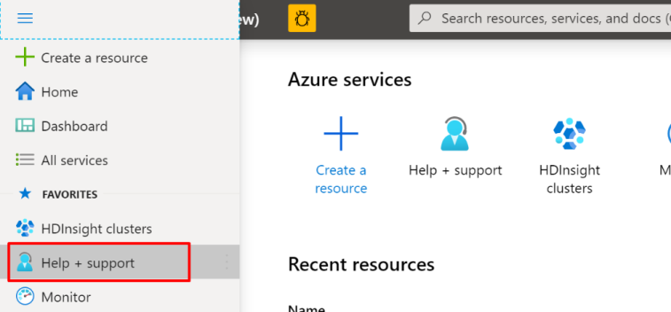

# Requesting quota increases for Azure HDInsight

CPU core quotas help to ensure that resource usage is distributed fairly between all customers in a particular Azure region. However, in certain cases, your business requirements might demand more cluster resources than your current quota will allow. In such cases, you can request a CPU core quota increase so that you can deploy clusters, which match your data processing requirements.

When you reach a quota limit, you can't deploy new clusters or scale out existing clusters by adding more worker nodes. The only quota limit is the CPU Cores quota that exists at the region level for each subscription. For example, your subscription may have a 30 CPU core limit in the East US region, with another 30 CPU cores allowed in the East US 2.

## Gather required information

If you have received a error indicating that you have hit a quota limit, use the process described in this section to gather important information and submit a quota increase request.

1. Determine your desired cluster VM size, scale, and type.
1. Check the current quota capacity limits of your subscription. To check your available cores, do the following steps:

    1. Sign in to the [Azure portal](https://portal.azure.com/).
    1. Navigate to the **Overview** page for the HDInsight cluster.
    1. On the left menu, select **Quota limits**. The page displays the number of cores in use, the number of available cores, and the total cores.

To request a quota increase, do the following steps:

1. Sign in to the [Azure portal](https://portal.azure.com/).
1. Select **Help + support** on the bottom-left side of the page.

    

1. Select **New support request**.
1. On the **New support request** page, under **Basics** tab, select the following options:

   - **Issue type**: **Service and subscription limits (quotas)**
   - **Subscription**: the subscription you want to modify
   - **Quota type**: **HDInsight**

     

1. Select **Next: Solutions >>**.
1. On the **Details** page, enter a description of the issue, select the severity of the issue, your preferred contact method, and other required fields. Use the template listed below, to ensure that you provide necessary information. Quota increase requests are evaluated by the Azure capacity team, and not by the HDInsight product team. The more complete information you provide, the more likely your request will be approved.

    ```
    I would like to request [SPECIFY DESIRED AMOUNT] on [DESIRED SKU] for [SUBSCRIPTION ID].
    
    My current quota on this subscription is [CURRENT QUOTA AMOUNT].
    
    I would like to use the extra cores for [DETAIL REASON].
    ```

    

1. Select **Next: Review + create >>**.
1. On the **Review + create** tab, select **Create**.

> [!NOTE]  
> If you need to increase the HDInsight core quota in a private region, [submit a whitelist request](https://aka.ms/canaryintwhitelist).

You can [contact support to request a quota increase](https://docs.microsoft.com/azure/azure-portal/supportability/resource-manager-core-quotas-request).

There are some fixed quota limits. For example, a single Azure subscription can have at most 10,000 cores. For details on these limits, see [Azure subscription and service limits, quotas, and constraints](https://docs.microsoft.com/azure/azure-resource-manager/management/azure-subscription-service-limits).

## Next steps

* [Set up clusters in HDInsight with Apache Hadoop, Spark, Kafka, and more](hdinsight-hadoop-provision-linux-clusters.md): Learn how to set up and configure clusters in HDInsight.
* [Monitor cluster performance](hdinsight-key-scenarios-to-monitor.md): Learn about key scenarios to monitor for your HDInsight cluster that might affect your cluster's capacity.