# Get started with R Server on HDInsight

Azure HDInsight includes an R Server option to be integrated into your HDInsight cluster. This option allows R scripts to use Spark and MapReduce to run distributed computations. In this article, you learn how to create an R Server on HDInsight cluster. You then learn how to run an R script that demonstrates using Spark for distributed R computations.

## Prerequisites

* **An Azure subscription**: Before you begin this tutorial, you must have an Azure subscription. For more information, see [Get Microsoft Azure free trial](https://azure.microsoft.com/documentation/videos/get-azure-free-trial-for-testing-hadoop-in-hdinsight/).
* **A Secure Shell (SSH) client**: An SSH client is used to remotely connect to the HDInsight cluster and run commands directly on the cluster. For more information, see [Use SSH with HDInsight](../hdinsight-hadoop-linux-use-ssh-unix.md).
* **SSH keys (optional)**: You can secure the SSH account that's used to connect to the cluster by using either a password or a public key. Using a password is easier, and it enables you to get started without having to create a public/private key pair. However, using a key is more secure.

  > [!NOTE]
  > The steps in this article assume that you are using a password.

## Automate cluster creation

You can automate the creation of HDInsight R Server instances by using Azure Resource Manager templates, the SDK, and PowerShell.

* To create an R Server instance by using an Azure Resource Manager template, see [Deploy an R server HDInsight cluster](https://azure.microsoft.com/resources/templates/101-hdinsight-rserver/).
* To create an R Server instance by using the .NET SDK, see [Create Linux-based clusters in HDInsight using the .NET SDK](../hdinsight-hadoop-create-linux-clusters-dotnet-sdk.md).
* To deploy R Server by using PowerShell, see [Create Linux-based clusters in HDInsight using Azure PowerShell](../hdinsight-hadoop-create-linux-clusters-azure-powershell.md).

## Create a cluster by using the Azure portal

1. Sign in to the [Azure portal](https://portal.azure.com).

2. Select **New** > **Intelligence + analytics** > **HDInsight**.

    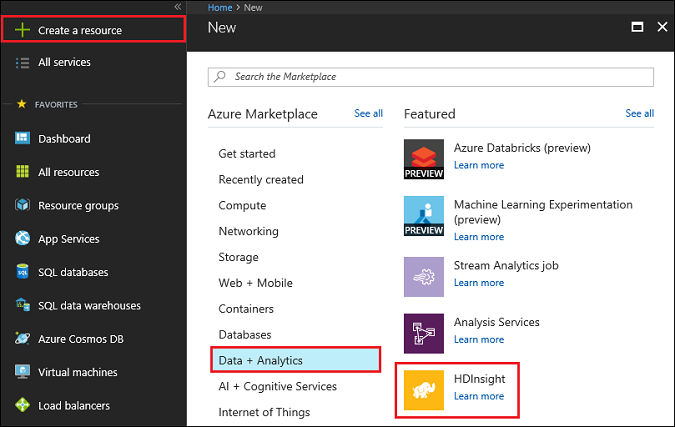

3. In the **Quick create** experience, enter a name for the cluster in the **Cluster name** box. If you have multiple Azure subscriptions, use the **Subscription** box to select the one that you want to use.

    

4. Select **Cluster type** to open the **Cluster configuration** pane. In the **Cluster configuration** pane, select the following options:

   	* **Cluster type**: Select **R Server**.
   	* **Version**: Select the version of R Server to install on the cluster. The version currently available is **R Server 9.1 (HDI 3.6)**. Release notes for the available versions of R Server are available on [docs.microsoft.com](https://docs.microsoft.com/machine-learning-server/whats-new-in-r-server#r-server-91).
   	* **R Studio community edition for R Server**: This browser-based IDE is installed by default on the edge node. If you prefer to not have it installed, clear the check box. If you choose to have it installed, the URL for accessing the RStudio Server login will be in a portal application pane for your cluster after it’s created.
   	* Leave the other options at the default values, and use the **Select** button to save the cluster type.

   		

5. In the **Basics** pane, in the **Cluster login username** and **Cluster login password** boxes, enter a username and a password (respectively) for the cluster.

6. In the **Secure Shell (SSH) username** box, specify the SSH username. SSH is used to remotely connect to the cluster by using an SSH client. You can specify the SSH user in this box or after the cluster is created (on the **Configuration** tab for the cluster).
   
   > [!NOTE] 
   > R Server is configured to expect an SSH username of “remoteuser.” If you use a different username, you must perform an additional step after the cluster is created.

7. Leave the **Use same password as cluster login** check box selected to use **PASSWORD** as the authentication type, unless you prefer to use a public key. You need a public/private key pair to access R Server on the cluster via a remote client, such as R Tools for Visual Studio, RStudio, or another desktop IDE. If you install the RStudio Server community edition, you need to choose an SSH password.     

   To create and use a public/private key pair, clear **Use same password as cluster login**. Then select **PUBLIC KEY** and proceed as follows. These instructions assume that you have Cygwin with ssh-keygen or an equivalent installed.

   a. Generate a public/private key pair from the command prompt on your laptop:

		ssh-keygen -t rsa -b 2048

   b. Follow the prompt to name a key file and then enter a passphrase for added security. Your screen should look something like the following image:

      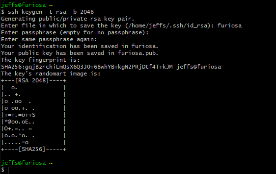

   	  This command creates a private key file and a public key file under the name <private-key-filename>.pub. In this example, the files are furiosa and furiosa.pub:

      

   c. Specify the public key file (&#42;.pub) when assigning HDI cluster credentials. Confirm your resource group and region, and select **Next**.

        

   d. Change permissions on the private key file on your laptop:

		chmod 600 <private-key-filename>

   e. Use the private key file with SSH for remote login:

		ssh –i <private-key-filename> remoteuser@<hostname public ip>

   	  Or, use the private key file as part the definition of your Hadoop Spark compute context for R Server on the client. For more information, see [Create a Compute Context for Spark](https://docs.microsoft.com/machine-learning-server/r/how-to-revoscaler-spark).

8. The quick create transitions you to the **Storage** pane. There, you select the storage account settings to be used for the primary location of the HDFS file system that the cluster uses. Select a new or existing Azure storage account, or select an existing Azure Data Lake Store account.

	- If you select an Azure storage account, you can choose an existing account by selecting **Select a storage account** and then selecting the relevant account. Create a new account by using the **Create new** link in the **Select a storage account** section.

      > [!NOTE]
      > If you select **New**, you must enter a name for the new storage account. A green check appears if the name is accepted.

      **Default container** defaults to the name of the cluster. Leave this default as the value.

      If you selected a new storage account, use **Location** in the prompt to select a region for it.  

         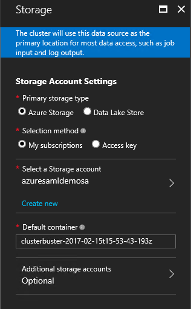  

      > [!IMPORTANT]
      > Selecting the location for the default data source also sets the location of the HDInsight cluster. The cluster and default data source must be in the same region.

	- If you want to use an existing Data Lake Store account, select the account to use. Then add the cluster *ADD* identity to your cluster to allow access to the store. For more information on this process, see [Create HDInsight clusters with Data Lake Store by using the Azure portal](https://docs.microsoft.com/azure/data-lake-store/data-lake-store-hdinsight-hadoop-use-portal).

   	Use the **Select** button to save the data source configuration.

9. The **Summary** pane then appears so you can validate all your settings. Here you can change your cluster size to modify the number of servers in your cluster. You can also specify any script actions that you want to run. Unless you know that you need a larger cluster, leave the number of worker nodes at the default of **4**. The pane also shows the estimated cost of the cluster.

   	

   > [!NOTE]
   > If needed, you can resize your cluster later through the portal (**Cluster** > **Settings** > **Scale cluster**) to increase or decrease the number of worker nodes. This resizing can be useful for idling down the cluster when it's not in use, or for adding capacity to meet the needs of larger tasks.
   >
   >

   Factors to keep in mind when sizing your cluster, the data nodes, and the edge node include:  

   * The performance of distributed R Server analyses on Spark is proportional to the number of worker nodes when the data is large.  

   * The performance of R Server analyses is linear in the size of data being analyzed. For example:  

     * For small to modest data, performance is best when the data is analyzed in a local compute context on the edge node. For more information on the scenarios under which the local and Spark compute contexts work best, see [Compute context options for R Server on HDInsight](r-server-compute-contexts.md). 
     * If you log in to the edge node and run your R script, all but the ScaleR rx-functions are executed *locally* on the edge node. So the memory and number of cores on the edge node should be sized accordingly. The same applies if you use R Server on HDI as a remote compute context from your laptop.

   Use the **Select** button to save the node pricing configuration.

   

   There is also a link for **Download template and parameters**. Select this link to display scripts that can be used to automate the creation of a cluster with the selected configuration. These scripts are also available from the Azure portal entry for your cluster after it's created.

   > [!NOTE]
   > It takes some time for the cluster to be created, usually around 20 minutes. To check on the creation process, use the tile on the Startboard or the **Notifications** entry on the left of the page.
   >
   >

## Connect to RStudio Server

If you chose to include RStudio Server community edition in your installation, you can access the RStudio login via two methods:

- Go to the following URL (where *CLUSTERNAME* is the name of the cluster that you created):

    https://*CLUSTERNAME*.azurehdinsight.net/rstudio/

- Open the entry for your cluster in the Azure portal, select the **R Server dashboards** quick link, and then select **R Studio dashboard**:

  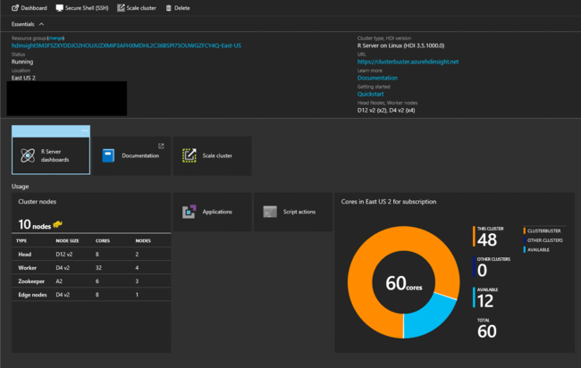

  

> [!IMPORTANT]
> Regardless of the method used, the first time you log in, you need to authenticate twice. At the first authentication, provide the cluster admin user ID and password. At the second prompt, provide the SSH user ID and password. Subsequent logins require only the SSH user ID and password.

## Connect to the R Server edge node

Connect to the R Server edge node of the HDInsight cluster by using SSH via this command:

   `ssh USERNAME@CLUSTERNAME-ed-ssh.azurehdinsight.net`

> [!NOTE]
> You can find the `USERNAME@CLUSTERNAME-ed-ssh.azurehdinsight.net` address in the Azure portal. Select your cluster, and then select **All Settings** > **Apps** > **RServer**. This displays the SSH endpoint information for the edge node.
>
> 
>
>

If you used a password to help secure your SSH user account, you are prompted to enter it. If you used a public key, you might have to use the `-i` parameter to specify the matching private key. For example:

	ssh -i ~/.ssh/id_rsa USERNAME@CLUSTERNAME-ed-ssh.azurehdinsight.net

For more information, see [Connect to HDInsight (Hadoop) using SSH](../hdinsight-hadoop-linux-use-ssh-unix.md).

After you're connected, you arrive at a prompt that's similar to the following:

	sername@ed00-myrser:~$

## Enable multiple concurrent users

You can enable multiple concurrent users by adding more users for the edge node on which the RStudio community version runs.

When you create an HDInsight cluster, you must provide two users: an HTTP user and an SSH user.

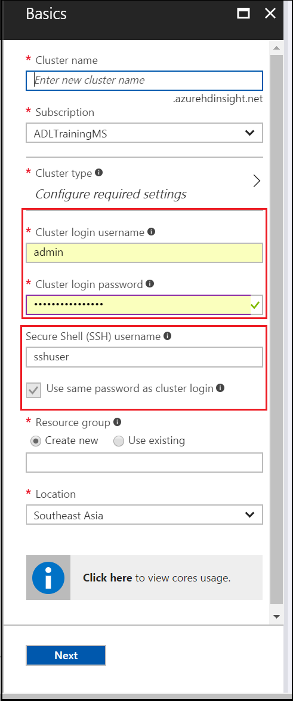

- **Cluster login username**: An HTTP user for authentication through the HDInsight gateway that's used to protect the HDInsight clusters that you created. This HTTP user is used to access the Ambari UI, the YARN UI, and other UI components.
- **Secure Shell (SSH) username**: An SSH user to access the cluster through Secure Shell. This user is a user in the Linux system for all the head nodes, worker nodes, and edge nodes. So you can use SSH to access any of the nodes in a remote cluster.

The RStudio Server community version used in the Microsoft R Server on HDInsight type cluster accepts only the Linux username and password as a login mechanism. It does not support passing tokens. So if you have created a new cluster and want to use RStudio to access it, you need to log in twice.

1. Log in by using the HTTP user credentials through the HDInsight gateway: 

	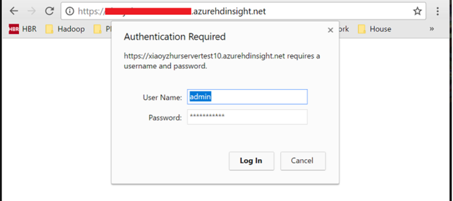

2. Use the SSH user credentials to sign in to RStudio:
  
	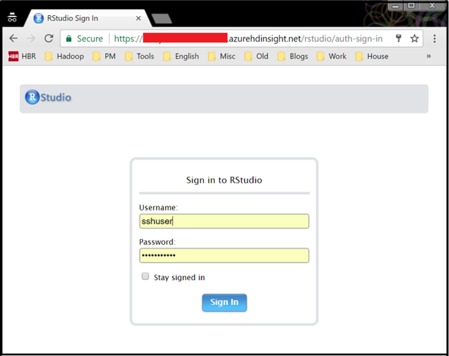

Currently, you can create only one SSH user account when provisioning an HDInsight cluster. To enable multiple users to access Microsoft R Server on HDInsight clusters, you need to create additional users in the Linux system.

Because RStudio Server community version is running on the cluster’s edge node, there are three steps here:

1. Use the created SSH user to log in to the edge node.
2. Add more Linux users to the edge node.
3. Use the RStudio community version with the created user.

### Use the created SSH user to log in to the edge node

Download any SSH tool (such as PuTTY) and use the existing SSH user to log in. Then follow the instructions provided in [Connect to HDInsight (Hadoop) using SSH](../hdinsight-hadoop-linux-use-ssh-unix.md) to access the edge node. The edge node address for the R Server on HDInsight cluster is:
**clustername-ed-ssh.azurehdinsight.net**

### Add more Linux users to the edge node

To add a user to the edge node, run these commands:

	sudo useradd yournewusername -m
	sudo passwd yourusername

You should see the following items returned: 

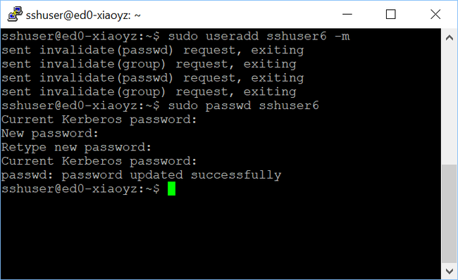

When you're prompted for the current Kerberos password, just select the Enter key to ignore it. The `-m` option in the `useradd` command indicates that the system will create a home folder for the user. This folder is required for the RStudio community version.

### Use the RStudio community version with the created user

Use the created user to sign in to RStudio:

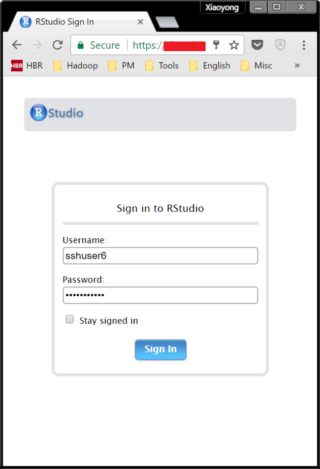

Notice that RStudio indicates that you are using the new user (here, for example, **sshuser6**) to log in to the cluster: 

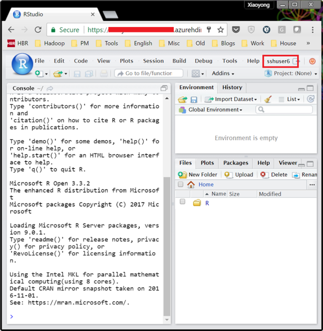

You can also log in by using the original credentials (by default, it's **sshuser**) concurrently from another browser window.

You can submit a job by using ScaleR functions. Here is an example of the commands for running a job:

	# Set the HDFS (Azure Blob storage) location of example data
	bigDataDirRoot <- "/example/data"

	# Create a local folder for storing data temporarily
	source <- "/tmp/AirOnTimeCSV2012"
	dir.create(source)

	# Download data to the tmp folder
	remoteDir <- "https://packages.revolutionanalytics.com/datasets/AirOnTimeCSV2012"
	download.file(file.path(remoteDir, "airOT201201.csv"), file.path(source, "airOT201201.csv"))
	download.file(file.path(remoteDir, "airOT201202.csv"), file.path(source, "airOT201202.csv"))
	download.file(file.path(remoteDir, "airOT201203.csv"), file.path(source, "airOT201203.csv"))
	download.file(file.path(remoteDir, "airOT201204.csv"), file.path(source, "airOT201204.csv"))
	download.file(file.path(remoteDir, "airOT201205.csv"), file.path(source, "airOT201205.csv"))
	download.file(file.path(remoteDir, "airOT201206.csv"), file.path(source, "airOT201206.csv"))
	download.file(file.path(remoteDir, "airOT201207.csv"), file.path(source, "airOT201207.csv"))
	download.file(file.path(remoteDir, "airOT201208.csv"), file.path(source, "airOT201208.csv"))
	download.file(file.path(remoteDir, "airOT201209.csv"), file.path(source, "airOT201209.csv"))
	download.file(file.path(remoteDir, "airOT201210.csv"), file.path(source, "airOT201210.csv"))
	download.file(file.path(remoteDir, "airOT201211.csv"), file.path(source, "airOT201211.csv"))
	download.file(file.path(remoteDir, "airOT201212.csv"), file.path(source, "airOT201212.csv"))

	# Set the directory in bigDataDirRoot to load the data
	inputDir <- file.path(bigDataDirRoot,"AirOnTimeCSV2012")

	# Create the directory
	rxHadoopMakeDir(inputDir)

	# Copy the data from source to input
	rxHadoopCopyFromLocal(source, bigDataDirRoot)

	# Define the HDFS (Blob storage) file system
	hdfsFS <- RxHdfsFileSystem()

	# Create an info list for the airline data
	airlineColInfo <- list(
	DAY_OF_WEEK = list(type = "factor"),
	ORIGIN = list(type = "factor"),
	DEST = list(type = "factor"),
	DEP_TIME = list(type = "integer"),
	ARR_DEL15 = list(type = "logical"))

	# Get all the column names
	varNames <- names(airlineColInfo)

	# Define the text data source in HDFS
	airOnTimeData <- RxTextData(inputDir, colInfo = airlineColInfo, varsToKeep = varNames, fileSystem = hdfsFS)

	# Define the text data source in the local system
	airOnTimeDataLocal <- RxTextData(source, colInfo = airlineColInfo, varsToKeep = varNames)

	# Specify the formula to use
	formula = "ARR_DEL15 ~ ORIGIN + DAY_OF_WEEK + DEP_TIME + DEST"

	# Define the Spark compute context
	mySparkCluster <- RxSpark()

	# Set the compute context
	rxSetComputeContext(mySparkCluster)

	# Run a logistic regression
	system.time(
		modelSpark <- rxLogit(formula, data = airOnTimeData)
	)

	# Display a summary
	summary(modelSpark)

Notice that the submitted jobs are under different user names in the YARN UI:

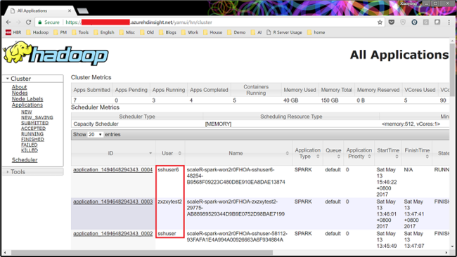

Note also that the newly added users do not have root privileges in Linux system. But they do have the same access to all the files in the remote HDFS file system and Blob storage.

## Use the R console

1. From the SSH session, use the following command to start the R console:  

		R

2. You should see output similar to the following:
	
		R version 3.2.2 (2015-08-14) -- "Fire Safety"
		Copyright (C) 2015 The R Foundation for Statistical Computing
		Platform: x86_64-pc-linux-gnu (64-bit)

		R is free software and comes with ABSOLUTELY NO WARRANTY.
		You are welcome to redistribute it under certain conditions.
		Type 'license()' or 'licence()' for distribution details.

	    Natural language support but running in an English locale

		R is a collaborative project with many contributors.
		Type 'contributors()' for more information and
		'citation()' on how to cite R or R packages in publications.

		Type 'demo()' for some demos, 'help()' for on-line help, or
		'help.start()' for an HTML browser interface to help.
		Type 'q()' to quit R.

		Microsoft R Server version 8.0: an enhanced distribution of R
		Microsoft packages Copyright (C) 2016 Microsoft Corporation

	    Type 'readme()' for release notes.
	    >

3. From the `>` prompt, you can enter R code. R Server includes packages that you can use to easily interact with Hadoop and run distributed computations. For example, use the following command to view the root of the default file system for the HDInsight cluster:

		rxHadoopListFiles("/")

4. You can also use the Blob storage style of addressing:

		rxHadoopListFiles("wasb:///")

## Use R Server on HDI from a remote instance of Microsoft R Server or Microsoft R Client

It's possible to set up access to the HDI Hadoop Spark compute context from a remote instance of Microsoft R Server or Microsoft R Client running on a desktop or laptop. For more information, see the "Using Microsoft R Server as a Hadoop Client" section in [Creating a Compute Context for Spark](https://docs.microsoft.com/machine-learning-server/r/how-to-revoscaler-spark#more-spark-scenarios). To do so, specify the following options when defining the RxSpark compute context on your laptop: hdfsShareDir, shareDir, sshUsername, sshHostname, sshSwitches, and sshProfileScript. Here's an example:

    myNameNode <- "default"
    myPort <- 0

    mySshHostname  <- 'rkrrehdi1-ed-ssh.azurehdinsight.net'  # HDI secure shell hostname
    mySshUsername  <- 'remoteuser'# HDI SSH username
    mySshSwitches  <- '-i /cygdrive/c/Data/R/davec'   # HDI SSH private key

    myhdfsShareDir <- paste("/user/RevoShare", mySshUsername, sep="/")
    myShareDir <- paste("/var/RevoShare" , mySshUsername, sep="/")

    mySparkCluster <- RxSpark(
      hdfsShareDir = myhdfsShareDir,
      shareDir     = myShareDir,
      sshUsername  = mySshUsername,
      sshHostname  = mySshHostname,
      sshSwitches  = mySshSwitches,
      sshProfileScript = '/etc/profile',
      nameNode     = myNameNode,
      port         = myPort,
      consoleOutput= TRUE
    )

## Use a compute context

You can use a compute context to control whether computation is performed locally on the edge node or is distributed across the nodes in the HDInsight cluster.

1. From RStudio Server or the R console (in an SSH session), use the following code to load example data into the default storage for HDInsight:

        # Set the HDFS (Blob storage) location of example data
        bigDataDirRoot <- "/example/data"

        # Create a local folder for storing data temporarily
        source <- "/tmp/AirOnTimeCSV2012"
        dir.create(source)

        # Download data to the tmp folder
        remoteDir <- "https://packages.revolutionanalytics.com/datasets/AirOnTimeCSV2012"
        download.file(file.path(remoteDir, "airOT201201.csv"), file.path(source, "airOT201201.csv"))
        download.file(file.path(remoteDir, "airOT201202.csv"), file.path(source, "airOT201202.csv"))
        download.file(file.path(remoteDir, "airOT201203.csv"), file.path(source, "airOT201203.csv"))
        download.file(file.path(remoteDir, "airOT201204.csv"), file.path(source, "airOT201204.csv"))
        download.file(file.path(remoteDir, "airOT201205.csv"), file.path(source, "airOT201205.csv"))
        download.file(file.path(remoteDir, "airOT201206.csv"), file.path(source, "airOT201206.csv"))
        download.file(file.path(remoteDir, "airOT201207.csv"), file.path(source, "airOT201207.csv"))
        download.file(file.path(remoteDir, "airOT201208.csv"), file.path(source, "airOT201208.csv"))
        download.file(file.path(remoteDir, "airOT201209.csv"), file.path(source, "airOT201209.csv"))
        download.file(file.path(remoteDir, "airOT201210.csv"), file.path(source, "airOT201210.csv"))
        download.file(file.path(remoteDir, "airOT201211.csv"), file.path(source, "airOT201211.csv"))
        download.file(file.path(remoteDir, "airOT201212.csv"), file.path(source, "airOT201212.csv"))

        # Set the directory in bigDataDirRoot to load the data into
        inputDir <- file.path(bigDataDirRoot,"AirOnTimeCSV2012")

        # Make the directory
        rxHadoopMakeDir(inputDir)

        # Copy the data from source to input
        rxHadoopCopyFromLocal(source, bigDataDirRoot)

2. Create some data info and define two data sources so that you can work with the data:

        # Define the HDFS (Blob storage) file system
        hdfsFS <- RxHdfsFileSystem()

        # Create an info list for the airline data
        airlineColInfo <- list(
             DAY_OF_WEEK = list(type = "factor"),
             ORIGIN = list(type = "factor"),
             DEST = list(type = "factor"),
             DEP_TIME = list(type = "integer"),
             ARR_DEL15 = list(type = "logical"))

        # Get all the column names
        varNames <- names(airlineColInfo)

        # Define the text data source in HDFS
        airOnTimeData <- RxTextData(inputDir, colInfo = airlineColInfo, varsToKeep = varNames, fileSystem = hdfsFS)

        # Define the text data source in the local system
        airOnTimeDataLocal <- RxTextData(source, colInfo = airlineColInfo, varsToKeep = varNames)

        # Formula to use
        formula = "ARR_DEL15 ~ ORIGIN + DAY_OF_WEEK + DEP_TIME + DEST"

3. Run a logistic regression over the data by using the local compute context:

        # Set a local compute context
        rxSetComputeContext("local")

        # Run a logistic regression
        system.time(
           modelLocal <- rxLogit(formula, data = airOnTimeDataLocal)
        )

        # Display a summary
        summary(modelLocal)

    You should see output that ends with lines similar to the following:

        Data: airOnTimeDataLocal (RxTextData Data Source)
        File name: /tmp/AirOnTimeCSV2012
        Dependent variable(s): ARR_DEL15
        Total independent variables: 634 (Including number dropped: 3)
        Number of valid observations: 6005381
        Number of missing observations: 91381
        -2*LogLikelihood: 5143814.1504 (Residual deviance on 6004750 degrees of freedom)

        Coefficients:
                         Estimate Std. Error z value Pr(>|z|)
         (Intercept)   -3.370e+00  1.051e+00  -3.208  0.00134 **
         ORIGIN=JFK     4.549e-01  7.915e-01   0.575  0.56548
         ORIGIN=LAX     5.265e-01  7.915e-01   0.665  0.50590
         ......
         DEST=SHD       5.975e-01  9.371e-01   0.638  0.52377
         DEST=TTN       4.563e-01  9.520e-01   0.479  0.63172
         DEST=LAR      -1.270e+00  7.575e-01  -1.676  0.09364 .
         DEST=BPT         Dropped    Dropped Dropped  Dropped

         ---

         Signif. codes:  0 ‘***’ 0.001 ‘**’ 0.01 ‘*’ 0.05 ‘.’ 0.1 ‘ ’ 1

         Condition number of final variance-covariance matrix: 11904202
         Number of iterations: 7

4. Run the same logistic regression by using the Spark context. The Spark context distributes the processing over all the worker nodes in the HDInsight cluster.

        # Define the Spark compute context
        mySparkCluster <- RxSpark()

        # Set the compute context
        rxSetComputeContext(mySparkCluster)

        # Run a logistic regression
        system.time(  
           modelSpark <- rxLogit(formula, data = airOnTimeData)
        )
        
        # Display a summary
        summary(modelSpark)

   > [!NOTE]
   > You can also use MapReduce to distribute computation across cluster nodes. For more information on compute context, see [Compute context options for R Server on HDInsight](r-server-compute-contexts.md).

## Distribute R code to multiple nodes

With R Server, you can easily take existing R code and run it across multiple nodes in the cluster by using `rxExec`. This function is useful when you're doing a parameter sweep or simulations. The following code is an example of how to use `rxExec`:

	rxExec( function() {Sys.info()["nodename"]}, timesToRun = 4 )

If you are still using the Spark or MapReduce context, this command returns the `nodename` value for the worker nodes that the code `(Sys.info()["nodename"])` is run on. For example, on a four-node cluster, you expect to receive output similar to the following:

    $rxElem1
        nodename
    "wn3-myrser"

    $rxElem2
        nodename
    "wn0-myrser"

    $rxElem3
        nodename
    "wn3-myrser"

    $rxElem4
        nodename
    "wn3-myrser"

## Access data in Hive and Parquet

A feature available in R Server 9.1 allows direct access to data in Hive and Parquet for use by ScaleR functions in the Spark compute context. These capabilities are available through new ScaleR data source functions called RxHiveData and RxParquetData. These functions work through use of Spark SQL to load data directly into a Spark DataFrame for analysis by ScaleR.  

The following code provides some examples of how to use the new functions:

    #Create a Spark compute context
    myHadoopCluster <- rxSparkConnect(reset = TRUE)

    #Retrieve some sample data from Hive and run a model
    hiveData <- RxHiveData("select * from hivesampletable",
                     colInfo = list(devicemake = list(type = "factor")))
    rxGetInfo(hiveData, getVarInfo = TRUE)

    rxLinMod(querydwelltime ~ devicemake, data=hiveData)

    #Retrieve some sample data from Parquet and run a model
    rxHadoopMakeDir('/share')
    rxHadoopCopyFromLocal(file.path(rxGetOption('sampleDataDir'), 'claimsParquet/'), '/share/')
    pqData <- RxParquetData('/share/claimsParquet',
                     colInfo = list(
    		    age    = list(type = "factor"),
    		   car.age = list(type = "factor"),
    		      type = list(type = "factor")
    		 ) )
    rxGetInfo(pqData, getVarInfo = TRUE)

    rxNaiveBayes(type ~ age + cost, data = pqData)

    #Check on Spark data objects, clean up, and close the Spark session
    lsObj <- rxSparkListData() #Two data objects are cached
    lsObj
    rxSparkRemoveData(lsObj)
    rxSparkListData() #It should show an empty list
    rxSparkDisconnect(myHadoopCluster)

For more information about these new functions, see the online help in R Server by using the `?RxHivedata` and `?RxParquetData` commands.  

## Install additional R packages on the edge node

If you want to install additional R packages on the edge node, you can use `install.packages()` directly from within the R console when connected to the edge node through SSH. However, if you need to install R packages on the worker nodes of the cluster, you must use a script action.

Script actions are Bash scripts that are used to make configuration changes to the HDInsight cluster or to install additional software, such as additional R packages. To install additional packages by using a script action, use the following steps.

> [!IMPORTANT]
> You can use script actions to install additional R packages only after the cluster is created. Do not use this procedure during cluster creation, because the script relies on R Server being completely installed and configured.
>
>

1. From the [Azure portal](https://portal.azure.com), select your R Server on HDInsight cluster.

2. From the **Settings** pane, select **Script Actions** > **Submit New**.

   

3. From the **Submit script action** pane, provide the following information:

   * **Name**: A friendly name to identify this script.

   * **Bash script URI**: `http://mrsactionscripts.blob.core.windows.net/rpackages-v01/InstallRPackages.sh`

   * **Head**: This item should be cleared.

   * **Worker**: This item should be cleared.

   * **Zookeeper**: This item should be cleared.

   * **Edge nodes**: This item should be selected.

   * **Parameters**: The R packages to be installed--for example, `bitops stringr arules`.

   * **Persist this script**: This item should be selected.  

   > [!NOTE]
   > By default, all R packages are installed from a snapshot of the Microsoft R Application Network repository that's consistent with the installed version of R Server. If you want to install newer versions of packages, there is some risk of incompatibility. However, this kind of installation is possible if you specify `useCRAN` as the first element of the package list--for example, `useCRAN bitops, stringr, arules`.  
   > 
   > Some R packages require additional Linux system libraries. For convenience, we have pre-installed the dependencies that the 100 most popular R packages need. If the R packages that you install require libraries beyond these, you must download the base script used here and add steps to install the system libraries. You must then upload the modified script to a public blob container in Azure Storage and use the modified script to install the packages.
   >
   > For more information on developing script actions, see [Script action development](../hdinsight-hadoop-script-actions-linux.md).  
   >
   >

   

4. Select **Create** to run the script. After the script finishes, the R packages are available on all worker nodes.

## Configure Microsoft R Server operationalization

When your data modeling is complete, you can operationalize the model to make predictions. To configure Microsoft R Server operationalization, perform the following steps:

1. Use the `ssh` command for the edge node--for example: 

	   ssh -L USERNAME@CLUSTERNAME-ed-ssh.azurehdinsight.net

2. Change directory for the relevant version, and use the `sudo dotnet` command for the .dll file. 

   For Microsoft R Server 9.1:

       cd /usr/lib64/microsoft-r/rserver/o16n/9.1.0
	   sudo dotnet Microsoft.RServer.Utils.AdminUtil/Microsoft.RServer.Utils.AdminUtil.dll

   For Microsoft R Server 9.0:

       cd /usr/lib64/microsoft-deployr/9.0.1
       sudo dotnet Microsoft.DeployR.Utils.AdminUtil/Microsoft.DeployR.Utils.AdminUtil.dll

3. To configure Microsoft R Server operationalization with a one-box configuration, do the following:

   a. Select `Configure R Server for Operationalization`.

   b. Select `A. One-box (web + compute nodes)`.

   c. Enter a password for the `admin` user.

   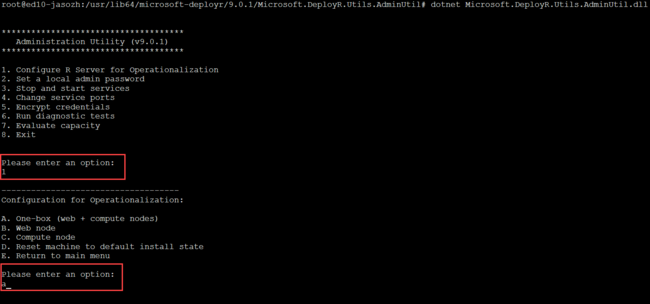

4. As an optional step, you can perform a diagnostic test as follows:

   a. Select `6. Run diagnostic tests`.

   b. Select `A. Test configuration`.

   c. Enter `admin` for the username, and enter the password from the previous configuration step.

   d. Confirm `Overall Health = pass`.

   e. Exit the admin utility.

   f. Exit SSH.

   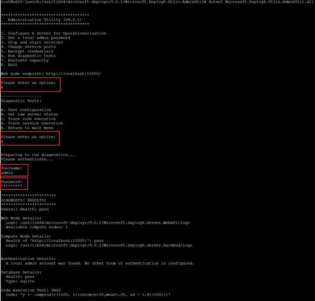

>[!NOTE]
>If you encounter long delays when trying to consume a web service created with mrsdeploy functions in a Spark compute context, you might need to add some missing folders. The Spark application belongs to a user called *rserve2* whenever it's invoked from a web service through mrsdeploy functions. To work around this issue:

	#Create these required folders for user rserve2 in local and HDFS
	hadoop fs -mkdir /user/RevoShare/rserve2
	hadoop fs -chmod 777 /user/RevoShare/rserve2

	mkdir /var/RevoShare/rserve2
	chmod 777 /var/RevoShare/rserve2

	#Create a new Spark compute context 
	rxSparkConnect(reset = TRUE)

At this stage, the configuration for operationalization is complete. Now you can use the mrsdeploy package on R Client to connect to the operationalization on the edge node. You can then start using its features, like [remote execution](https://docs.microsoft.com/machine-learning-server/r/how-to-execute-code-remotely) and [web services](https://docs.microsoft.com/machine-learning-server/operationalize/concept-what-are-web-services). Depending on whether your cluster is set up on a virtual network or not, you might need to set up port forward tunneling through an SSH login.

### R Server cluster on a virtual network

Make sure that you allow traffic through port 12800 to the edge node. That way, you can use the edge node to connect to the operationalization feature.

	library(mrsdeploy)

	remoteLogin(
    	deployr_endpoint = "http://[your-cluster-name]-ed-ssh.azurehdinsight.net:12800",
    	username = "admin",
    	password = "xxxxxxx"
	)

If `remoteLogin()` cannot connect to the edge node, but you can use SSH to connect to the edge node, you need to check whether the rule to allow traffic on port 12800 is set properly. If you continue to face the issue, you can work around it by setting up port forward tunneling through SSH. For instructions, see the following section.

### R Server cluster not set up on a virtual network

If your cluster is not set up on a virtual network, or if you're having trouble with connectivity through a virtual network, you can use SSH port forward tunneling:

	ssh -L localhost:12800:localhost:12800 USERNAME@CLUSTERNAME-ed-ssh.azurehdinsight.net

You can also set it up on PuTTY:

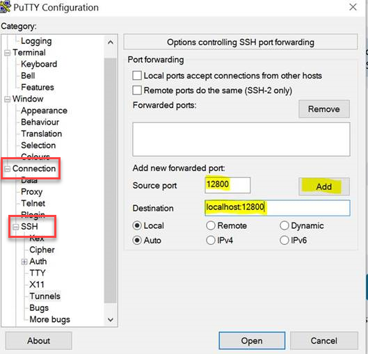

After your SSH session is active, the traffic from your machine’s port 12800 is forwarded to the edge node’s port 12800 through the SSH session. Make sure that you use `127.0.0.1:12800` in your `remoteLogin()` method. This method logs in to the edge node’s operationalization through port forwarding.

	library(mrsdeploy)

	remoteLogin(
    	deployr_endpoint = "http://127.0.0.1:12800",
    	username = "admin",
    	password = "xxxxxxx"
	)

## Scale Microsoft R Server operationalization compute nodes on HDInsight worker nodes

### Decommission the worker nodes

Microsoft R Server is currently not managed through Yarn. If the worker nodes are not decommissioned, Yarn ResourceManager will not work as expected because it will not be aware of the resources that the server is using. To avoid this situation, we recommend decommissioning the worker nodes before you scale out the compute nodes.

To decommission worker nodes:

1. Log in to the HDI cluster's Ambari console and select the **Hosts** tab.
2. Select worker nodes to be decommissioned, and then select **Actions** > **Selected Hosts** > **Hosts** > **Turn On Maintenance Mode**. For example, in the following image, we have selected wn3 and wn4 to decommission.  

     

3. Select **Actions** > **Selected Hosts** > **DataNodes** > **Decommission**.
4. Select **Actions** > **Selected Hosts** > **NodeManagers** > **Decommission**.
5. Select **Actions** > **Selected Hosts** > **DataNodes** > **Stop**.
6. Select **Actions** > **Selected Hosts** > **NodeManagers** > **Stop**.
7. Select **Actions** > **Selected Hosts** > **Hosts** > **Stop All Components**.
8. Unselect the worker nodes and select the head nodes.
9. Select **Actions** > **Selected Hosts** > **Hosts** > **Restart All Components**.

###	Configure compute nodes on each decommissioned worker node

1. Use SSH to connect to each decommissioned worker node.
2. Run an admin utility by using `dotnet /usr/lib64/microsoft-deployr/9.0.1/Microsoft.DeployR.Utils.AdminUtil/Microsoft.DeployR.Utils.AdminUtil.dll`.
3. Enter `1` to select the option `Configure R Server for Operationalization`.
4. Enter `c` to select the option `C. Compute node`. This step configures the compute node on the worker node.
5. Exit the admin utility.

### Add compute nodes' details on the web node

After all decommissioned worker nodes are configured to run on the compute node, go back to the edge node and add decommissioned worker nodes' IP addresses in the Microsoft R Server web node's configuration:

1. Use SSH to connect to the edge node.
2. Run `vi /usr/lib64/microsoft-deployr/9.0.1/Microsoft.DeployR.Server.WebAPI/appsettings.json`.
3. Look for the `URIs` section, and add the worker nodes' IP and port details.

	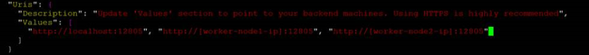

## Troubleshoot

If you have problems with creating HDInsight clusters, see [Access control requirements](../hdinsight-administer-use-portal-linux.md#create-clusters).

## Next steps

Now you should understand how to create an HDInsight cluster that includes R Server. You should also understand the basics of using the R console from an SSH session. The following topics explain other ways of managing and working with R Server on HDInsight:

* [Compute context options for R Server on HDInsight](r-server-compute-contexts.md)
* [Azure Storage options for R Server on HDInsight](r-server-storage.md)
