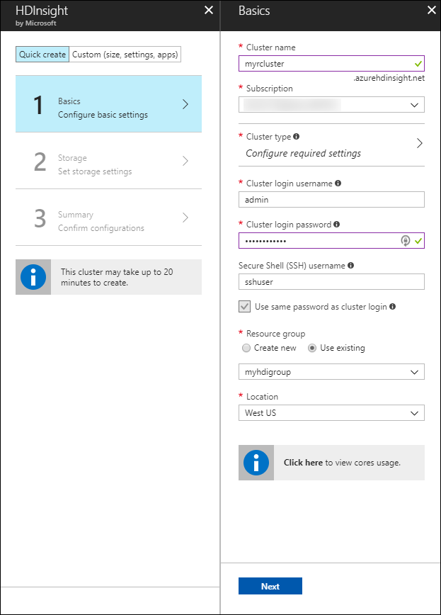
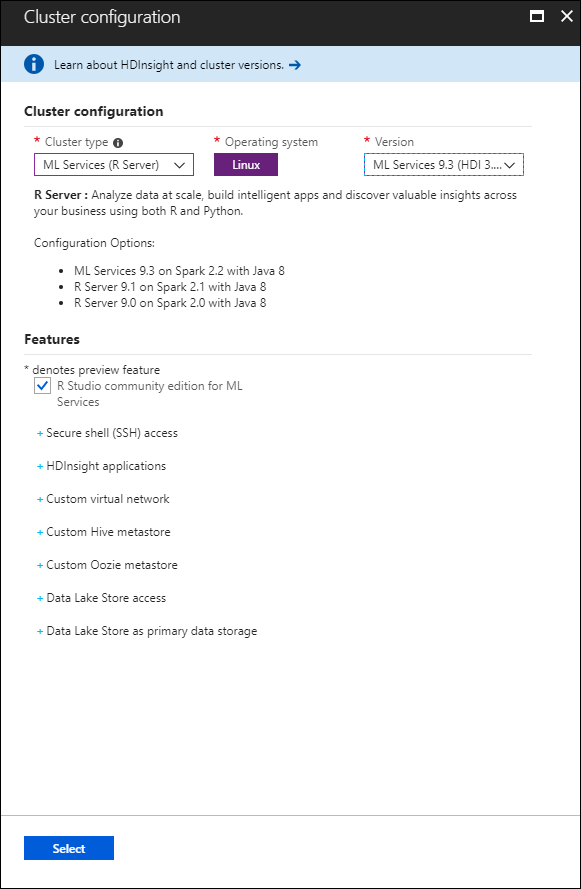
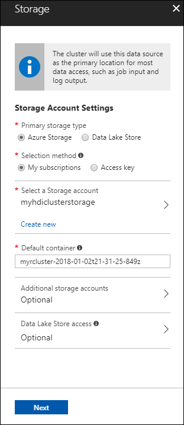
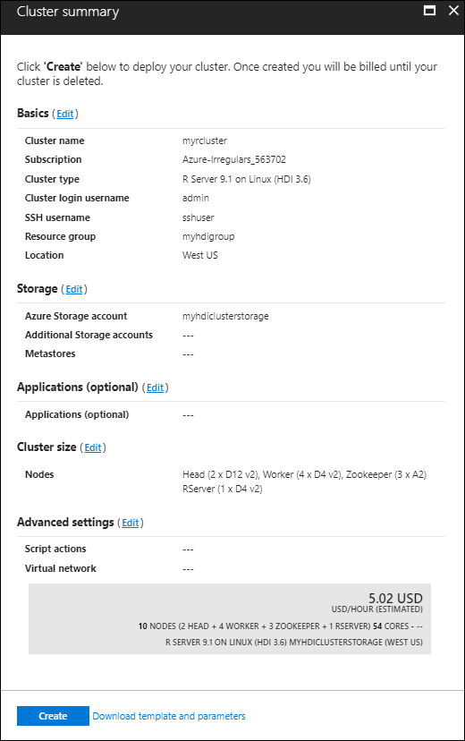
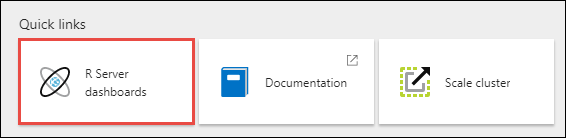
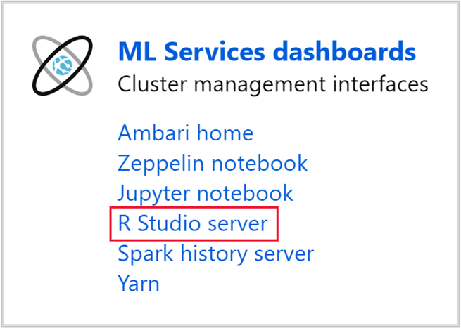
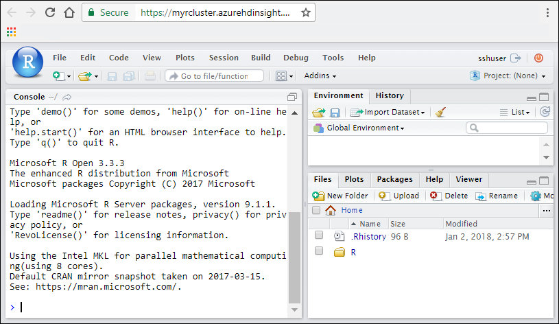
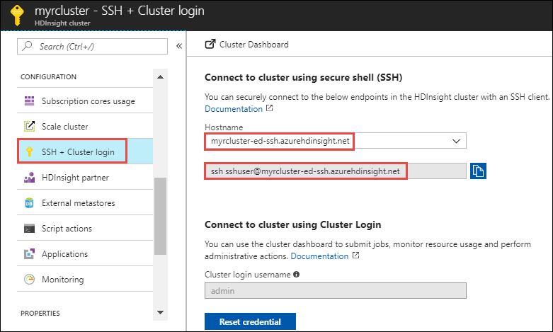

# Get started with ML Services on Azure HDInsight

Azure HDInsight enables you to create an ML Services cluster. This option allows R scripts to use Spark and MapReduce to run distributed computations. In this article, you learn how to create an ML Service cluster on HDInsight and how to run an R script that demonstrates using Spark for distributed R computations.

## Prerequisites

* **An Azure subscription**: Before you begin this tutorial, you must have an Azure subscription. For more information, see [Get Microsoft Azure free trial](https://azure.microsoft.com/documentation/videos/get-azure-free-trial-for-testing-hadoop-in-hdinsight/).
* **A Secure Shell (SSH) client**: An SSH client is used to remotely connect to the HDInsight cluster and run commands directly on the cluster. For more information, see [Use SSH with HDInsight](../hdinsight-hadoop-linux-use-ssh-unix.md).

## Create the cluster using the Azure portal

1. Sign in to the [Azure portal](https://portal.azure.com).

2. Click **Create a resource** > **Data + Analytics** > **HDInsight**.

3. From **Basics**, enter the following information:

    * **Cluster Name**: The name of the HDInsight cluster.
    * **Subscription**: Select the subscription to use.
    * **Cluster login username** and **Cluster login password**: The login when accessing the cluster over HTTPS. You use these credentials to access services such as the Ambari Web UI or REST API.
    * **Secure Shell (SSH) username**: The login used when accessing the cluster over SSH. By default the password is the same as the cluster login password.
    * **Resource Group**: The resource group to create the cluster in.
    * **Location**: The Azure region to create the cluster in.

        

4. Select **Cluster type**, and then set the following values in the **Cluster configuration** section:

    * **Cluster Type**: ML Services

    * **Operating system**: Linux

    * **Version**: ML Server 9.3 (HDI 3.6). Release notes for ML Server 9.3 are available on [docs.microsoft.com](https://docs.microsoft.com/machine-learning-server/whats-new-in-machine-learning-server).

    * **R Studio community edition for ML Server**: This browser-based IDE is installed by default on the edge node. Clear the check box if you prefer to not have it installed. If you choose to have it installed, the URL for accessing the RStudio Server login is available on the portal application blade for your cluster once it’s been created.

        

4. After selecting the cluster type, use the __Select__ button to set the cluster type. Next, use the __Next__ button to finish basic configuration.

5. From the **Storage** section, select or create a Storage account. For the steps in this document, leave the other fields in this section at the default values. Use the __Next__ button to save storage configuration.

    

6. From the **Summary** section, review the configuration for the cluster. Use the __Edit__ links to change any settings that are incorrect. Finally, use the __Create__ button to create the cluster.

    

    > [!NOTE]
    > It can take up to 20 minutes to create the cluster.

## Connect to RStudio Server

If you chose to install RStudio Server Community Edition as part of your HDInsight cluster, then you can access the RStudio login using one of the following two methods:

* **Option 1** - Go to the following URL (where **CLUSTERNAME** is the name of the ML Services cluster you created):

        https://CLUSTERNAME.azurehdinsight.net/rstudio/

* **Option 2** - Open the ML Services cluster in the Azure portal, under **Quick links** click **ML Services Dashboards**.

     

    From **Cluster Dashboards**, click **R Studio Server**.

    

   > [!IMPORTANT]
   > Regardless of the method used, the first time you log in you need to authenticate twice.  For the first authentication prompt, provide the *cluster Admin userid* and *password*. For the second authentication prompt, provide the *SSH userid* and *password*. Subsequent log ins only require the SSH credentials.

Once you are connected, your screen should resemble the following screenshot:

## Run a sample job

You can submit a job using ScaleR functions. Here is an example of the commands used to run a job:

	# Set the HDFS (WASB) location of example data.
	bigDataDirRoot <- "/example/data"

	# Create a local folder for storaging data temporarily.
	source <- "/tmp/AirOnTimeCSV2012"
	dir.create(source)

	# Download data to the tmp folder.
	remoteDir <- "https://packages.revolutionanalytics.com/datasets/AirOnTimeCSV2012"
	download.file(file.path(remoteDir, "airOT201201.csv"), file.path(source, "airOT201201.csv"))
	download.file(file.path(remoteDir, "airOT201202.csv"), file.path(source, "airOT201202.csv"))
	download.file(file.path(remoteDir, "airOT201203.csv"), file.path(source, "airOT201203.csv"))
	download.file(file.path(remoteDir, "airOT201204.csv"), file.path(source, "airOT201204.csv"))
	download.file(file.path(remoteDir, "airOT201205.csv"), file.path(source, "airOT201205.csv"))
	download.file(file.path(remoteDir, "airOT201206.csv"), file.path(source, "airOT201206.csv"))
	download.file(file.path(remoteDir, "airOT201207.csv"), file.path(source, "airOT201207.csv"))
	download.file(file.path(remoteDir, "airOT201208.csv"), file.path(source, "airOT201208.csv"))
	download.file(file.path(remoteDir, "airOT201209.csv"), file.path(source, "airOT201209.csv"))
	download.file(file.path(remoteDir, "airOT201210.csv"), file.path(source, "airOT201210.csv"))
	download.file(file.path(remoteDir, "airOT201211.csv"), file.path(source, "airOT201211.csv"))
	download.file(file.path(remoteDir, "airOT201212.csv"), file.path(source, "airOT201212.csv"))

	# Set directory in bigDataDirRoot to load the data.
	inputDir <- file.path(bigDataDirRoot,"AirOnTimeCSV2012")

	# Create the directory.
	rxHadoopMakeDir(inputDir)

	# Copy the data from source to input.
	rxHadoopCopyFromLocal(source, bigDataDirRoot)

	# Define the HDFS (WASB) file system.
	hdfsFS <- RxHdfsFileSystem()

	# Create info list for the airline data.
	airlineColInfo <- list(
	DAY_OF_WEEK = list(type = "factor"),
	ORIGIN = list(type = "factor"),
	DEST = list(type = "factor"),
	DEP_TIME = list(type = "integer"),
	ARR_DEL15 = list(type = "logical"))

	# Get all the column names.
	varNames <- names(airlineColInfo)

	# Define the text data source in HDFS.
	airOnTimeData <- RxTextData(inputDir, colInfo = airlineColInfo, varsToKeep = varNames, fileSystem = hdfsFS)

	# Define the text data source in local system.
	airOnTimeDataLocal <- RxTextData(source, colInfo = airlineColInfo, varsToKeep = varNames)

	# Specify the formula to use.
	formula = "ARR_DEL15 ~ ORIGIN + DAY_OF_WEEK + DEP_TIME + DEST"

	# Define the Spark compute context.
	mySparkCluster <- RxSpark()

	# Set the compute context.
	rxSetComputeContext(mySparkCluster)

	# Run a logistic regression.
	system.time(
		modelSpark <- rxLogit(formula, data = airOnTimeData)
	)

	# Display a summary.
	summary(modelSpark)

## Connect to the cluster edge node

In this section, you learn how to connect to the edge node of an ML Services HDInsight cluster using SSH. For familiarity on using SSH, see [Use SSH with HDInsight](../hdinsight-hadoop-linux-use-ssh-unix.md).

The SSH command to connect to the ML Services cluster edge node is:

   `ssh USERNAME@CLUSTERNAME-ed-ssh.azurehdinsight.net`

To find the SSH command for your cluster, from the Azure portal click the cluster name, click **SSH + Cluster login**, and then for **Hostname**, select the edge node. This displays the SSH Endpoint information for the edge node.

If you used a password to secure your SSH user account, you are prompted to enter it. If you used a public key, you may have to use the `-i` parameter to specify the matching private key. For example:

	ssh -i ~/.ssh/id_rsa USERNAME@CLUSTERNAME-ed-ssh.azurehdinsight.net

Once connected, you get at a prompt similar to the following:

	sshuser@ed00-myrclu:~$

## Use the R console

1. From the SSH session, use the following command to start the R console:  

		R

2. You should see an output with the version of ML Server, in addition to other information.
	
3. From the `>` prompt, you can enter R code. ML Services on HDInsight includes packages that allow you to easily interact with Hadoop and run distributed computations. For example, use the following command to view the root of the default file system for the HDInsight cluster:

		rxHadoopListFiles("/")

4. You can also use the WASB style addressing.

		rxHadoopListFiles("wasb:///")

5. To quit the R console, use the following command:

        quit()

## Automated cluster creation

You can automate the creation of ML Services cluster for HDInsight by using the SDK and the PowerShell.

<!---* To create an ML Server cluster using an Azure Resource Management template, see [Deploy an R Server for HDInsight cluster](https://azure.microsoft.com/resources/templates/101-hdinsight-rserver/).--->
* To create an ML Services cluster using the .NET SDK, see [Create Linux-based clusters in HDInsight using the .NET SDK.](../hdinsight-hadoop-create-linux-clusters-dotnet-sdk.md)
* To create an ML Services cluster using powershell, see the article on [Create HDInsight clusters using Azure PowerShell](../hdinsight-hadoop-create-linux-clusters-azure-powershell.md).

## Delete the cluster

[!INCLUDE [delete-cluster-warning](../../../includes/hdinsight-delete-cluster-warning.md)]

## Troubleshoot

If you run into issues with creating HDInsight clusters, see [access control requirements](../hdinsight-administer-use-portal-linux.md#create-clusters).

## Next steps

In this article you learned how to create a new ML Services cluster in Azure HDInsight and the basics of using the R console from an SSH session. The following articles explain other ways of managing and working with ML Services on HDInsight:

* [Submit jobs from R Tools for Visual Studio](r-server-submit-jobs-r-tools-vs.md)
* [Manage ML Services cluster on HDInsight](r-server-hdinsight-manage.md)
* [Operationalize ML Services cluster on HDInsight](r-server-operationalize.md)
* [Compute context options for ML Services cluster on HDInsight](r-server-compute-contexts.md)
* [Azure Storage options for ML Services cluster on HDInsight](r-server-storage.md)
