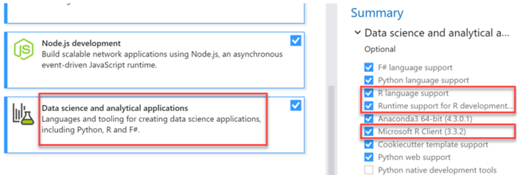
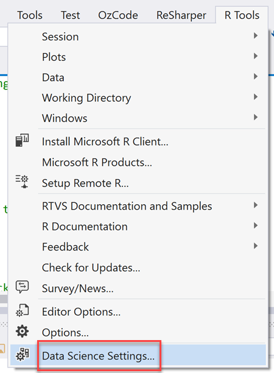
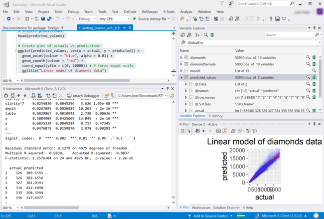
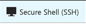
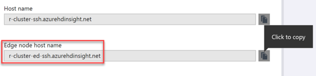
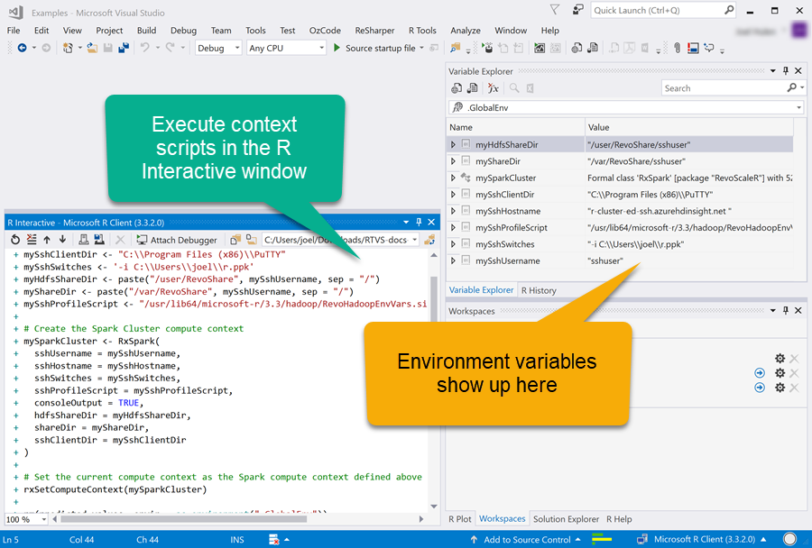
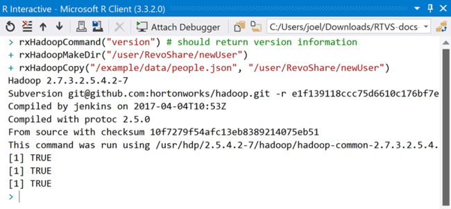
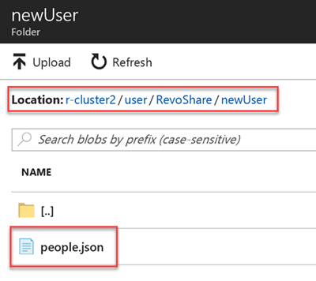

# Submit jobs from R Tools for Visual Studio

[R Tools for Visual Studio](https://www.visualstudio.com/vs/rtvs/) (RTVS) is a free, open-source extension for the Community (free), Professional, and Enterprise editions of both [Visual Studio 2017](https://www.visualstudio.com/downloads/), and [Visual Studio 2015 Update 3](http://go.microsoft.com/fwlink/?LinkId=691129) or higher.

RTVS enhances your R workflow by offering tools such as the [R Interactive window](https://docs.microsoft.com/visualstudio/rtvs/interactive-repl) (REPL), intellisense (code completion), [plot visualization](https://docs.microsoft.com/visualstudio/rtvs/visualizing-data) through R libraries such as ggplot2 and ggviz, [R code debugging](https://docs.microsoft.com/visualstudio/rtvs/debugging), and more.

## Set up your environment

1. Install [R Tools for Visual Studio](https://docs.microsoft.com/visualstudio/rtvs/installation).

    

2. Select the *Data science and analytical applications* workload, then select the **R language support**, **Runtime support for R development**, and **Microsoft R Client** options.

3. You need to have public and private keys for SSH authentication.
<!-- {TODO tbd, no such file yet}[use SSH with HDInsight](hdinsight-hadoop-linux-use-ssh-windows.md) -->

4. Install [ML Server](https://msdn.microsoft.com/microsoft-r/rserver-install-windows) on your machine. ML Server provides the [`RevoScaleR`](https://msdn.microsoft.com/microsoft-r/scaler/scaler) and `RxSpark` functions.

5. Install [PuTTY](http://www.putty.org/) to provide a compute context to run `RevoScaleR` functions from your local client to your HDInsight cluster.

6. You have the option to apply the Data Science Settings to your Visual Studio environment, which provides a new layout for your workspace for the R tools.
    1. To save your current Visual Studio settings, use the **Tools > Import and Export Settings** command, then select **Export selected environment settings** and specify a file name. To restore those settings, use the same command and select **Import selected environment settings**.

    2. Go to the **R Tools** menu item, then select **Data Science Settings...**.

        

    > [!NOTE]
    > Using the approach in step 1, you can also save and restore your personalized data scientist layout, rather than repeating the **Data Science Settings** command.

## Execute local R methods

1. Create your [HDInsight ML Services cluster](r-server-get-started.md).
2. Install the [RTVS extension](https://docs.microsoft.com/visualstudio/rtvs/installation).
3. Download the [samples zip file](https://github.com/Microsoft/RTVS-docs/archive/master.zip).
4. Open `examples/Examples.sln` to launch the solution in Visual Studio.
5. Open the `1-Getting Started with R.R` file in the `A first look at R` solution folder.
6. Starting at the top of the file, press Ctrl+Enter to send each line, one at a time, to the R Interactive window. Some lines might take a while as they install packages.
    * Alternatively, you can select all lines in the R file (Ctrl+A), then either execute all (Ctrl+Enter), or select the Execute Interactive icon on the toolbar.
        

7. After running all the lines in the script, you should see an output similar to this:

    

## Submit jobs to an HDInsight ML Services cluster

Using a Microsoft ML Server/Microsoft R Client from a Windows computer equipped with PuTTY, you can create a compute context that will run distributed `RevoScaleR` functions from your local client to your HDInsight cluster. Use `RxSpark` to create the compute context, specifying your username, the Hadoop cluster's edge node, SSH switches, and so forth.

1. To find your edge node's host name, open your HDInsight ML Services cluster pane on Azure, then select **Secure Shell (SSH)** on the top menu of the Overview pane.

    

2. Copy the **Edge node host name** value.

    

3. Paste the following code into the R Interactive window in Visual Studio, altering the values of the setup variables to match your environment.

    ```R
    # Setup variables that connect the compute context to your HDInsight cluster
    mySshHostname <- 'r-cluster-ed-ssh.azurehdinsight.net ' # HDI secure shell hostname
    mySshUsername <- 'sshuser' # HDI SSH username
    mySshClientDir <- "C:\\Program Files (x86)\\PuTTY"
    mySshSwitches <- '-i C:\\Users\\azureuser\\r.ppk' # Path to your private ssh key
    myHdfsShareDir <- paste("/user/RevoShare", mySshUsername, sep = "/")
    myShareDir <- paste("/var/RevoShare", mySshUsername, sep = "/")
    mySshProfileScript <- "/usr/lib64/microsoft-r/3.3/hadoop/RevoHadoopEnvVars.site"

    # Create the Spark Cluster compute context
    mySparkCluster <- RxSpark(
          sshUsername = mySshUsername,
      sshHostname = mySshHostname,
      sshSwitches = mySshSwitches,
      sshProfileScript = mySshProfileScript,
      consoleOutput = TRUE,
      hdfsShareDir = myHdfsShareDir,
      shareDir = myShareDir,
      sshClientDir = mySshClientDir
    )
    
    # Set the current compute context as the Spark compute context defined above
    rxSetComputeContext(mySparkCluster)
    ```
    
    

4. Execute the following commands in the R Interactive window:

    ```R
    rxHadoopCommand("version") # should return version information
    rxHadoopMakeDir("/user/RevoShare/newUser") # creates a new folder in your storage account
    rxHadoopCopy("/example/data/people.json", "/user/RevoShare/newUser") # copies file to new folder
    ```

    You should see an output similar to the following:

    

5. Verify that the `rxHadoopCopy` successfully copied the `people.json` file from the example data folder to the newly created `/user/RevoShare/newUser` folder:

    1. From your HDInsight ML Services cluster pane in Azure, select **Storage accounts** from the left-hand menu.

        

    2. Select the default storage account for your cluster, making note of the container/directory name.

    3. Select **Containers** from the left-hand menu on your storage account pane.

        

    4. Select your cluster's container name, browse to the **user** folder (you might have to click *Load more* at the bottom of the list), then select *RevoShare*, then **newUser**. The `people.json` file should be displayed in the `newUser` folder.

        

6. After you are finished using the current Spark context, you must stop it. You cannot run multiple contexts at once.

    ```R
    rxStopEngine(mySparkCluster)
    ```

## Next steps

* [Compute context options for ML Services on HDInsight](r-server-compute-contexts.md)
* [Combining ScaleR and SparkR](../hdinsight-hadoop-r-scaler-sparkr.md) provides an example of airline flight delay predictions.
<!-- * You can also submit R jobs with the [R Studio Server](hdinsight-submit-jobs-from-r-studio-server.md) -->
