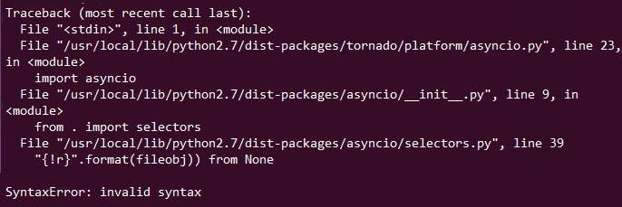
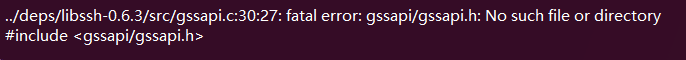
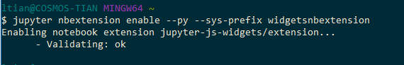
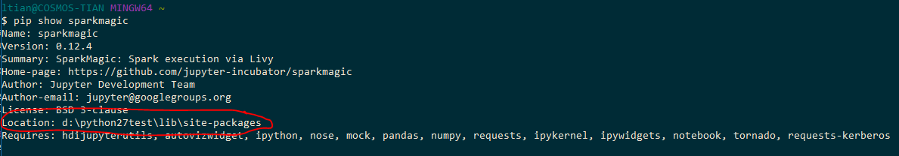
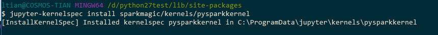
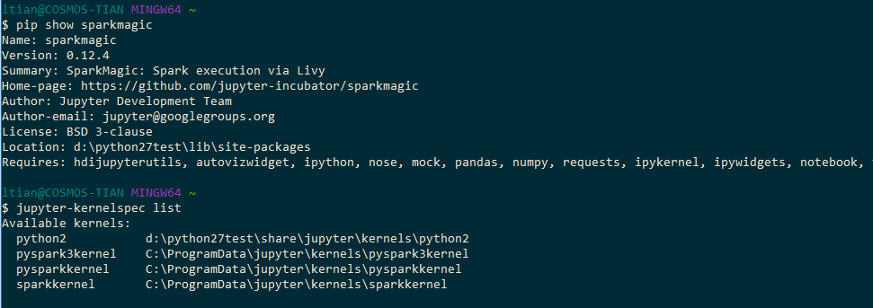

# Set Up PySpark Interactive Environment for Visual Studio Code

The following steps show how to install python packages when run **HDInsight: PySpark Interactive**.


## Set up PySpark interactive environment on MacOS and Linux
You need use command **pip3** for the following steps, if it is **python 3.x**.
1. Make sure the **Python** and **pip** installed.
 
    

2.	Install Jupyter
    ```
    sudo pip install jupyter
    ```
    +  Maybe the following error message come out on Linux and MacOS:

        
        ```Resolve:
        sudo pip uninstall asyncio
        sudo pip install trollies
        ```

    + Install libkrb5-dev(For Linux only), maybe display the following error message:

        
        ```Resolve:
        sudo apt-get install libkrb5-dev 
        ```

3. Install sparkmagic
   ```
   sudo pip install sparkmagic
   ```

4. Make sure that ipywidgets is properly installed by running:
   ```
   sudo jupyter nbextension enable --py --sys-prefix widgetsnbextension
   ```
   
 

5. Install the wrapper kernels. Do run **pip show sparkmagic** and it shows the path that sparkmagic is installed. 

    
   
6. Navigate to the location and run:

   ```Python2
   sudo jupyter-kernelspec install sparkmagic/kernels/pysparkkernel   
   ```
   ```Python3
   sudo jupyter-kernelspec install sparkmagic/kernels/pyspark3kernel
   ```

   
7. Check the installation status: 

    ```
    jupyter-kernelspec list
    ```
    

    For available kernels: **python2** and **pysparkkernel** correspond to **python 2.x**, **python3** and **pyspark3kernel** correspond to **python 3.x**. 

8. Restart VScode and back to script editor running **HDInsight: PySpark Interactive**.

## Next steps

### Demo
* HDInsight for VScode: [Video](https://go.microsoft.com/fwlink/?linkid=858706)

### Tools and extensions
* [Use Azure HDInsight Tool for Visual Studio Code](hdinsight-for-vscode.md)
* [Use Azure Toolkit for IntelliJ to create and submit Spark Scala applications](spark/apache-spark-intellij-tool-plugin.md)
* [Use Azure Toolkit for IntelliJ to debug Spark applications remotely through SSH](spark/apache-spark-intellij-tool-debug-remotely-through-ssh.md)
* [Use Azure Toolkit for IntelliJ to debug Spark applications remotely through VPN](spark/apache-spark-intellij-tool-plugin-debug-jobs-remotely.md)
* [Use HDInsight Tools in Azure Toolkit for Eclipse to create Spark applications](spark/apache-spark-eclipse-tool-plugin.md)
* [Use HDInsight Tools for IntelliJ with Hortonworks Sandbox](hadoop/hdinsight-tools-for-intellij-with-hortonworks-sandbox.md)
* [Use Zeppelin notebooks with a Spark cluster on HDInsight](spark/apache-spark-zeppelin-notebook.md)
* [Kernels available for Jupyter notebook in Spark cluster for HDInsight](spark/apache-spark-jupyter-notebook-kernels.md)
* [Use external packages with Jupyter notebooks](spark/apache-spark-jupyter-notebook-use-external-packages.md)
* [Install Jupyter on your computer and connect to an HDInsight Spark cluster](spark/apache-spark-jupyter-notebook-install-locally.md)
* [Visualize Hive data with Microsoft Power BI in Azure HDInsight](hadoop/apache-hadoop-connect-hive-power-bi.md).
* [Use Zeppelin to run Hive queries in Azure HDInsight ](hdinsight-connect-hive-zeppelin.md)
