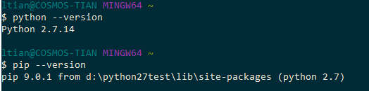
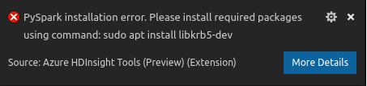

# Set up the PySpark interactive environment for Visual Studio Code

The following steps show you how to set up the PySpark interactive environment in VS Code.

We use **python/pip** command to build virtual environment in your Home path. If you want to use another version, you need to change default version of **python/pip** command manually. More details see [update-alternatives](https://linux.die.net/man/8/update-alternatives).

1. Install  [Python](https://www.python.org/downloads/) and [pip](https://pip.pypa.io/en/stable/installing/).
   
   + Install Python from [https://www.python.org/downloads/](https://www.python.org/downloads/).
   + Install pip from [https://pip.pypa.io/en/stable/installing](https://pip.pypa.io/en/stable/installing/). (If not installed from the Python installation)
   + Validate Python and pip are installed successfully using the following commands. (Optional)
 
        

     > [!NOTE]
     > It is recommended to manually install Python instead of using the MacOS default version.


2. Install **virtualenv** by running command below.
   
   ```
   pip install virtualenv
   ```

3. For Linux only, install the required packages by running commands bellow if you encounter the error message.
   
    
       
   ```
   sudo apt-get install libkrb5-dev 
   ```

   ```
   sudo apt-get install python-dev
   ```

4. Restart VS Code, and then go back to the script editor that's running **HDInsight: PySpark Interactive**.

## Next steps

### Demo
* HDInsight for VS Code: [Video](https://go.microsoft.com/fwlink/?linkid=858706)

### Tools and extensions
* [Use Azure HDInsight Tool for Visual Studio Code](hdinsight-for-vscode.md)
* [Use Azure Toolkit for IntelliJ to create and submit Apache Spark Scala applications](spark/apache-spark-intellij-tool-plugin.md)
* [Use Azure Toolkit for IntelliJ to debug Apache Spark applications remotely through SSH](spark/apache-spark-intellij-tool-debug-remotely-through-ssh.md)
* [Use Azure Toolkit for IntelliJ to debug Apache Spark applications remotely through VPN](spark/apache-spark-intellij-tool-plugin-debug-jobs-remotely.md)
* [Use HDInsight Tools in Azure Toolkit for Eclipse to create Apache Spark applications](spark/apache-spark-eclipse-tool-plugin.md)
* [Use Apache Zeppelin notebooks with an Apache Spark cluster on HDInsight](spark/apache-spark-zeppelin-notebook.md)
* [Kernels available for Jupyter notebook in an Apache Spark cluster for HDInsight](spark/apache-spark-jupyter-notebook-kernels.md)
* [Use external packages with Jupyter notebooks](spark/apache-spark-jupyter-notebook-use-external-packages.md)
* [Install Jupyter on your computer and connect to an HDInsight Spark cluster](spark/apache-spark-jupyter-notebook-install-locally.md)
* [Visualize Apache Hive data with Microsoft Power BI in Azure HDInsight](hadoop/apache-hadoop-connect-hive-power-bi.md)
* [Use Apache Zeppelin to run Apache Hive queries in Azure HDInsight](./interactive-query/hdinsight-connect-hive-zeppelin.md)
