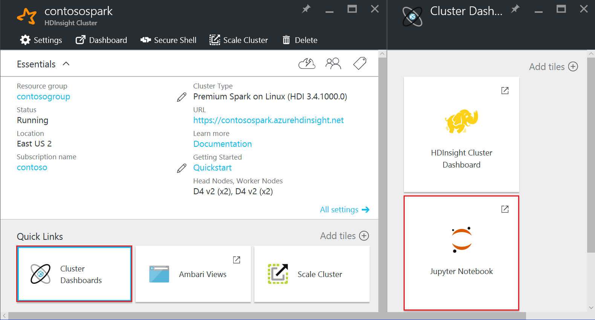

# Analyze Application Insights telemetry logs with Spark on HDInsight

Learn how to use Spark on HDInsight to analyze Application Insight telemetry data.

[Visual Studio Application Insights](../../application-insights/app-insights-overview.md) is an analytics service that monitors your web applications. Telemetry data generated by Application Insights can be exported to Azure Storage. Once the data is in Azure Storage, HDInsight can be used to analyze it.

## Prerequisites

* An application that is configured to use Application Insights.

* Familiarity with creating a Linux-based HDInsight cluster. For more information, see [Create Spark on HDInsight](apache-spark-jupyter-spark-sql.md).

  > [!IMPORTANT]
  > The steps in this document require an HDInsight cluster that uses Linux. Linux is the only operating system used on HDInsight version 3.4 or greater. For more information, see [HDInsight retirement on Windows](../hdinsight-component-versioning.md#hdinsight-windows-retirement).

* A web browser.

The following resources were used in developing and testing this document:

* Application Insights telemetry data was generated using a [Node.js web app configured to use Application Insights](../../application-insights/app-insights-nodejs.md).

* A Linux-based Spark on HDInsight cluster version 3.5 was used to analyze the data.

## Architecture and planning

The following diagram illustrates the service architecture of this example:


### Azure storage

Application Insights can be configured to continuously export telemetry information to blobs. HDInsight can then read data stored in the blobs. However, there are some requirements that you must follow:

* **Location**: If the Storage Account and HDInsight are in different locations, it may increase latency. It also increases cost, as egress charges are applied to data moving between regions.

    > [!WARNING]
    > Using a Storage Account in a different location than HDInsight is not supported.

* **Blob type**: HDInsight only supports block blobs. Application Insights defaults to using block blobs, so should work by default with HDInsight.

For information on adding storage to an existing cluster, see the [Add additional storage accounts](../hdinsight-hadoop-add-storage.md) document.

### Data schema

Application Insights provides [export data model](../../application-insights/app-insights-export-data-model.md) information for the telemetry data format exported to blobs. The steps in this document use Spark SQL to work with the data. Spark SQL can automatically generate a schema for the JSON data structure logged by Application Insights.

## Export telemetry data

Follow the steps in [Configure Continuous Export](../../application-insights/app-insights-export-telemetry.md) to configure your Application Insights to export telemetry information to an Azure storage blob.

## Configure HDInsight to access the data

If you are creating an HDInsight cluster, add the storage account during cluster creation.

To add the Azure Storage Account to an existing cluster, use the information in the [Add additional Storage Accounts](../hdinsight-hadoop-add-storage.md) document.

## Analyze the data: PySpark

1. From the [Azure portal](https://portal.azure.com), select your Spark on HDInsight cluster. From the **Quick Links** section, select **Cluster Dashboards**, and then select **Jupyter Notebook** from the Cluster Dashboard__ section.

    

2. In the upper right corner of the Jupyter page, select **New**, and then **PySpark**. A new browser tab containing a Python-based Jupyter Notebook opens.

3. In the first field (called a **cell**) on the page, enter the following text:

   ```python
   sc._jsc.hadoopConfiguration().set('mapreduce.input.fileinputformat.input.dir.recursive', 'true')
   ```

    This code configures Spark to recursively access the directory structure for the input data. Application Insights telemetry is logged to a directory structure similar to the `/{telemetry type}/YYYY-MM-DD/{##}/`.

4. Use **SHIFT+ENTER** to run the code. On the left side of the cell, an '\*' appears between the brackets to indicate that the code in this cell is being executed. Once it completes, the '\*' changes to a number, and output similar to the following text is displayed below the cell:

        Creating SparkContext as 'sc'

        ID    YARN Application ID    Kind    State    Spark UI    Driver log    Current session?
        3    application_1468969497124_0001    pyspark    idle    Link    Link    ✔

        Creating HiveContext as 'sqlContext'
        SparkContext and HiveContext created. Executing user code ...
5. A new cell is created below the first one. Enter the following text in the new cell. Replace `CONTAINER` and `STORAGEACCOUNT` with the Azure storage account name and blob container name that contains Application Insights data.

   ```python
   %%bash
   hdfs dfs -ls wasb://CONTAINER@STORAGEACCOUNT.blob.core.windows.net/
   ```

    Use **SHIFT+ENTER** to execute this cell. You see a result similar to the following text:

        Found 1 items
        drwxrwxrwx   -          0 1970-01-01 00:00 wasb://appinsights@contosostore.blob.core.windows.net/contosoappinsights_2bededa61bc741fbdee6b556571a4831

    The wasb path returned is the location of the Application Insights telemetry data. Change the `hdfs dfs -ls` line in the cell to use the wasb path returned, and then use **SHIFT+ENTER** to run the cell again. This time, the results should display the directories that contain telemetry data.

   > [!NOTE]
   > For the remainder of the steps in this section, the `wasb://appinsights@contosostore.blob.core.windows.net/contosoappinsights_{ID}/Requests` directory was used. Your directory structure may be different.

6. In the next cell, enter the following code: Replace `WASB_PATH` with the path from the previous step.

   ```python
   jsonFiles = sc.textFile('WASB_PATH')
   jsonData = sqlContext.read.json(jsonFiles)
   ```

    This code creates a dataframe from the JSON files exported by the continuous export process. Use **SHIFT+ENTER** to run this cell.
7. In the next cell, enter and run the following to view the schema that Spark created for the JSON files:

   ```python
   jsonData.printSchema()
   ```

    The schema for each type of telemetry is different. The following example is the schema that is generated for web requests (data stored in the `Requests` subdirectory):

        root
        |-- context: struct (nullable = true)
        |    |-- application: struct (nullable = true)
        |    |    |-- version: string (nullable = true)
        |    |-- custom: struct (nullable = true)
        |    |    |-- dimensions: array (nullable = true)
        |    |    |    |-- element: string (containsNull = true)
        |    |    |-- metrics: array (nullable = true)
        |    |    |    |-- element: string (containsNull = true)
        |    |-- data: struct (nullable = true)
        |    |    |-- eventTime: string (nullable = true)
        |    |    |-- isSynthetic: boolean (nullable = true)
        |    |    |-- samplingRate: double (nullable = true)
        |    |    |-- syntheticSource: string (nullable = true)
        |    |-- device: struct (nullable = true)
        |    |    |-- browser: string (nullable = true)
        |    |    |-- browserVersion: string (nullable = true)
        |    |    |-- deviceModel: string (nullable = true)
        |    |    |-- deviceName: string (nullable = true)
        |    |    |-- id: string (nullable = true)
        |    |    |-- osVersion: string (nullable = true)
        |    |    |-- type: string (nullable = true)
        |    |-- location: struct (nullable = true)
        |    |    |-- city: string (nullable = true)
        |    |    |-- clientip: string (nullable = true)
        |    |    |-- continent: string (nullable = true)
        |    |    |-- country: string (nullable = true)
        |    |    |-- province: string (nullable = true)
        |    |-- operation: struct (nullable = true)
        |    |    |-- name: string (nullable = true)
        |    |-- session: struct (nullable = true)
        |    |    |-- id: string (nullable = true)
        |    |    |-- isFirst: boolean (nullable = true)
        |    |-- user: struct (nullable = true)
        |    |    |-- anonId: string (nullable = true)
        |    |    |-- isAuthenticated: boolean (nullable = true)
        |-- internal: struct (nullable = true)
        |    |-- data: struct (nullable = true)
        |    |    |-- documentVersion: string (nullable = true)
        |    |    |-- id: string (nullable = true)
        |-- request: array (nullable = true)
        |    |-- element: struct (containsNull = true)
        |    |    |-- count: long (nullable = true)
        |    |    |-- durationMetric: struct (nullable = true)
        |    |    |    |-- count: double (nullable = true)
        |    |    |    |-- max: double (nullable = true)
        |    |    |    |-- min: double (nullable = true)
        |    |    |    |-- sampledValue: double (nullable = true)
        |    |    |    |-- stdDev: double (nullable = true)
        |    |    |    |-- value: double (nullable = true)
        |    |    |-- id: string (nullable = true)
        |    |    |-- name: string (nullable = true)
        |    |    |-- responseCode: long (nullable = true)
        |    |    |-- success: boolean (nullable = true)
        |    |    |-- url: string (nullable = true)
        |    |    |-- urlData: struct (nullable = true)
        |    |    |    |-- base: string (nullable = true)
        |    |    |    |-- hashTag: string (nullable = true)
        |    |    |    |-- host: string (nullable = true)
        |    |    |    |-- protocol: string (nullable = true)
8. Use the following to register the dataframe as a temporary table and run a query against the data:

   ```python
   jsonData.registerTempTable("requests")
   df = sqlContext.sql("select context.location.city from requests where context.location.city is not null")
   df.show()
   ```

    This query returns the city information for the top 20 records where context.location.city is not null.

   > [!NOTE]
   > The context structure is present in all telemetry logged by Application Insights. The city element may not be populated in your logs. Use the schema to identify other elements that you can query that may contain data for your logs.

    This query returns information similar to the following text:

        +---------+
        |     city|
        +---------+
        | Bellevue|
        |  Redmond|
        |  Seattle|
        |Charlotte|
        ...
        +---------+

## Analyze the data: Scala

1. From the [Azure portal](https://portal.azure.com), select your Spark on HDInsight cluster. From the **Quick Links** section, select **Cluster Dashboards**, and then select **Jupyter Notebook** from the Cluster Dashboard__ section.

    
2. In the upper right corner of the Jupyter page, select **New**, and then **Scala**. A new browser tab containing a Scala-based Jupyter Notebook appears.
3. In the first field (called a **cell**) on the page, enter the following text:

   ```scala
   sc.hadoopConfiguration.set("mapreduce.input.fileinputformat.input.dir.recursive", "true")
   ```

    This code configures Spark to recursively access the directory structure for the input data. Application Insights telemetry is logged to a directory structure similar to `/{telemetry type}/YYYY-MM-DD/{##}/`.

4. Use **SHIFT+ENTER** to run the code. On the left side of the cell, an '\*' appears between the brackets to indicate that the code in this cell is being executed. Once it completes, the '\*' changes to a number, and output similar to the following text is displayed below the cell:

        Creating SparkContext as 'sc'

        ID    YARN Application ID    Kind    State    Spark UI    Driver log    Current session?
        3    application_1468969497124_0001    spark    idle    Link    Link    ✔

        Creating HiveContext as 'sqlContext'
        SparkContext and HiveContext created. Executing user code ...
5. A new cell is created below the first one. Enter the following text in the new cell. Replace `CONTAINER` and `STORAGEACCOUNT` with the Azure storage account name and blob container name that contains Application Insights logs.

   ```scala
   %%bash
   hdfs dfs -ls wasb://CONTAINER@STORAGEACCOUNT.blob.core.windows.net/
   ```

    Use **SHIFT+ENTER** to execute this cell. You see a result similar to the following text:

        Found 1 items
        drwxrwxrwx   -          0 1970-01-01 00:00 wasb://appinsights@contosostore.blob.core.windows.net/contosoappinsights_2bededa61bc741fbdee6b556571a4831

    The wasb path returned is the location of the Application Insights telemetry data. Change the `hdfs dfs -ls` line in the cell to use the wasb path returned, and then use **SHIFT+ENTER** to run the cell again. This time, the results should display the directories that contain telemetry data.

   > [!NOTE]
   > For the remainder of the steps in this section, the `wasb://appinsights@contosostore.blob.core.windows.net/contosoappinsights_{ID}/Requests` directory was used. This directory may not exist unless your telemetry data is for a web app.

6. In the next cell, enter the following code: Replace `WASB\_PATH` with the path from the previous step.

   ```scala
   var jsonFiles = sc.textFile('WASB_PATH')
   val sqlContext = new org.apache.spark.sql.SQLContext(sc)
   var jsonData = sqlContext.read.json(jsonFiles)
   ```

    This code creates a dataframe from the JSON files exported by the continuous export process. Use **SHIFT+ENTER** to run this cell.

7. In the next cell, enter and run the following to view the schema that Spark created for the JSON files:

   ```scala
   jsonData.printSchema
   ```

    The schema for each type of telemetry is different. The following example is the schema that is generated for web requests (data stored in the `Requests` subdirectory):

        root
        |-- context: struct (nullable = true)
        |    |-- application: struct (nullable = true)
        |    |    |-- version: string (nullable = true)
        |    |-- custom: struct (nullable = true)
        |    |    |-- dimensions: array (nullable = true)
        |    |    |    |-- element: string (containsNull = true)
        |    |    |-- metrics: array (nullable = true)
        |    |    |    |-- element: string (containsNull = true)
        |    |-- data: struct (nullable = true)
        |    |    |-- eventTime: string (nullable = true)
        |    |    |-- isSynthetic: boolean (nullable = true)
        |    |    |-- samplingRate: double (nullable = true)
        |    |    |-- syntheticSource: string (nullable = true)
        |    |-- device: struct (nullable = true)
        |    |    |-- browser: string (nullable = true)
        |    |    |-- browserVersion: string (nullable = true)
        |    |    |-- deviceModel: string (nullable = true)
        |    |    |-- deviceName: string (nullable = true)
        |    |    |-- id: string (nullable = true)
        |    |    |-- osVersion: string (nullable = true)
        |    |    |-- type: string (nullable = true)
        |    |-- location: struct (nullable = true)
        |    |    |-- city: string (nullable = true)
        |    |    |-- clientip: string (nullable = true)
        |    |    |-- continent: string (nullable = true)
        |    |    |-- country: string (nullable = true)
        |    |    |-- province: string (nullable = true)
        |    |-- operation: struct (nullable = true)
        |    |    |-- name: string (nullable = true)
        |    |-- session: struct (nullable = true)
        |    |    |-- id: string (nullable = true)
        |    |    |-- isFirst: boolean (nullable = true)
        |    |-- user: struct (nullable = true)
        |    |    |-- anonId: string (nullable = true)
        |    |    |-- isAuthenticated: boolean (nullable = true)
        |-- internal: struct (nullable = true)
        |    |-- data: struct (nullable = true)
        |    |    |-- documentVersion: string (nullable = true)
        |    |    |-- id: string (nullable = true)
        |-- request: array (nullable = true)
        |    |-- element: struct (containsNull = true)
        |    |    |-- count: long (nullable = true)
        |    |    |-- durationMetric: struct (nullable = true)
        |    |    |    |-- count: double (nullable = true)
        |    |    |    |-- max: double (nullable = true)
        |    |    |    |-- min: double (nullable = true)
        |    |    |    |-- sampledValue: double (nullable = true)
        |    |    |    |-- stdDev: double (nullable = true)
        |    |    |    |-- value: double (nullable = true)
        |    |    |-- id: string (nullable = true)
        |    |    |-- name: string (nullable = true)
        |    |    |-- responseCode: long (nullable = true)
        |    |    |-- success: boolean (nullable = true)
        |    |    |-- url: string (nullable = true)
        |    |    |-- urlData: struct (nullable = true)
        |    |    |    |-- base: string (nullable = true)
        |    |    |    |-- hashTag: string (nullable = true)
        |    |    |    |-- host: string (nullable = true)
        |    |    |    |-- protocol: string (nullable = true)

8. Use the following to register the dataframe as a temporary table and run a query against the data:

   ```scala
   jsonData.registerTempTable("requests")
   var city = sqlContext.sql("select context.location.city from requests where context.location.city is not null limit 10").show()
   ```

    This query returns the city information for the top 20 records where context.location.city is not null.

   > [!NOTE]
   > The context structure is present in all telemetry logged by Application Insights. The city element may not be populated in your logs. Use the schema to identify other elements that you can query that may contain data for your logs.
   >
   >

    This query returns information similar to the following text:

        +---------+
        |     city|
        +---------+
        | Bellevue|
        |  Redmond|
        |  Seattle|
        |Charlotte|
        ...
        +---------+

## Next steps

For more examples of using Spark to work with data and services in Azure, see the following documents:

* [Spark with BI: Perform interactive data analysis using Spark in HDInsight with BI tools](apache-spark-use-bi-tools.md)
* [Spark with Machine Learning: Use Spark in HDInsight for analyzing building temperature using HVAC data](apache-spark-ipython-notebook-machine-learning.md)
* [Spark with Machine Learning: Use Spark in HDInsight to predict food inspection results](apache-spark-machine-learning-mllib-ipython.md)
* [Website log analysis using Spark in HDInsight](apache-spark-custom-library-website-log-analysis.md)

For information on creating and running Spark applications, see the following documents:

* [Create a standalone application using Scala](apache-spark-create-standalone-application.md)
* [Run jobs remotely on a Spark cluster using Livy](apache-spark-livy-rest-interface.md)
