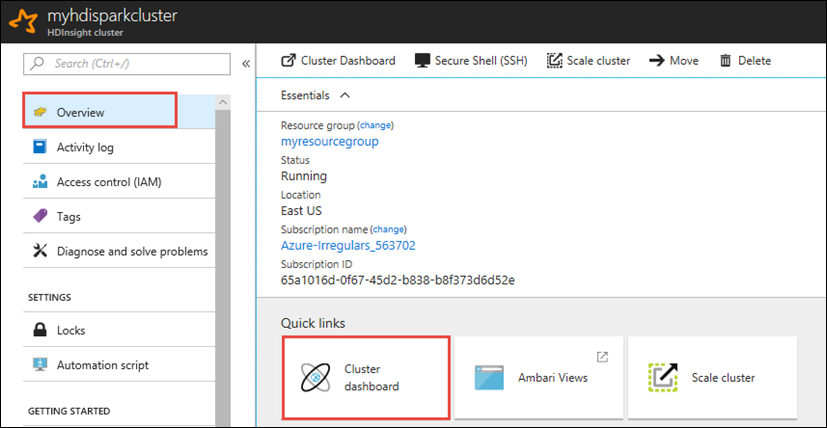
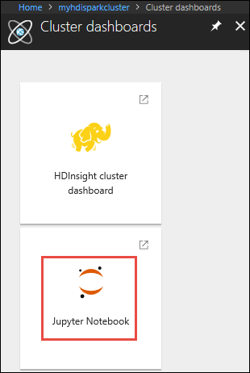

# Use HDInsight Spark cluster to read and write data to Azure SQL database

Learn how to connect an Apache Spark cluster in Azure HDInsight with an Azure SQL database and then read, write, and stream data into the SQL database. The instructions in this article use a Jupyter notebook to run the Scala code snippets. However, you can create a standalone application in Scala or Python and perform the same tasks. 

## Prerequisites

* Azure HDInsight Spark cluster.  Follow the instructions at [Create an Apache Spark cluster in HDInsight](apache-spark-jupyter-spark-sql.md).

* Azure SQL database. Follow the instructions at [Create an Azure SQL database](../../sql-database/sql-database-get-started-portal.md). Make sure you create a database with the sample AdventureWorks schema and data. Also, make sure you create a server-level firewall rule to allow your client's IP address to access the SQL database on the server. The instructions to add the firewall rule is available in the same article. Once you have created your Azure SQL database, make sure you keep the following values handy. You need them to connect to the database from a Spark cluster.

    * Server name hosting the Azure SQL database
    * Azure SQL database name
    * Azure SQL database admin user name / password

* SQL Server Management Studio. Follow the instructions at [Use SSMS to connect and query data](../../sql-database/sql-database-connect-query-ssms.md).

## Create a Jupyter notebook

Start by creating a Jupyter notebook associated with the Spark cluster. You use this notebook to run the code snippets used in this article. 

1. From the [Azure portal](https://portal.azure.com/), open your cluster. 

2. From the **Quick links** section, click **Cluster dashboards** to open the **Cluster dashboards** view.  If you don't see **Quick Links**, click **Overview** from the left menu on the blade.

     

3. Click **Jupyter Notebook**. If prompted, enter the admin credentials for the cluster.

    
   
   > [!NOTE]
   > You can also access the Jupyter notebook on Spark cluster by opening the following URL in your browser. Replace **CLUSTERNAME** with the name of your cluster:
   >
   > `https://CLUSTERNAME.azurehdinsight.net/jupyter`
   > 
   > 

4. In the Jupyter notebook, from the top-right corner, click **New**, and then click **Spark** to create a Scala notebook. Jupyter notebooks on HDInsight Spark cluster also provide **PySpark** kernel for Python2 applications, and **PySpark3** kernel for Python3 applications. For this article, we create a Scala notebook.
   
    

    For more information about the kernels, see [Use Jupyter notebook kernels with Apache Spark clusters in HDInsight](apache-spark-jupyter-notebook-kernels.md).

5. This opens a new notebook with a default name, **Untitled**. Click the notebook name and enter a name of your choice.

    

You can now start creating your application.
	
## Read data from Azure SQL database

In this section, you read data from a table (for example, **SalesLT.Address**) that exists in the AdventureWorks database.

1. In a new Jupyter notebook, in a code cell, paste the following snippet and replace the placeholder values with the values for your Azure SQL database.

       // Declare the values for your Azure SQL database

       val jdbcUsername = "<SQL DB ADMIN USER>"
       val jdbcPassword = "<SQL DB ADMIN PWD>"
       val jdbcHostname = "<SQL SERVER NAME HOSTING SDL DB>" //typically, this is in the form or servername.database.windows.net
       val jdbcPort = <JDBC PORT>                            //typically, this value is 1433
       val jdbcDatabase ="<AZURE SQL DB NAME>"

    Press **SHIFT + ENTER** to run the code cell.  

2. Paste the following snippet in the next code cell and press **SHIFT + ENTER** to run it. This snippet builds a JDBC URL that you can pass to the Spark dataframe APIs creates an `Properties` object to hold the parameters.

       import java.util.Properties

       val jdbc_url = s"jdbc:sqlserver://${jdbcHostname}:${jdbcPort};database=${jdbcDatabase};encrypt=true;trustServerCertificate=false;hostNameInCertificate=*.database.windows.net;loginTimeout=60;"
       val connectionProperties = new Properties()
       connectionProperties.put("user", s"${jdbcUsername}")
       connectionProperties.put("password", s"${jdbcPassword}")         

3. Paste the following snippet to create a dataframe with the data from a table in your Azure SQL database. In this snippet, we use a **SalesLT.Address** table that is available as part of the **AdventureWorks** database.

       val sqlTableDF = spark.read.jdbc(jdbc_url, "SalesLT.Address", connectionProperties)

4. You can now perform operations on the dataframe, such as getting the data schema:

       sqlTableDF.printSchema
   
    You see an output similar to the following:

    

5. You can also perform operations like, retrieve the top 10 rows.

       sqlTableDF.show(10)

6. Or, retrieve specific columns from the dataset.

       sqlTableDF.select("AddressLine1", "City").show(10)

## Write data into Azure SQL database

In this section, we use a sample CSV file available on the cluster to create a table in Azure SQL database and populate it with data. The sample CSV file (**HVAC.csv**) is available on all HDInsight clusters at `HdiSamples/HdiSamples/SensorSampleData/hvac/HVAC.csv`.

1. In a new Jupyter notebook, in a code cell, paste the following snippet and replace the placeholder values with the values for your Azure SQL database.

       // Declare the values for your Azure SQL database

       val jdbcUsername = "<SQL DB ADMIN USER>"
       val jdbcPassword = "<SQL DB ADMIN PWD>"
       val jdbcHostname = "<SQL SERVER NAME HOSTING SDL DB>" //typically, this is in the form or servername.database.windows.net
       val jdbcPort = <JDBC PORT>                            //typically, this value is 1433
       val jdbcDatabase ="<AZURE SQL DB NAME>"

    Press **SHIFT + ENTER** to run the code cell.  

2. Paste the following snippet in the next code cell and press **SHIFT + ENTER** to run it. This snippet builds a JDBC URL that you can pass to the Spark dataframe APIs creates an `Properties` object to hold the parameters.

       import java.util.Properties

       val jdbc_url = s"jdbc:sqlserver://${jdbcHostname}:${jdbcPort};database=${jdbcDatabase};encrypt=true;trustServerCertificate=false;hostNameInCertificate=*.database.windows.net;loginTimeout=60;"
       val connectionProperties = new Properties()
       connectionProperties.put("user", s"${jdbcUsername}")
       connectionProperties.put("password", s"${jdbcPassword}")

3. Extract the schema of the data in HVAC.csv and use the schema to load the data from the CSV in a dataframe, `readDf`.

       val userSchema = spark.read.csv("wasbs:///HdiSamples/HdiSamples/SensorSampleData/hvac/HVAC.csv").schema
       val readDf = spark.read.format("csv").schema(userSchema).load("wasbs:///HdiSamples/HdiSamples/SensorSampleData/hvac/HVAC.csv")

4. Use the `readDf` dataframe to create a temporary table, `temphvactable`. Then use the temporary table to create a hive table, `hvactable_hive`.

       readDf.createOrReplaceTempView("temphvactable")
       spark.sql("create table hvactable_hive as select * from temphvactable")

5. Finally, use the hive table to create a table in Azure SQL database. The following snippet creates `hvactable` in Azure SQL database.

        spark.table("hvactable1").write.jdbc(jdbc_url, "hvactable", connectionProperties)

6. Connect to the Azure SQL database using SSMS and verify that you see a `dbo.hvactable` there.

    a. Start SSMS and connect to the Azure SQL database by providing connection details as shown in the screenshot below.

    

    b. From the Object Explorer, expand the Azure SQL database and the Table node to see the **dbo.hvactable** created.

    

## Stream data into Azure SQL database

In this section, we stream data into the **hvactable** that you already created in Azure SQL database in the previous section.

1. As a first step, make sure there are no records in the **hvactable**. Using SSMS, run the following query on the table.

       DELETE FROM [dbo].[hvactable]

2. Create a new Jupyter notebook on the HDInsight Spark cluster. In a code cell, paste the following snippet and then press **SHIFT + ENTER**:

       import org.apache.spark.sql._
       import org.apache.spark.sql.types._
       import org.apache.spark.sql.functions._
       import org.apache.spark.sql.streaming._
       import java.sql.{Connection,DriverManager,ResultSet}

3. We stream data from the **HVAC.csv** into the hvactable. HVAC.csv file is available on the cluster at */HdiSamples/HdiSamples/SensorSampleData/HVAC/*. We first get the schema of the data to be streamed. Then, we create a streaming dataframe using that schema.

       val hvacData = spark.read.csv("wasbs:///HdiSamples/HdiSamples/SensorSampleData/hvac/HVAC.csv")
       val userSchema1 = hvacData.schema
       val readStreamDf = spark.readStream.schema(userSchema1).csv("wasbs:///HdiSamples/HdiSamples/SensorSampleData/hvac/") 
       readStreamDf.printSchema

4. You should see an output that shows the schema of **HVAC.csv**. The **hvactable** has the same schema as well. The output lists the columns (**_c0**, **_c1**, etc.) in the table.

    

5. Finally, use the following snippet to read data from the HVAC.csv and stream it into the **hvactable** in Azure SQL database. Replace the placeholder values with the values for your Azure SQL database.

       val WriteToSQLQuery  = readStreamDf.writeStream.foreach(new ForeachWriter[Row] {
          var connection:java.sql.Connection = _
          var statement:java.sql.Statement = _
          
          val jdbcUsername = "<SQL DB ADMIN USER>"
          val jdbcPassword = "<SQL DB ADMIN PWD>"
          val jdbcHostname = "<SQL SERVER NAME HOSTING SDL DB>" //typically, this is in the form or servername.database.windows.net
          val jdbcPort = <JDBC PORT>                            //typically, this value is 1433
          val jdbcDatabase ="<AZURE SQL DB NAME>"
          val driver = "com.microsoft.sqlserver.jdbc.SQLServerDriver"
          val jdbc_url = s"jdbc:sqlserver://${jdbcHostname}:${jdbcPort};database=${jdbcDatabase};encrypt=true;trustServerCertificate=false;hostNameInCertificate=*.database.windows.net;loginTimeout=30;"
  
 
        def open(partitionId: Long, version: Long):Boolean = {
         Class.forName(driver)
         connection = DriverManager.getConnection(jdbc_url, jdbcUsername, jdbcPassword)
         statement = connection.createStatement
         true
        }
  
        def process(value: Row): Unit = {
          val _c0  = value(0)
          val _c1 = value(1)
          val _c2 = value(2)
          val _c3 = value(3)
          val _c4 = value(4)
          val _c5 = value(5)
          val _c6 = value(6)  
    
          val valueStr = "'" + _c0 + "'," + "'" + _c1 + "'," + "'" + _c2 + "'," + "'" + _c3 + "'," + "'" + _c4 + "'," + "'" + _c5 + "'," + "'" + _c6 + "'"
          statement.execute("INSERT INTO " + "dbo.hvactable" + " VALUES (" + valueStr + ")")   
          }

        def close(errorOrNull: Throwable): Unit = {
            connection.close
          }
        })
        
        var streamingQuery = WriteToSQLQuery.start()

6. Verify that the data is being streamed into the **hvactable** by running the following query. Everytime you run the query, it should show new rows getting added to the table.

        SELECT * FROM hvactable

## Next steps

* [Use HDInsight Spark cluster to analyze data in Data Lake Store](apache-spark-use-with-data-lake-store.md)
* [Process structured streaming events using EventHub](apache-spark-eventhub-structured-streaming.md)
* [Use Spark Structured Streaming with Kafka on HDInsight](../hdinsight-apache-kafka-spark-structured-streaming.md)
