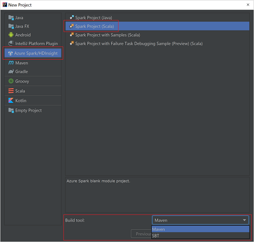
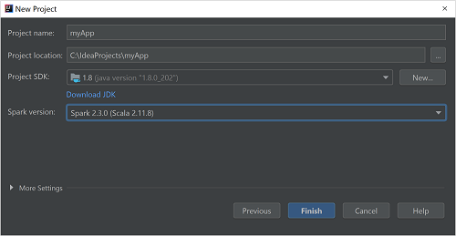
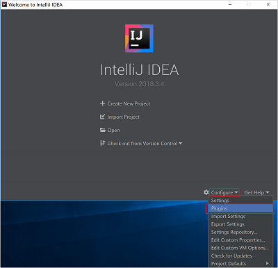
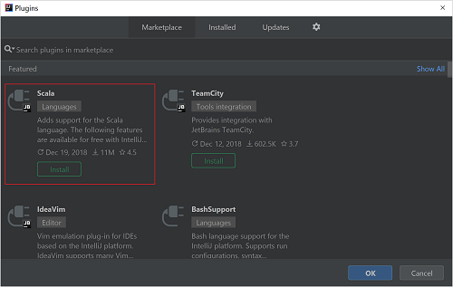
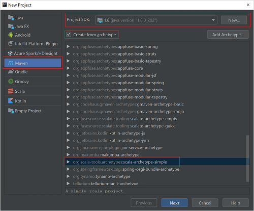
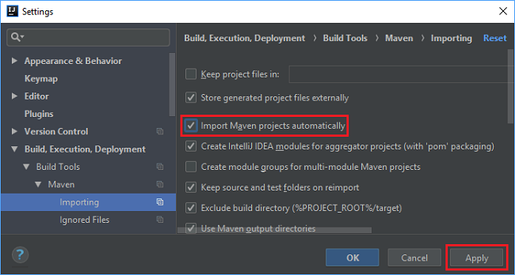
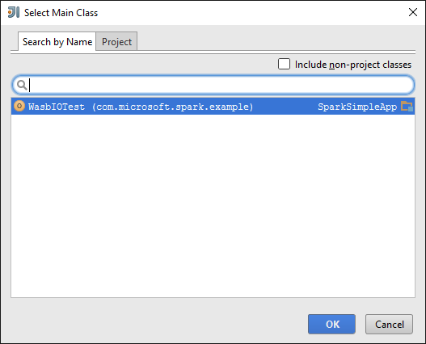
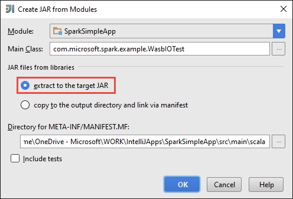
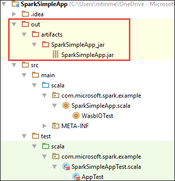

# Tutorial: create a Scala Maven application for Spark in HDInsight using IntelliJ

In this tutorial, you learn how to create a Spark application written in Scala using Maven with IntelliJ IDEA. The article uses Apache Maven as the build system and starts with an existing Maven archetype for Scala provided by IntelliJ IDEA.  Creating a Scala application in IntelliJ IDEA involves the following steps:

* Use Maven as the build system.
* Update Project Object Model (POM) file to resolve Spark module dependencies.
* Write your application in Scala.
* Generate a jar file that can be submitted to HDInsight Spark clusters.
* Run the application on Spark cluster using Livy.

> [!NOTE]
> HDInsight also provides an IntelliJ IDEA plugin tool to ease the process of creating and submitting applications to an HDInsight Spark cluster on Linux. For more information, see [Use HDInsight Tools Plugin for IntelliJ IDEA to create and submit Spark applications](apache-spark-intellij-tool-plugin.md).
> 

In this tutorial, you learn how to:
> [!div class="checklist"]
> * Use IntelliJ to develop a Scala Maven application

If you don't have an Azure subscription, [create a free account](https://azure.microsoft.com/free/) before you begin.

## Prerequisites

* An Apache Spark cluster on HDInsight. For instructions, see [Create Apache Spark clusters in Azure HDInsight](apache-spark-jupyter-spark-sql.md).
* Oracle Java Development kit. You can install it from [here](http://www.oracle.com/technetwork/java/javase/downloads/jdk8-downloads-2133151.html).
* A Java IDE. This article uses IntelliJ IDEA 18.1.1. You can install it from [here](https://www.jetbrains.com/idea/download/).

## Use IntelliJ to create application

1. Start IntelliJ IDEA, and then create a project. In the **New Project** dialog box, do the following: 

   a. Select **HDInsight** > **Spark on HDInsight (Scala)**.

   b. In the **Build tool** list, select either of the following, according to your need:

      * **Maven**, for Scala project-creation wizard support
      * **SBT**, for managing the dependencies and building for the Scala project

   

1. Select **Next**.

1. The Scala project-creation wizard automatically detects whether you've installed the Scala plug-in. Select **Install**.

    

1. To download the Scala plug-in, select **OK**. Follow the instructions to restart IntelliJ. 

   

1. In the **New Project** window, do the following:  

    

   a. Enter a project name and location.

   b. In the **Project SDK** drop-down list, select **Java 1.8** for the Spark 2.x cluster, or select **Java 1.7** for the Spark 1.x cluster.

   c. In the **Spark version** drop-down list, Scala project creation wizard integrates the proper version for Spark SDK and Scala SDK. If the Spark cluster version is earlier than 2.0, select **Spark 1.x**. Otherwise, select **Spark2.x**. This example uses **Spark 2.0.2 (Scala 2.11.8)**.

1. Select **Finish**.

## Install Scala plugin for IntelliJ IDEA
To install the Scala plugin, use the following steps:

1. Open IntelliJ IDEA.
1. On the welcome screen, select **Configure** and then select **Plugins**.
   
    
1. Select **Install JetBrains plugin** from the lower left corner. 
1. In the **Browse JetBrains Plugins** dialog box, search for **Scala** and then select **Install**.
   
    
1. After the plugin installs successfully, you must restart the IDE.

## Create a standalone Scala project
1. Open IntelliJ IDEA.
1. From the **File** menu, select **New > Project** to create a new project.
1. In the new project dialog box, make the following choices:
   
    
   
   * Select **Maven** as the project type.
   * Specify a **Project SDK**. Select **New** and navigate to the Java installation directory, typically `C:\Program Files\Java\jdk1.8.0_66`.
   * Select the **Create from archetype** option.
   * From the list of archetypes, select **org.scala-tools.archetypes:scala-archetype-simple**. This archetype creates the right directory structure and download the required default dependencies to write Scala program.
1. Select **Next**.
1. Provide relevant values for **GroupId**, **ArtifactId**, and **Version**. The following values are used in this tutorial:

    - GroupId: com.microsoft.spark.example
    - ArtifactId: SparkSimpleApp
1. Select **Next**.
1. Verify the settings and then select **Next**.
1. Verify the project name and location, and then select **Finish**.
1. In the left pane, select **src > test > scala > com > microsoft > spark > example**, right-click **MySpec**, and then select **Delete**. You do not need this file for the application.
  
1. In the subsequent steps, you update the pom.xml to define the dependencies for the Spark Scala application. For those dependencies to be downloaded and resolved automatically, you must configure Maven accordingly.
   
    
   
   1. From the **File** menu, select **Settings**.
   1. In the **Settings** dialog box, navigate to **Build, Execution, Deployment** > **Build Tools** > **Maven** > **Importing**.
   1. Select the option to **Import Maven projects automatically**.
   1. Select **Apply**, and then select **OK**.
1. In the left pane, select **src > main > scala > com.microsoft.spark.example**, and then double-click **App** to open App.scala.

1. Replace the existing sample code with the following code and save the changes. This code reads the data from the HVAC.csv (available on all HDInsight Spark clusters), retrieves the rows that only have one digit in the sixth column, and writes the output to **/HVACOut** under the default storage container for the cluster.

        package com.microsoft.spark.example
   
        import org.apache.spark.SparkConf
        import org.apache.spark.SparkContext
   
        /**
          * Test IO to wasb
          */
        object WasbIOTest {
          def main (arg: Array[String]): Unit = {
            val conf = new SparkConf().setAppName("WASBIOTest")
            val sc = new SparkContext(conf)
   
            val rdd = sc.textFile("wasb:///HdiSamples/HdiSamples/SensorSampleData/hvac/HVAC.csv")
   
            //find the rows which have only one digit in the 7th column in the CSV
            val rdd1 = rdd.filter(s => s.split(",")(6).length() == 1)
   
            rdd1.saveAsTextFile("wasb:///HVACout")
          }
        }
1. In the left pane, double-click **pom.xml**.
   
   1. Within `<project>\<properties>` add the following segments:
      
          <scala.version>2.10.4</scala.version>
          <scala.compat.version>2.10.4</scala.compat.version>
          <scala.binary.version>2.10</scala.binary.version>
   1. Within `<project>\<dependencies>` add the following segments:
      
           <dependency>
             <groupId>org.apache.spark</groupId>
             <artifactId>spark-core_${scala.binary.version}</artifactId>
             <version>1.4.1</version>
           </dependency>
      
      Save changes to pom.xml.
1. Create the .jar file. IntelliJ IDEA enables creation of JAR as an artifact of a project. Perform the following steps.
    
    1. From the **File** menu, select **Project Structure**.
    1. In the **Project Structure** dialog box, select **Artifacts** and then select the plus symbol. From the pop-up dialog box, select **JAR**, and then select **From modules with dependencies**.
       
        
    1. In the **Create JAR from Modules** dialog box, select the ellipsis () against the **Main Class**.
    1. In the **Select Main Class** dialog box, select the class that appears by default and then select **OK**.
       
        
    1. In the **Create JAR from Modules** dialog box, make sure the **extract to the target JAR** option is selected, and then select **OK**.  This setting creates a single JAR with all dependencies.
       
        
    1. The output layout tab lists all the jars that are included as part of the Maven project. You can select and delete the ones on which the Scala application has no direct dependency. For the application, you are creating here, you can remove all but the last one (**SparkSimpleApp compile output**). Select the jars to delete and then select the **Delete** icon.
       
        
       
        Make sure the **Include in project build** box is selected, which ensures that the jar is created every time the project is built or updated. select **Apply** and then **OK**.
    1. From the **Build** menu, select **Build Artifacts** to create the jar. The output jar is created under **\out\artifacts**.
       
        

## Run the application on the Spark cluster
To run the application on the cluster, you can use the following approaches:

* **Copy the application jar to the Azure storage blob** associated with the cluster. You can use [**AzCopy**](../../storage/common/storage-use-azcopy.md), a command-line utility, to do so. There are many other clients as well that you can use to upload data. You can find more about them at [Upload data for Hadoop jobs in HDInsight](../hdinsight-upload-data.md).
* **Use Livy to submit an application job remotely** to the Spark cluster. Spark clusters on HDInsight includes Livy that exposes REST endpoints to remotely submit Spark jobs. For more information, see [Submit Spark jobs remotely using Livy with Spark clusters on HDInsight](apache-spark-livy-rest-interface.md).

## Next step

In this article, you learned how to create a Spark scala application. Advance to the next article to learn how to run this application on an HDInsight Spark cluster using Livy.

> [!div class="nextstepaction"]
>[Run jobs remotely on a Spark cluster using Livy](./apache-spark-livy-rest-interface.md)

