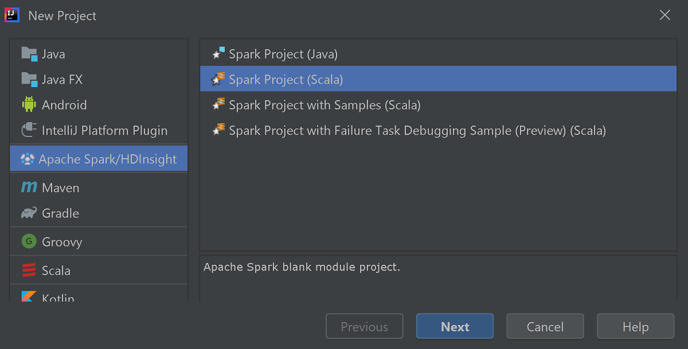
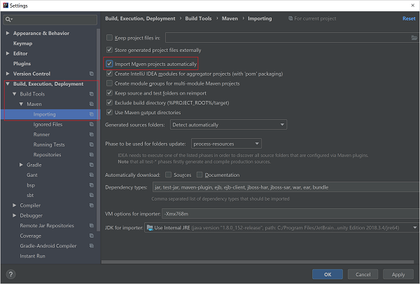
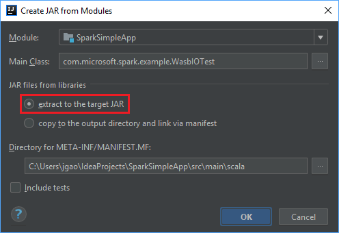

# Tutorial: Create a Scala Maven application for Apache Spark in HDInsight using IntelliJ

In this tutorial, you learn how to create an Apache Spark application written in Scala using Apache Maven with IntelliJ IDEA. The article uses Apache Maven as the build system. And starts with an existing Maven archetype for Scala provided by IntelliJ IDEA.  Creating a Scala application in IntelliJ IDEA involves the following steps:

* Use Maven as the build system.
* Update Project Object Model (POM) file to resolve Spark module dependencies.
* Write your application in Scala.
* Generate a jar file that can be submitted to HDInsight Spark clusters.
* Run the application on Spark cluster using Livy.

In this tutorial, you learn how to:
> [!div class="checklist"]
> * Install Scala plugin for IntelliJ IDEA
> * Use IntelliJ to develop a Scala Maven application
> * Create a standalone Scala project

## Prerequisites

* An Apache Spark cluster on HDInsight. For instructions, see [Create Apache Spark clusters in Azure HDInsight](apache-spark-jupyter-spark-sql.md).

* [Oracle Java Development kit](https://www.azul.com/downloads/azure-only/zulu/).  This tutorial uses Java version 8.0.202.

* A Java IDE. This article uses [IntelliJ IDEA Community ver.  2018.3.4](https://www.jetbrains.com/idea/download/).

* Azure Toolkit for IntelliJ.  See [Installing the Azure Toolkit for IntelliJ](https://docs.microsoft.com/java/azure/intellij/azure-toolkit-for-intellij-create-hello-world-web-app#installation-and-sign-in).

## Install Scala plugin for IntelliJ IDEA

Do the following steps to install the Scala plugin:

1. Open IntelliJ IDEA.

2. On the welcome screen, navigate to **Configure** > **Plugins** to open the **Plugins** window.

    

3. Select **Install** for the Scala plugin that is featured in the new window.  

    

4. After the plugin installs successfully, you must restart the IDE.

## Use IntelliJ to create application

1. Start IntelliJ IDEA, and select **Create New Project** to open the **New Project** window.

2. Select **Apache Spark/HDInsight** from the left pane.

3. Select **Spark Project (Scala)** from the main window.

4. From the **Build tool** drop-down list, select one of the following values:
      * **Maven** for Scala project-creation wizard support.
      * **SBT** for managing the dependencies and building for the Scala project.

   

5. Select **Next**.

6. In the **New Project** window, provide the following information:  

    |  Property   | Description   |  
    | ----- | ----- |  
    |Project name| Enter a name.|  
    |Project&nbsp;location| Enter the location to save your project.|
    |Project SDK| This field will be blank on your first use of IDEA.  Select **New...** and navigate to your JDK.|
    |Spark Version|The creation wizard integrates the proper version for Spark SDK and Scala SDK. If the Spark cluster version is earlier than 2.0, select **Spark 1.x**. Otherwise, select **Spark2.x**. This example uses **Spark 2.3.0 (Scala 2.11.8)**.|

    

7. Select **Finish**.

## Create a standalone Scala project

1. Start IntelliJ IDEA, and select **Create New Project** to open the **New Project** window.

2. Select **Maven** from the left pane.

3. Specify a **Project SDK**. If blank, select **New...** and navigate to the Java installation directory.

4. Select the **Create from archetype** checkbox.  

5. From the list of archetypes, select **`org.scala-tools.archetypes:scala-archetype-simple`**. This archetype creates the right directory structure and downloads the required default dependencies to write Scala program.

    

6. Select **Next**.

7. Expand **Artifact Coordinates**. Provide relevant values for **GroupId**, and **ArtifactId**. **Name**, and **Location** will autopopulate. The following values are used in this tutorial:

    - **GroupId:** com.microsoft.spark.example
    - **ArtifactId:** SparkSimpleApp

    

8. Select **Next**.

9. Verify the settings and then select **Next**.

10. Verify the project name and location, and then select **Finish**.  The project will take a few minutes to import.

11. Once the project has imported, from the left pane navigate to **SparkSimpleApp** > **src** > **test** > **scala** > **com** > **microsoft** > **spark** > **example**.  Right-click **MySpec**, and then select **Delete...**. You don't need this file for the application.  Select **OK** in the dialog box.
  
12. In the later steps, you update the **pom.xml** to define the dependencies for the Spark Scala application. For those dependencies to be downloaded and resolved automatically, you must configure Maven.

13. From the **File** menu, select **Settings** to open the **Settings** window.

14. From the **Settings** window, navigate to **Build, Execution, Deployment** > **Build Tools** > **Maven** > **Importing**.

15. Select the **Import Maven projects automatically** checkbox.

16. Select **Apply**, and then select **OK**.  You'll then be returned to the project window.

    

17. From the left pane, navigate to **src** > **main** > **scala** > **com.microsoft.spark.example**, and then double-click **App** to open App.scala.

18. Replace the existing sample code with the following code and save the changes. This code reads the data from the HVAC.csv (available on all HDInsight Spark clusters). Retrieves the rows that only have one digit in the sixth column. And writes the output to **/HVACOut** under the default storage container for the cluster.

        package com.microsoft.spark.example
   
        import org.apache.spark.SparkConf
        import org.apache.spark.SparkContext
   
        /**
          * Test IO to wasb
          */
        object WasbIOTest {
          def main (arg: Array[String]): Unit = {
            val conf = new SparkConf().setAppName("WASBIOTest")
            val sc = new SparkContext(conf)
   
            val rdd = sc.textFile("wasb:///HdiSamples/HdiSamples/SensorSampleData/hvac/HVAC.csv")
   
            //find the rows which have only one digit in the 7th column in the CSV
            val rdd1 = rdd.filter(s => s.split(",")(6).length() == 1)
   
            rdd1.saveAsTextFile("wasb:///HVACout")
          }
        }
19. In the left pane, double-click **pom.xml**.  

20. Within `<project>\<properties>` add the following segments:

          <scala.version>2.11.8</scala.version>
          <scala.compat.version>2.11.8</scala.compat.version>
          <scala.binary.version>2.11</scala.binary.version>

21. Within `<project>\<dependencies>` add the following segments:

           <dependency>
             <groupId>org.apache.spark</groupId>
             <artifactId>spark-core_${scala.binary.version}</artifactId>
             <version>2.3.0</version>
           </dependency>

    Save changes to pom.xml.

22. Create the .jar file. IntelliJ IDEA enables creation of JAR as an artifact of a project. Do the following steps.

    1. From the **File** menu, select **Project Structure...**.

    2. From the **Project Structure** window, navigate to **Artifacts** > **the plus symbol +** > **JAR** > **From modules with dependencies...**.

        

    3. In the **Create JAR from Modules** window, select the folder icon in the **Main Class** text box.

    4. In the **Select Main Class** window, select the class that appears by default and then select **OK**.

        

    5. In the **Create JAR from Modules** window, ensure the **extract to the target JAR** option is selected, and then select **OK**.  This setting creates a single JAR with all dependencies.

        

    6. The **Output Layout** tab lists all the jars that are included as part of the Maven project. You can select and delete the ones on which the Scala application has no direct dependency. For the application, you're creating here, you can remove all but the last one (**SparkSimpleApp compile output**). Select the jars to delete and then select the negative symbol **-**.

        

        Ensure sure the **Include in project build** checkbox is selected. This option ensures that the jar is created every time the project is built or updated. Select **Apply** and then **OK**.

    7. To create the jar, navigate to **Build** > **Build Artifacts** > **Build**. The project will compile in about 30 seconds.  The output jar is created under **\out\artifacts**.

        

## Run the application on the Apache Spark cluster

To run the application on the cluster, you can use the following approaches:

* **Copy the application jar to the Azure Storage blob** associated with the cluster. You can use **AzCopy**, a command-line utility, to do so. There are many other clients as well that you can use to upload data. You can find more about them at [Upload data for Apache Hadoop jobs in HDInsight](../hdinsight-upload-data.md).

* **Use Apache Livy to submit an application job remotely** to the Spark cluster. Spark clusters on HDInsight includes Livy that exposes REST endpoints to remotely submit Spark jobs. For more information, see [Submit Apache Spark jobs remotely using Apache Livy with Spark clusters on HDInsight](apache-spark-livy-rest-interface.md).

## Clean up resources

If you're not going to continue to use this application, delete the cluster that you created with the following steps:

1. Sign in to the [Azure portal](https://portal.azure.com/).

1. In the **Search** box at the top, type **HDInsight**.

1. Select **HDInsight clusters** under **Services**.

1. In the list of HDInsight clusters that appears, select the **...** next to the cluster that you created for this tutorial.

1. Select **Delete**. Select **Yes**.

## Next step

In this article, you learned how to create an Apache Spark scala application. Advance to the next article to learn how to run this application on an HDInsight Spark cluster using Livy.

> [!div class="nextstepaction"]
>[Run jobs remotely on an Apache Spark cluster using Apache Livy](./apache-spark-livy-rest-interface.md)
