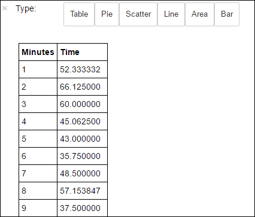

# Analyze website logs using a custom Python library with Spark cluster on HDInsight

This notebook demonstrates how to analyze log data using a custom library with Spark on HDInsight. The custom library we use is a Python library called **iislogparser.py**.

> [!TIP]
> This tutorial is also available as a Jupyter notebook on a Spark (Linux) cluster that you create in HDInsight. The notebook experience lets you run the Python snippets from the notebook itself. To perform the tutorial from within a notebook, create a Spark cluster, launch a Jupyter notebook (`https://CLUSTERNAME.azurehdinsight.net/jupyter`), and then run the notebook **Analyze logs with Spark using a custom library.ipynb** under the **PySpark** folder.
>
>

**Prerequisites:**

You must have the following:

* An Azure subscription. See [Get Azure free trial](https://azure.microsoft.com/documentation/videos/get-azure-free-trial-for-testing-hadoop-in-hdinsight/).

* An Apache Spark cluster on HDInsight. For instructions, see [Create Apache Spark clusters in Azure HDInsight](apache-spark-jupyter-spark-sql.md).

## Save raw data as an RDD
In this section, we use the [Jupyter](https://jupyter.org) notebook associated with an Apache Spark cluster in HDInsight to run jobs that process your raw sample data and save it as a Hive table. The sample data is a .csv file (hvac.csv) available on all clusters by default.

Once your data is saved as a Hive table, in the next section we will connect to the Hive table using BI tools such as Power BI and Tableau.

1. From the [Azure portal](https://portal.azure.com/), from the startboard, click the tile for your Spark cluster (if you pinned it to the startboard). You can also navigate to your cluster under **Browse All** > **HDInsight Clusters**.   
2. From the Spark cluster blade, click **Cluster Dashboard**, and then click **Jupyter Notebook**. If prompted, enter the admin credentials for the cluster.

   > [!NOTE]
   > You may also reach the Jupyter Notebook for your cluster by opening the following URL in your browser. Replace **CLUSTERNAME** with the name of your cluster:
   >
   > `https://CLUSTERNAME.azurehdinsight.net/jupyter`
   >
   >
3. Create a new notebook. Click **New**, and then click **PySpark**.

    
4. A new notebook is created and opened with the name Untitled.pynb. Click the notebook name at the top, and enter a friendly name.

    
5. Because you created a notebook using the PySpark kernel, you do not need to create any contexts explicitly. The Spark and Hive contexts will be automatically created for you when you run the first code cell. You can start by importing the types that are required for this scenario. Paste the following snippet in an empty cell, and then press **SHIFT + ENTER**.

        from pyspark.sql import Row
        from pyspark.sql.types import *

1. Create an RDD using the sample log data already available on the cluster. You
   can access the data in the default storage account associated with the cluster
   at **\HdiSamples\HdiSamples\WebsiteLogSampleData\SampleLog\909f2b.log**.

        logs = sc.textFile('wasb:///HdiSamples/HdiSamples/WebsiteLogSampleData/SampleLog/909f2b.log')

1. Retrieve a sample log set to verify that the previous step completed
   successfully.

        logs.take(5)

    You should see an output similar to the following:

        # -----------------
        # THIS IS AN OUTPUT
        # -----------------

        [u'#Software: Microsoft Internet Information Services 8.0',
         u'#Fields: date time s-sitename cs-method cs-uri-stem cs-uri-query s-port cs-username c-ip cs(User-Agent) cs(Cookie) cs(Referer) cs-host sc-status sc-substatus sc-win32-status sc-bytes cs-bytes time-taken',
         u'2014-01-01 02:01:09 SAMPLEWEBSITE GET /blogposts/mvc4/step2.png X-ARR-LOG-ID=2ec4b8ad-3cf0-4442-93ab-837317ece6a1 80 - 1.54.23.196 Mozilla/5.0+(Windows+NT+6.3;+WOW64)+AppleWebKit/537.36+(KHTML,+like+Gecko)+Chrome/31.0.1650.63+Safari/537.36 - http://weblogs.asp.net/sample/archive/2007/12/09/asp-net-mvc-framework-part-4-handling-form-edit-and-post-scenarios.aspx www.sample.com 200 0 0 53175 871 46',
         u'2014-01-01 02:01:09 SAMPLEWEBSITE GET /blogposts/mvc4/step3.png X-ARR-LOG-ID=9eace870-2f49-4efd-b204-0d170da46b4a 80 - 1.54.23.196 Mozilla/5.0+(Windows+NT+6.3;+WOW64)+AppleWebKit/537.36+(KHTML,+like+Gecko)+Chrome/31.0.1650.63+Safari/537.36 - http://weblogs.asp.net/sample/archive/2007/12/09/asp-net-mvc-framework-part-4-handling-form-edit-and-post-scenarios.aspx www.sample.com 200 0 0 51237 871 32',
         u'2014-01-01 02:01:09 SAMPLEWEBSITE GET /blogposts/mvc4/step4.png X-ARR-LOG-ID=4bea5b3d-8ac9-46c9-9b8c-ec3e9500cbea 80 - 1.54.23.196 Mozilla/5.0+(Windows+NT+6.3;+WOW64)+AppleWebKit/537.36+(KHTML,+like+Gecko)+Chrome/31.0.1650.63+Safari/537.36 - http://weblogs.asp.net/sample/archive/2007/12/09/asp-net-mvc-framework-part-4-handling-form-edit-and-post-scenarios.aspx www.sample.com 200 0 0 72177 871 47']

## Analyze log data using a custom Python library
1. In the output above, the first couple lines include the header information and each remaining line matches the schema described in that header. Parsing such logs could be complicated. So, we use a custom Python library
   (**iislogparser.py**) that makes parsing such logs much easier. By default, this library is included with your Spark cluster on HDInsight at **/HdiSamples/HdiSamples/WebsiteLogSampleData/iislogparser.py**.

    However, this library is not in the `PYTHONPATH` so we cannot use it by using an import statement like `import iislogparser`. To use this library, we must distribute it to all the worker nodes. Run the following snippet.

        sc.addPyFile('wasb:///HdiSamples/HdiSamples/WebsiteLogSampleData/iislogparser.py')

1. `iislogparser` provides a function `parse_log_line` that returns `None` if a log
   line is a header row, and returns an instance of the `LogLine` class if it
   encounters a log line. Use the `LogLine` class to extract only the log lines
   from the RDD:

        def parse_line(l):
            import iislogparser
            return iislogparser.parse_log_line(l)
        logLines = logs.map(parse_line).filter(lambda p: p is not None).cache()
2. Retrieve a couple of extracted log lines to verify that the step completed
   successfully.

       logLines.take(2)

   The output should be similar to the following:

       # -----------------
       # THIS IS AN OUTPUT
       # -----------------

       [2014-01-01 02:01:09 SAMPLEWEBSITE GET /blogposts/mvc4/step2.png X-ARR-LOG-ID=2ec4b8ad-3cf0-4442-93ab-837317ece6a1 80 - 1.54.23.196 Mozilla/5.0+(Windows+NT+6.3;+WOW64)+AppleWebKit/537.36+(KHTML,+like+Gecko)+Chrome/31.0.1650.63+Safari/537.36 - http://weblogs.asp.net/sample/archive/2007/12/09/asp-net-mvc-framework-part-4-handling-form-edit-and-post-scenarios.aspx www.sample.com 200 0 0 53175 871 46,
        2014-01-01 02:01:09 SAMPLEWEBSITE GET /blogposts/mvc4/step3.png X-ARR-LOG-ID=9eace870-2f49-4efd-b204-0d170da46b4a 80 - 1.54.23.196 Mozilla/5.0+(Windows+NT+6.3;+WOW64)+AppleWebKit/537.36+(KHTML,+like+Gecko)+Chrome/31.0.1650.63+Safari/537.36 - http://weblogs.asp.net/sample/archive/2007/12/09/asp-net-mvc-framework-part-4-handling-form-edit-and-post-scenarios.aspx www.sample.com 200 0 0 51237 871 32]
3. The `LogLine` class, in turn, has some useful methods, like `is_error()`, which
   returns whether a log entry has an error code. Use this to compute the number of
   errors in the extracted log lines, and then log all the errors to a different
   file.

       errors = logLines.filter(lambda p: p.is_error())
       numLines = logLines.count()
       numErrors = errors.count()
       print 'There are', numErrors, 'errors and', numLines, 'log entries'
       errors.map(lambda p: str(p)).saveAsTextFile('wasb:///HdiSamples/HdiSamples/WebsiteLogSampleData/SampleLog/909f2b-2.log')

   You should see an output like the following:

       # -----------------
       # THIS IS AN OUTPUT
       # -----------------

       There are 30 errors and 646 log entries
4. You can also use **Matplotlib** to construct a visualization of the data. For
   example, if you want to isolate the cause of requests that run for a long time,
   you might want to find the files that take the most time to serve on average.
   The snippet below retrieves the top 25 resources that took most time to serve a
   request.

       def avgTimeTakenByKey(rdd):
           return rdd.combineByKey(lambda line: (line.time_taken, 1),
                                   lambda x, line: (x[0] + line.time_taken, x[1] + 1),
                                   lambda x, y: (x[0] + y[0], x[1] + y[1]))\
                     .map(lambda x: (x[0], float(x[1][0]) / float(x[1][1])))

       avgTimeTakenByKey(logLines.map(lambda p: (p.cs_uri_stem, p))).top(25, lambda x: x[1])

   You should see an output like the following:

       # -----------------
       # THIS IS AN OUTPUT
       # -----------------

       [(u'/blogposts/mvc4/step13.png', 197.5),
        (u'/blogposts/mvc2/step10.jpg', 179.5),
        (u'/blogposts/extractusercontrol/step5.png', 170.0),
        (u'/blogposts/mvc4/step8.png', 159.0),
        (u'/blogposts/mvcrouting/step22.jpg', 155.0),
        (u'/blogposts/mvcrouting/step3.jpg', 152.0),
        (u'/blogposts/linqsproc1/step16.jpg', 138.75),
        (u'/blogposts/linqsproc1/step26.jpg', 137.33333333333334),
        (u'/blogposts/vs2008javascript/step10.jpg', 127.0),
        (u'/blogposts/nested/step2.jpg', 126.0),
        (u'/blogposts/adminpack/step1.png', 124.0),
        (u'/BlogPosts/datalistpaging/step2.png', 118.0),
        (u'/blogposts/mvc4/step35.png', 117.0),
        (u'/blogposts/mvcrouting/step2.jpg', 116.5),
        (u'/blogposts/aboutme/basketball.jpg', 109.0),
        (u'/blogposts/anonymoustypes/step11.jpg', 109.0),
        (u'/blogposts/mvc4/step12.png', 106.0),
        (u'/blogposts/linq8/step0.jpg', 105.5),
        (u'/blogposts/mvc2/step18.jpg', 104.0),
        (u'/blogposts/mvc2/step11.jpg', 104.0),
        (u'/blogposts/mvcrouting/step1.jpg', 104.0),
        (u'/blogposts/extractusercontrol/step1.png', 103.0),
        (u'/blogposts/sqlvideos/sqlvideos.jpg', 102.0),
        (u'/blogposts/mvcrouting/step21.jpg', 101.0),
        (u'/blogposts/mvc4/step1.png', 98.0)]
5. You can also present this information in the form of plot. As a first step to create a plot, let us first create a temporary table **AverageTime**. The table groups the logs by time to see if there were any unusual latency spikes at any particular time.

       avgTimeTakenByMinute = avgTimeTakenByKey(logLines.map(lambda p: (p.datetime.minute, p))).sortByKey()
       schema = StructType([StructField('Minutes', IntegerType(), True),
                            StructField('Time', FloatType(), True)])

       avgTimeTakenByMinuteDF = sqlContext.createDataFrame(avgTimeTakenByMinute, schema)
       avgTimeTakenByMinuteDF.registerTempTable('AverageTime')
6. You can then run the following SQL query to get all the records in the **AverageTime** table.

       %%sql -o averagetime
       SELECT * FROM AverageTime

   The `%%sql` magic followed by `-o averagetime` ensures that the output of the query is persisted locally on the Jupyter server (typically the headnode of the cluster). The output is persisted as a [Pandas](http://pandas.pydata.org/) dataframe with the specified name **averagetime**.

   You should see an output like the following:

   

   For more information about the `%%sql` magic, see [Parameters supported with the %%sql magic](apache-spark-jupyter-notebook-kernels.md#parameters-supported-with-the-sql-magic).
7. You can now use Matplotlib, a library used to construct visualization of data, to create a plot. Because the plot must be created from the locally persisted **averagetime** dataframe, the code snippet must begin with the `%%local` magic. This ensures that the code is run locally on the Jupyter server.

       %%local
       %matplotlib inline
       import matplotlib.pyplot as plt

       plt.plot(averagetime['Minutes'], averagetime['Time'], marker='o', linestyle='--')
       plt.xlabel('Time (min)')
       plt.ylabel('Average time taken for request (ms)')

   You should see an output like the following:

   
8. After you have finished running the application, you should shutdown the notebook to release the resources. To do so, from the **File** menu on the notebook, click **Close and Halt**. This will shutdown and close the notebook.

## See also
* [Overview: Apache Spark on Azure HDInsight](apache-spark-overview.md)

### Scenarios
* [Spark with BI: Perform interactive data analysis using Spark in HDInsight with BI tools](apache-spark-use-bi-tools.md)
* [Spark with Machine Learning: Use Spark in HDInsight for analyzing building temperature using HVAC data](apache-spark-ipython-notebook-machine-learning.md)
* [Spark with Machine Learning: Use Spark in HDInsight to predict food inspection results](apache-spark-machine-learning-mllib-ipython.md)

### Create and run applications
* [Create a standalone application using Scala](apache-spark-create-standalone-application.md)
* [Run jobs remotely on a Spark cluster using Livy](apache-spark-livy-rest-interface.md)

### Tools and extensions
* [Use HDInsight Tools Plugin for IntelliJ IDEA to create and submit Spark Scala applications](apache-spark-intellij-tool-plugin.md)
* [Use HDInsight Tools Plugin for IntelliJ IDEA to debug Spark applications remotely](../hdinsight-apache-spark-intellij-tool-plugin-debug-jobs-remotely.md)
* [Use Zeppelin notebooks with a Spark cluster on HDInsight](apache-spark-zeppelin-notebook.md)
* [Kernels available for Jupyter notebook in Spark cluster for HDInsight](apache-spark-jupyter-notebook-kernels.md)
* [Use external packages with Jupyter notebooks](apache-spark-jupyter-notebook-use-external-packages.md)
* [Install Jupyter on your computer and connect to an HDInsight Spark cluster](apache-spark-jupyter-notebook-install-locally.md)

### Manage resources
* [Manage resources for the Apache Spark cluster in Azure HDInsight](apache-spark-resource-manager.md)
* [Track and debug jobs running on an Apache Spark cluster in HDInsight](apache-spark-job-debugging.md)
