# Use Azure Toolkit for Eclipse to create Apache Spark applications for an HDInsight cluster

Use HDInsight Tools in Azure Toolkit for [Eclipse](https://www.eclipse.org/) to develop [Apache Spark](https://spark.apache.org/) applications written in [Scala](https://www.scala-lang.org/) and submit them to an Azure HDInsight Spark cluster, directly from the Eclipse IDE. You can use the HDInsight Tools plug-in in a few different ways:

* To develop and submit a Scala Spark application on an HDInsight Spark cluster.
* To access your Azure HDInsight Spark cluster resources.
* To develop and run a Scala Spark application locally.

## Prerequisites

* Apache Spark cluster on HDInsight. For instructions, see [Create Apache Spark clusters in Azure HDInsight](apache-spark-jupyter-spark-sql.md).

* [Java Developer Kit (JDK) version 8](https://aka.ms/azure-jdks).

* [Eclipse IDE](https://www.eclipse.org/downloads/). This article uses the Eclipse IDE for Java Developers.

## Install required plug-ins

### Install Azure Toolkit for Eclipse

For installation instructions, see [Installing Azure Toolkit for Eclipse](https://docs.microsoft.com/azure/developer/java/toolkit-for-eclipse/installation).

### Install the Scala plug-in

When you open Eclipse, HDInsight Tools automatically detects whether you installed the Scala plug-in. Select **OK** to continue, and then follow the instructions to install the plug-in from the Eclipse Marketplace. Restart the IDE after installation completes.


### Confirm plug-ins

1. Navigate to **Help** > **Eclipse Marketplace...**.

1. Select the **Installed** tab.

1. You should see at least:
    * Azure Toolkit for Eclipse \<version>.
    * Scala IDE \<version>.

## Sign in to your Azure subscription

1. Start Eclipse IDE.

1. Navigate to **Window** >  **Show View** > **Other...** > **Sign In..**.

1. From the **Show View** dialog, navigate to **Azure** > **Azure Explorer**, and then select **Open**.

   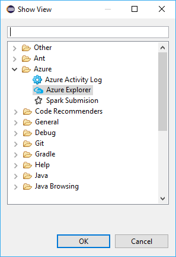

1. From **Azure Explorer**, right-click the **Azure** node, and then select **Sign in**.

1. In the **Azure Sign In** dialog box, choose the authentication method, select **Sign in**, and complete the sign-in process.

   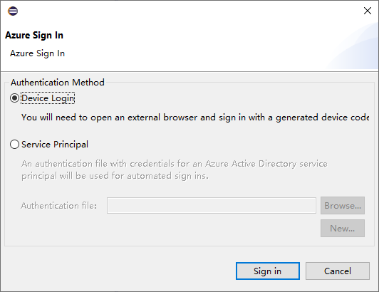

1. After you're signed in, the **Your Subscriptions** dialog box lists all the Azure subscriptions associated with the credentials. Press **Select** to close the dialog box.

   

1. From **Azure Explorer**, navigate to **Azure** >  **HDInsight** to see the HDInsight Spark clusters under your subscription.

   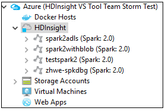

1. You can further expand a cluster name node to see the resources (for example, storage accounts) associated with the cluster.

   

## Link a cluster

You can link a normal cluster by using the Ambari managed username. Similarly, for a domain-joined HDInsight cluster, you can link by using the domain and username, such as `user1@contoso.com`.

1. From **Azure Explorer**, right-click **HDInsight**, and select **Link A Cluster**.

   

1. Enter **Cluster Name**, **User Name**, and **Password**, then select **OK**. Optionally, enter Storage Account, Storage Key and then select Storage Container for storage explorer to work in the left tree view

   

   > [!NOTE]  
   > We use the linked storage key, username and password if the cluster both logged in Azure subscription and Linked a cluster.
   > 
   >
   > For the keyboard only user, when the current focus is at **Storage Key**, you need to use **Ctrl+TAB** to focus on the next field in the dialog.

1. You can see the linked cluster under **HDInsight**. Now you can submit an application to this linked cluster.

   

1. You also can unlink a cluster from **Azure Explorer**.

   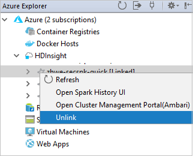

## Set up a Spark Scala project for an HDInsight Spark cluster

1. From the Eclipse IDE workspace, select **File** > **New** > **Project...**.

1. In the **New Project** wizard, select **HDInsight Project** > **Spark on HDInsight (Scala)**. Then select **Next**.

   

1. In the **New HDInsight Scala Project** dialog box, provide the following values, and then select **Next**:
   * Enter a name for the project.
   * In the **JRE** area, make sure that **Use an execution environment JRE** is set to **JavaSE-1.7** or later.
   * In the **Spark Library** area, you can choose **Use Maven to configure Spark SDK** option.  Our tool integrates the proper version for Spark SDK and Scala SDK. You can also choose **Add Spark SDK manually** option, download, and add Spark SDK by manually.

   

1. In the next dialog box, review the details, and then select **Finish**.

## Create a Scala application for an HDInsight Spark cluster

1. From **Package Explorer**, expand the project that you created earlier. Right-click **src**, select **New** > **Other...**.

1. In the **Select a wizard** dialog box, select **Scala Wizards** > **Scala Object**. Then select **Next**.

   

1. In the **Create New File** dialog box, enter a name for the object, and then select **Finish**. A text editor will open.

   

1. In the text editor, replace the current contents with the code below:

    ```scala
    import org.apache.spark.SparkConf
    import org.apache.spark.SparkContext

    object MyClusterApp{
        def main (arg: Array[String]): Unit = {
        val conf = new SparkConf().setAppName("MyClusterApp")
        val sc = new SparkContext(conf)

        val rdd = sc.textFile("wasbs:///HdiSamples/HdiSamples/SensorSampleData/hvac/HVAC.csv")

        //find the rows that have only one digit in the seventh column in the CSV
        val rdd1 =  rdd.filter(s => s.split(",")(6).length() == 1)

        rdd1.saveAsTextFile("wasbs:///HVACOut")
        }
    }
    ```

1. Run the application on an HDInsight Spark cluster:

   a. From Package Explorer, right-click the project name, and then select **Submit Spark Application to HDInsight**.

   b. In the **Spark Submission** dialog box, provide the following values, and then select **Submit**:

   * For **Cluster Name**, select the HDInsight Spark cluster on which you want to run your application.
   * Select an artifact from the Eclipse project, or select one from a hard drive. The default value depends on the item that you right-click from Package Explorer.
   * In the **Main class name** drop-down list, the submission wizard displays all object names from your project. Select or enter one that you want to run. If you selected an artifact from a hard drive, you must enter the main class name manually. 
   * Because the application code in this example doesn't require any command-line arguments or reference JARs or files, you can leave the remaining text boxes empty.

     

1. The **Spark Submission** tab should start displaying the progress. You can stop the application by selecting the red button in the **Spark Submission** window. You can also view the logs for this specific application run by selecting the globe icon (denoted by the blue box in the image).

   

## Access and manage HDInsight Spark clusters by using HDInsight Tools in Azure Toolkit for Eclipse

You can perform various operations by using HDInsight Tools, including accessing the job output.

### Access the job view

1. In **Azure Explorer**, expand **HDInsight**, then the Spark cluster name, and then select **Jobs**.

   

1. Select the **Jobs** node. If Java version is lower than **1.8**, HDInsight Tools automatically reminder you install the **E(fx)clipse** plug-in. Select **OK** to continue, and then follow the wizard to install it from the Eclipse Marketplace and restart Eclipse.

   

1. Open the Job View from the **Jobs** node. In the right pane, the **Spark Job View** tab displays all the applications that were run on the cluster. Select the name of the application for which you want to see more details.

   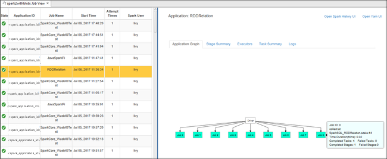

   You can then take any of these actions:

   * Hover on the job graph. It displays basic info about the running job. Select the job graph, and you can see the stages and info that every job generates.

     

   * Select the **Log** tab to view frequently used logs, including **Driver Stderr**, **Driver Stdout**, and **Directory Info**.

     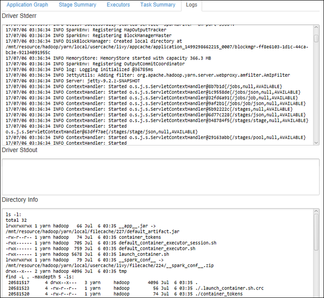

   * Open the Spark history UI and the Apache Hadoop YARN UI (at the application level) by selecting the hyperlinks at the top of the window.

### Access the storage container for the cluster

1. In Azure Explorer, expand the **HDInsight** root node to see a list of HDInsight Spark clusters that are available.

1. Expand the cluster name to see the storage account and the default storage container for the cluster.

   

1. Select the storage container name associated with the cluster. In the right pane, double-click the **HVACOut** folder. Open one of the **part-** files to see the output of the application.

### Access the Spark history server

1. In Azure Explorer, right-click your Spark cluster name, and then select **Open Spark History UI**. When you're prompted, enter the admin credentials for the cluster. You specified these while provisioning the cluster.

1. In the Spark history server dashboard, you use the application name to look for the application that you just finished running. In the preceding code, you set the application name by using `val conf = new SparkConf().setAppName("MyClusterApp")`. So, your Spark application name was **MyClusterApp**.

### Start the Apache Ambari portal

1. In Azure Explorer, right-click your Spark cluster name, and then select **Open Cluster Management Portal (Ambari)**.

1. When you're prompted, enter the admin credentials for the cluster. You specified these while provisioning the cluster.

### Manage Azure subscriptions

By default, HDInsight Tool in Azure Toolkit for Eclipse lists the Spark clusters from all your Azure subscriptions. If necessary, you can specify the subscriptions for which you want to access the cluster.

1. In Azure Explorer, right-click the **Azure** root node, and then select **Manage Subscriptions**.

1. In the dialog box, clear the check boxes for the subscription that you don't want to access, and then select **Close**. You can also select **Sign Out** if you want to sign out of your Azure subscription.

## Run a Spark Scala application locally

You can use HDInsight Tools in Azure Toolkit for Eclipse to run Spark Scala applications locally on your workstation. Typically, these applications don't need access to cluster resources such as a storage container, and you can run and test them locally.

### Prerequisite

While you're running the local Spark Scala application on a Windows computer, you might get an exception as explained in [SPARK-2356](https://issues.apache.org/jira/browse/SPARK-2356). This exception occurs because **WinUtils.exe** is missing in Windows.

To resolve this error, you need [Winutils.exe](https://github.com/steveloughran/winutils) to a location like **C:\WinUtils\bin**, and then add the environment variable **HADOOP_HOME** and set the value of the variable to **C\WinUtils**.

### Run a local Spark Scala application

1. Start Eclipse and create a project. In the **New Project** dialog box, make the following choices, and then select **Next**.

1. In the **New Project** wizard, select **HDInsight Project** > **Spark on HDInsight Local Run Sample (Scala)**. Then select **Next**.

   

1. To provide the project details, follow steps 3 through 6 from the earlier section [Setup a Spark Scala project for an HDInsight Spark cluster](#set-up-a-spark-scala-project-for-an-hdinsight-spark-cluster).

1. The template adds a sample code (**LogQuery**) under the **src** folder that you can run locally on your computer.

   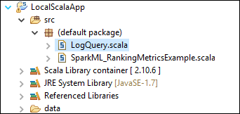

1. Right-click **LogQuery.scala** , and select **Run As** > **1 Scala Application**. Output like this appears on the **Console** tab:

   

## Reader-only role

When users submit job to a cluster with reader-only role permission, Ambari credentials is required.

### Link cluster from context menu

1. Sign in with reader-only role account.

2. From **Azure Explorer**, expand **HDInsight** to view HDInsight clusters that are in your subscription. The clusters marked **"Role:Reader"** only have reader-only role permission.

    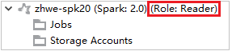

3. Right-click the cluster with reader-only role permission. Select **Link this cluster** from context menu to link cluster. Enter the Ambari username and password.

    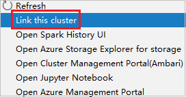

4. If the cluster is linked successfully, HDInsight will be refreshed.
   The stage of the cluster will become linked.
  
    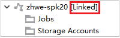

### Link cluster by expanding Jobs node

1. Click **Jobs** node, **Cluster Job Access Denied** window pops up.

2. Click **Link this cluster** to link cluster.

    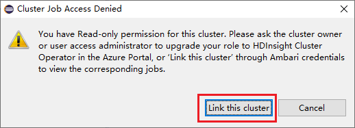

### Link cluster from Spark Submission window

1. Create an HDInsight Project.

2. Right-click the package. Then select **Submit Spark Application to HDInsight**.

   

3. Select a cluster, which has reader-only role permission for **Cluster Name**. Warning message shows out. You can click **Link this cluster** to link cluster.

   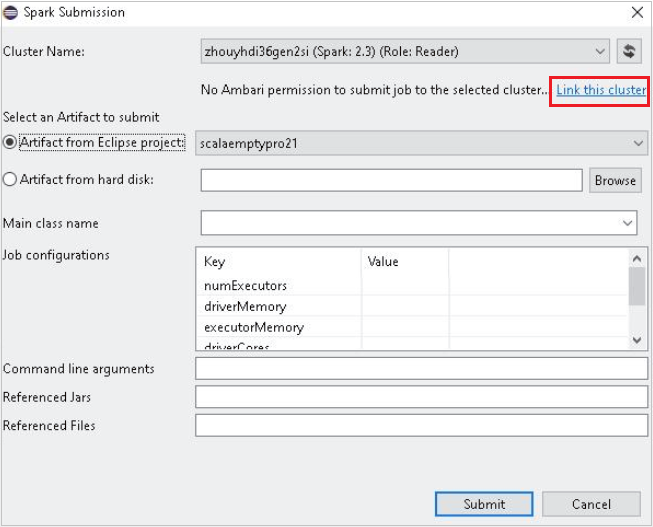

### View Storage Accounts

* For clusters with reader-only role permission, click **Storage Accounts** node, **Storage Access Denied** window pops up.

   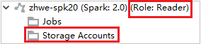

   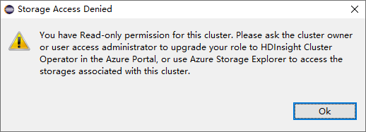

* For linked clusters, click **Storage Accounts** node, **Storage Access Denied** window pops up.

   

## Known problems

When using **Link A Cluster**, I would suggest you to provide credential of storage.


There are two modes to submit the jobs. If storage credential is provided, batch mode will be used to submit the job. Otherwise, interactive mode will be used. If the cluster is busy, you might get the error below.


## See also

* [Overview: Apache Spark on Azure HDInsight](apache-spark-overview.md)

### Scenarios

* [Apache Spark with BI: Perform interactive data analysis using Spark in HDInsight with BI tools](apache-spark-use-bi-tools.md)
* [Apache Spark with Machine Learning: Use Spark in HDInsight for analyzing building temperature using HVAC data](apache-spark-ipython-notebook-machine-learning.md)
* [Apache Spark with Machine Learning: Use Spark in HDInsight to predict food inspection results](apache-spark-machine-learning-mllib-ipython.md)
* [Website log analysis using Apache Spark in HDInsight](apache-spark-custom-library-website-log-analysis.md)

### Creating and running applications

* [Create a standalone application using Scala](apache-spark-create-standalone-application.md)
* [Run jobs remotely on an Apache Spark cluster using Apache Livy](apache-spark-livy-rest-interface.md)

### Tools and extensions

* [Use Azure Toolkit for IntelliJ to create and submit Spark Scala applications](apache-spark-intellij-tool-plugin.md)
* [Use Azure Toolkit for IntelliJ to debug Apache Spark applications remotely through VPN](../hdinsight-apache-spark-intellij-tool-plugin-debug-jobs-remotely.md)
* [Use Azure Toolkit for IntelliJ to debug Apache Spark applications remotely through SSH](../hdinsight-apache-spark-intellij-tool-debug-remotely-through-ssh.md)
* [Use Apache Zeppelin notebooks with an Apache Spark cluster on HDInsight](apache-spark-zeppelin-notebook.md)
* [Kernels available for Jupyter notebook in Apache Spark cluster for HDInsight](apache-spark-jupyter-notebook-kernels.md)
* [Use external packages with Jupyter notebooks](apache-spark-jupyter-notebook-use-external-packages.md)
* [Install Jupyter on your computer and connect to an HDInsight Spark cluster](apache-spark-jupyter-notebook-install-locally.md)

### Managing resources

* [Manage resources for the Apache Spark cluster in Azure HDInsight](apache-spark-resource-manager.md)
* [Track and debug jobs running on an Apache Spark cluster in HDInsight](apache-spark-job-debugging.md)
