# Use Azure Toolkit for Eclipse to create Spark applications for an HDInsight cluster

Use HDInsight Tools in Azure Toolkit for Eclipse to develop Spark applications written in Scala and submit them to an Azure HDInsight Spark cluster, directly from the Eclipse IDE. You can use the HDInsight Tools plug-in in a few different ways:

* To develop and submit a Scala Spark application on an HDInsight Spark cluster
* To access your Azure HDInsight Spark cluster resources
* To develop and run a Scala Spark application locally

> [!IMPORTANT]
> You can use this tool to create and submit applications only for an HDInsight Spark cluster on Linux.
> 
> 

## Prerequisites

* Apache Spark cluster on HDInsight. For instructions, see [Create Apache Spark clusters in Azure HDInsight](apache-spark-jupyter-spark-sql.md).
* Oracle Java Development Kit version 8, which is used for the Eclipse IDE runtime. You can download it from the [Oracle website](http://www.oracle.com/technetwork/java/javase/downloads/jdk8-downloads-2133151.html).
* Eclipse IDE. This article uses Eclipse Neon. You can install it from the [Eclipse website](https://www.eclipse.org/downloads/).

## Install HDInsight Tools in Azure Toolkit for Eclipse and the Scala plug-in

### Install Azure Toolkit for Eclipse
HDInsight Tools for Eclipse is available as part of Azure Toolkit for Eclipse. For installation instructions, see [Installing Azure Toolkit for Eclipse](https://docs.microsoft.com/java/azure/eclipse/azure-toolkit-for-eclipse-installation).

### Install the Scala plug-in
When you open Eclipse, HDInsight Tool automatically detects whether you installed the Scala plug-in. Select **OK** to continue, and then follow the instructions to install the plug-in from the Eclipse Marketplace.

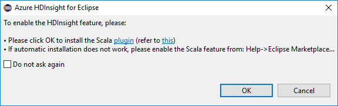

User can either [sign in to Azure subscription](#Sign-in-to-your-Azure-subscription), or [link a HDInsight cluster](#Link-a-cluster) using Ambari username/password or domain joined credential to start. 

## Sign in to your Azure subscription
1. Start the Eclipse IDE and open Azure Explorer. On the **Window** menu, select **Show View**, and then select **Other**. In the dialog box that opens, expand **Azure**, select **Azure Explorer**, and then select **OK**.

   
1. Right-click the **Azure** node, and then select **Sign in**.
1. In the **Azure Sign In** dialog box, choose the authentication method, select **Sign in**, and enter your Azure credentials.
   
   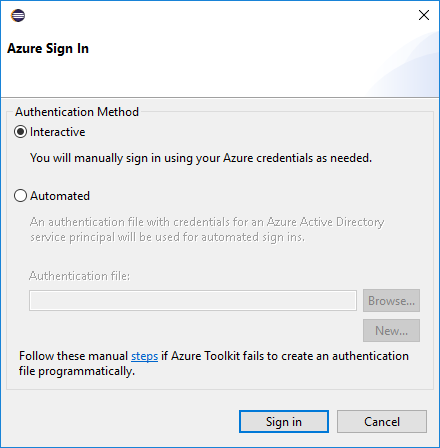
1. After you're signed in, the **Select Subscriptions** dialog box lists all the Azure subscriptions associated with the credentials. Click **Select** to close the dialog box.

   
1. On the **Azure Explorer** tab, expand **HDInsight** to see the HDInsight Spark clusters under your subscription.
   
   
1. You can further expand a cluster name node to see the resources (for example, storage accounts) associated with the cluster.
   
   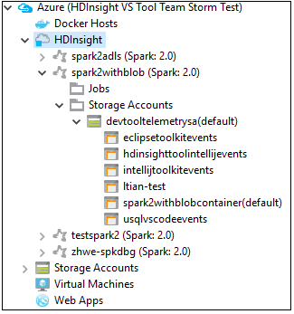

## Link a cluster
You can link a normal cluster by using the Ambari managed username. Similarly, for a domain-joined HDInsight cluster, you can link by using the domain and username, such as user1@contoso.com.

1. Select **Link a cluster** from **Azure Explorer**.

   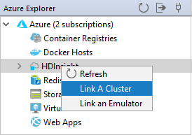

1. Enter **Cluster Name**, **User Name** and **Password**, then click OK button to link cluster. Optionally, enter Storage Account, Storage Key and then select Storage Container for storage explorer to work in the left tree view
   
   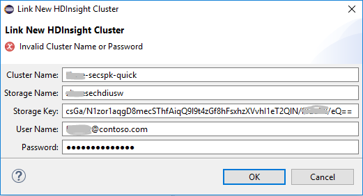
   
   > [!NOTE]
   > We use the linked storage key, username and password if the cluster both logged in Azure subscription and Linked a cluster.
   > 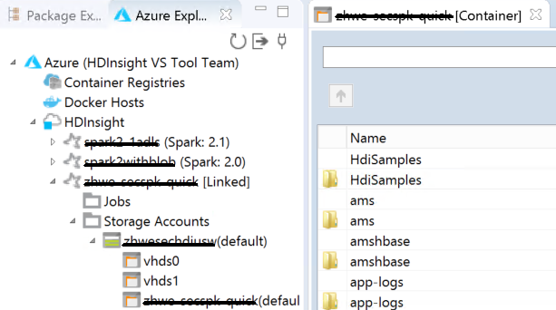

1. You can see a Linked cluster in **HDInsight** node after clicking OK button, if the input information are right. Now you can submit an application to this linked cluster.

   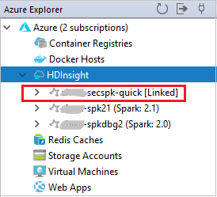

1. You also can unlink a cluster from **Azure Explorer**.
   
   

## Set up a Spark Scala project for an HDInsight Spark cluster

1. In the Eclipse IDE workspace, select **File**, select **New**, and then select **Project**. 
1. In the New Project wizard, expand **HDInsight**, select **Spark on HDInsight (Scala)**, and then select **Next**.

   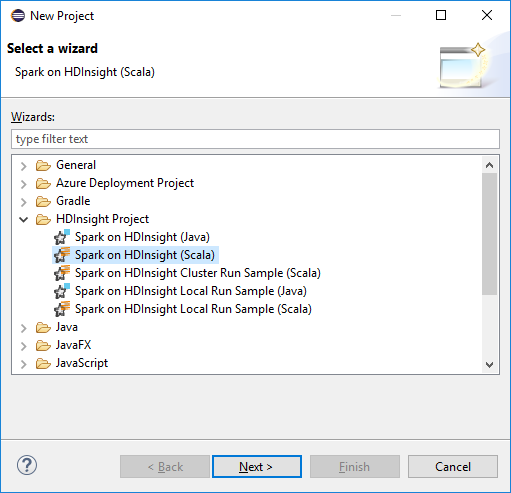
1. The Scala project creation wizard automatically detects whether you installed the Scala plug-in. Select **OK** to continue downloading the Scala plug-in, and then follow the instructions to restart Eclipse.

   
1. In the **New HDInsight Scala Project** dialog box, provide the following values, and then select **Next**:
   * Enter a name for the project.
   * In the **JRE** area, make sure that **Use an execution environment JRE** is set to **JavaSE-1.7** or later.
   * In the **Spark Library** area, you can choose **Use Maven to configure Spark SDK** option.  Our tool integrates the proper version for Spark SDK and Scala SDK. You can also choose **Add Spark SDK manually** option, download and add Spark SDK by manually.

   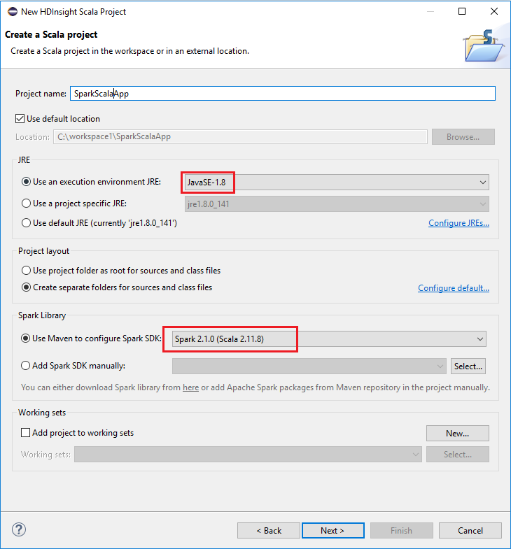
1. In the next dialog box, select **Finish**. 
   
  
## Create a Scala application for an HDInsight Spark cluster

1. In the Eclipse IDE, from Package Explorer, expand the project that you created earlier, right-click **src**, point to **New**, and then select **Other**.
1. In the **Select a wizard** dialog box, expand **Scala Wizards**, select **Scala Object**, and then select **Next**.
   
   
1. In the **Create New File** dialog box, enter a name for the object, and then select **Finish**.
   
   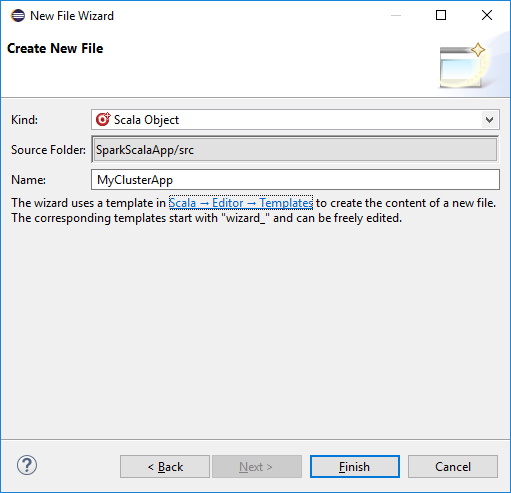
1. Paste the following code in the text editor:
   
        import org.apache.spark.SparkConf
        import org.apache.spark.SparkContext
   
        object MyClusterApp{
          def main (arg: Array[String]): Unit = {
            val conf = new SparkConf().setAppName("MyClusterApp")
            val sc = new SparkContext(conf)
   
            val rdd = sc.textFile("wasb:///HdiSamples/HdiSamples/SensorSampleData/hvac/HVAC.csv")
   
            //find the rows that have only one digit in the seventh column in the CSV
            val rdd1 =  rdd.filter(s => s.split(",")(6).length() == 1)
   
            rdd1.saveAsTextFile("wasb:///HVACOut")
          }        
        }
1. Run the application on an HDInsight Spark cluster:
   
   a. From Package Explorer, right-click the project name, and then select **Submit Spark Application to HDInsight**.        
   b. In the **Spark Submission** dialog box, provide the following values, and then select **Submit**:
      
      * For **Cluster Name**, select the HDInsight Spark cluster on which you want to run your application.
      * Select an artifact from the Eclipse project, or select one from a hard drive. The default value depends on the item that you right-click from Package Explorer.
      * In the **Main class name** drop-down list, the submission wizard displays all object names from your project. Select or enter one that you want to run. If you selected an artifact from a hard drive, you must enter the main class name manually. 
      * Because the application code in this example does not require any command-line arguments or reference JARs or files, you can leave the remaining text boxes empty.
        
      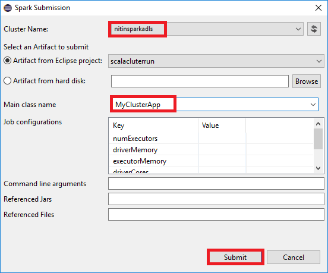
1. The **Spark Submission** tab should start displaying the progress. You can stop the application by selecting the red button in the **Spark Submission** window. You can also view the logs for this specific application run by selecting the globe icon (denoted by the blue box in the image).
      
   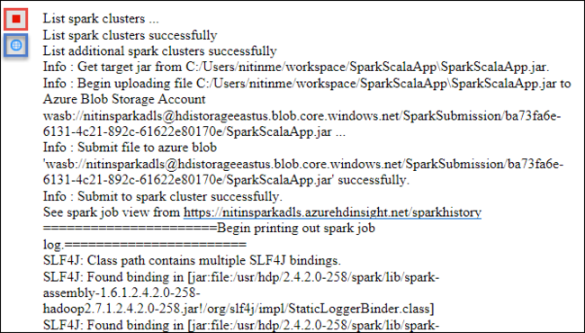

## Access and manage HDInsight Spark clusters by using HDInsight Tools in Azure Toolkit for Eclipse
You can perform various operations by using HDInsight Tools, including accessing the job output.

### Access the job view
1. In Azure Explorer, expand **HDInsight**, expand the Spark cluster name, and then select **Jobs**. 

   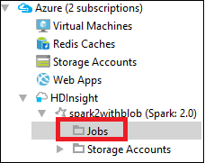

1. Select the **Jobs** node. If Java version is lower than **1.8**, HDInsight Tools automatically reminder you install the **E(fx)clipse** plug-in. Select **OK** to continue, and then follow the wizard to install it from the Eclipse Marketplace and restart Eclipse. 

   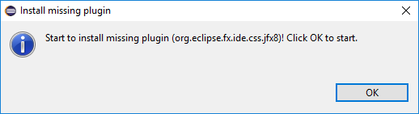

1. Open the Job View from the **Jobs** node. In the right pane, the **Spark Job View** tab displays all the applications that were run on the cluster. Select the name of the application for which you want to see more details.

   

   You can then take any of these actions:

   * Hover on the job graph. It displays basic info about the running job. Select the job graph, and you can see the stages and info that every job generates.

     

   * Select the **Log** tab to view frequently used logs, including **Driver Stderr**, **Driver Stdout**, and **Directory Info**.

     

   * Open the Spark history UI and the YARN UI (at the application level) by selecting the hyperlinks at the top of the window.

### Access the storage container for the cluster
1. In Azure Explorer, expand the **HDInsight** root node to see a list of HDInsight Spark clusters that are available.
1. Expand the cluster name to see the storage account and the default storage container for the cluster.
   
   
1. Select the storage container name associated with the cluster. In the right pane, double-click the **HVACOut** folder. Open one of the **part-** files to see the output of the application.

### Access the Spark history server
1. In Azure Explorer, right-click your Spark cluster name, and then select **Open Spark History UI**. When you're prompted, enter the admin credentials for the cluster. You specified these while provisioning the cluster.
1. In the Spark history server dashboard, you use the application name to look for the application that you just finished running. In the preceding code, you set the application name by using `val conf = new SparkConf().setAppName("MyClusterApp")`. So, your Spark application name was **MyClusterApp**.

### Start the Ambari portal
1. In Azure Explorer, right-click your Spark cluster name, and then select **Open Cluster Management Portal (Ambari)**. 
1. When you're prompted, enter the admin credentials for the cluster. You specified these while provisioning the cluster.

### Manage Azure subscriptions
By default, HDInsight Tool in Azure Toolkit for Eclipse lists the Spark clusters from all your Azure subscriptions. If necessary, you can specify the subscriptions for which you want to access the cluster. 

1. In Azure Explorer, right-click the **Azure** root node, and then select **Manage Subscriptions**. 
1. In the dialog box, clear the check boxes for the subscription that you don't want to access, and then select **Close**. You can also select **Sign Out** if you want to sign out of your Azure subscription.

## Run a Spark Scala application locally
You can use HDInsight Tools in Azure Toolkit for Eclipse to run Spark Scala applications locally on your workstation. Typically, these applications don't need access to cluster resources such as a storage container, and you can run and test them locally.

### Prerequisite
While you're running the local Spark Scala application on a Windows computer, you might get an exception as explained in [SPARK-2356](https://issues.apache.org/jira/browse/SPARK-2356). This exception occurs because **WinUtils.exe** is missing in Windows. 

To resolve this error, you need [download the executable](http://public-repo-1.hortonworks.com/hdp-win-alpha/winutils.exe) to a location like **C:\WinUtils\bin**, and then add the environment variable **HADOOP_HOME** and set the value of the variable to **C\WinUtils**.

### Run a local Spark Scala application
1. Start Eclipse and create a project. In the **New Project** dialog box, make the following choices, and then select **Next**.
   
   * In the left pane, select **HDInsight**.
   * In the right pane, select **Spark on HDInsight Local Run Sample (Scala)**.

   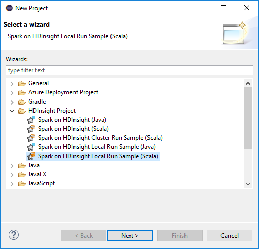
   
1. To provide the project details, follow steps 3 through 6 from the earlier section [Setup a Spark Scala project for an HDInsight Spark cluster](#set-up-a-spark-scala-project-for-an-hdinsight-spark-cluster).

1. The template adds a sample code (**LogQuery**) under the **src** folder that you can run locally on your computer.
   
   
   
1. Right-click the **LogQuery** application, point to **Run As**, and then select **1 Scala Application**. Output like this appears on the **Console** tab:
   
   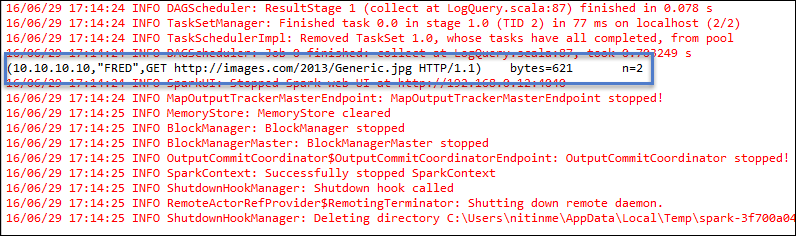

## Known problems
When link a cluster, I would suggest you to provide credential of storage.

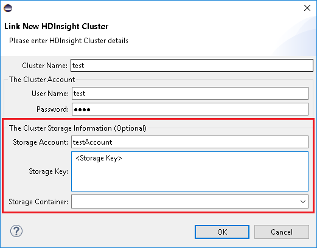

There are two modes to submit the jobs. If storage credential is provided, batch mode will be used to submit the job. Otherwise, interactive mode will be used. If the cluster is busy, you might get the error below.

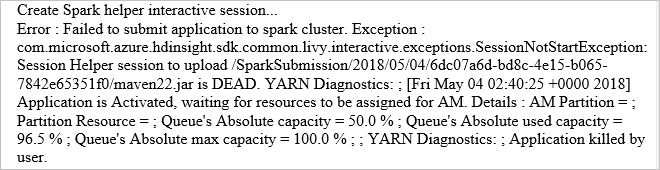

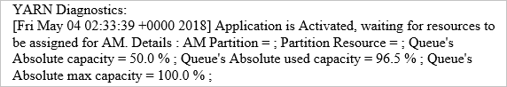

## Feedback
If you have any feedback, or if you encounter any other problems when using this tool, send us an email at hdivstool@microsoft.com.

## See also
* [Overview: Apache Spark on Azure HDInsight](apache-spark-overview.md)

### Scenarios
* [Spark with BI: Perform interactive data analysis using Spark in HDInsight with BI tools](apache-spark-use-bi-tools.md)
* [Spark with Machine Learning: Use Spark in HDInsight for analyzing building temperature using HVAC data](apache-spark-ipython-notebook-machine-learning.md)
* [Spark with Machine Learning: Use Spark in HDInsight to predict food inspection results](apache-spark-machine-learning-mllib-ipython.md)
* [Website log analysis using Spark in HDInsight](apache-spark-custom-library-website-log-analysis.md)

### Creating and running applications
* [Create a standalone application using Scala](apache-spark-create-standalone-application.md)
* [Run jobs remotely on a Spark cluster using Livy](apache-spark-livy-rest-interface.md)

### Tools and extensions
* [Use Azure Toolkit for IntelliJ to create and submit Spark Scala applications](apache-spark-intellij-tool-plugin.md)
* [Use Azure Toolkit for IntelliJ to debug Spark applications remotely through VPN](../hdinsight-apache-spark-intellij-tool-plugin-debug-jobs-remotely.md)
* [Use Azure Toolkit for IntelliJ to debug Spark applications remotely through SSH](../hdinsight-apache-spark-intellij-tool-debug-remotely-through-ssh.md)
* [Use HDInsight Tools for IntelliJ with Hortonworks Sandbox](../hadoop/hdinsight-tools-for-intellij-with-hortonworks-sandbox.md)
* [Use Zeppelin notebooks with a Spark cluster on HDInsight](apache-spark-zeppelin-notebook.md)
* [Kernels available for Jupyter notebook in Spark cluster for HDInsight](apache-spark-jupyter-notebook-kernels.md)
* [Use external packages with Jupyter notebooks](apache-spark-jupyter-notebook-use-external-packages.md)
* [Install Jupyter on your computer and connect to an HDInsight Spark cluster](apache-spark-jupyter-notebook-install-locally.md)

### Managing resources
* [Manage resources for the Apache Spark cluster in Azure HDInsight](apache-spark-resource-manager.md)
* [Track and debug jobs running on an Apache Spark cluster in HDInsight](apache-spark-job-debugging.md)

