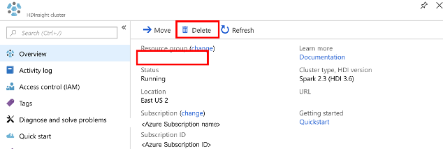

# Tutorial: Process tweets using Azure Event Hubs and Spark in HDInsight

In this tutorial, you Learn how to create an Apache Spark streaming application to send tweets to an Azure event hub, and create another application to read the tweets from the event hub. For a detailed explanation of Spark streaming, see [Apache Spark streaming overview](http://spark.apache.org/docs/latest/streaming-programming-guide.html#overview). HDInsight brings the same streaming features to a Spark cluster on Azure.

In this tutorial, you learn how to:
> [!div class="checklist"]
> * Send messages to Azure Event Hub
> * Read messages from Azure Event Hub

If you don't have an Azure subscription, [create a free account](https://azure.microsoft.com/free/) before you begin.

## Prerequisites

* **Complete the article [Tutorial: Load data and run queries on an Apache Spark cluster in Azure HDInsight](./apache-spark-load-data-run-query.md)**.

## Create a Twitter application

To receive a stream of tweets, you create an application in Twitter. Follow the instructions create a Twitter application and write down the values that you need to complete this tutorial.

1. Browse to [Twitter Application Management](https://apps.twitter.com/).
2. Select **Create New App**.
3. Provide the following values:

    - Name: provide the application name. The value used for this tutorial is **HDISparkStreamApp0423**. This name has to be a unique name.
    - Description: provide a short description of the application. The value used for this tutorial is **A simple HDInsight Spark streaming application**.
    - Website: provide the application's website. It doesn't have to be a valid website.  The value used for this tutorial is **http://www.contoso.com**.
    - Callback URL: you can leave it blank.

4. Select **Yes, I have read and agree to the Twitter Developer Agreement**, and then Select **Create your Twitter application**.
5. Select the **Keys and Access Tokens** tab.
6. Select **Create my access token** at the end of the page.
7. Write down the following values from the page.  You need these values later in the tutorial:

    - **Consumer Key (API Key)**	
    - **Consumer Secret (API Secret)**	
    - **Access Token**
    - **Access Token Secret**	

## Create an Azure Event Hub

You use this event hub to store tweets.

1. Sign in to the [Azure Portal](https://ms.portal.azure.com).
2. Select **Create a resource** at the top left of the screen.
3. Select **Internet of Things**, then select **Event Hubs**.

    
4. Enter the following values for the new event hub namespace:

    - **Name**: Enter a name for the event hub.  The value used for this tutorial is **myeventhubns20180403**.
    - **Price tier**: Select **Standard**.
    - **Resource group**: You have the option to create a new or select the resource group for the Spark cluster. 
    - **Location**: Select the same **Location** as your Apache Spark cluster in HDInsight to reduce latency and costs.

    
5. Select **Create** to create the namespace.

6. Open the event hub namespace using the following instructions:

    1. From the portal, select **All services**.
    2. In the filter box, enter **event hubs**.
    3. Double-click the namespace you created.
    4. Select **+ Event Hub**.

6. In the Event Hubs namespace list, Select the newly created namespace.      
5. Select **Event Hubs**, and then Select **+ Event Hub** to create a new Event Hub.
  

6. Enter the following values:

    - Name: Give a name for your Event Hub.
    - Partition count: 10
    - Message retention: 1. 
   
    

7. Select **Create**.
8. Select **Shared access policies** for the namespace (Note it is not the event hub shared access policies), and then Select **RootManageSharedAccessKey**.
    
     

9. Save the values of **Primary key** and **Connection string-primary key** to use later in the tutorial.

     


## Send tweets to the event hub

You need to create a Jupyter notebook, and name it **SendTweetsToEventHub**. 

1. Run the following code to add the external Maven libraries:

    ```
    %%configure
    {"conf":{"spark.jars.packages":"com.microsoft.azure:azure-eventhubs-spark_2.11:2.2.0,org.twitter4j:twitter4j-core:4.0.6"}}
    ```

2. Run the following code to send tweets to your event hub:

    ```
    import java.util._
    import scala.collection.JavaConverters._
    import java.util.concurrent._
    
    import org.apache.spark._
    import org.apache.spark.streaming._
    import org.apache.spark.eventhubs.ConnectionStringBuilder

    // Event hub configurations
    // Replace values below with yours        
    val eventHubName = "<Event hub name>"
    val eventHubNSConnStr = "<Event hub namespace connection string>"
    val connStr = ConnectionStringBuilder(eventHubNSConnStr).setEventHubName(eventHubName).build 
    
    import com.microsoft.azure.eventhubs._
    val pool = Executors.newFixedThreadPool(1)
    val eventHubClient = EventHubClient.create(connStr.toString(), pool)
    
    def sendEvent(message: String) = {
          val messageData = EventData.create(message.getBytes("UTF-8"))
          eventHubClient.get().send(messageData)
          println("Sent event: " + message + "\n")
    }
    
    import twitter4j._
    import twitter4j.TwitterFactory
    import twitter4j.Twitter
    import twitter4j.conf.ConfigurationBuilder

    // Twitter application configurations
    // Replace values below with yours   
    val twitterConsumerKey = "<CONSUMER KEY>"
    val twitterConsumerSecret = "<CONSUMER SECRET>"
    val twitterOauthAccessToken = "<ACCESS TOKEN>"
    val twitterOauthTokenSecret = "<TOKEN SECRET>"
    
    val cb = new ConfigurationBuilder()
    cb.setDebugEnabled(true).setOAuthConsumerKey(twitterConsumerKey).setOAuthConsumerSecret(twitterConsumerSecret).setOAuthAccessToken(twitterOauthAccessToken).setOAuthAccessTokenSecret(twitterOauthTokenSecret)
    
    val twitterFactory = new TwitterFactory(cb.build())
    val twitter = twitterFactory.getInstance()

    // Getting tweets with keyword "Azure" and sending them to the Event Hub in realtime!
    
    val query = new Query(" #Azure ")
    query.setCount(100)
    query.lang("en")
    var finished = false
    while (!finished) {
      val result = twitter.search(query)
      val statuses = result.getTweets()
      var lowestStatusId = Long.MaxValue
      for (status <- statuses.asScala) {
        if(!status.isRetweet()){
          sendEvent(status.getText())
        }
        lowestStatusId = Math.min(status.getId(), lowestStatusId)
        Thread.sleep(2000)
      }
      query.setMaxId(lowestStatusId - 1)
    }
    
    // Closing connection to the Event Hub
    eventHubClient.get().close()
    ```

3. Open the event hub in the Azure portal.  On **Overview**, you shall see some charts showing the messages sent to the event hub.

## Read tweets from the event hub

You need to create another Jupyter notebook, and name it **ReadTweetsFromEventHub**. 

1. Run the following code to add an external Maven library:

    ```
    %%configure -f
    {"conf":{"spark.jars.packages":"com.microsoft.azure:azure-eventhubs-spark_2.11:2.2.0"}}
    ```
2. Run the following code to read tweets from your event hub:

    ```
    import org.apache.spark.eventhubs._
    // Event hub configurations
    // Replace values below with yours        
    val eventHubName = "<Event hub name>"
    val eventHubNSConnStr = "<Event hub namespace connection string>"
    val connStr = ConnectionStringBuilder(eventHubNSConnStr).setEventHubName(eventHubName).build 
    
    val customEventhubParameters = EventHubsConf(connStr).setMaxEventsPerTrigger(5)
    val incomingStream = spark.readStream.format("eventhubs").options(customEventhubParameters.toMap).load()
    //incomingStream.printSchema    
    
    import org.apache.spark.sql.types._
    import org.apache.spark.sql.functions._
    
    // Event Hub message format is JSON and contains "body" field
    // Body is binary, so you cast it to string to see the actual content of the message
    val messages = incomingStream.withColumn("Offset", $"offset".cast(LongType)).withColumn("Time (readable)", $"enqueuedTime".cast(TimestampType)).withColumn("Timestamp", $"enqueuedTime".cast(LongType)).withColumn("Body", $"body".cast(StringType)).select("Offset", "Time (readable)", "Timestamp", "Body")
    
    messages.printSchema
    
    messages.writeStream.outputMode("append").format("console").option("truncate", false).start().awaitTermination()
    ```

## Clean up resources

With HDInsight, your data is stored in Azure Storage or Azure Data Lake Store, so you can safely delete a cluster when it is not in use. You are also charged for an HDInsight cluster, even when it is not in use. Since the charges for the cluster are many times more than the charges for storage, it makes economic sense to delete clusters when they are not in use. If you plan to work on the next tutorial immediately, you might want to keep the cluster.

Open the cluster in the Azure portal, and select **Delete**.



You can also select the resource group name to open the resource group page, and then select **Delete resource group**. By deleting the resource group, you delete both the HDInsight Spark cluster, and the default storage account.

## Next steps

In this tutorial, you learned how to:

* Read message from an event hub.
Advance to the next article to see you can create a machine learning application. 

> [!div class="nextstepaction"]
> [Create a machine learning application](./apache-spark-ipython-notebook-machine-learning.md)


