# Use extended Spark History Server to monitor Spark applications

This article provides guidance on how to use extended Spark History Server to monitor completed and running Spark applications. The extension currently includes data tab and graph tab. In data tab, users can check the input and output data of the Spark job. In graph tab, users can check the data flow and replay the job graph.

## Open the Spark History Server

Spark History Server is the web UI for completed and running Spark applications. 

### To open the Spark History Server Web UI from Azure portal

1. From the [Azure portal](https://portal.azure.com/), open the Spark cluster. For more information, see [List and show clusters](../hdinsight-administer-use-portal-linux.md#list-and-show-clusters).
2. From **Quick Links**, click **Cluster Dashboard**, and then click **Spark History Server**. When prompted, enter the admin credentials for the Spark cluster. 

    

### To open the Spark History Server Web UI by URL
Open the Spark History Server by browsing to the following URL, replace <ClusterName> with Spark cluster name of customer.

   ```
   https://<ClusterName>.azurehdinsight.net/sparkhistory
   ```

The Spark History Server web UI looks like:


## Open the Data tab from Spark History Server
Select job ID then click **Data** on the tool menu to get the data view.

+ Check the **Inputs**, **Outputs**, and **Table Operations** by selecting the tabs separately.

    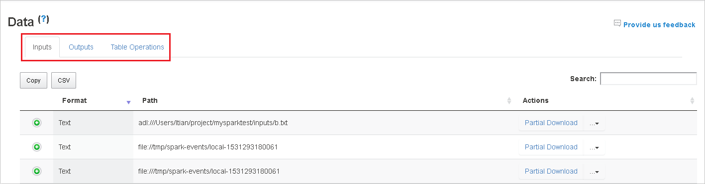

+ Copy all rows by clicking button **Copy**.

    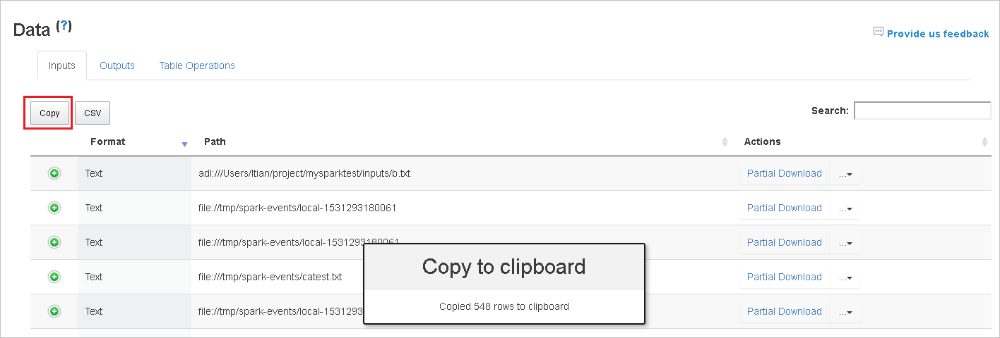

+ Save all data as CSV file by clicking button **CSV**.

    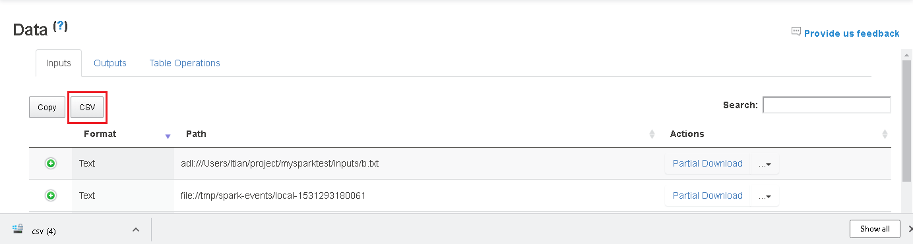

+ Search by entering keywords in field **Search**, the search result will display immediately.

    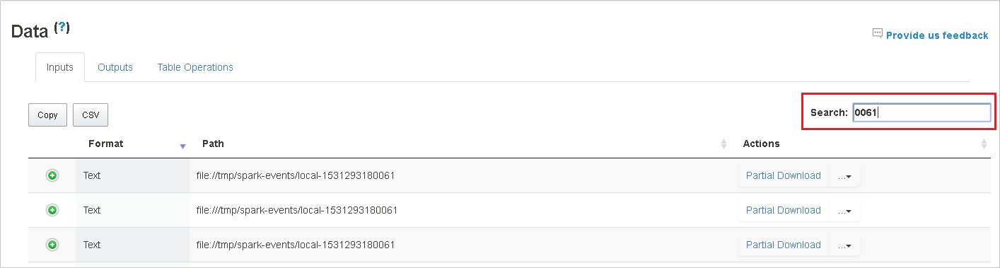

+ Click the column header to sort table, click the plus sign to expand a row to show more details, or click the minus sign to collapse a row.

    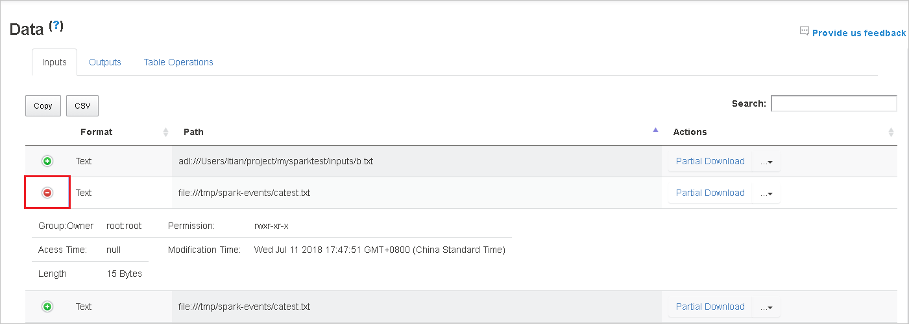

+ Download single file by clicking button **Partial Download** that place at the right, then the selected file will be downloaded to local, if the file does not exist any more, it will open a new tab to show the error messages.

    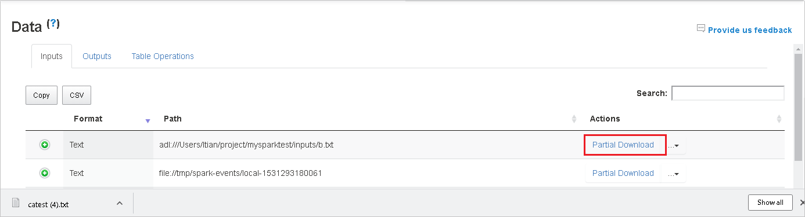

+ Copy full path or relative path by selecting the **Copy Full Path**, **Copy Relative Path** that expands from download menu. For azure data lake storage files, **Open in Azure Storage Explorer** will launch Azure Storage Explorer, and locate to the folder when sign-in.

    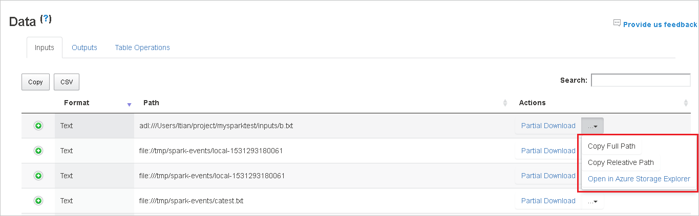

+ Click the number below the table to navigate pages when too many rows to display in one page. 

    

+ Hover on the question mark beside Data to show the tooltip, and click it to get more information.

    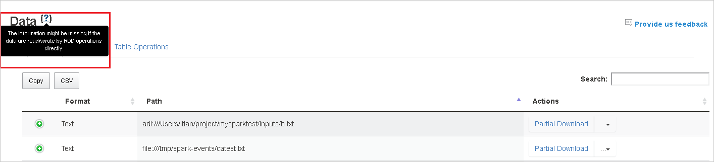

+ Send feedback with issues by clicking **Provide us feedback**.

    


## Open the Graph tab from Spark History Server
Select job ID then click **Graph** on the tool menu to get the job graph view.

+ Check overview of your job by the generated job graph. 

+ By default, it will show all jobs, and it could be filtered by **Job ID**.

    

+ By default, **Progress** is selected, user could check the data flow by selecting **Read/Written** in the dropdown list of **Display**.

    

    The graph node display in color that shows the heatmap.

    

+ Play back the job by clicking the **Playback** button and stop anytime by clicking the stop button. The task display in color to show different status when playback:

    + Green for succeeded: The job has completed successfully.
    + Orange for retried: Instances of tasks that failed but do not affect the final result of the job. These tasks had duplicate or retry instances that may succeed later.
    + Red for failed: The task has failed.
    + Blue for running: The task is running.
    + White for skipped or waiting: The task is waiting to run, or the stage has skipped.

    
 
    
 
    > Note: Playback for each job is allowed. When a job does not have any stage or haven’t complete, playback is not supported.


+ Mouse scrolls to zoom in/out the job graph, or click **Zoom to fit** to make it fit to screen.
 
    

+ Hover on graph node to see the tooltip when there are failed tasks, and click on stage to open stage page.

    

+ The job graph node will display the following information of each stage:
    + ID.
    + Name or description.
    + Total task number.
    + Data read: the sum of input size and shuffle read size.
    + Data write: the sum of output size and shuffle write size.
    + Execution time: the time between start time of the first attempt and completion time of the last attempt.
    + Row count: the sum of input records, output records, shuffle read records and shuffle write records.
    + Progress.

    >Note: By default, the job graph node will display information from last attempt of each stage (except for stage execution time), but during playback graph node will show information of each attempt.

    >Note: For data size of read and write we use 1MB = 1000 KB = 1000 * 1000 Bytes.

+ Send feedback with issues by clicking **Provide us feedback**.

    


## FAQ

### 1. Revert to community version

To revert to community version, do the following steps:

1. Open cluster in Ambari. Click **Spark2** in left panel.
2. Click **Configs** tab.
3. Expand the group **Custom spark2-defaults**.
4. Click **Add Property**, add **spark.ui.enhancement.enabled=false**, save.
5. The property sets to **false** now.
6. Click **Save** to save the configuration.

    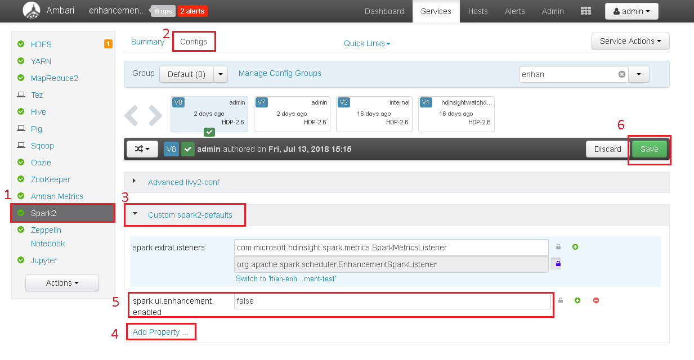

7. Click **Spark2** in left panel, under **Summary** tab, click **Spark2 History Server**.

     

8. Restart history server by clicking **Restart** of **Spark2 History Server**.

      

9. Refresh the Spark history server web UI, it will be reverted to community version.

### 2. Upload history server log

If you run into history server error, use the script below which will upload the history server log to the blob storage specified by us(who is working on investigating the history server issues). 

**upload_shs_log.sh**:

   ```bash
    #!/usr/bin/env bash

    # Copyright (C) Microsoft Corporation. All rights reserved.

    # Arguments:
    # $1 Blob link with SAS token query string 
    # $2 Log path
    # $3 Max log file size in MB

    if [ "$#" -ne 3 ]; then
        >&2 echo "$@"
        >&2 echo "Please provide Azure Storage link, log path and max log size."
        exit 1
    fi

    blob_link=$1
    log_path=$2
    max_log_size=$3

    if ! [ -e "$log_path" ]; then
        >&2 echo "There is no log path $log_path on this node"
        exit 0 
    fi

    tail -c $((1024*1024*max_log_size)) \
        "$log_path" > /tmp/shs_log_for_trouble_shooting.log

    curl -T /tmp/shs_log_for_trouble_shooting.log \
        -X PUT \
        -H "x-ms-date: $(date -u)" \
        -H "x-ms-blob-type: BlockBlob" \
        "$blob_link"
   ```

**Usage**: 

`"upload_shs_log.sh ${blob_link}" ${log_path} ${log_max_MB_size}`

**Example**:

`"upload_shs_log.sh https://${account_name}.blob.core.windows.net/${blob_container}/${log_file}{SAS_query_string}" /var/log/spark2/spark-spark-org.apache.spark.deploy.history.HistoryServer-1-{head_node_alias}-spark2.out 100`

For **head_node_alias**, it may be **hn0** or **hn1** for a cluster with two head nodes. Fill in the active head node alias.

For **log_file**, specify by customer.

For **SAS_query_string**, you can get it from ASE: 
1.	Right-click the container you want to use and choose **Get Shared Access Signature…**:
 
    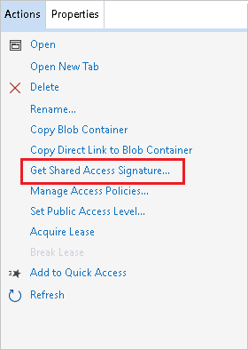

2.	Choose permissions with **Write** and adjust the **Start time** and **Expiry time**:

    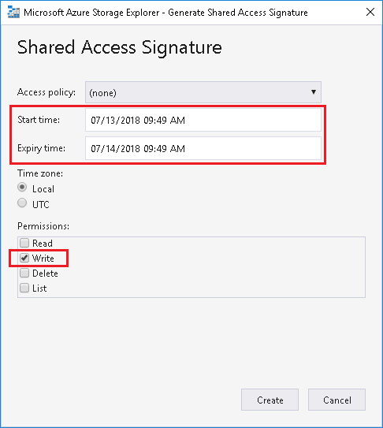

3.	Click **Copy** to copy the query string:

    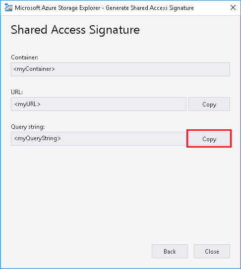

**To use the bash file from Azure portal**

1. Launch [Azure Portal](https://ms.portal.azure.com), and select your cluster.
2. Click **Script actions**, then **Submit new**. Complete the **Submit script action** form, then click **Create** button.
    
    + **Script type**, select **Custom**.
    + **Name**, specify a script name.
    + **Bash script URI**, upload the bash file to private cluster then copy URL here. Alternatively, use the URI provided.

   ```upload_shs_log
    https://hdinsighttoolingstorage.blob.core.windows.net/shsscriptactions/upload_shs_log.sh
   ```

    + Check on **Head**.
    + **Parameters**, set the parameters follow the bash usage.

    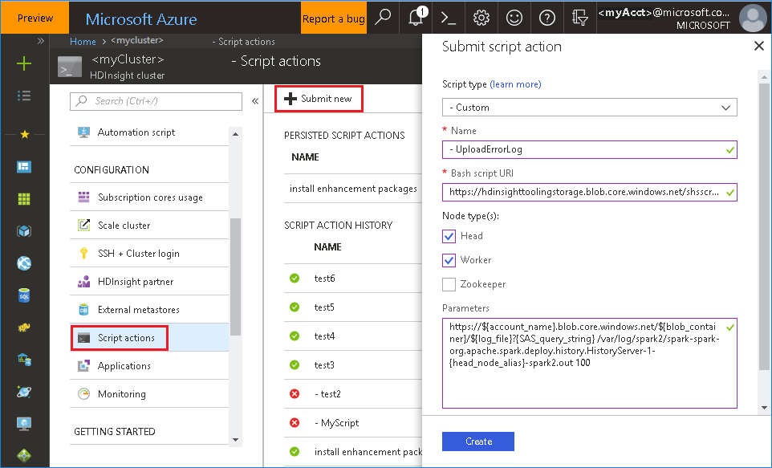


### 3. Upgrade jar file for hotfix scenario

If you want to upgrade with hotfix, use the script below which will upgrade spark-enhancement.jar*.

**upgrade_spark_enhancement.sh**:

   ```bash
    #!/usr/bin/env bash

    # Copyright (C) Microsoft Corporation. All rights reserved.

    # Arguments:
    # $1 Enhancement jar path

    if [ "$#" -ne 1 ]; then
        >&2 echo "Please provide the upgrade jar path."
        exit 1
    fi

    jar_path=$1
    jars_folder="/usr/hdp/current/spark2-client/jars"

    rm -f ${jars_folder}/spark-enhancement*
    wget -P ${jars_folder} "$jar_path" 
   ```

**Usage**: 

`upgrade_spark_enhancement.sh https://${jar_path}`

**Example**:

`upgrade_spark_enhancement.sh https://${account_name}.blob.core.windows.net/packages/jars/spark-enhancement-${version}.tgz` 

**To use the bash file from Azure portal**

1. Launch [Azure Portal](https://ms.portal.azure.com), and select your cluster.
2. Click **Script actions**, then **Submit new**. Complete the **Submit script action** form, then click **Create** button.
    
    + **Script type**, select **Custom**.
    + **Name**, specify a script name.
    + **Bash script URI**, upload the bash file to private cluster then copy URL here. Alternatively, use the URI provided.
    
   ```upgrade_spark_enhancement
    https://hdinsighttoolingstorage.blob.core.windows.net/shsscriptactions/upgrade_spark_enhancement.sh
   ```

    + Check on **Head** and **Worker**.
    + **Parameters**, set the parameters follow the bash usage.

    


## Known issue

1.	Currently, it only works for Spark 2.3 cluster.

2.	Input/output data using RDD will not show in data tab.


## Contact us

If you have any feedback, or if you encounter any other problems when using this tool, send an email at ([hdivstool@microsoft.com](mailto:hdivstool@microsoft.com)).