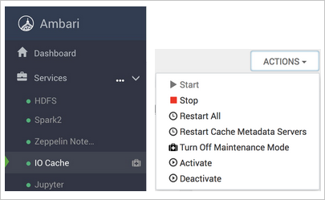
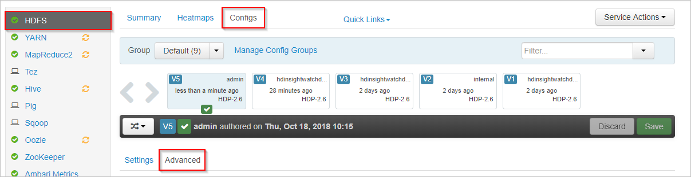
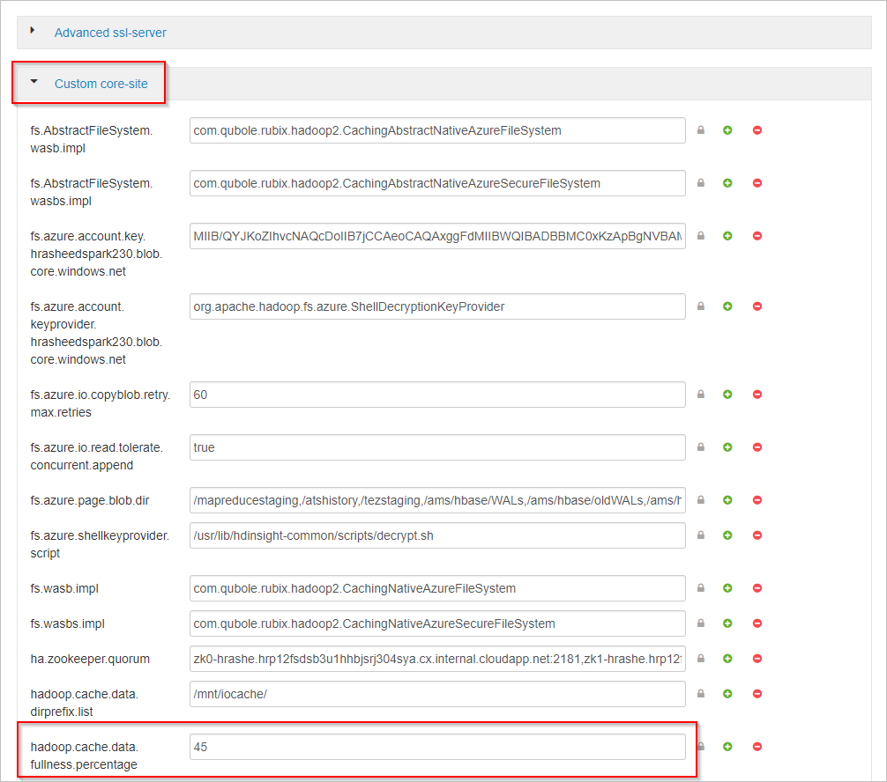
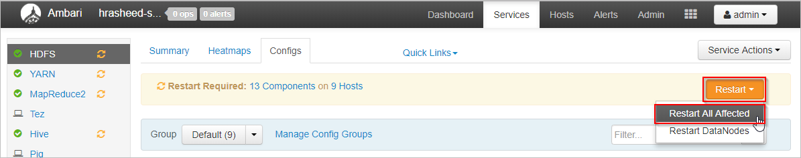

# Improve performance of Apache Spark workloads using Azure HDInsight IO Cache

IO Cache is a data caching service for Azure HDInsight that improves the performance of Apache Spark jobs. IO Cache also works with [Apache TEZ](https://tez.apache.org/) and [Apache Hive](https://hive.apache.org/) workloads, which can be run on [Apache Spark](https://spark.apache.org/) clusters. IO Cache uses an open-source caching component called RubiX. RubiX is a local disk cache for use with big data analytics engines that access data from cloud storage systems. RubiX is unique among caching systems, because it uses Solid-State Drives (SSDs) rather than reserve operating memory for caching purposes. The IO Cache service launches and manages RubiX Metadata Servers on each worker node of the cluster. It also configures all services of the cluster for transparent use of RubiX cache.

Most SSDs provide more than 1 GByte per second of bandwidth. This bandwidth, complemented by the operating system in-memory file cache, provides enough bandwidth to load big data compute processing engines, such as Apache Spark. The operating memory is left available for Apache Spark to process heavily memory-dependent tasks, such as shuffles. Having exclusive use of operating memory allows Apache Spark to achieve optimal resource usage.  

> [!Note]  
> IO Cache currently uses RubiX as a caching component, but this may change in future versions of the service. Please use IO Cache interfaces and don't take any dependencies directly on the RubiX implementation.
>IO Cache is only supported with Azure BLOB Storage at this time.

## Benefits of Azure HDInsight IO Cache

Using IO Cache provides a performance increase for jobs that read data from Azure Blob Storage.

You don't have to make any changes to your Spark jobs to see performance increases when using IO Cache. When IO Cache is disabled, this Spark code would read data remotely from Azure Blob Storage: `spark.read.load('wasbs:///myfolder/data.parquet').count()`. When IO Cache is activated, the same line of code causes a cached read through IO Cache. On following reads, the data is read locally from SSD. Worker nodes on HDInsight cluster are equipped with locally attached, dedicated SSD drives. HDInsight IO Cache uses these local SSDs for caching, which provides lowest level of latency and maximizes bandwidth.

## Getting started

Azure HDInsight IO Cache is deactivated by default in preview. IO Cache is available on Azure HDInsight 3.6+ Spark clusters, which run Apache Spark 2.3.  To activate IO Cache on HDInsight 4.0, do the following steps:

1. From a web browser, navigate to `https://CLUSTERNAME.azurehdinsight.net`, where `CLUSTERNAME` is the name of your cluster.

1. Select the **IO Cache** service on the left.

1. Select **Actions** (**Service Actions** in HDI 3.6) and **Activate**.

    

1. Confirm restart of all the affected services on the cluster.

> [!NOTE]  
> Even though the progress bar shows activated, IO Cache isn't actually enabled until you restart the other affected services.

## Troubleshooting
  
You may get disk space errors running Spark jobs after enabling IO Cache. These errors occur because Spark also uses local disk storage for storing data during shuffling operations. Spark may run out of SSD space once IO Cache is enabled and the space for Spark storage is reduced. The amount of space used by IO Cache defaults to half of the total SSD space. The disk space usage for IO Cache is configurable in Ambari. If you get disk space errors, reduce the amount of SSD space used for IO Cache and restart the service. To change the space set for IO Cache, do the following steps:

1. In Apache Ambari, select the **HDFS** service on the left.

1. Select the **Configs** and **Advanced** tabs.

    

1. Scroll down and expand the **Custom core-site** area.

1. Locate the property **hadoop.cache.data.fullness.percentage**.

1. Change the value in the box.

    

1. Select **Save** on the upper right.

1. Select **Restart** > **Restart All Affected**.

    

1. Select **Confirm Restart All**.

If that doesn't work, disable IO Cache.

## Next Steps

Read more about IO Cache, including performance benchmarks in this blog post: [Apache Spark jobs gain up to 9x speed up with HDInsight IO Cache](https://azure.microsoft.com/blog/apache-spark-speedup-with-hdinsight-io-cache/)
