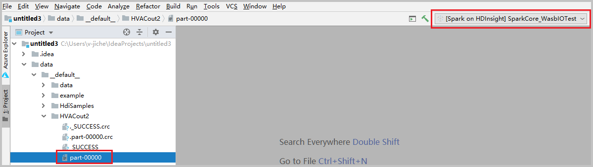
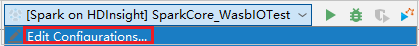
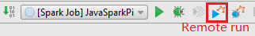
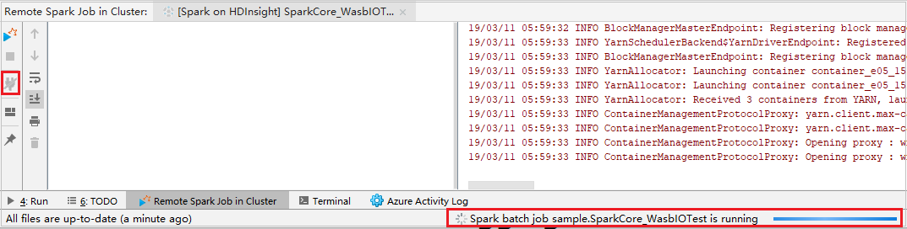

# Debug Spark applications locally or remotely on an HDInsight cluster with Azure Toolkit for IntelliJ through SSH

This article provides step-by-step guidance on how to use HDInsight Tools in Azure Toolkit for IntelliJ to debug applications remotely on an HDInsight cluster. To debug your project, you can also view the [Debug HDInsight Spark applications with Azure Toolkit for IntelliJ](https://channel9.msdn.com/Series/AzureDataLake/Debug-HDInsight-Spark-Applications-with-Azure-Toolkit-for-IntelliJ) video.

**Prerequisites**
* **HDInsight Tools in Azure Toolkit for IntelliJ**. This tool is part of Azure Toolkit for IntelliJ. For more information, see [Install Azure Toolkit for IntelliJ](https://docs.microsoft.com/azure/azure-toolkit-for-intellij-installation). And **Azure Toolkit for IntelliJ**. Use this toolkit to create Spark applications for an HDInsight cluster. For more information, follow the instructions in [Use Azure Toolkit for IntelliJ to create Spark applications for an HDInsight cluster](https://docs.microsoft.com/azure/hdinsight/hdinsight-apache-spark-intellij-tool-plugin).

* **HDInsight SSH service with username and password management**. For more information, see [Connect to HDInsight (Hadoop) by using SSH](https://docs.microsoft.com/azure/hdinsight/hdinsight-hadoop-linux-use-ssh-unix) and [Use SSH tunneling to access Ambari web UI, JobHistory, NameNode, Oozie, and other web UIs](https://docs.microsoft.com/azure/hdinsight/hdinsight-linux-ambari-ssh-tunnel). 
 
## Learn how to perform local run and debugging
### Scenario 1: Create a Spark Scala application 

1. Start IntelliJ IDEA, and then create a project. In the **New Project** dialog box, do the following:

   a. Select **HDInsight**. 

   b. Select a Java or Scala template based on your preference. Select between the following options:

      - **Spark on HDInsight (Scala)**

      - **Spark on HDInsight (Java)**

      - **Spark on HDInsight Sample (Scala)**

      This example uses a **Spark on HDInsight Sample (Scala)** template.

   c. In the **Build tool** list, select either of the following, according to your need:

      - **Maven**, for Scala project-creation wizard support

      -  **SBT**, for managing the dependencies and building for the Scala project 

      

   d. Select **Next**.     
 
1. In the next **New Project** window, do the following:

   

   a. Enter a project name and project location.

   b. In the **Project SDK** drop-down list, select **Java 1.8** for **Spark 2.x** cluster or select **Java 1.7** for **Spark 1.x** cluster.

   c. In the **Spark Version** drop-down list, the Scala project creation wizard integrates the correct version for Spark SDK and Scala SDK. If the spark cluster version is earlier than 2.0, select **Spark 1.x**. Otherwise, select **Spark 2.x.** This example uses **Spark 2.0.2 (Scala 2.11.8)**.

   d. Select **Finish**.

1. Select **src** > **main** > **scala** to open your code in the project. This example uses the **SparkCore_wasbloTest** script.

### Prerequisite for windows
While you're running the local Spark Scala application on a Windows computer, you might get an exception, as explained in [SPARK-2356](https://issues.apache.org/jira/browse/SPARK-2356). The exception occurs because WinUtils.exe is missing on Windows. 

To resolve this error, [download the executable](http://public-repo-1.hortonworks.com/hdp-win-alpha/winutils.exe) to a location such as **C:\WinUtils\bin**. Then, add the environment variable **HADOOP_HOME**, and set the value of the variable to **C:\WinUtils**.

### Scenario 2: Perform local run
1. Open the **SparkCore_wasbloTest** script, right-click the script editor, and then select the option **Run '[Spark Job]XXX'** to perform local run.
1. Once local run completed, you can see the output file save to your current project explorer **data** > **__default__**.

    
1. Our tools have set the default local run configuration automatically when you perform the local run and local debug. Open the configuration **[Spark Job] XXX** on the upper right corner, you can see the **[Spark Job]XXX** already created under **Azure HDInsight Spark Job**. Switch to **Locally Run** tab.

    
    - [Environment variables](#prerequisite-for-windows): If you already set the system environment variable **HADOOP_HOME** to **C:\WinUtils**, it can auto detect that no need to manually add.
    - [WinUtils.exe Location](#prerequisite-for-windows): If you have not set the system environment variable, you can find the location by clicking its button.
    - Just choose either of two options and, they are not needed on MacOS and Linux.
1. You can also set the configuration manually before performing local run and local debug. In the preceding screenshot, select the plus sign (**+**). Then select the **Azure HDInsight Spark Job** option. Enter information for **Name**, **Main class name** to save, then click the local run button.

### Scenario 3: Perform local debugging
1. Open the **SparkCore_wasbloTest** script, set breakpoints.
1. Right-click the script editor, and then select the option **Debug '[Spark Job]XXX'** to perform local debugging.   

## Learn how to perform remote run and debugging
### Scenario 1: Perform remote run

1. To access the **Edit Configurations** menu, select the icon in the upper-right corner. From this menu, you can create or edit the configurations for remote debugging.

    

1. In the **Run/Debug Configurations** dialog box, select the plus sign (**+**). Then select the **Azure HDInsight Spark Job** option.

   
1. Switch to **Remotely Run in Cluster** tab. Enter information for **Name**, **Spark cluster**, and **Main class name**. Then select **Advanced configuration**. Our tools support debug with **Executors**. The **numExectors**, the default value is 5. You'd better not set higher than 3.

   

1. In the **Spark Submission Advanced Configuration** dialog box, select **Enable Spark remote debug**. Enter the SSH username, and then enter a password or use a private key file. To save the configuration, select **OK**. If you want to perform remote debug, you need to set it. There is no need to set it if you just want to use remote run.

   

1. The configuration is now saved with the name you provided. To view the configuration details, select the configuration name. To make changes, select **Edit Configurations**. 

1. After you complete the configurations settings, you can run the project against the remote cluster or perform remote debugging.
   
   

1. Click the **Disconnect** button that the submission logs not appear in the left panel. However, it is still running on the backend.

   

### Scenario 2: Perform remote debugging
1. Set up breaking points, and then Click the **Remote debug** icon. The difference with remote submission is that SSH username/password need to be configured.

   

1. When the program execution reaches the breaking point, you see a **Driver** tab and two **Executor** tabs in the **Debugger** pane. Select the **Resume Program** icon to continue running the code, which then reaches the next breakpoint. You need to switch to the correct **Executor** tab to find the target executor to debug. You can view the execution logs on the corresponding **Console** tab.

   

### Scenario 3: Perform remote debugging and bug fixing
1. Set up two breaking points, and then select the **Debug** icon to start the remote debugging process.

1. The code stops at the first breaking point, and the parameter and variable information are shown in the **Variables** pane. 

1. Select the **Resume Program** icon to continue. The code stops at the second point. The exception is caught as expected.

    

1. Select the **Resume Program** icon again. The **HDInsight Spark Submission** window displays a "job run failed" error.

    

1. To dynamically update the variable value by using the IntelliJ debugging capability, select **Debug** again. The **Variables** pane appears again. 

1. Right-click the target on the **Debug** tab, and then select **Set Value**. Next, enter a new value for the variable. Then select **Enter** to save the value. 

    

1. Select the **Resume Program** icon to continue to run the program. This time, no exception is caught. You can see that the project runs successfully without any exceptions.

   

## Next steps
* [Overview: Apache Spark on Azure HDInsight](apache-spark-overview.md)

### Demo
* Create Scala project (video): [Create Spark Scala Applications](https://channel9.msdn.com/Series/AzureDataLake/Create-Spark-Applications-with-the-Azure-Toolkit-for-IntelliJ)
* Remote debug (video): [Use Azure Toolkit for IntelliJ to debug Spark applications remotely on an HDInsight cluster](https://channel9.msdn.com/Series/AzureDataLake/Debug-HDInsight-Spark-Applications-with-Azure-Toolkit-for-IntelliJ)

### Scenarios
* [Spark with BI: Perform interactive data analysis by using Spark in HDInsight with BI tools](apache-spark-use-bi-tools.md)
* [Spark with Machine Learning: Use Spark in HDInsight to analyze building temperature using HVAC data](apache-spark-ipython-notebook-machine-learning.md)
* [Spark with Machine Learning: Use Spark in HDInsight to predict food inspection results](apache-spark-machine-learning-mllib-ipython.md)
* [Website log analysis using Spark in HDInsight](../hdinsight-apache-spark-custom-library-website-log-analysis.md)

### Create and run applications
* [Create a standalone application using Scala](../hdinsight-apache-spark-create-standalone-application.md)
* [Run jobs remotely on a Spark cluster using Livy](apache-spark-livy-rest-interface.md)

### Tools and extensions
* [Use Azure Toolkit for IntelliJ to create Spark applications for an HDInsight cluster](apache-spark-intellij-tool-plugin.md)
* [Use Azure Toolkit for IntelliJ to debug Spark applications remotely through VPN](apache-spark-intellij-tool-plugin-debug-jobs-remotely.md)
* [Use HDInsight Tools for IntelliJ with Hortonworks Sandbox](../hadoop/hdinsight-tools-for-intellij-with-hortonworks-sandbox.md)
* [Use HDInsight Tools in Azure Toolkit for Eclipse to create Spark applications](../hdinsight-apache-spark-eclipse-tool-plugin.md)
* [Use Zeppelin notebooks with a Spark cluster on HDInsight](apache-spark-zeppelin-notebook.md)
* [Kernels available for Jupyter notebook in the Spark cluster for HDInsight](apache-spark-jupyter-notebook-kernels.md)
* [Use external packages with Jupyter notebooks](apache-spark-jupyter-notebook-use-external-packages.md)
* [Install Jupyter on your computer and connect to an HDInsight Spark cluster](apache-spark-jupyter-notebook-install-locally.md)

### Manage resources
* [Manage resources for the Apache Spark cluster in Azure HDInsight](apache-spark-resource-manager.md)
* [Track and debug jobs running on an Apache Spark cluster in HDInsight](apache-spark-job-debugging.md)
