# Debug Apache Spark applications on an HDInsight cluster with Azure Toolkit for IntelliJ through SSH

This article provides step-by-step guidance on how to use HDInsight Tools in [Azure Toolkit for IntelliJ](https://docs.microsoft.com/azure/developer/java/toolkit-for-intellij) to debug applications remotely on an HDInsight cluster. To debug your project, you can also view the [Debug HDInsight Spark applications with Azure Toolkit for IntelliJ](https://channel9.msdn.com/Series/AzureDataLake/Debug-HDInsight-Spark-Applications-with-Azure-Toolkit-for-IntelliJ) video.

## Prerequisites

* An Apache Spark cluster on HDInsight. See [Create an Apache Spark cluster](../spark/apache-spark-jupyter-spark-sql-use-portal.md).

* For Windows users: While you're running the local Spark Scala application on a Windows computer, you might get an exception, as explained in [SPARK-2356](https://issues.apache.org/jira/browse/SPARK-2356). The exception occurs because WinUtils.exe is missing on Windows.

    To resolve this error, download [Winutils.exe](https://github.com/steveloughran/winutils) to a location such as **C:\WinUtils\bin**. Then, add the environment variable **HADOOP_HOME**, and set the value of the variable to **C:\WinUtils**.

* [IntelliJ IDEA](https://www.jetbrains.com/idea/download/#section=windows) (The Community edition is free.).

* [Azure Toolkit for IntelliJ](https://docs.microsoft.com/azure/developer/java/toolkit-for-intellij/installation).

* [Scala plugin for IntelliJ](../spark/apache-spark-intellij-tool-plugin.md#install-scala-plugin-for-intellij-idea).

* An SSH client. For more information, see [Connect to HDInsight (Apache Hadoop) using SSH](../hdinsight-hadoop-linux-use-ssh-unix.md).

## Create a Spark Scala application

1. Start IntelliJ IDEA, and select **Create New Project** to open the **New Project** window.

1. Select **Apache Spark/HDInsight** from the left pane.

1. Select **Spark Project with Samples (Scala)** from the main window.

1. From the **Build tool** drop-down list, select one of the following:

    * **Maven** for Scala project-creation wizard support.
    * **SBT** for managing the dependencies and building for the Scala project.

     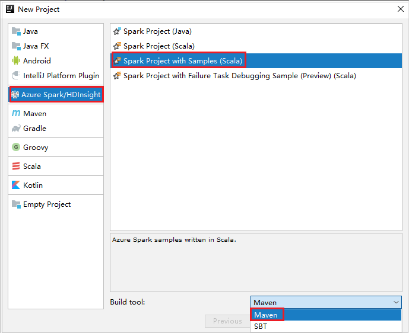

1. Select **Next**.

1. In the next **New Project** window, provide the following information:

    |Property |Description |
    |---|---|
    |Project name|Enter a name. This walk through uses `myApp`.|
    |Project location|Enter the desired location to save your project.|
    |Project SDK|If blank, select **New...** and navigate to your JDK.|
    |Spark Version|The creation wizard integrates the proper version for Spark SDK and Scala SDK. If the Spark cluster version is earlier than 2.0, select **Spark 1.x**. Otherwise, select **Spark 2.x.**. This example uses **Spark 2.3.0 (Scala 2.11.8)**.|

   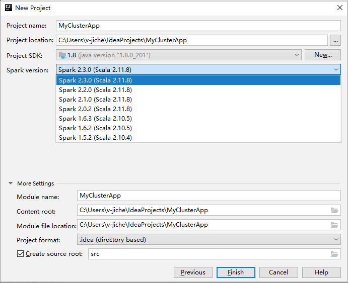

1. Select **Finish**. It may take a few minutes before the project becomes available. Watch the bottom right-hand corner for progress.

1. Expand your project, and navigate to **src** > **main** > **scala** > **sample**. Double-click **SparkCore_WasbIOTest**.

## Perform local run

1. From the **SparkCore_WasbIOTest** script, right-click the script editor, and then select the option **Run 'SparkCore_WasbIOTest'** to perform local run.

1. Once local run completed, you can see the output file save to your current project explorer **data** > **__default__**.

    

1. Our tools have set the default local run configuration automatically when you perform the local run and local debug. Open the configuration **[Spark on HDInsight] XXX** on the upper right corner, you can see the **[Spark on HDInsight]XXX** already created under **Apache Spark on HDInsight**. Switch to **Locally Run** tab.

    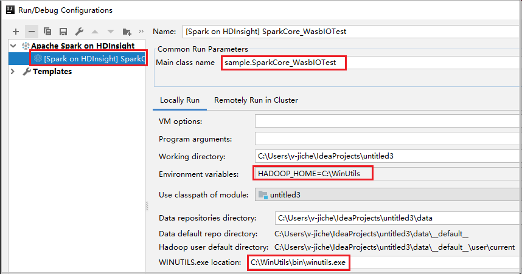

    - [Environment variables](#prerequisites): If you already set the system environment variable **HADOOP_HOME** to **C:\WinUtils**, it can auto detect that no need to manually add.
    - [WinUtils.exe Location](#prerequisites): If you have not set the system environment variable, you can find the location by clicking its button.
    - Just choose either of two options and, they are not needed on MacOS and Linux.

1. You can also set the configuration manually before performing local run and local debug. In the preceding screenshot, select the plus sign (**+**). Then select the **Apache Spark on HDInsight** option. Enter information for **Name**, **Main class name** to save, then click the local run button.

## Perform local debugging

1. Open the **SparkCore_wasbloTest** script, set breakpoints.

1. Right-click the script editor, and then select the option **Debug '[Spark on HDInsight]XXX'** to perform local debugging.

## Perform remote run

1. Navigate to **Run** > **Edit Configurations...**. From this menu, you can create or edit the configurations for remote debugging.

1. In the **Run/Debug Configurations** dialog box, select the plus sign (**+**). Then select the **Apache Spark on HDInsight** option.

   

1. Switch to **Remotely Run in Cluster** tab. Enter information for **Name**, **Spark cluster**, and **Main class name**. Then Click **Advanced configuration (Remote Debugging)**. Our tools support debug with **Executors**. The **numExectors**, the default value is 5. You'd better not set higher than 3.

   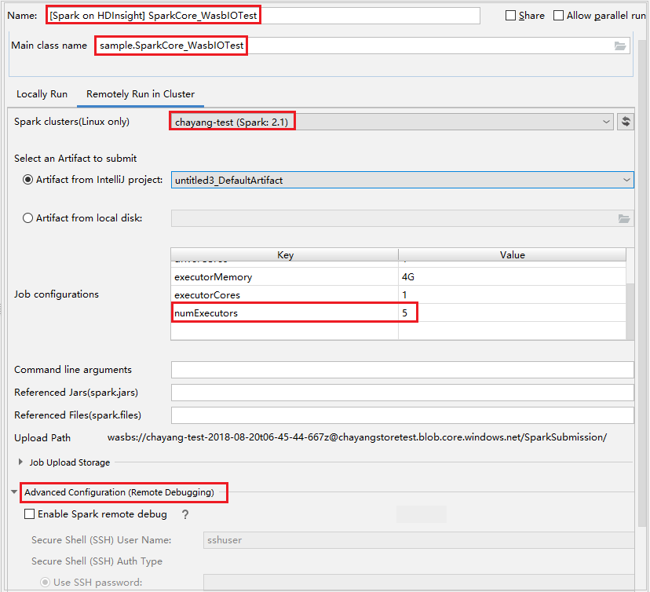

1. In the **Advanced Configuration (Remote Debugging)** part, select **Enable Spark remote debug**. Enter the SSH username, and then enter a password or use a private key file. If you want to perform remote debug, you need to set it. There is no need to set it if you just want to use remote run.

   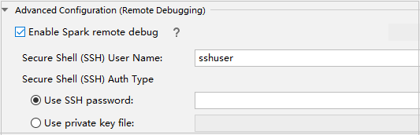

1. The configuration is now saved with the name you provided. To view the configuration details, select the configuration name. To make changes, select **Edit Configurations**.

1. After you complete the configurations settings, you can run the project against the remote cluster or perform remote debugging.

   

1. Click the **Disconnect** button that the submission logs not appear in the left panel. However, it is still running on the backend.

   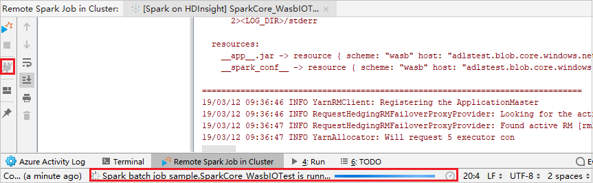

## Perform remote debugging

1. Set up breaking points, and then Click the **Remote debug** icon. The difference with remote submission is that SSH username/password need to be configured.

   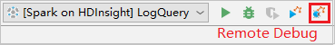

1. When the program execution reaches the breaking point, you see a **Driver** tab and two **Executor** tabs in the **Debugger** pane. Select the **Resume Program** icon to continue running the code, which then reaches the next breakpoint. You need to switch to the correct **Executor** tab to find the target executor to debug. You can view the execution logs on the corresponding **Console** tab.

   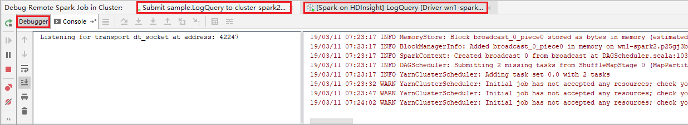

### Perform remote debugging and bug fixing

1. Set up two breaking points, and then select the **Debug** icon to start the remote debugging process.

1. The code stops at the first breaking point, and the parameter and variable information are shown in the **Variables** pane.

1. Select the **Resume Program** icon to continue. The code stops at the second point. The exception is caught as expected.

   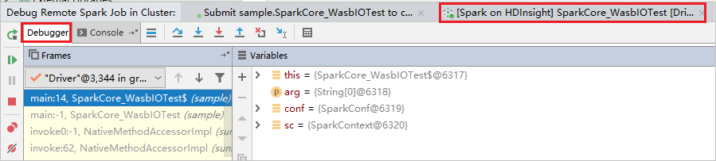

1. Select the **Resume Program** icon again. The **HDInsight Spark Submission** window displays a "job run failed" error.

   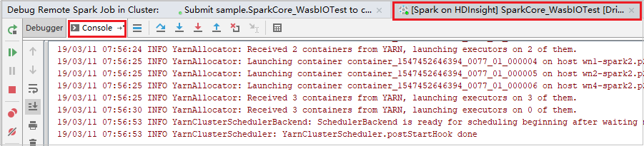

1. To dynamically update the variable value by using the IntelliJ debugging capability, select **Debug** again. The **Variables** pane appears again.

1. Right-click the target on the **Debug** tab, and then select **Set Value**. Next, enter a new value for the variable. Then select **Enter** to save the value.

   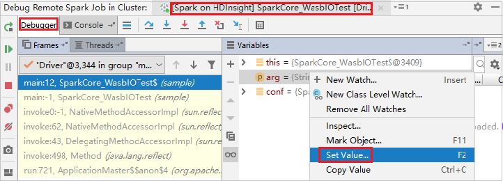

1. Select the **Resume Program** icon to continue to run the program. This time, no exception is caught. You can see that the project runs successfully without any exceptions.

   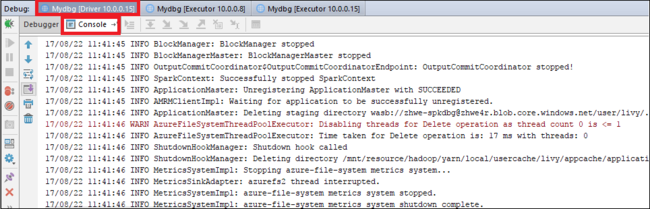

## Next steps

* [Overview: Apache Spark on Azure HDInsight](apache-spark-overview.md)

### Demo

* Create Scala project (video): [Create Apache Spark Scala Applications](https://channel9.msdn.com/Series/AzureDataLake/Create-Spark-Applications-with-the-Azure-Toolkit-for-IntelliJ)
* Remote debug (video): [Use Azure Toolkit for IntelliJ to debug Apache Spark applications remotely on an HDInsight cluster](https://channel9.msdn.com/Series/AzureDataLake/Debug-HDInsight-Spark-Applications-with-Azure-Toolkit-for-IntelliJ)

### Scenarios

* [Apache Spark with BI: Perform interactive data analysis by using Spark in HDInsight with BI tools](apache-spark-use-bi-tools.md)
* [Apache Spark with Machine Learning: Use Spark in HDInsight to analyze building temperature using HVAC data](apache-spark-ipython-notebook-machine-learning.md)
* [Apache Spark with Machine Learning: Use Spark in HDInsight to predict food inspection results](apache-spark-machine-learning-mllib-ipython.md)
* [Website log analysis using Apache Spark in HDInsight](../hdinsight-apache-spark-custom-library-website-log-analysis.md)

### Create and run applications

* [Create a standalone application using Scala](../hdinsight-apache-spark-create-standalone-application.md)
* [Run jobs remotely on an Apache Spark cluster using Apache Livy](apache-spark-livy-rest-interface.md)

### Tools and extensions

* [Use Azure Toolkit for IntelliJ to create Apache Spark applications for an HDInsight cluster](apache-spark-intellij-tool-plugin.md)
* [Use Azure Toolkit for IntelliJ to debug Apache Spark applications remotely through VPN](apache-spark-intellij-tool-plugin-debug-jobs-remotely.md)
* [Use HDInsight Tools in Azure Toolkit for Eclipse to create Apache Spark applications](../hdinsight-apache-spark-eclipse-tool-plugin.md)
* [Use Apache Zeppelin notebooks with an Apache Spark cluster on HDInsight](apache-spark-zeppelin-notebook.md)
* [Kernels available for Jupyter notebook in the Apache Spark cluster for HDInsight](apache-spark-jupyter-notebook-kernels.md)
* [Use external packages with Jupyter notebooks](apache-spark-jupyter-notebook-use-external-packages.md)
* [Install Jupyter on your computer and connect to an HDInsight Spark cluster](apache-spark-jupyter-notebook-install-locally.md)

### Manage resources

* [Manage resources for the Apache Spark cluster in Azure HDInsight](apache-spark-resource-manager.md)
* [Track and debug jobs running on an Apache Spark cluster in HDInsight](apache-spark-job-debugging.md)
