# Run Spark Failure Debug Apache Spark applications locally with Azure Toolkit for IntelliJ through SSH

This article provides step-by-step guidance on how to use HDInsight Tools in [Azure Toolkit for IntelliJ](https://docs.microsoft.com/java/azure/intellij/azure-toolkit-for-intellij?view=azure-java-stable) to run **Spark Failure Debug** applications locally. 

**Prerequisites**
* **HDInsight Tools in Azure Toolkit for IntelliJ**. This tool is part of Azure Toolkit for IntelliJ. For more information, see [Install Azure Toolkit for IntelliJ](https://docs.microsoft.com/azure/azure-toolkit-for-intellij-installation). And **Azure Toolkit for IntelliJ**. Use this toolkit to create Apache Spark applications for an HDInsight cluster. For more information, follow the instructions in [Use Azure Toolkit for IntelliJ to create Apache Spark applications for an HDInsight cluster](https://docs.microsoft.com/azure/hdinsight/hdinsight-apache-spark-intellij-tool-plugin).

* **HDInsight SSH service with username and password management**. For more information, see [Connect to HDInsight (Apache Hadoop) by using SSH](https://docs.microsoft.com/azure/hdinsight/hdinsight-hadoop-linux-use-ssh-unix) and [Use SSH tunneling to access Ambari web UI, JobHistory, NameNode, Apache Oozie, and other web UIs](https://docs.microsoft.com/azure/hdinsight/hdinsight-linux-ambari-ssh-tunnel). 

## Learn how to perform local run and local debug
### Scenario 1: Create a Spark Scala application 

1. Start IntelliJ IDEA, and then create a project. In the **New Project** dialog box, do the following:

   a. Select **Azure Spark/HDInsight**. 

   b. Select a Java or Scala template based on your preference. Select between the following options:

   - **Spark Project (Java)**

   - **Spark Project (Scala)**

   - **Spark Project with Samples (Scala)**

   - **Spark Project with Failure Task Debugging Samples (Preview) (Scala)**

     This example uses a **Spark Project with Failure Task Debugging Samples (Preview) (Scala)** template.

     

   c. Select **Next**.     
 
2. In the next **New Project** window, do the following:

   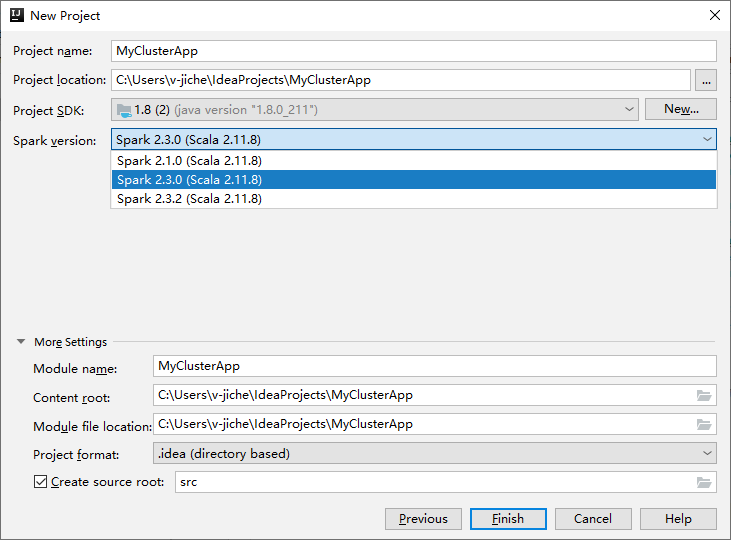

   a. Enter a project name and project location.

   b. In the **Project SDK** drop-down list, select **Java 1.8** for **Spark 2.x** cluster or select **Java 1.7** for **Spark 1.x** cluster.

   c. In the **Spark Version** drop-down list, the Scala project creation wizard integrates the correct version for Spark SDK and Scala SDK. If the spark cluster version is earlier than 2.0, select **Spark 1.x**. Otherwise, select **Spark 2.x.** This example uses **Spark 2.0.2 (Scala 2.11.8)**.

   d. Select **Finish**.

3. Select **src** > **main** > **scala** to open your code in the project. This example uses the **AgeMean_Div()** script.

### Prerequisite for Windows
While you're running the local Spark Scala application on a Windows computer, you might get an exception, as explained in [SPARK-2356](https://issues.apache.org/jira/browse/SPARK-2356). The exception occurs because WinUtils.exe is missing on Windows. 

To resolve this error, [download the executable](https://public-repo-1.hortonworks.com/hdp-win-alpha/winutils.exe) to a location such as **C:\WinUtils\bin**. Then, add the environment variable **HADOOP_HOME**, and set the value of the variable to **C:\WinUtils**.

### Scenario 2: Perform local run
1. Open the **AgeMean_Div()** script, right-click the script editor, choose **Default Spark application Type** as **Spark on Cosmos**, and then select the option **Run '[Spark Job]XXX'** to perform local run.
2. Once local run completed, you can see the output file save to your current project explorer **data** > **__default__**.

    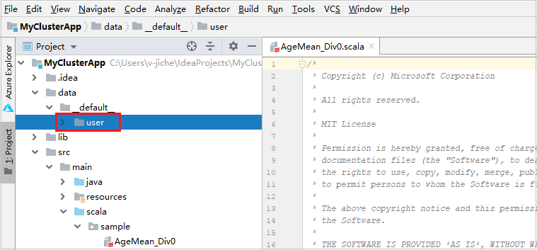
3. Our tools have set the default local run configuration automatically when you perform the local run and local debug. Open the configuration **[Spark on Cosmos] XXX** on the upper right corner, you can see the **[Spark on Cosmos]XXX** already created under **Apache Spark on Cosmos**. Switch to **Locally Run** tab.

    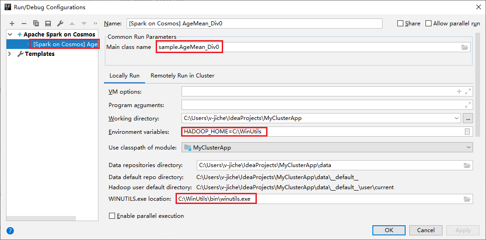
    - [Environment variables](#prerequisite-for-windows): If you already set the system environment variable **HADOOP_HOME** to **C:\WinUtils**, it can auto detect that no need to manually add.
    - [WinUtils.exe Location](#prerequisite-for-windows): If you have not set the system environment variable, you can find the location by clicking its button.
    - Just choose either of two options and, they are not needed on MacOS and Linux.
4. You can also set the configuration manually before performing local run and local debug. In the preceding screenshot, select the plus sign (**+**). Then select the **Apache Spark on Cosmos** option. Enter information for **Name**, **Main class name** to save, then click the local run button.

### Scenario 3: Perform local debug
1. Open the **AgeMean_Div()** script, set breakpoints.
1. Right-click the script editor, and then select the option **Debug '[Spark on Cosmos]XXX'** to perform local debugging.   

## Learn how to perform local run Spark Failure debug application
### Scenario 1: Perform remote run

1. Open **Azure Explorer**. expand **Apache Spark on Cosmos**, right click account node, and then select **Provision Spark Cluster** to provision a cluster.
   
      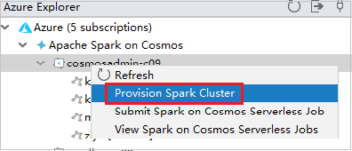 

2. To access the **Edit Configurations** menu, select the icon in the upper-right corner. From this menu, you can create or edit the configurations for remote debugging.

   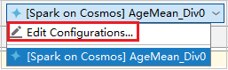 

3. In the **Run/Debug Configurations** dialog box, select the plus sign (**+**). Then select the **Apache Spark on Cosmos** option.

   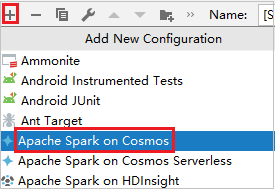
4. Switch to **Remotely Run in Cluster** tab. Enter information for **Name**, **Spark cluster**, and **Main class name**. Then Click **Advanced configuration (Remote Debugging)**. Our tools support debug with **Executors**. The **numExectors**, the default value is 5, and you'd better not set higher than 3. To reduce the run time, you can add **spark.yarn.maxAppAttempts** into **job Configurations** and set the value to 1. Click **OK** button to save the configuration.

   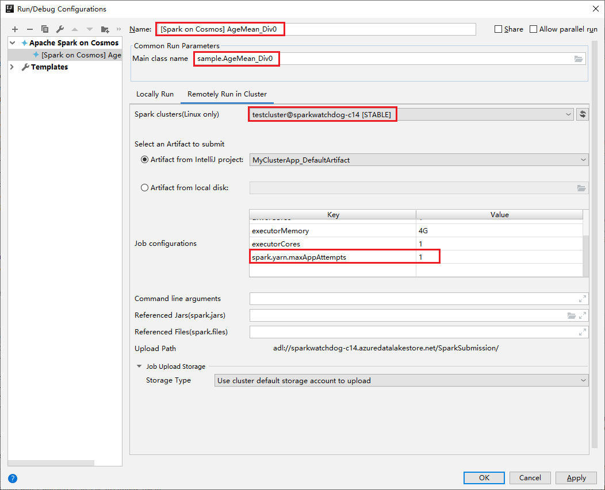

5. The configuration is now saved with the name you provided. To view the configuration details, select the configuration name. To make changes, select **Edit Configurations**. 

6. After you complete the configurations settings, you can run the project against the remote cluster.
   
   

7. If the submission is successful, **Spark Master UI** will be opened automatically. You can check the application ID from here.
   
   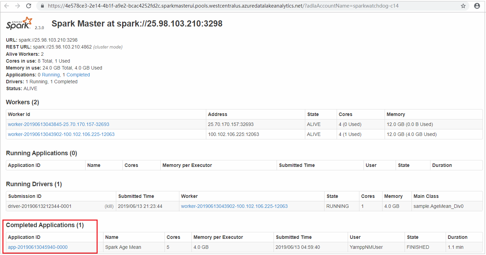

### Scenario 2: Download spark failure file

**Microsoft Azure Storage Explorer** can help you quickly find the  spark failure file and download it. You can download **Microsoft Azure Storage Explorer** from [Download Microsoft Azure Storage Explorer](https://azure.microsoft.com/en-us/features/storage-explorer/).

1.  Start **Microsoft Azure Storage Explorer**, then sign in with Microsoft account.

2. Find the subscription which the cluster belongs to. The cluster is what you submitted to before. Find the spark failure file from spak-events/spark-failures/application ID, click **Download**, then select the folder. The **activities** window will show the download progress.

   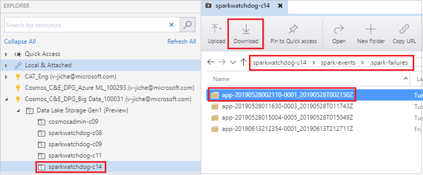

      

### Scenario 3: local run Spark Failure Debug configuration

1. In the **Run/Debug Configurations** dialog box, select the plus sign (**+**). Then select the **Spark Failure Debug** option.

   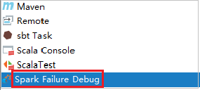

2. Click the icon, select the spark failure file, then click **OK** button to save the configuration.

   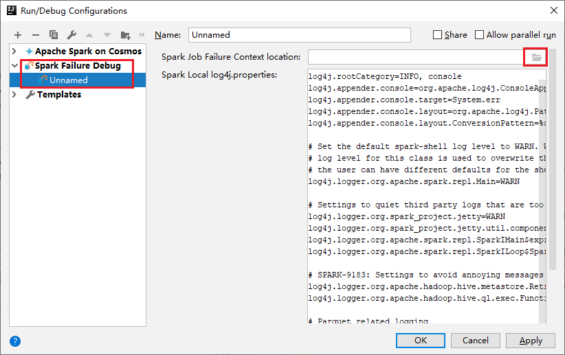

   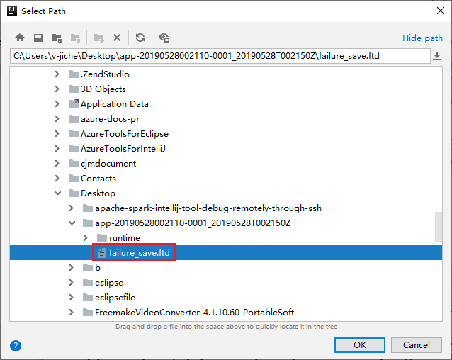   

3. The configuration is now saved with the name you provided. To view the configuration details, select the configuration name. To make changes, select **Edit Configurations**. 

4. After you complete the configurations settings, click the icon to local run the **Spark Failure Debug** configuraion.
   
   

5. The result will show in the output window.
   
   

 
## Next steps
* [Overview: Apache Spark on Azure HDInsight](apache-spark-overview.md)

### Demo
* Create Scala project (video): [Create Apache Spark Scala Applications](https://channel9.msdn.com/Series/AzureDataLake/Create-Spark-Applications-with-the-Azure-Toolkit-for-IntelliJ)
* Remote debug (video): [Use Azure Toolkit for IntelliJ to debug Apache Spark applications remotely on an HDInsight cluster](https://channel9.msdn.com/Series/AzureDataLake/Debug-HDInsight-Spark-Applications-with-Azure-Toolkit-for-IntelliJ)

### Scenarios
* [Apache Spark with BI: Perform interactive data analysis by using Spark in HDInsight with BI tools](apache-spark-use-bi-tools.md)
* [Apache Spark with Machine Learning: Use Spark in HDInsight to analyze building temperature using HVAC data](apache-spark-ipython-notebook-machine-learning.md)
* [Apache Spark with Machine Learning: Use Spark in HDInsight to predict food inspection results](apache-spark-machine-learning-mllib-ipython.md)
* [Website log analysis using Apache Spark in HDInsight](../hdinsight-apache-spark-custom-library-website-log-analysis.md)

### Create and run applications
* [Create a standalone application using Scala](../hdinsight-apache-spark-create-standalone-application.md)
* [Run jobs remotely on an Apache Spark cluster using Apache Livy](apache-spark-livy-rest-interface.md)

### Tools and extensions
* [Use Azure Toolkit for IntelliJ to create Apache Spark applications for an HDInsight cluster](apache-spark-intellij-tool-plugin.md)
* [Use Azure Toolkit for IntelliJ to debug Apache Spark applications remotely through VPN](apache-spark-intellij-tool-plugin-debug-jobs-remotely.md)
* [Use HDInsight Tools for IntelliJ with Hortonworks Sandbox](../hadoop/hdinsight-tools-for-intellij-with-hortonworks-sandbox.md)
* [Use HDInsight Tools in Azure Toolkit for Eclipse to create Apache Spark applications](../hdinsight-apache-spark-eclipse-tool-plugin.md)
* [Use Apache Zeppelin notebooks with an Apache Spark cluster on HDInsight](apache-spark-zeppelin-notebook.md)
* [Kernels available for Jupyter notebook in the Apache Spark cluster for HDInsight](apache-spark-jupyter-notebook-kernels.md)
* [Use external packages with Jupyter notebooks](apache-spark-jupyter-notebook-use-external-packages.md)
* [Install Jupyter on your computer and connect to an HDInsight Spark cluster](apache-spark-jupyter-notebook-install-locally.md)

### Manage resources
* [Manage resources for the Apache Spark cluster in Azure HDInsight](apache-spark-resource-manager.md)
* [Track and debug jobs running on an Apache Spark cluster in HDInsight](apache-spark-job-debugging.md)
