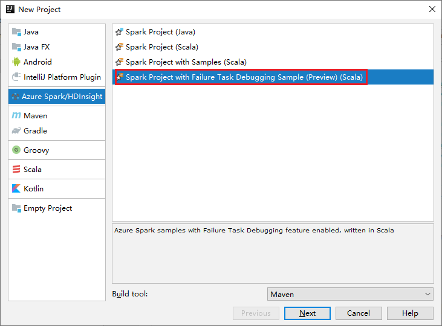
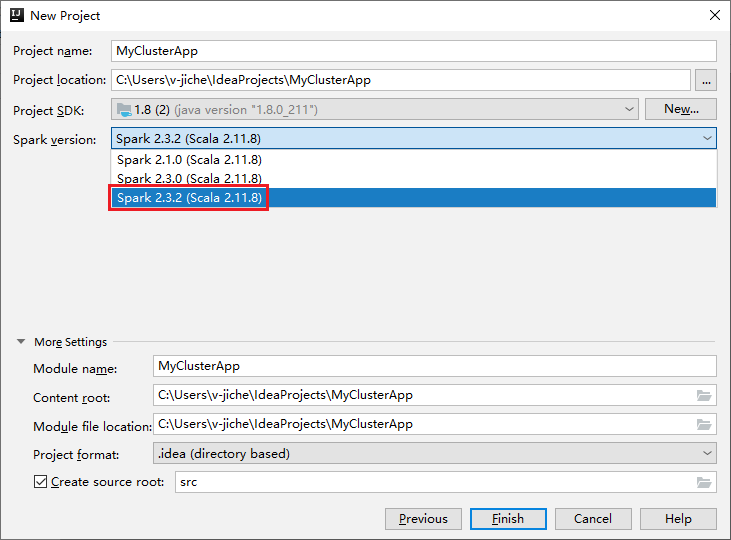
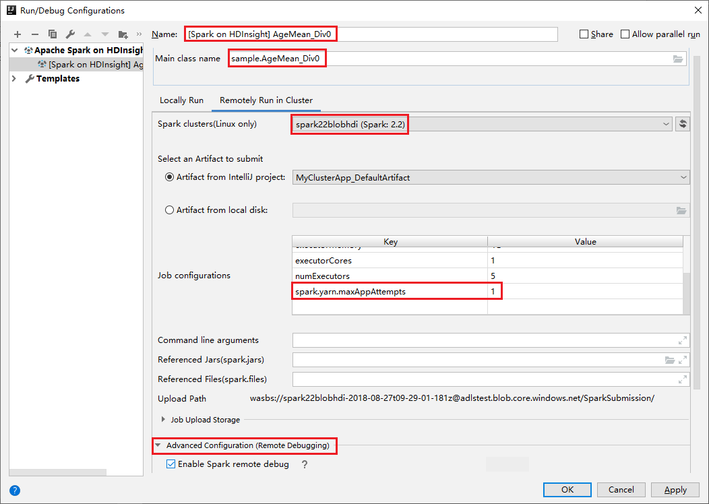
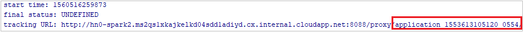
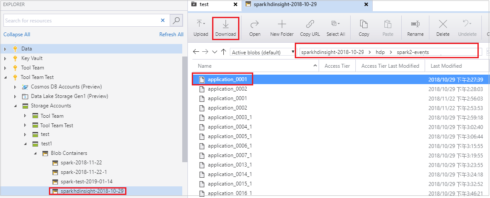
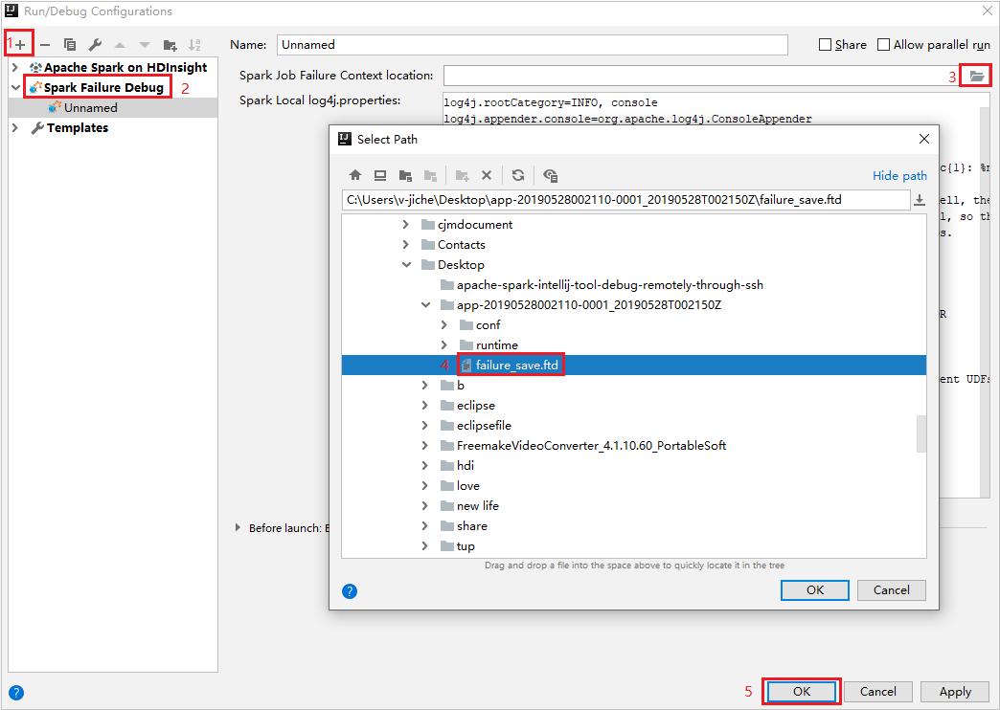
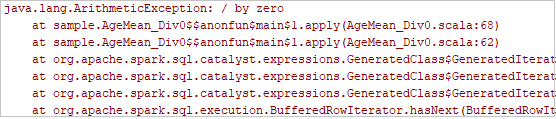

# Failure spark job debugging with Azure Toolkit for IntelliJ (preview)

This article provides step-by-step guidance on how to use HDInsight Tools in [Azure Toolkit for IntelliJ](https://docs.microsoft.com/azure/developer/java/toolkit-for-intellij) to run **Spark Failure Debug** applications.

## Prerequisites

* [Oracle Java Development kit](https://www.oracle.com/technetwork/java/javase/downloads/jdk8-downloads-2133151.html). This tutorial uses Java version 8.0.202.
  
* IntelliJ IDEA. This article uses [IntelliJ IDEA Community ver. 2019.1.3](https://www.jetbrains.com/idea/download/#section=windows).
  
* Azure Toolkit for IntelliJ. See [Installing the Azure Toolkit for IntelliJ](https://docs.microsoft.com/azure/developer/java/toolkit-for-intellij/installation).

* Connect to your HDInsight cluster. See [Connect to your HDInsight cluster](apache-spark-intellij-tool-plugin.md).

* Microsoft Azure Storage Explorer. See [Download Microsoft Azure Storage Explorer](https://azure.microsoft.com/features/storage-explorer/).

## Create a project with debugging template

Create a spark2.3.2 project to continue failure debug, take failure task​ debugging sample file in this document.

1. Open IntelliJ IDEA. Open the **New Project** window.

   a. Select **Azure Spark/HDInsight** from the left pane.

   b. Select **Spark Project with Failure Task Debugging Sample(Preview)(Scala)** from the main window.

     

   c. Select **Next**.

2. In the **New Project** window, do the following steps:

   

   a. Enter a project name and project location.

   b. In the **Project SDK** drop-down list, select **Java 1.8** for **Spark 2.3.2** cluster.

   c. In the **Spark Version** drop-down list, select **Spark 2.3.2(Scala 2.11.8)**.

   d. Select **Finish**.

3. Select **src** > **main** > **scala** to open your code in the project. This example uses the **AgeMean_Div()** script.

## Run a Spark ​Scala/Java application on an HDInsight cluster

Create a spark Scala​/Java application, then run the application on a Spark cluster by doing the following steps:

1. Click **Add Configuration** to open **Run/Debug Configurations** window.

   

2. In the **Run/Debug Configurations** dialog box, select the plus sign (**+**). Then select the **Apache Spark on HDInsight** option.

   

3. Switch to **Remotely Run in Cluster** tab. Enter information for **Name**, **Spark cluster**, and **Main class name**. Our tools support debug with **Executors**. The **numExectors**, the default value is 5, and you'd better not set higher than 3. To reduce the run time, you can add **spark.yarn.maxAppAttempts** into **job Configurations** and set the value to 1. Click **OK** button to save the configuration.

   

4. The configuration is now saved with the name you provided. To view the configuration details, select the configuration name. To make changes, select **Edit Configurations**.

5. After you complete the configurations settings, you can run the project against the remote cluster.

   

6. You can check the application ID from the output window.

   

## Download failed job profile

​If the job submission fails, you could download the failed job profile to the local machine for further debugging.

1. Open **Microsoft Azure Storage Explorer**, locate the HDInsight account of the cluster for the failed job, download the failed job resources from the corresponding location: **\hdp\spark2-events\\.spark-failures\\\<application ID>** to a local folder.​ The **activities** window will show the download progress.

   

   

## Configure local debugging environment and debug on failure​​

1. Open the original project​ or create a new project and associate it with the original source code​.​ Only spark2.3.2 version is supported for failure debugging currently.

1. In IntelliJ IDEA, create a **Spark Failure Debug** config file, select the FTD file from the previously downloaded failed job resources for the **Spark Job Failure Context location** field.

   

1. Click the local run button in the toolbar, the error will display in Run window.

   

   

1. Set break point as the log indicates, then click local debug button to do local debugging just as your normal Scala / Java projects in IntelliJ.

1. After debugging, ​if the project completes successfully​​​, ​you could resubmit the failed job to your spark on HDInsight cluster.

## Next steps

* [Overview: Debug Apache Spark applications](apache-spark-intellij-tool-debug-remotely-through-ssh.md)

### Demo

* Create Scala project (video): [Create Apache Spark Scala Applications](https://channel9.msdn.com/Series/AzureDataLake/Create-Spark-Applications-with-the-Azure-Toolkit-for-IntelliJ)
* Remote debug (video): [Use Azure Toolkit for IntelliJ to debug Apache Spark applications remotely on an HDInsight cluster](https://channel9.msdn.com/Series/AzureDataLake/Debug-HDInsight-Spark-Applications-with-Azure-Toolkit-for-IntelliJ)

### Scenarios

* [Apache Spark with BI: Do interactive data analysis by using Spark in HDInsight with BI tools](apache-spark-use-bi-tools.md)
* [Apache Spark with Machine Learning: Use Spark in HDInsight to analyze building temperature using HVAC data](apache-spark-ipython-notebook-machine-learning.md)
* [Apache Spark with Machine Learning: Use Spark in HDInsight to predict food inspection results](apache-spark-machine-learning-mllib-ipython.md)
* [Website log analysis using Apache Spark in HDInsight](../hdinsight-apache-spark-custom-library-website-log-analysis.md)

### Create and run applications

* [Create a standalone application using Scala](../hdinsight-apache-spark-create-standalone-application.md)
* [Run jobs remotely on an Apache Spark cluster using Apache Livy](apache-spark-livy-rest-interface.md)

### Tools and extensions

* [Use Azure Toolkit for IntelliJ to create Apache Spark applications for an HDInsight cluster](apache-spark-intellij-tool-plugin.md)
* [Use Azure Toolkit for IntelliJ to debug Apache Spark applications remotely through VPN](apache-spark-intellij-tool-plugin-debug-jobs-remotely.md)
* [Use HDInsight Tools for IntelliJ with Hortonworks Sandbox](../hadoop/hdinsight-tools-for-intellij-with-hortonworks-sandbox.md)
* [Use HDInsight Tools in Azure Toolkit for Eclipse to create Apache Spark applications](../hdinsight-apache-spark-eclipse-tool-plugin.md)
* [Use Apache Zeppelin notebooks with an Apache Spark cluster on HDInsight](apache-spark-zeppelin-notebook.md)
* [Kernels available for Jupyter notebook in the Apache Spark cluster for HDInsight](apache-spark-jupyter-notebook-kernels.md)
* [Use external packages with Jupyter notebooks](apache-spark-jupyter-notebook-use-external-packages.md)
* [Install Jupyter on your computer and connect to an HDInsight Spark cluster](apache-spark-jupyter-notebook-install-locally.md)

### Manage resources

* [Manage resources for the Apache Spark cluster in Azure HDInsight](apache-spark-resource-manager.md)
* [Track and debug jobs running on an Apache Spark cluster in HDInsight](apache-spark-job-debugging.md)
