# Tutorial: Use Azure Toolkit for IntelliJ to create Apache Spark applications for an HDInsight cluster

This tutorial demonstrates how to use the Azure Toolkit for IntelliJ plug-in to develop Apache Spark applications written in [Scala](https://www.scala-lang.org/), and then submit them to an HDInsight Spark cluster directly from the IntelliJ integrated development environment (IDE). You can use the plug-in in a few ways:

* Develop and submit a Scala Spark application on an HDInsight Spark cluster.
* Access your Azure HDInsight Spark cluster resources.
* Develop and run a Scala Spark application locally.

In this tutorial, you learn how to:
> [!div class="checklist"]
> * Use the Azure Toolkit for IntelliJ plug-in
> * Develop Apache Spark applications
> * Submit application to Azure HDInsight cluster

## Prerequisites

* An Apache Spark cluster on HDInsight. For instructions, see [Create Apache Spark clusters in Azure HDInsight](apache-spark-jupyter-spark-sql.md).

* [Oracle Java Development kit](https://www.oracle.com/technetwork/java/javase/downloads/jdk8-downloads-2133151.html).  This tutorial uses Java version 8.0.202.

* IntelliJ IDEA. This article uses [IntelliJ IDEA Community ver.  2018.3.4](https://www.jetbrains.com/idea/download/).

* Azure Toolkit for IntelliJ.  See [Installing the Azure Toolkit for IntelliJ](https://docs.microsoft.com/java/azure/intellij/azure-toolkit-for-intellij-installation?view=azure-java-stable).

* WINUTILS.EXE.  See [Problems running Hadoop on Windows](https://wiki.apache.org/hadoop/WindowsProblems).

## Install Scala plugin for IntelliJ IDEA

Perform the following steps to install the Scala plugin:

1. Open IntelliJ IDEA.

2. On the welcome screen, navigate to **Configure** > **Plugins** to open the **Plugins** window.
   
    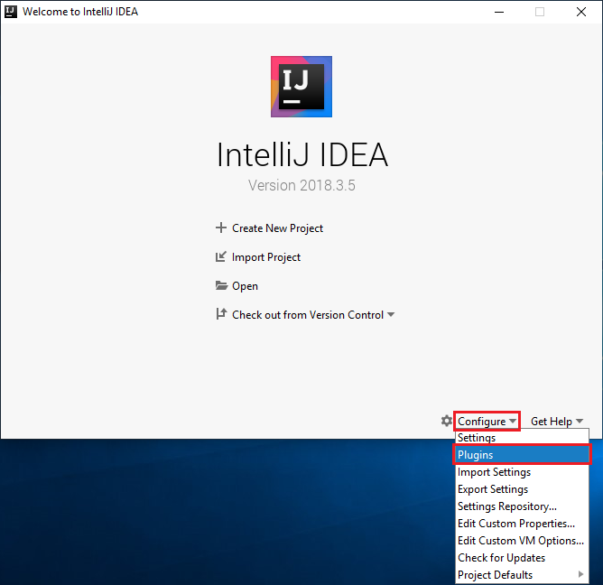

3. Select **Install** for the Scala plugin that is featured in the new window.  

    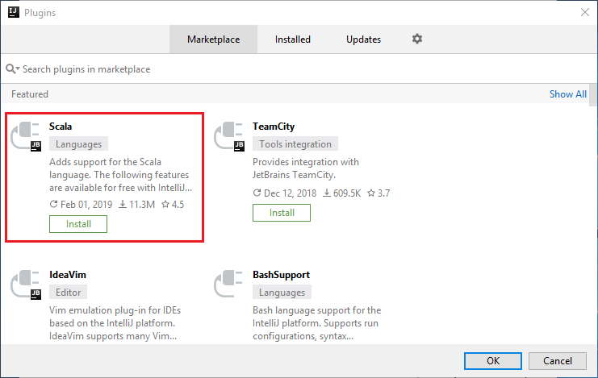

4. After the plugin installs successfully, you must restart the IDE.

## Create a Spark Scala application for an HDInsight Spark cluster

1. Start IntelliJ IDEA, and select **Create New Project** to open the **New Project** window.

2. Select **Azure Spark/HDInsight** from the left pane.

3. Select **Spark Project (Scala)** from the main window.

4. From the **Build tool** drop-down list, select one of the following:
   * **Maven** for Scala project-creation wizard support.
   * **SBT** for managing the dependencies and building for the Scala project.

     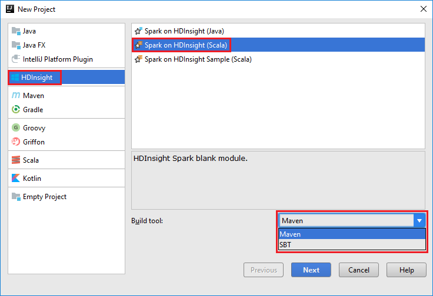

5. Select **Next**.

6. In the **New Project** window, provide the following information:  

    |  Property   | Description   |  
    | ----- | ----- |  
    |Project name| Enter a name.  This tutorial uses `myApp`.|  
    |Project&nbsp;location| Enter the desired location to save your project.|
    |Project SDK| This might be blank on your first use of IDEA.  Select **New...** and navigate to your JDK.|
    |Spark Version|The creation wizard integrates the proper version for Spark SDK and Scala SDK. If the Spark cluster version is earlier than 2.0, select **Spark 1.x**. Otherwise, select **Spark2.x**. This example uses **Spark 2.3.0 (Scala 2.11.8)**.|

    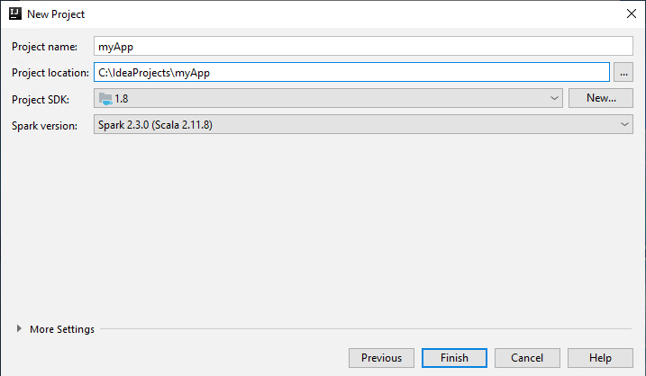

7. Select **Finish**.  It may take a few minutes before the project becomes available.

8. The Spark project automatically creates an artifact for you. To view the artifact, do the following:

   a. From the menu bar, navigate to **File** > **Project Structure...**.

   b. From the **Project Structure** window, select **Artifacts**.  

   c. Select **Cancel**  after viewing the artifact.

      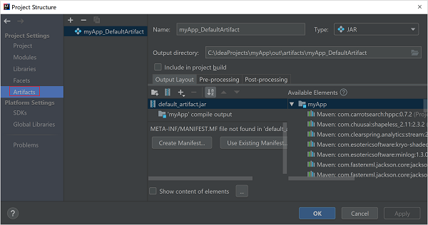

9. Add your application source code by doing the following:

    a. From Project, navigate to **myApp** > **src** > **main** > **scala**.  

    b. Right-click **scala**, and then navigate to **New** > **Scala Class**.

   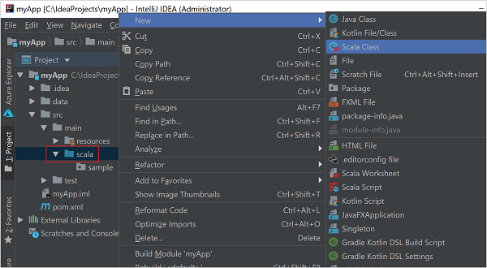

   c. In the **Create New Scala Class** dialog box, provide a name, select **Object** in the **Kind** drop-down list, and then select **OK**.

     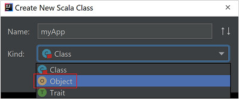

   d. The **myApp.scala** file then opens in the main view. Replace the default code with the code found below:  

        import org.apache.spark.SparkConf
        import org.apache.spark.SparkContext
    
        object myApp{
            def main (arg: Array[String]): Unit = {
            val conf = new SparkConf().setAppName("myApp")
            val sc = new SparkContext(conf)
    
            val rdd = sc.textFile("wasbs:///HdiSamples/HdiSamples/SensorSampleData/hvac/HVAC.csv")
    
            //find the rows that have only one digit in the seventh column in the CSV file
            val rdd1 =  rdd.filter(s => s.split(",")(6).length() == 1)
    
            rdd1.saveAsTextFile("wasbs:///HVACOut")
            }
    
        }

    The code reads the data from HVAC.csv (available on all HDInsight Spark clusters), retrieves the rows that have only one digit in the seventh column in the CSV file, and writes the output to `/HVACOut` under the default storage container for the cluster.

## Connect to your HDInsight cluster
User can either [sign in to Azure subscription](#sign-in-to-your-azure-subscription), or [link a HDInsight cluster](#link-a-cluster) using Ambari username/password or domain joined credential to connect to your HDInsight cluster.

### Sign in to your Azure subscription

1. From the menu bar, navigate to **View** > **Tool Windows** > **Azure Explorer**.
       
   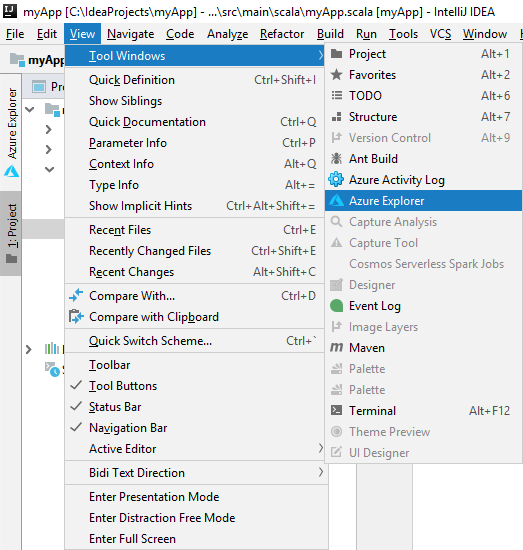

2. From Azure Explorer, right-click the **Azure** node, and then select **Sign In**.
   
   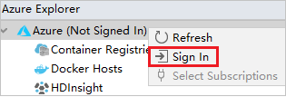

3. In the **Azure Sign In** dialog box, choose **Device Login**, and then select **Sign in**.

    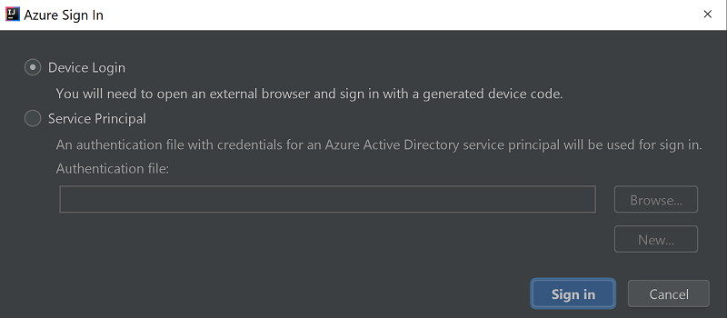

4. In the **Azure Device Login** dialog box, click **Copy&Open**.
   
   

5. In the browser interface, paste the code, and then click **Next**.
   
   

6. Enter your Azure credentials, and then close the browser.
   
   

7. After you're signed in, the **Select Subscriptions** dialog box lists all the Azure subscriptions that are associated with the credentials. Select your subscription and then select the **Select** button.

    

8. From **Azure Explorer**, expand **HDInsight** to view the HDInsight Spark clusters that are in your subscriptions.

    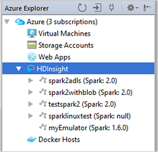

9.  To view the resources (for example, storage accounts) that are associated with the cluster, you can further expand a cluster-name node.

    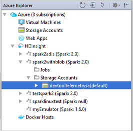

### Link a cluster

You can link an HDInsight cluster by using the Apache Ambari managed username. Similarly, for a domain-joined HDInsight cluster, you can link by using the domain and username, such as user1@contoso.com. Also you can link Livy Service cluster.

1. From the menu bar, navigate to **View** > **Tool Windows** > **Azure Explorer**.

2. From Azure Explorer, right-click the **HDInsight** node, and then select **Link A Cluster**.

   

3. The available options in the **Link A Cluster** window will vary depending on which value you select from the **Link Resource Type** drop-down list.  Enter your values and then select **OK**.

    * **HDInsight Cluster**  
  
        |Property |Value |
        |----|----|
        |Link Resource Type|Select **HDInsight Cluster** from the drop-down list.|
        |Cluster Name/URL| Enter cluster name.|
        |Authentication Type| Leave as **Basic Authentication**|
        |User Name| Enter cluster user name, default is admin.|
        |Password| Enter password for user name.|
    
        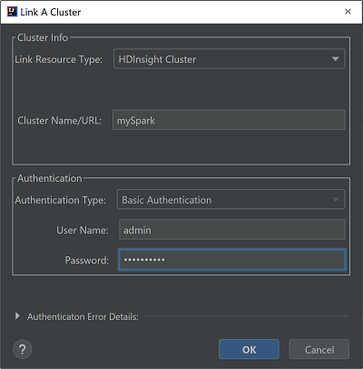

    * **Livy Service**  
  
        |Property |Value |
        |----|----|
        |Link Resource Type|Select **Livy Service** from the drop-down list.|
        |Livy Endpoint| Enter Livy Endpoint|
        |Cluster Name| Enter cluster name.|
        |Yarn Endpoint|Optional.|
        |Authentication Type| Leave as **Basic Authentication**|
        |User Name| Enter cluster user name, default is admin.|
        |Password| Enter password for user name.|

        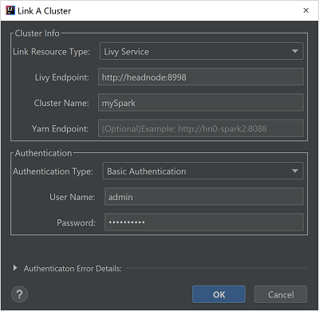

1. You can see your linked cluster from the **HDInsight** node.

   

2. You also can unlink a cluster from **Azure Explorer**.

   

## Run a Spark Scala application on an HDInsight Spark cluster

After creating a Scala application, you can submit it to the cluster.

1. From Project, navigate to **myApp** > **src** > **main** > **scala** > **myApp**.  Right-click **myApp**, and select **Submit Spark Application** (It will likely be located at the bottom of the list).
    
      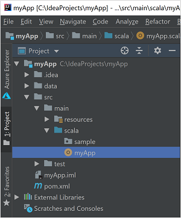

2. In the **Submit Spark Application** dialog window, select **1. Spark on HDInsight**.

3. In the **Edit configuration** window, provide the following values and then select **OK**:

    |Property |Value |
    |----|----|
    |Spark clusters (Linux only)|Select the HDInsight Spark cluster on which you want to run your application.|
    |Select an Artifact to submit|Leave default setting.|
    |Main class name|The default value is the main class from the selected file. You can change the class by selecting the ellipsis(**...**)  and choosing another class.|
    |Job configurations|You can change the default keys and/or values. For more information, see [Apache Livy REST API](https://livy.incubator.apache.org./docs/latest/rest-api.html).|
    |Command line arguments|You can enter arguments separated by space for the main class if needed.|
    |Referenced Jars and Referenced Files|You can enter the paths for the referenced Jars and files if any. You can also browse files in the Azure virtual file system, which currently only supports ADLS Gen 2 cluster. For more information: [Apache Spark Configuration](https://spark.apache.org/docs/latest/configuration.html#runtime-environment).  See also, [How to upload resources to cluster](https://docs.microsoft.com/azure/storage/blobs/storage-quickstart-blobs-storage-explorer).|
    |Job Upload Storage|Expand to reveal additional options.|
    |Storage Type|Select **Use Azure Blob to upload** from the drop-down list.|
    |Storage Account|Enter your storage account.|
    |Storage Key|Enter your storage key.|
    |Storage Container|Select your storage container from the drop-down list once **Storage Account** and **Storage Key** has been entered.|

    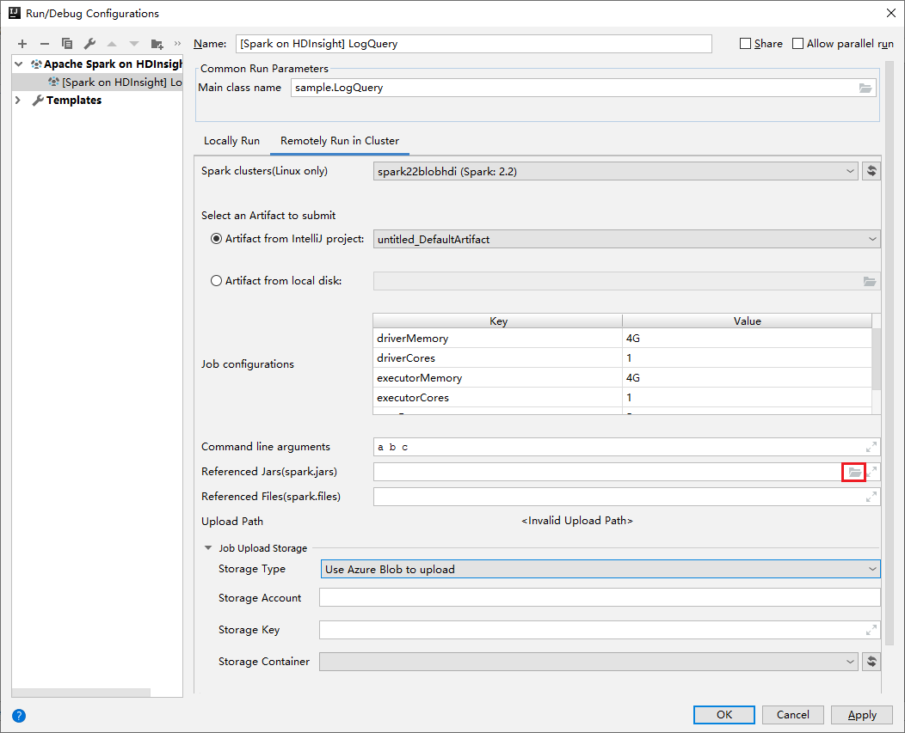

4. Select **SparkJobRun** to submit your project to the selected cluster. The **Remote Spark Job in Cluster** tab displays the job execution progress at the bottom. You can stop the application by clicking the red button. To learn how to access the job output, see the "Access and manage HDInsight Spark clusters by using Azure Toolkit for IntelliJ" section later in this article.  
      
    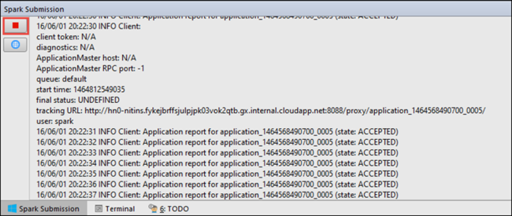

## Debug Apache Spark applications locally or remotely on an HDInsight cluster 

We also recommend another way of submitting the Spark application to the cluster. You can do so by setting the parameters in the **Run/Debug configurations** IDE. For more information, see [Debug Apache Spark applications locally or remotely on an HDInsight cluster with Azure Toolkit for IntelliJ through SSH](apache-spark-intellij-tool-debug-remotely-through-ssh.md).

## Access and manage HDInsight Spark clusters by using Azure Toolkit for IntelliJ

You can perform various operations by using Azure Toolkit for IntelliJ.  Most of the operations are initiated from **Azure Explorer**.  From the menu bar, navigate to **View** > **Tool Windows** > **Azure Explorer**.

### Access the job view

1. From Azure Explorer, navigate to **HDInsight** > \<Your Cluster> > **Jobs**.

    

2. In the right pane, the **Spark Job View** tab displays all the applications that were run on the cluster. Select the name of the application for which you want to see more details.

    

3. To display basic running job information, hover over the job graph. To view the stages graph and information that every job generates, select a node on the job graph.

    

4. To view frequently used logs, such as *Driver Stderr*, *Driver Stdout*, and *Directory Info*, select the **Log** tab.

    

5. You can also view the Spark history UI and the YARN UI (at the application level) by selecting a link at the top of the window.

### Access the Spark history server

1. From Azure Explorer, expand **HDInsight**, right-click your Spark cluster name, and then select **Open Spark History UI**.  
2. When you're prompted, enter the cluster's admin credentials, which you specified when you set up the cluster.

3. On the Spark history server dashboard, you can use the application name to look for the application that you just finished running. In the preceding code, you set the application name by using `val conf = new SparkConf().setAppName("myApp")`. Therefore, your Spark application name is **myApp**.

### Start the Ambari portal

1. From Azure Explorer, expand **HDInsight**, right-click your Spark cluster name, and then select **Open Cluster Management Portal(Ambari)**.  

2. When you're prompted, enter the admin credentials for the cluster. You specified these credentials during the cluster setup process.

### Manage Azure subscriptions

By default, Azure Toolkit for IntelliJ lists the Spark clusters from all your Azure subscriptions. If necessary, you can specify the subscriptions that you want to access.  

1. From Azure Explorer, right-click the **Azure** root node, and then select **Select Subscriptions**.  

2. From the **Select Subscriptions** window, clear the check boxes next to the subscriptions that you don't want to access, and then select **Close**.

## Spark Console

You can run Spark Local Console(Scala) or run Spark Livy Interactive Session Console(Scala).

### Spark Local Console(Scala)

Ensure you have satisfied the WINUTILS.EXE prerequisite.

1. From the menu bar, navigate to **Run** > **Edit Configurations...**.

2. From the **Run/Debug Configurations** window, in the left pane, navigate to **Apache Spark on HDInsight** > **[Spark on HDInsight] myApp**.

3. From the main window, select the **Locally Run** tab.

4. Provide the following values, and then select **OK**:

    |Property |Value |
    |----|----|
    |Job main class|The default value is the main class from the selected file. You can change the class by selecting the ellipsis(**...**)  and choosing another class.|
    |Environment variables|Ensure the value for HADOOP_HOME is correct.|
    |WINUTILS.exe location|Ensure the path is correct.|

    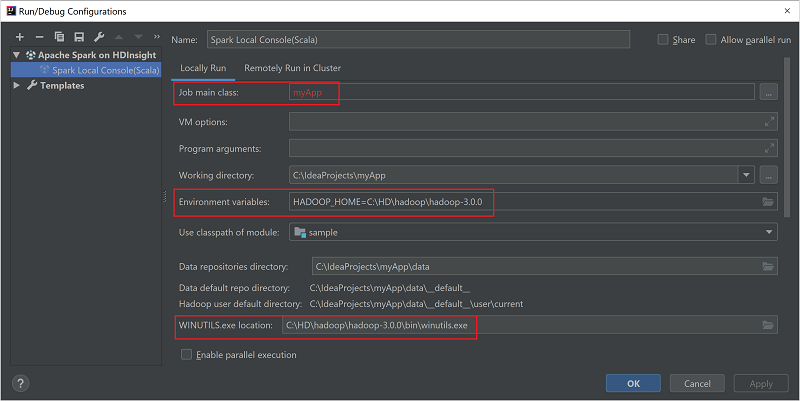

5. From Project, navigate to **myApp** > **src** > **main** > **scala** > **myApp**.  

6. From the menu bar, navigate to **Tools** > **Spark Console** > **Run Spark Local Console(Scala)**.

7. Then two dialogs may be displayed to ask you if you want to auto fix dependencies. If so, select **Auto Fix**.

    

    

8. The console should look similar to the picture below. In the console window type `sc.appName`, and then press ctrl+Enter.  The result will be shown. You can terminate the local console by clicking red button.

    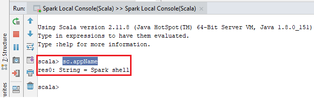

### Spark Livy Interactive Session Console(Scala)

It is only supported on IntelliJ 2018.2 and 2018.3.

1. From the menu bar, navigate to **Run** > **Edit Configurations...**.

2. From the **Run/Debug Configurations** window, in the left pane, navigate to **Apache Spark on HDInsight** > **[Spark on HDInsight] myApp**.

3. From the main window, select the **Remotely Run in Cluster** tab.

4. Provide the following values, and then select **OK**:

    |Property |Value |
    |----|----|
    |Spark clusters (Linux only)|Select the HDInsight Spark cluster on which you want to run your application.|
    |Main class name|The default value is the main class from the selected file. You can change the class by selecting the ellipsis(**...**)  and choosing another class.|

    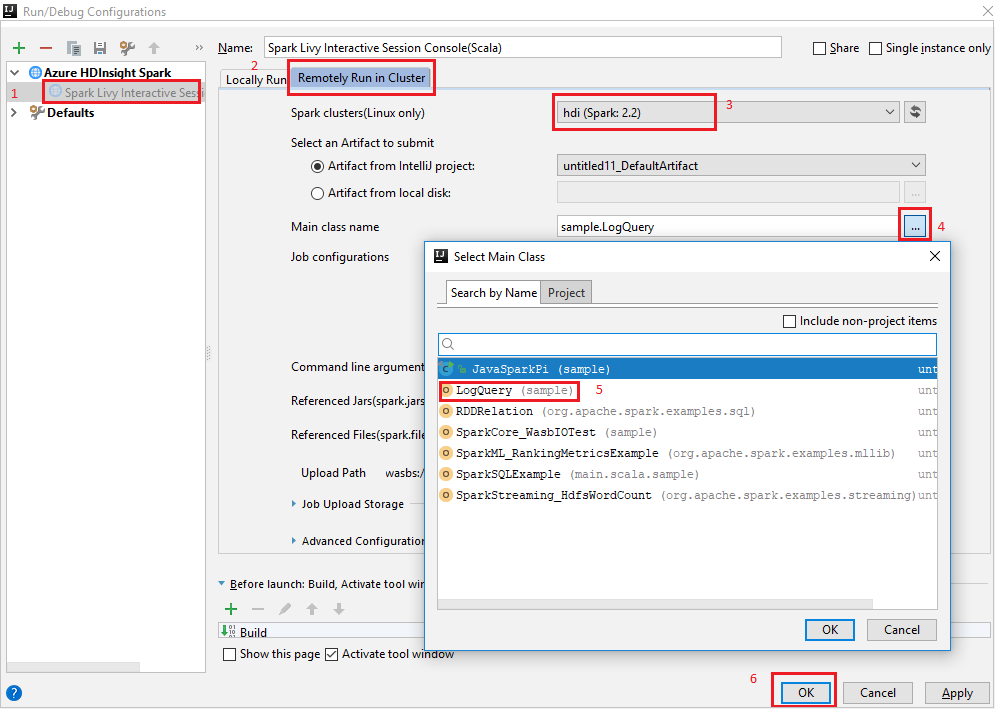

5. From Project, navigate to **myApp** > **src** > **main** > **scala** > **myApp**.  

6. From the menu bar, navigate to **Tools** > **Spark Console** > **Run Spark Livy Interactive Session Console(Scala)**.

7. The console should look similar to the picture below. In the console window type `sc.appName`, and then press ctrl+Enter.  The result will be shown. You can terminate the local console by clicking red button.

    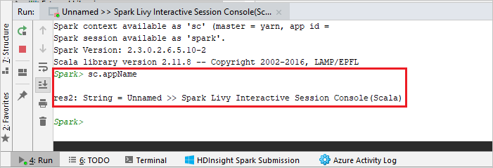

### Send Selection to Spark Console

It is convenient for you to foresee the script result by sending some code to the local console or Livy Interactive Session Console(Scala). You can highlight some code in the Scala file, then right-click **Send Selection To Spark Console**. The selected code will be sent to the console and be performed. The result will be displayed after the code in the console. The console will check the errors if existing.  

   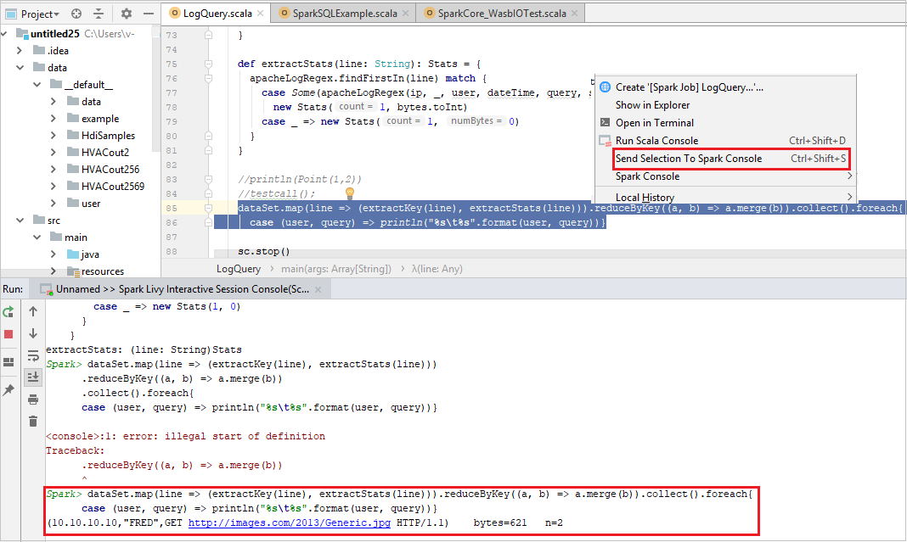

## Reader-only role

When users submit job to a cluster with reader-only role permission, Ambari credentials is required.

### Link cluster from context menu

1. Sign in with reader-only role account.
       
2. From **Azure Explorer**, expand **HDInsight** to view HDInsight clusters that are in your subscription. The clusters marked **"Role:Reader"** only have reader-only role permission.

    

3. Right-click the cluster with reader-only role permission. Select **Link this cluster** from context menu to link cluster. Enter the Ambari username and Password.

  
    

4. If the cluster is linked successfully, HDInsight will be refreshed.
   The stage of the cluster will become linked.
  
    

### Link cluster by expanding Jobs node

1. Click **Jobs** node, **Cluster Job Access Denied** window pops up.
   
2. Click **Link this cluster** to link cluster.
   
    

### Link cluster from Run/Debug Configurations window

1. Create an HDInsight Configuration. Then select **Remotely Run in Cluster**.
   
2. Select a cluster, which has reader-only role permission for **Spark clusters(Linux only)**. Warning message shows out. You can Click **Link this cluster** to link cluster.
   
   
   
### View Storage Accounts

* For clusters with reader-only role permission, click **Storage Accounts** node, **Storage Access Denied** window pops up. You can click **Open Azure Storage Explorer** to open Storage Explorer.
     
   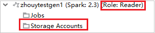

   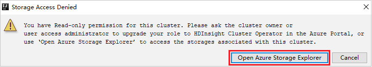

* For linked clusters, click **Storage Accounts** node, **Storage Access Denied** window pops up. You can click **Open Azure Storage** to open Storage Explorer.
     
   

   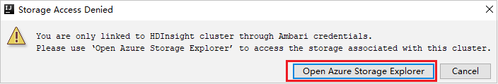

## Convert existing IntelliJ IDEA applications to use Azure Toolkit for IntelliJ

You can convert the existing Spark Scala applications that you created in IntelliJ IDEA to be compatible with Azure Toolkit for IntelliJ. You can then use the plug-in to submit the applications to an HDInsight Spark cluster.

1. For an existing Spark Scala application that was created through IntelliJ IDEA, open the associated .iml file.

2. At the root level is a **module** element like the following:
   
        <module org.jetbrains.idea.maven.project.MavenProjectsManager.isMavenModule="true" type="JAVA_MODULE" version="4">

   Edit the element to add `UniqueKey="HDInsightTool"` so that the **module** element looks like the following:
   
        <module org.jetbrains.idea.maven.project.MavenProjectsManager.isMavenModule="true" type="JAVA_MODULE" version="4" UniqueKey="HDInsightTool">

3. Save the changes. Your application should now be compatible with Azure Toolkit for IntelliJ. You can test it by right-clicking the project name in Project. The pop-up menu now has the option **Submit Spark Application to HDInsight**.

## Clean up resources

If you're not going to continue to use this application, delete the cluster that you created with the following steps:

1. Sign in to the [Azure portal](https://portal.azure.com/).

1. In the **Search** box at the top, type **HDInsight**.

1. Select **HDInsight clusters** under **Services**.

1. In the list of HDInsight clusters that appears, select the **...** next to the cluster that you created for this tutorial.

1. Select **Delete**. Select **Yes**.

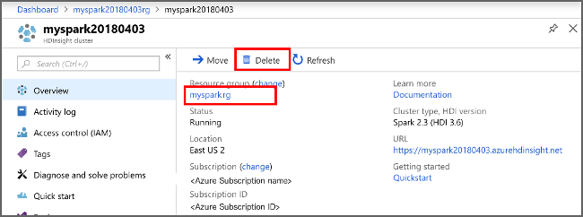

## Next steps

In this tutorial, you learned how to use the Azure Toolkit for IntelliJ plug-in to develop Apache Spark applications written in [Scala](https://www.scala-lang.org/), and then submitted them to an HDInsight Spark cluster directly from the IntelliJ integrated development environment (IDE). Advance to the next article to see how the data you registered in Apache Spark can be pulled into a BI analytics tool such as Power BI.

> [!div class="nextstepaction"]
> [Analyze data using BI tools](apache-spark-use-bi-tools.md)
