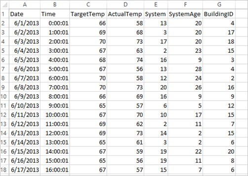
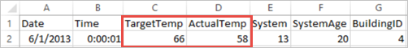

# Build Apache Spark machine learning applications on Azure HDInsight

Learn how to build an Apache Spark machine learning application using a Spark cluster on HDInsight. This article shows how to use the Jupyter notebook available with the cluster to build and test this application. The application uses the sample HVAC.csv data that is available on all clusters by default.

[MLlib](https://spark.apache.org/docs/1.1.0/mllib-guide.html) is Spark’s scalable machine learning library consisting of common learning algorithms and utilities, including classification, regression, clustering, collaborative filtering, dimensionality reduction, as well as underlying optimization primitives.

## Prerequisites:

You must have the following item:

* An Apache Spark cluster on HDInsight. For instructions, see [Create Apache Spark clusters in Azure HDInsight](apache-spark-jupyter-spark-sql.md). 

## <a name="data"></a>Understand the data set

The following data shows the target temperature and the actual temperature of some buildings that have HVAC systems installed. The **System** column represents the system ID and the **SystemAge** column represents the number of years the HVAC system has been in place at the building. You use the data in this tutorial to predict whether a building will be hotter or colder based on the target temperature, given a system ID and system age.



The data file, **HVAC.csv**, is located at **\HdiSamples\HdiSamples\SensorSampleData\hvac** on all HDInsight clusters.

## <a name="app"></a>Write a Spark machine learning application using Spark MLlib
In this application, you use a Spark [ML pipeline](https://spark.apache.org/docs/2.2.0/ml-pipeline.html) to perform a document classification. ML Pipelines provide a uniform set of high-level APIs built on top of DataFrames that help users create and tune practical machine learning pipelines. In the pipeline, you split the document into words, convert the words into a numerical feature vector, and finally build a prediction model using the feature vectors and labels. Perform the following steps to create the application.

1. Create a Jupyter notebook using the PySpark kernel. For the instructions, see [Create a Jupyter notebook](./apache-spark-jupyter-spark-sql.md#create-a-jupyter-notebook).
2. Import the types required for this scenario. Paste the following snippet in an empty cell, and then press **SHIFT + ENTER**. 

    ```PySpark
    from pyspark.ml import Pipeline
    from pyspark.ml.classification import LogisticRegression
    from pyspark.ml.feature import HashingTF, Tokenizer
    from pyspark.sql import Row

    import os
    import sys
    from pyspark.sql.types import *

    from pyspark.mllib.classification import LogisticRegressionWithSGD
    from pyspark.mllib.regression import LabeledPoint
    from numpy import array
    ```
3. Load the data (hvac.csv), parse it, and use it to train the model. 

    ```PySpark
    # Define a type called LabelDocument
    LabeledDocument = Row("BuildingID", "SystemInfo", "label")

    # Define a function that parses the raw CSV file and returns an object of type LabeledDocument
    def parseDocument(line):
        values = [str(x) for x in line.split(',')]
        if (values[3] > values[2]):
            hot = 1.0
        else:
            hot = 0.0        

        textValue = str(values[4]) + " " + str(values[5])

        return LabeledDocument((values[6]), textValue, hot)

    # Load the raw HVAC.csv file, parse it using the function
    data = sc.textFile("wasb:///HdiSamples/HdiSamples/SensorSampleData/hvac/HVAC.csv")

    documents = data.filter(lambda s: "Date" not in s).map(parseDocument)
    training = documents.toDF()
    ```

    In the code snippet, you define a function that compares the actual temperature with the target temperature. If the actual temperature is greater, the building is hot, denoted by the value **1.0**. Otherwise the building is cold, denoted by the value **0.0**. 

4. Configure the Spark machine learning pipeline that consists of three stages: tokenizer, hashingTF, and lr. 

    ```PySpark
    tokenizer = Tokenizer(inputCol="SystemInfo", outputCol="words")
    hashingTF = HashingTF(inputCol=tokenizer.getOutputCol(), outputCol="features")
    lr = LogisticRegression(maxIter=10, regParam=0.01)
    pipeline = Pipeline(stages=[tokenizer, hashingTF, lr])
    ```

    For more information about what is a pipeline and how it works see <a href="http://spark.apache.org/docs/latest/ml-guide.html#how-it-works" target="_blank">Spark machine learning pipeline</a>.

5. Fit the pipeline to the training document.
   
    ```PySpark
    model = pipeline.fit(training)
    ```

6. Verify the training document to checkpoint your progress with the application.
   
    ```PySpark
    training.show()
    ```
   
    This should give the output similar to the following:

    ```
    +----------+----------+-----+
    |BuildingID|SystemInfo|label|
    +----------+----------+-----+
    |         4|     13 20|  0.0|
    |        17|      3 20|  0.0|
    |        18|     17 20|  1.0|
    |        15|      2 23|  0.0|
    |         3|      16 9|  1.0|
    |         4|     13 28|  0.0|
    |         2|     12 24|  0.0|
    |        16|     20 26|  1.0|
    |         9|      16 9|  1.0|
    |        12|       6 5|  0.0|
    |        15|     10 17|  1.0|
    |         7|      2 11|  0.0|
    |        15|      14 2|  1.0|
    |         6|       3 2|  0.0|
    |        20|     19 22|  0.0|
    |         8|     19 11|  0.0|
    |         6|      15 7|  0.0|
    |        13|      12 5|  0.0|
    |         4|      8 22|  0.0|
    |         7|      17 5|  0.0|
    +----------+----------+-----+
    ```

    Comparing the output against the raw CSV file. For example, the first row the CSV file has this data:

    

    Notice how the actual temperature is less than the target temperature suggesting the building is cold. Hence in the training output, the value for **label** in the first row is **0.0**, which means the building is not hot.

7. Prepare a data set to run the trained model against. To do so, you pass on a system ID and system age (denoted as **SystemInfo** in the training output), and the model predicts whether the building with that system ID and system age will be hotter (denoted by 1.0) or cooler (denoted by 0.0).
   
    ```PySpark   
    # SystemInfo here is a combination of system ID followed by system age
    Document = Row("id", "SystemInfo")
    test = sc.parallelize([(1L, "20 25"),
                    (2L, "4 15"),
                    (3L, "16 9"),
                    (4L, "9 22"),
                    (5L, "17 10"),
                    (6L, "7 22")]) \
        .map(lambda x: Document(*x)).toDF() 
    ```
8. Finally, make predictions on the test data. 
   
    ```PySpark
    # Make predictions on test documents and print columns of interest
    prediction = model.transform(test)
    selected = prediction.select("SystemInfo", "prediction", "probability")
    for row in selected.collect():
        print row
    ```

    You should see an output similar to the following:

    ```   
    Row(SystemInfo=u'20 25', prediction=1.0, probability=DenseVector([0.4999, 0.5001]))
    Row(SystemInfo=u'4 15', prediction=0.0, probability=DenseVector([0.5016, 0.4984]))
    Row(SystemInfo=u'16 9', prediction=1.0, probability=DenseVector([0.4785, 0.5215]))
    Row(SystemInfo=u'9 22', prediction=1.0, probability=DenseVector([0.4549, 0.5451]))
    Row(SystemInfo=u'17 10', prediction=1.0, probability=DenseVector([0.4925, 0.5075]))
    Row(SystemInfo=u'7 22', prediction=0.0, probability=DenseVector([0.5015, 0.4985]))
    ```
   
   From the first row in the prediction, you can see that for an HVAC system with ID 20 and system age of 25 years, the building is hot (**prediction=1.0**). The first value for DenseVector (0.49999) corresponds to the  prediction 0.0 and the second value (0.5001) corresponds to the prediction 1.0. In the output, even though the second value is only marginally higher, the model shows **prediction=1.0**.
10. Shut down the notebook to release the resources. To do so, from the **File** menu on the notebook, click **Close and Halt**. This will shut down and close the notebook.

## <a name="anaconda"></a>Use Anaconda scikit-learn library for Spark machine learning
Apache Spark clusters on HDInsight include Anaconda libraries. This also includes the **scikit-learn** library for machine learning. The library also includes various data sets that you can use to build sample applications directly from a Jupyter notebook. For examples on using the scikit-learn library, see [http://scikit-learn.org/stable/auto_examples/index.html](http://scikit-learn.org/stable/auto_examples/index.html).

## <a name="seealso"></a>See also
* [Overview: Apache Spark on Azure HDInsight](apache-spark-overview.md)

### Scenarios
* [Spark with BI: Perform interactive data analysis using Spark in HDInsight with BI tools](apache-spark-use-bi-tools.md)
* [Spark with Machine Learning: Use Spark in HDInsight to predict food inspection results](apache-spark-machine-learning-mllib-ipython.md)
* [Website log analysis using Spark in HDInsight](apache-spark-custom-library-website-log-analysis.md)

### Create and run applications
* [Create a standalone application using Scala](apache-spark-create-standalone-application.md)
* [Run jobs remotely on a Spark cluster using Livy](apache-spark-livy-rest-interface.md)

### Tools and extensions
* [Use HDInsight Tools Plugin for IntelliJ IDEA to create and submit Spark Scala applications](apache-spark-intellij-tool-plugin.md)
* [Use HDInsight Tools Plugin for IntelliJ IDEA to debug Spark applications remotely](apache-spark-intellij-tool-plugin-debug-jobs-remotely.md)
* [Use Zeppelin notebooks with a Spark cluster on HDInsight](apache-spark-zeppelin-notebook.md)
* [Kernels available for Jupyter notebook in Spark cluster for HDInsight](apache-spark-jupyter-notebook-kernels.md)
* [Use external packages with Jupyter notebooks](apache-spark-jupyter-notebook-use-external-packages.md)
* [Install Jupyter on your computer and connect to an HDInsight Spark cluster](apache-spark-jupyter-notebook-install-locally.md)

### Manage resources
* [Manage resources for the Apache Spark cluster in Azure HDInsight](apache-spark-resource-manager.md)
* [Track and debug jobs running on an Apache Spark cluster in HDInsight](apache-spark-job-debugging.md)

[hdinsight-versions]: hdinsight-component-versioning.md
[hdinsight-upload-data]: hdinsight-upload-data.md
[hdinsight-storage]: hdinsight-hadoop-use-blob-storage.md

[hdinsight-weblogs-sample]:../hadoop/apache-hive-analyze-website-log.md
[hdinsight-sensor-data-sample]:../hadoop/apache-hive-analyze-sensor-data.md

[azure-purchase-options]: http://azure.microsoft.com/pricing/purchase-options/
[azure-member-offers]: http://azure.microsoft.com/pricing/member-offers/
[azure-free-trial]: http://azure.microsoft.com/pricing/free-trial/
[azure-create-storageaccount]:../../storage/common/storage-create-storage-account.md
