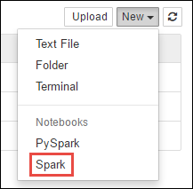
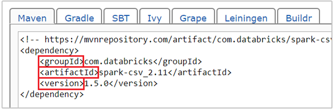

# Use external packages with Jupyter notebooks in Apache Spark clusters on HDInsight
> [!div class="op_single_selector"]
> * [Using cell magic](apache-spark-jupyter-notebook-use-external-packages.md)
> * [Using Script Action](apache-spark-python-package-installation.md)

Learn how to configure a [Jupyter Notebook](https://jupyter.org/) in Apache Spark cluster on HDInsight to use external, community-contributed Apache **maven** packages that are not included out-of-the-box in the cluster. 

You can search the [Maven repository](https://search.maven.org/) for the complete list of packages that are available. You can also get a list of available packages from other sources. For example, a complete list of community-contributed packages is available at [Spark Packages](https://spark-packages.org/).

In this article, you will learn how to use the [spark-csv](https://search.maven.org/#artifactdetails%7Ccom.databricks%7Cspark-csv_2.10%7C1.4.0%7Cjar) package with the Jupyter notebook.

## Prerequisites
You must have the following:

* An Apache Spark cluster on HDInsight. For instructions, see [Create Apache Spark clusters in Azure HDInsight](apache-spark-jupyter-spark-sql.md).

## Use external packages with Jupyter notebooks
1. From the [Azure Portal](https://portal.azure.com/), from the startboard, click the tile for your Spark cluster (if you pinned it to the startboard). You can also navigate to your cluster under **Browse All** > **HDInsight Clusters**.   

1. From the Spark cluster blade, click **Quick Links**, and then from the **Cluster Dashboard** blade, click **Jupyter Notebook**. If prompted, enter the admin credentials for the cluster.

	> [!NOTE]  
	> You may also reach the Jupyter Notebook for your cluster by opening the following URL in your browser. Replace **CLUSTERNAME** with the name of your cluster:
	> 
	> `https://CLUSTERNAME.azurehdinsight.net/jupyter`

1. Create a new notebook. Click **New**, and then click **Spark**.
   
    

1. A new notebook is created and opened with the name Untitled.pynb. Click the notebook name at the top, and enter a friendly name.
   
    

1. You will use the `%%configure` magic to configure the notebook to use an external package. In notebooks that use external packages, make sure you call the `%%configure` magic in the first code cell. This ensures that the kernel is configured to use the package before the session starts.

	>[!IMPORTANT]  
	>If you forget to configure the kernel in the first cell, you can use the `%%configure` with the `-f` parameter, but that will restart the session and all progress will be lost.

	| HDInsight version | Command |
	|-------------------|---------|
	|For HDInsight 3.3 and HDInsight 3.4 | `%%configure`  `{ "packages":["com.databricks:spark-csv_2.10:1.4.0"] }`|
	| For HDInsight 3.5 and HDInsight 3.6 | `%%configure` `{ "conf": {"spark.jars.packages": "com.databricks:spark-csv_2.10:1.4.0" }}`|

1. The snippet above expects the maven coordinates for the external package in Maven Central Repository. In this snippet, `com.databricks:spark-csv_2.10:1.4.0` is the maven coordinate for **spark-csv** package. Here's how you construct the coordinates for a package.
   
    a. Locate the package in the Maven Repository. For this article, we use [spark-csv](https://search.maven.org/#artifactdetails%7Ccom.databricks%7Cspark-csv_2.10%7C1.4.0%7Cjar).
   
    b. From the repository, gather the values for **GroupId**, **ArtifactId**, and **Version**. Make sure that the values you gather match your cluster. In this case, we are using a Scala 2.10 and Spark 1.4.0 package, but you may need to select different versions for the appropriate Scala or Spark version in your cluster. You can find out the Scala version on your cluster by running `scala.util.Properties.versionString` on the Spark Jupyter kernel or on Spark submit. You can find out the Spark version on your cluster by running `sc.version` on Jupyter notebooks.
   
    
   
    c. Concatenate the three values, separated by a colon (**:**).
   
        com.databricks:spark-csv_2.10:1.4.0

1. Run the code cell with the `%%configure` magic. This will configure the underlying Livy session to use the package you provided. In the subsequent cells in the notebook, you can now use the package, as shown below.
   
        val df = sqlContext.read.format("com.databricks.spark.csv").
        option("header", "true").
        option("inferSchema", "true").
        load("wasb:///HdiSamples/HdiSamples/SensorSampleData/hvac/HVAC.csv")

    For HDInsight 3.6, you should use the following snippet.

        val df = spark.read.format("com.databricks.spark.csv").
        option("header", "true").
        option("inferSchema", "true").
        load("wasb:///HdiSamples/HdiSamples/SensorSampleData/hvac/HVAC.csv")

1. You can then run the snippets, like shown below, to view the data from the dataframe you created in the previous step.
   
        df.show()
   
        df.select("Time").count()

## See also
* [Overview: Apache Spark on Azure HDInsight](apache-spark-overview.md)

### Scenarios
* [Apache Spark with BI: Perform interactive data analysis using Spark in HDInsight with BI tools](apache-spark-use-bi-tools.md)
* [Apache Spark with Machine Learning: Use Spark in HDInsight for analyzing building temperature using HVAC data](apache-spark-ipython-notebook-machine-learning.md)
* [Apache Spark with Machine Learning: Use Spark in HDInsight to predict food inspection results](apache-spark-machine-learning-mllib-ipython.md)
* [Website log analysis using Apache Spark in HDInsight](apache-spark-custom-library-website-log-analysis.md)

### Create and run applications
* [Create a standalone application using Scala](apache-spark-create-standalone-application.md)
* [Run jobs remotely on an Apache Spark cluster using Apache Livy](apache-spark-livy-rest-interface.md)

### Tools and extensions

* [Use external python packages with Jupyter notebooks in Apache Spark clusters on HDInsight Linux](apache-spark-python-package-installation.md)
* [Use HDInsight Tools Plugin for IntelliJ IDEA to create and submit Spark Scala applications](apache-spark-intellij-tool-plugin.md)
* [Use HDInsight Tools Plugin for IntelliJ IDEA to debug Apache Spark applications remotely](apache-spark-intellij-tool-plugin-debug-jobs-remotely.md)
* [Use Apache Zeppelin notebooks with an Apache Spark cluster on HDInsight](apache-spark-zeppelin-notebook.md)
* [Kernels available for Jupyter notebook in Apache Spark cluster for HDInsight](apache-spark-jupyter-notebook-kernels.md)
* [Install Jupyter on your computer and connect to an HDInsight Spark cluster](apache-spark-jupyter-notebook-install-locally.md)

### Manage resources
* [Manage resources for the Apache Spark cluster in Azure HDInsight](apache-spark-resource-manager.md)
* [Track and debug jobs running on an Apache Spark cluster in HDInsight](apache-spark-job-debugging.md)
