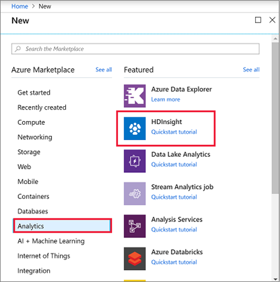
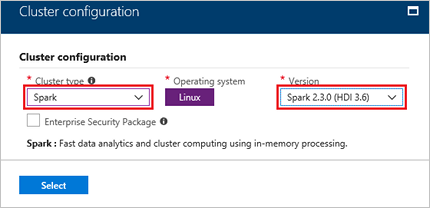
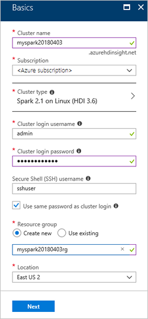

# Quickstart: Create Apache Spark cluster in Azure HDInsight using Azure portal

Learn how to create Apache Spark cluster in Azure HDInsight, and how to run Spark SQL queries against Hive tables. Apache Spark enables fast data analytics and cluster computing using in-memory processing. For information on Spark on HDInsight, see [Overview: Apache Spark on Azure HDInsight](apache-spark-overview.md).

In this quickstart, you use the Azure portal to create an HDInsight Spark cluster. The cluster uses Azure Storage Blobs as the cluster storage. For more information on using Data Lake Storage Gen2, see [Quickstart: Set up clusters in HDInsight](../../storage/data-lake-storage/quickstart-create-connect-hdi-cluster.md).

> [!IMPORTANT]  
> Billing for HDInsight clusters is prorated per minute, whether you are using them or not. Be sure to delete your cluster after you have finished using it. For more information, see the [Clean up resources](#clean-up-resources) section of this article.

If you don't have an Azure subscription, [create a free account](https://azure.microsoft.com/free/) before you begin.

## Create an HDInsight Spark cluster

1. In the Azure portal, select **Create a resource** > **Analytics** > **HDInsight**. 

    
2. Under **Basics**, provide the following values:
     
    |Property  |Description  |
    |---------|---------|
    |**Cluster name**     | Give a name to your HDInsight Spark cluster. The cluster name used for this quickstart is **myspark20180403**.|
    |**Subscription**     | From the drop-down, select an Azure subscription used for this cluster. The subscription used for this quickstart is **&lt;Azure subscription**. |
    |**Cluster type**| Expand the item, and then select **Spark** as the cluster type, and specify the Spark cluster version. <br/>  |
    |**Cluster login username**| Enter the cluster login username.  The default name is *admin*. You use this account to login in to the Jupyter notebook later in the quickstart. |
    |**Cluster login password**| Enter the cluster login password. |
    |**Secure Shell (SSH) username**| Enter the SSH username. The SSH username used for this quickstart is **sshuser**. By default, this account shares the same password as the *Cluster Login username* account. |
    |**Resource group**     | Specify whether you want to create a new resource group or use an existing one. A resource group is a container that holds related resources for an Azure solution. The resource group name used for this quickstart is **myspark20180403rg**. |
    |**Location**     | Select a location for the resource group. The template uses this location for creating the cluster as well as for the default cluster storage. The location used for this quickstart is **East US 2**. |

    

    Select **Next** to continue to the **Storage** page.
3. Under **Storage**, provide the following values:

   - **Select a Storage account**: select **Create new**, and then give a name to the new storage account. The storage account name used for this quickstart is **myspark20180403store**.

     

     > [!NOTE]  
     > On the screenshot, it shows **Select existing**. The link toggles between **Create new** and **Select existing**.

     The **Default container** has a default name.  You can change the name if you want.

     Select **Next** to continue to the **Summary** page. 


3. On **Summary**, select **Create**. It takes about 20 minutes to create the cluster. The cluster must be created before you can proceed to the next session.

If you run into an issue with creating HDInsight clusters, it could be that you do not have the right permissions to do so. For more information, see [Access control requirements](../hdinsight-hadoop-create-linux-clusters-portal.md).

## Create a Jupyter notebook

Jupyter Notebook is an interactive notebook environment that supports various programming languages. The notebook allows you to interact with your data, combine code with markdown text and perform simple visualizations. 

1. Open the [Azure portal](https://portal.azure.com).
2. Select **HDInsight clusters**, and then select the cluster you created.

    

3. From the portal, select **Cluster dashboards**, and then select **Jupyter Notebook**. If prompted, enter the cluster login credentials for the cluster.

   

4. Select **New** > **PySpark** to create a notebook. 

   

   A new notebook is created and opened with the name Untitled(Untitled.pynb).


## Run Spark SQL statements

SQL (Structured Query Language) is the most common and widely used language for querying and defining data. Spark SQL functions as an extension to Apache Spark for processing structured data, using the familiar SQL syntax.

1. Verify the kernel is ready. The kernel is ready when you see a hollow circle next to the kernel name in the notebook. Solid circle denotes that the kernel is busy.

    

    When you start the notebook for the first time, the kernel performs some tasks in the background. Wait for the kernel to be ready. 
2. Paste the following code in an empty cell, and then press **SHIFT + ENTER** to run the code. The command lists the Hive tables on the cluster:

    ```PySpark
	%%sql
    SHOW TABLES
    ```
    When you use a Jupyter Notebook with your HDInsight Spark cluster, you get a preset `sqlContext` that you can use to run Hive queries using Spark SQL. `%%sql` tells Jupyter Notebook to use the preset `sqlContext` to run the Hive query. The query retrieves the top 10 rows from a Hive table (**hivesampletable**) that comes with all HDInsight clusters by default. It takes about 30 seconds to get the results. The output looks like: 

    

    Every time you run a query in Jupyter, your web browser window title shows a **(Busy)** status along with the notebook title. You also see a solid circle next to the **PySpark** text in the top-right corner.
    
2. Run another query to see the data in `hivesampletable`.

    ```PySpark
	%%sql
    SELECT * FROM hivesampletable LIMIT 10
    ```
    
    The screen shall refresh to show the query output.

    

2. From the **File** menu on the notebook, select **Close and Halt**. Shutting down the notebook releases the cluster resources.

## Clean up resources
HDInsight saves your data in Azure Storage or Azure Data Lake Storage, so you can safely delete a cluster when it is not in use. You are also charged for an HDInsight cluster, even when it is not in use. Since the charges for the cluster are many times more than the charges for storage, it makes economic sense to delete clusters when they are not in use. If you plan to work on the tutorial listed in [Next steps](#next-steps) immediately, you might want to keep the cluster.

Switch back to the Azure portal, and select **Delete**.


You can also select the resource group name to open the resource group page, and then select **Delete resource group**. By deleting the resource group, you delete both the HDInsight Spark cluster, and the default storage account.

## Next steps 

In this quickstart, you learned how to create an HDInsight Spark cluster and run a basic Spark SQL query. Advance to the next tutorial to learn how to use an HDInsight Spark cluster to run interactive queries on sample data.

> [!div class="nextstepaction"]
>[Run interactive queries on Apache Spark](./apache-spark-load-data-run-query.md)

