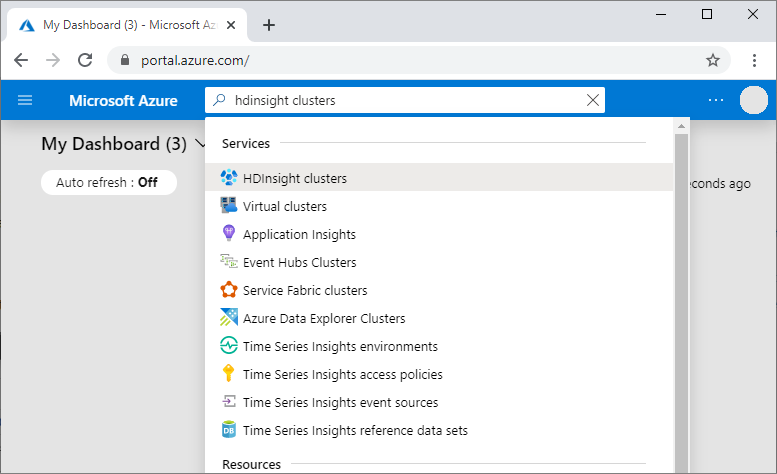
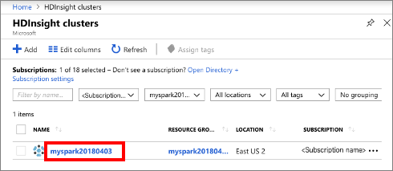
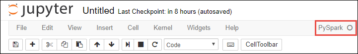
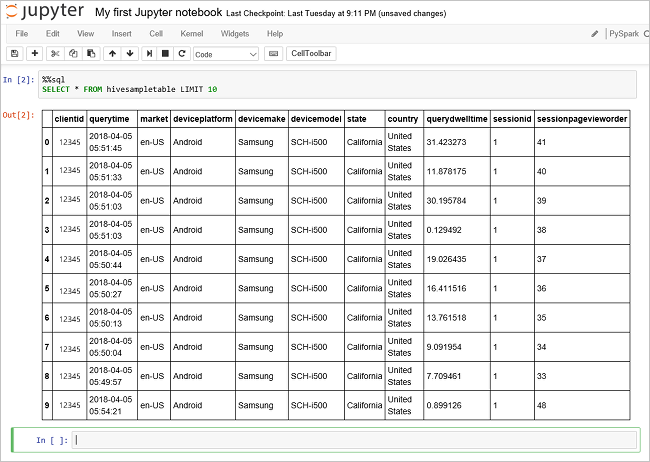
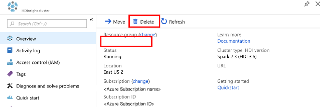

# Quickstart: Create Apache Spark cluster in Azure HDInsight using PowerShell

In this quickstart, you use Azure PowerShell to create an Apache Spark cluster in Azure HDInsight. You then create a Jupyter notebook, and use it to run Spark SQL queries against Apache Hive tables. Azure HDInsight is a managed, full-spectrum, open-source analytics service for enterprises. The Apache Spark framework for Azure HDInsight enables fast data analytics and cluster computing using in-memory processing. Jupyter notebook lets you interact with your data, combine code with markdown text, and do simple visualizations.

[Overview: Apache Spark on Azure HDInsight](apache-spark-overview.md) | [Apache Spark](https://spark.apache.org/) | [Apache Hive](https://hive.apache.org/) | [Jupyter Notebook](https://jupyter.org/)

If you're using multiple clusters together, you'll want to create a virtual network, and if you're using a Spark cluster you'll also want to use the Hive Warehouse Connector. For more information, see [Plan a virtual network for Azure HDInsight](../hdinsight-plan-virtual-network-deployment.md) and [Integrate Apache Spark and Apache Hive with the Hive Warehouse Connector](../interactive-query/apache-hive-warehouse-connector.md).

## Prerequisite

- An Azure account with an active subscription. [Create an account for free](https://azure.microsoft.com/free/?ref=microsoft.com&utm_source=microsoft.com&utm_medium=docs&utm_campaign=visualstudio).
- The [PowerShell Az module](https://docs.microsoft.com/powershell/azure/install-az-ps).

## Create an Apache Spark cluster in HDInsight

> [!IMPORTANT]  
> Billing for HDInsight clusters is prorated per minute, whether you are using them or not. Be sure to delete your cluster after you have finished using it. For more information, see the [Clean up resources](#clean-up-resources) section of this article.

Creating an HDInsight cluster includes creating the following Azure objects and resources:

- An Azure resource group. An Azure resource group is a container for Azure resources.
- An Azure storage account or Azure Data Lake Storage.  Each HDInsight cluster requires a dependent data storage. In this quickstart, you create a cluster that uses Azure Storage Blobs as the cluster storage. For more information on using Data Lake Storage Gen2, see [Quickstart: Set up clusters in HDInsight](../../storage/data-lake-storage/quickstart-create-connect-hdi-cluster.md).
- An cluster of different cluster types on HDInsight.  In this quickstart, you create a Spark 2.3 cluster.

You use a PowerShell script to create the resources. 

[!INCLUDE [updated-for-az](../../../includes/updated-for-az.md)]

When you run the PowerShell script, you are prompted to enter the following values:

|Parameter|Value|
|------|------|
|Azure resource group name | Provide a unique name for the resource group.|
|Location| Specify the Azure region, for example 'Central US'. |
|Default storage account name | Provide a unique name for the storage account. |
|Cluster name | Provide a unique name for the HDInsight cluster.|
|Cluster login credentials | You use this account to connect to the cluster dashboard later in the quickstart.|
|SSH user credentials | The SSH clients can be used to create a remote command-line session with the clusters in HDInsight.|

1. Select **Try It** in the upper right corner for the following code block to open [Azure Cloud Shell](../../cloud-shell/overview.md), and then follow the instructions to connect to Azure.

2. Copy and paste the following PowerShell script in the Cloud Shell.

    ```azurepowershell-interactive
    ### Create a Spark 2.3 cluster in Azure HDInsight

    # Default cluster size (# of worker nodes), version, and type
    $clusterSizeInNodes = "1"
    $clusterVersion = "3.6"
    $clusterType = "Spark"

    # Create the resource group
    $resourceGroupName = Read-Host -Prompt "Enter the resource group name"
    $location = Read-Host -Prompt "Enter the Azure region to create resources in, such as 'Central US'"
    $defaultStorageAccountName = Read-Host -Prompt "Enter the default storage account name"

    New-AzResourceGroup -Name $resourceGroupName -Location $location

    # Create an Azure storage account and container
    # Note: Storage account kind BlobStorage can only be used as secondary storage for HDInsight clusters.
    New-AzStorageAccount `
        -ResourceGroupName $resourceGroupName `
        -Name $defaultStorageAccountName `
        -Location $location `
        -SkuName Standard_LRS `
        -Kind StorageV2 `
        -EnableHttpsTrafficOnly 1

    $defaultStorageAccountKey = (Get-AzStorageAccountKey `
                                    -ResourceGroupName $resourceGroupName `
                                    -Name $defaultStorageAccountName)[0].Value

    $defaultStorageContext = New-AzStorageContext `
                                    -StorageAccountName $defaultStorageAccountName `
                                    -StorageAccountKey $defaultStorageAccountKey

    # Create a Spark 2.3 cluster
    $clusterName = Read-Host -Prompt "Enter the name of the HDInsight cluster"

    # Cluster login is used to secure HTTPS services hosted on the cluster
    $httpCredential = Get-Credential -Message "Enter Cluster login credentials" -UserName "admin"

    # SSH user is used to remotely connect to the cluster using SSH clients
    $sshCredentials = Get-Credential -Message "Enter SSH user credentials" -UserName "sshuser"

    # Set the storage container name to the cluster name
    $defaultBlobContainerName = $clusterName

    # Create a blob container. This holds the default data store for the cluster.
    New-AzStorageContainer `
        -Name $clusterName `
        -Context $defaultStorageContext

    $sparkConfig = New-Object "System.Collections.Generic.Dictionary``2[System.String,System.String]"
    $sparkConfig.Add("spark", "2.3")

    # Create the cluster in HDInsight
    New-AzHDInsightCluster `
        -ResourceGroupName $resourceGroupName `
        -ClusterName $clusterName `
        -Location $location `
        -ClusterSizeInNodes $clusterSizeInNodes `
        -ClusterType $clusterType `
        -OSType "Linux" `
        -Version $clusterVersion `
        -ComponentVersion $sparkConfig `
        -HttpCredential $httpCredential `
        -DefaultStorageAccountName "$defaultStorageAccountName.blob.core.windows.net" `
        -DefaultStorageAccountKey $defaultStorageAccountKey `
        -DefaultStorageContainer $clusterName `
        -SshCredential $sshCredentials

    Get-AzHDInsightCluster `
        -ResourceGroupName $resourceGroupName `
        -ClusterName $clusterName
    ```

   It takes about 20 minutes to create the cluster. The cluster must be created before you can proceed to the next session.

If you run into an issue with creating HDInsight clusters, it could be that you don't have the right permissions to do so. For more information, see [Access control requirements](../hdinsight-hadoop-customize-cluster-linux.md#access-control).

## Create a Jupyter notebook

[Jupyter Notebook](https://jupyter.org/) is an interactive notebook environment that supports various programming languages. The notebook allows you to interact with your data, combine code with markdown text and perform simple visualizations.

1. In the [Azure portal](https://portal.azure.com), search for and select **HDInsight clusters**.
   
   
   
1. From the list, select the cluster you created.
   
   
   
1. On the cluster **Overview** page, select **Cluster dashboards**, and then select **Jupyter Notebook**. If prompted, enter the cluster login credentials for the cluster.

   

1. Select **New** > **PySpark** to create a notebook.

   

   A new notebook is created and opened with the name Untitled(Untitled.pynb).

## Run Apache Spark SQL statements

SQL (Structured Query Language) is the most common and widely used language for querying and defining data. Spark SQL functions as an extension to Apache Spark for processing structured data, using the familiar SQL syntax.

1. Verify the kernel is ready. The kernel is ready when you see a hollow circle next to the kernel name in the notebook. Solid circle denotes that the kernel is busy.

    

    When you start the notebook for the first time, the kernel performs some tasks in the background. Wait for the kernel to be ready. 
1. Paste the following code in an empty cell, and then press **SHIFT + ENTER** to run the code. The command lists the Hive tables on the cluster:

    ```PySpark
    %%sql
    SHOW TABLES
    ```

    When you use a Jupyter Notebook with your Spark cluster in HDInsight, you get a preset `sqlContext` that you can use to run Hive queries using Spark SQL. `%%sql` tells Jupyter Notebook to use the preset `sqlContext` to run the Hive query. The query retrieves the top 10 rows from a Hive table (**hivesampletable**) that comes with all HDInsight clusters by default. It takes about 30 seconds to get the results. The output looks like:

    

    Every time you run a query in Jupyter, your web browser window title shows a **(Busy)** status along with the notebook title. You also see a solid circle next to the **PySpark** text in the top-right corner.

1. Run another query to see the data in `hivesampletable`.

    ```PySpark
    %%sql
    SELECT * FROM hivesampletable LIMIT 10
    ```

    The screen shall refresh to show the query output.

    

1. From the **File** menu on the notebook, select **Close and Halt**. Shutting down the notebook releases the cluster resources.

## Clean up resources

HDInsight saves your data in Azure Storage or Azure Data Lake Storage, so you can safely delete a cluster when it is not in use. You are also charged for an HDInsight cluster, even when it is not in use. Since the charges for the cluster are many times more than the charges for storage, it makes economic sense to delete clusters when they are not in use. If you plan to work on the tutorial listed in [Next steps](#next-steps) immediately, you might want to keep the cluster.

Switch back to the Azure portal, and select **Delete**.



You can also select the resource group name to open the resource group page, and then select **Delete resource group**. By deleting the resource group, you delete both the HDInsight cluster, and the default storage account.

### Piecemeal clean up with PowerShell Az module

```powershell
# Removes the specified HDInsight cluster from the current subscription.
Remove-AzHDInsightCluster `
    -ResourceGroupName $resourceGroupName `
    -ClusterName $clusterName

# Removes the specified storage container.
Remove-AzStorageContainer `
    -Name $clusterName `
    -Context $defaultStorageContext

# Removes a Storage account from Azure.
Remove-AzStorageAccount `
    -ResourceGroupName $resourceGroupName `
    -Name $defaultStorageAccountName

# Removes a resource group.
Remove-AzResourceGroup `
    -Name $resourceGroupName
```

## Next steps

In this quickstart, you learned how to create an Apache Spark cluster in HDInsight and run a basic Spark SQL query. Advance to the next tutorial to learn how to use an HDInsight cluster to run interactive queries on sample data.

> [!div class="nextstepaction"]
> [Run interactive queries on Apache Spark](./apache-spark-load-data-run-query.md)
