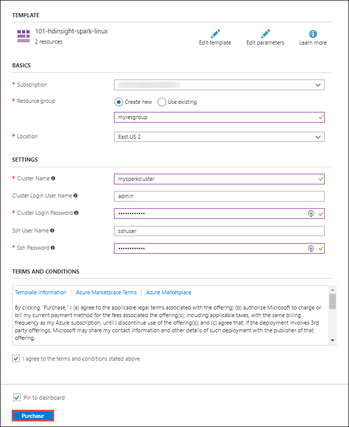
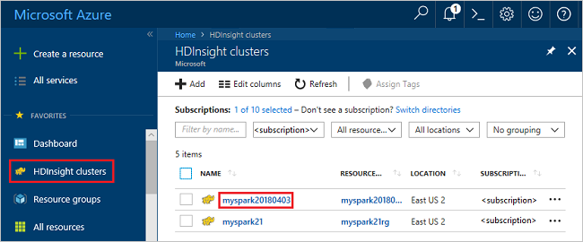
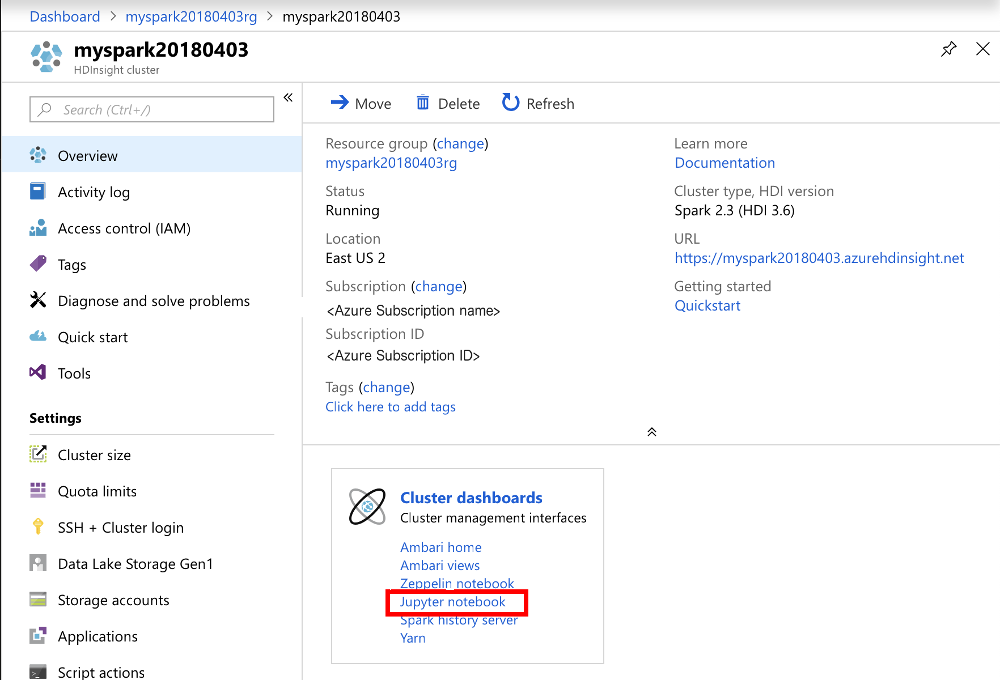
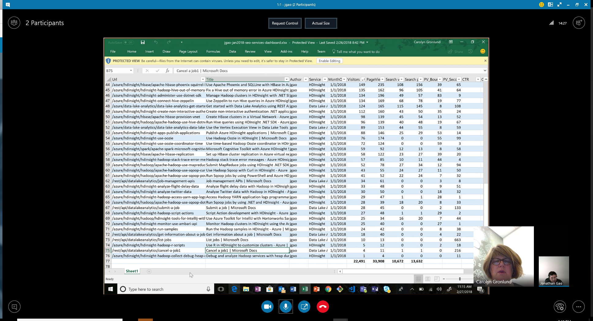
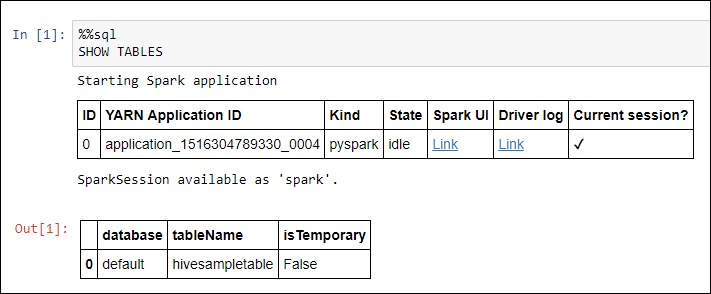
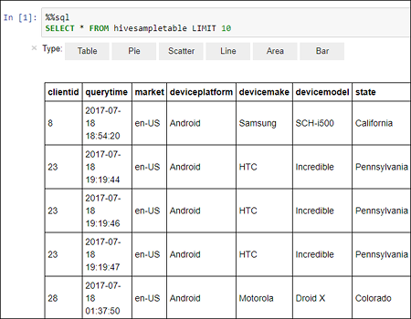

# Quickstart: Create Apache Spark cluster in Azure HDInsight using Resource Manager template

Learn how to create an [Apache Spark](https://spark.apache.org/) cluster in Azure HDInsight, and how to run Spark SQL queries against [Apache Hive](https://hive.apache.org/) tables. Apache Spark enables fast data analytics and cluster computing using in-memory processing. For information on Spark on HDInsight, see [Overview: Apache Spark on Azure HDInsight](apache-spark-overview.md).

In this quickstart, you use a Resource Manager template to create an HDInsight Spark cluster. Similar templates can be viewed at [Azure quickstart templates](https://azure.microsoft.com/resources/templates/?resourceType=Microsoft.Hdinsight&pageNumber=1&sort=Popular). The template reference can be found [here](https://docs.microsoft.com/azure/templates/microsoft.hdinsight/allversions).

The cluster uses Azure Storage Blobs as the cluster storage. For more information on using Data Lake Storage Gen2, see [Quickstart: Set up clusters in HDInsight](../../storage/data-lake-storage/quickstart-create-connect-hdi-cluster.md).

> [!IMPORTANT]  
> Billing for HDInsight clusters is prorated per minute, whether you are using them or not. Be sure to delete your cluster after you have finished using it. For more information, see the [Clean up resources](#clean-up-resources) section of this article.

If you don't have an Azure subscription, [create a free account](https://azure.microsoft.com/free/) before you begin.

## Create an HDInsight Spark cluster

Create an HDInsight Spark cluster using an Azure Resource Manager template. The template can be found in [GitHub](https://azure.microsoft.com/resources/templates/101-hdinsight-spark-linux/). For the JSON syntax and properties of the cluster, see [Microsoft.HDInsight/clusters](/azure/templates/microsoft.hdinsight/clusters).

1. Select the following link to open the template in the Azure portal in a new browser tab:

    <a href="https://portal.azure.com/#create/Microsoft.Template/uri/https%3A%2F%2Fraw.githubusercontent.com%2FAzure%2Fazure-quickstart-templates%2Fmaster%2F101-hdinsight-spark-linux%2Fazuredeploy.json" target="_blank">Deploy to Azure</a>

2. Enter the following values:

    | Property | Value |
    |---|---|
    |**Subscription**|Select your Azure subscription used for creating this cluster. The subscription used for this quickstart is **&lt;Azure subscription name>**. |
    | **Resource group**|Create a resource group or select an existing one. Resource group is used to manage Azure resources for your projects. The new resource group name used for this quickstart is **myspark20180403rg**.|
    | **Location**|Select a location for the resource group. The template uses this location for creating the cluster as well as for the default cluster storage. The location used for this quickstart is **East US 2**.|
    | **ClusterName**|Enter a name for the HDInsight cluster that you want to create. The new cluster name used for this quickstart is **myspark20180403**.|
    | **Cluster login name and password**|The default login name is admin. Choose a password for the cluster login. The login name used for this quickstart is **admin**.|
    | **SSH user name and password**|Choose a password for the SSH user. The SSH user name used for this quickstart is **sshuser**.|

    

3. Select **I agree to the terms and conditions stated above**, select **Pin to dashboard**, and then select **Purchase**. You can see a new tile titled **Deploying Template deployment**. It takes about 20 minutes to create the cluster. The cluster must be created before you can proceed to the next session.

If you run into an issue with creating HDInsight clusters, it could be that you do not have the right permissions to do so. For more information, see [Access control requirements](../hdinsight-hadoop-create-linux-clusters-portal.md).

## Install IntelliJ/Eclipse for Spark application
Use the Azure Toolkit for IntelliJ/Eclipse plug-in to develop Spark applications written in [Scala](https://www.scala-lang.org/), and then submit them to an Azure HDInsight Spark cluster directly from the IntelliJ/Eclipse integrated development environment (IDE). For more information, see [Use IntelliJ to author/submit Spark application](./apache-spark-intellij-tool-plugin.md) and [Use Eclipse to author/submit Spark application](./apache-spark-eclipse-tool-plugin.md).

## Install VSCode for PySpark/hive applications
Learn how to use the Azure HDInsight Tools for Visual Studio Code (VSCode) to create and submit Hive batch jobs, interactive Hive queries, PySpark batch, and PySpark interactive scripts. The Azure HDInsight Tools can be installed on the platforms that are supported by VSCode. These include Windows, Linux, and macOS. For more information, see [Use VSCode to author/submit PySpark application](../hdinsight-for-vscode.md).

## Create a Jupyter notebook

[Jupyter Notebook](https://jupyter.org/) is an interactive notebook environment that supports various programming languages. The notebook allows you to interact with your data, combine code with markdown text and perform simple visualizations.

1. Open the [Azure portal](https://portal.azure.com).
2. Select **HDInsight clusters**, and then select the cluster you created.

    

3. From the portal, in **Cluster dashboards** section, click on **Jupyter Notebook**. If prompted, enter the cluster login credentials for the cluster.

   

4. Select **New** > **PySpark** to create a notebook.

   

   A new notebook is created and opened with the name Untitled(Untitled.pynb).


## Run Spark SQL statements

SQL (Structured Query Language) is the most common and widely used language for querying and transforming data. Spark SQL functions as an extension to Apache Spark for processing structured data, using the familiar SQL syntax.

1. Verify the kernel is ready. The kernel is ready when you see a hollow circle next to the kernel name in the notebook. Solid circle denotes that the kernel is busy.

    

    When you start the notebook for the first time, the kernel performs some tasks in the background. Wait for the kernel to be ready.
2. Paste the following code in an empty cell, and then press **SHIFT + ENTER** to run the code. The command lists the Hive tables on the cluster:

    ```sql
    %%sql
    SHOW TABLES
    ```
    When you use a Jupyter Notebook with your HDInsight Spark cluster, you get a preset `spark` session that you can use to run Hive queries using Spark SQL. `%%sql` tells Jupyter Notebook to use the preset `spark` session to run the Hive query. The query retrieves the top 10 rows from a Hive table (**hivesampletable**) that comes with all HDInsight clusters by default. The first time you submit the query Jupyter will create Spark Application for the notebook. It takes about 30 seconds to complete. Once the spark application is ready the query is executed in about a second and produces the results. The output looks like:

    

    Every time you run a query in Jupyter, your web browser window title shows a **(Busy)** status along with the notebook title. You also see a solid circle next to the **PySpark** text in the top-right corner.

2. Run another query to see the data in `hivesampletable`.

    ```sql
    %%sql
    SELECT * FROM hivesampletable LIMIT 10
    ```
    
    The screen shall refresh to show the query output.

    

2. From the **File** menu on the notebook, select **Close and Halt**. Shutting down the notebook releases the cluster resources, including Spark Application.

## Clean up resources
HDInsight saves your data and Jupyter notebooks in Azure Storage or Azure Data Lake Store, so you can safely delete a cluster when it is not in use. You are also charged for an HDInsight cluster, even when it is not in use. Since the charges for the cluster are many times more than the charges for storage, it makes economic sense to delete clusters when they are not in use. If you plan to work on the tutorial listed in [Next steps](#next-steps) immediately, you might want to keep the cluster.

Switch back to the Azure portal, and select **Delete**.


You can also select the resource group name to open the resource group page, and then select **Delete resource group**. By deleting the resource group, you delete both the HDInsight Spark cluster, and the default storage account.

## Next steps

In this quickstart, you learned how to create an HDInsight Spark cluster and run a basic Spark SQL query. Advance to the next tutorial to learn how to use an HDInsight Spark cluster to run interactive queries on sample data.

> [!div class="nextstepaction"]
>[Run interactive queries on Apache Spark](./apache-spark-load-data-run-query.md)


