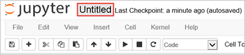

# Run interactive queries on Spark clusters in HDInsight

Learn how to use Jupyter notebook to run interactive Spark SQL queries against a Spark cluster. [Jupyter notebook](http://jupyter-notebook.readthedocs.io/en/latest/notebook.html) is a browser-based application that extends the console-based interactive experience to the Web. 

Jupyter notebooks on HDInsight clusters support three kernels - **PySpark**, **PySpark3** and **Spark**. The **PySpark** kernel is used in this tutorial. For more information about the kernels, and the benefits of using **PySpark**, see [Use Jupyter notebook kernels with Apache Spark clusters in HDInsight](apache-spark-jupyter-notebook-kernels.md).

## Prerequisites

* **An Azure HDInsight Spark cluster**. For instructions, see [Create an Apache Spark cluster in Azure HDInsight](apache-spark-jupyter-spark-sql.md).

## Create a Jupyter notebook to run interactive queries

To run queries, we use sample data that is by default available in the storage associated with the cluster. However, you must first load that data into Spark as a dataframe. Once you have the dataframe, you can run queries on it using the Jupyter notebook. In this article, you look at how to:

* Register a sample data set as a Spark dataframe.
* Run queries on the dataframe.

Let's get started.

1. Open the [Azure portal](https://portal.azure.com/).
2. Open your Spark cluster.  For the instructions, see [List and show clusters](../hdinsight-administer-use-portal-linux.md#list-and-show-clusters)
3. From **Quick links**, click **Cluster dashboards**, and then click **Jupyter Notebook**. 

   

   > [!NOTE]
   > You may also access the Jupyter notebook for your cluster by opening the following URL in your browser. Replace **CLUSTERNAME** with the name of your cluster:
   >
   > `https://CLUSTERNAME.azurehdinsight.net/jupyter`
   >
  
4. Enter the cluster admin credentials.
3. Click **New**, and then click **PySpark** to create a notebook

   

   A new notebook is created and opened with the name Untitled(Untitled.pynb). Click the notebook name at the top, and enter a friendly name if you want.

    

5. Paste the following code in an empty cell, and then press **SHIFT + ENTER** to run the code. The code imports the types required for this scenario:

    ```
    from pyspark.sql import *
    from pyspark.sql.types import *
    ```
    By using the PySpark kernel to create a notebook, the Spark and Hive contexts are automatically created for you when you run the first code cell. You do not need to explicitly create any contexts.

    When running an interactive query in Jupyter, the web browser window or tab caption shows a **(Busy)** status along with the notebook title. You also see a solid circle next to the **PySpark** text in the top-right corner. After the job is completed, it changes to a hollow circle.

    

6. Run the following code to create a dataframe and a temporary table (**hvac**) by running the following code. For this tutorial, we do not create all the columns available in the CSV file. 

    ```
    # Create an RDD from sample data
    hvacText = sc.textFile("wasbs:///HdiSamples/HdiSamples/SensorSampleData/hvac/HVAC.csv")
    
    # Create a schema for our data
    Entry = Row('Date', 'Time', 'TargetTemp', 'ActualTemp', 'BuildingID')
    
    # Parse the data and create a schema
    hvacParts = hvacText.map(lambda s: s.split(',')).filter(lambda s: s[0] != 'Date')
    hvac = hvacParts.map(lambda p: Entry(str(p[0]), str(p[1]), int(p[2]), int(p[3]), int(p[6])))
    
    # Infer the schema and create a table       
    hvacTable = sqlContext.createDataFrame(hvac)
    hvacTable.registerTempTable('hvactemptable')
    dfw = DataFrameWriter(hvacTable)
    dfw.saveAsTable('hvac')
    ```
    The following screenshot shows a snapshot of the HVAC.csv file. The csv file comes with all HDInsigt Spark clusters. The data captures the temperature variations of a building.

    

7. Once the table is created, run an interactive query on the data, use the following code.

    ```
    %%sql
    SELECT buildingID, (targettemp - actualtemp) AS temp_diff, date FROM hvac WHERE date = \"6/1/13\"
    ```

   Because the PySpark kernel is used in the notebook, you can now directly run an interactive SQL query on the temporary table **hvac** that you created by using the `%%sql` magic. For more information about the `%%sql` magic, and other magics available with the PySpark kernel, see [Kernels available on Jupyter notebooks with Spark HDInsight clusters](apache-spark-jupyter-notebook-kernels.md#parameters-supported-with-the-sql-magic).

   The following tabular output is displayed by default.

     

9. You can also see the results in other visualizations as well. To see an area graph for the same output, select **Area** then set other values as shown.

    

10. From the **File** menu on the notebook, click **Save and Checkpoint**. 

11. If you're starting the [next tutorial](apache-spark-use-bi-tools.md) now, leave the notebook open. If not, shut down the notebook to release the cluster resources: from the **File** menu on the notebook, click **Close and Halt**.

## Next step

In this article you learned how to run interactive queries in Spark using Jupyter notebook. Advance to the next article to see how the data you registered in Spark can be pulled into a BI analytics tool such as Power BI and Tableau. 

> [!div class="nextstepaction"]
>[Spark BI using data visualization tools with Azure HDInsight](apache-spark-use-bi-tools.md)


