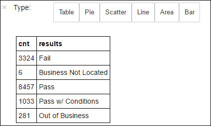

# Use Apache Spark MLlib to build a machine learning application and analyze a dataset

Learn how to use Apache Spark MLlib to create a machine learning application. The application will do predictive analysis on an open dataset. From Spark's built-in machine learning libraries, this example uses *classification* through logistic regression.

MLlib is a core Spark library that provides many utilities useful for machine learning tasks, such as:

* Classification
* Regression
* Clustering
* Modeling
* Singular value decomposition (SVD) and principal component analysis (PCA)
* Hypothesis testing and calculating sample statistics

## Understand classification and logistic regression

*Classification*, a popular machine learning task, is the process of sorting input data into categories. It's the job of a classification algorithm to figure out how to assign "labels" to input data that you provide. For example, you could think of a machine learning algorithm that accepts stock information as input. Then divides the stock into two categories: stocks that you should sell and stocks that you should keep.

Logistic regression is the algorithm that you use for classification. Spark's logistic regression API is useful for *binary classification*, or classifying input data into one of two groups. For more information about logistic regressions, see [Wikipedia](https://en.wikipedia.org/wiki/Logistic_regression).

In summary, the process of logistic regression produces a *logistic function*. Use the function to predict the probability that an input vector belongs in one group or the other.  

## Predictive analysis example on food inspection data

In this example, you use Spark to do some predictive analysis on food inspection data (**Food_Inspections1.csv**). Data acquired through the [City of Chicago data portal](https://data.cityofchicago.org/). This dataset contains information about food establishment inspections that were conducted in Chicago. Including information about each establishment, the violations found (if any), and the results of the inspection. The CSV data file is already available in the storage account associated with the cluster at **/HdiSamples/HdiSamples/FoodInspectionData/Food_Inspections1.csv**.

In the steps below, you develop a model to see what it takes to pass or fail a food inspection.

## Create an Apache Spark MLlib machine learning app

1. Create a Jupyter notebook using the PySpark kernel. For the instructions, see [Create a Jupyter notebook](./apache-spark-jupyter-spark-sql.md#create-a-jupyter-notebook).

2. Import the types required for this application. Copy and paste the following code into an empty cell, and then press **SHIFT + ENTER**.

    ```PySpark
    from pyspark.ml import Pipeline
    from pyspark.ml.classification import LogisticRegression
    from pyspark.ml.feature import HashingTF, Tokenizer
    from pyspark.sql import Row
    from pyspark.sql.functions import UserDefinedFunction
    from pyspark.sql.types import *
    ```

    Because of the PySpark kernel, you don't need to create any contexts explicitly. The Spark and Hive contexts are automatically created when you run the first code cell.

## Construct the input dataframe

Use the Spark context to pull the raw CSV data into memory as unstructured text. Then use Python's CSV library to parse each line of the data.

1. Run the following lines to create a Resilient Distributed Dataset (RDD) by importing and parsing the input data.

    ```PySpark
    def csvParse(s):
        import csv
        from StringIO import StringIO
        sio = StringIO(s)
        value = csv.reader(sio).next()
        sio.close()
        return value

    inspections = sc.textFile('/HdiSamples/HdiSamples/FoodInspectionData/Food_Inspections1.csv')\
                    .map(csvParse)
    ```

2. Run the following code to retrieve one row from the RDD, so you can take a look of the data schema:

    ```PySpark
    inspections.take(1)
    ```

    The output is:

    ```
    [['413707',
        'LUNA PARK INC',
        'LUNA PARK  DAY CARE',
        '2049789',
        "Children's Services Facility",
        'Risk 1 (High)',
        '3250 W FOSTER AVE ',
        'CHICAGO',
        'IL',
        '60625',
        '09/21/2010',
        'License-Task Force',
        'Fail',
        '24. DISH WASHING FACILITIES: PROPERLY DESIGNED, CONSTRUCTED, MAINTAINED, INSTALLED, LOCATED AND OPERATED - Comments: All dishwashing machines must be of a type that complies with all requirements of the plumbing section of the Municipal Code of Chicago and Rules and Regulation of the Board of Health. OBSEVERD THE 3 COMPARTMENT SINK BACKING UP INTO THE 1ST AND 2ND COMPARTMENT WITH CLEAR WATER AND SLOWLY DRAINING OUT. INST NEED HAVE IT REPAIR. CITATION ISSUED, SERIOUS VIOLATION 7-38-030 H000062369-10 COURT DATE 10-28-10 TIME 1 P.M. ROOM 107 400 W. SURPERIOR. | 36. LIGHTING: REQUIRED MINIMUM FOOT-CANDLES OF LIGHT PROVIDED, FIXTURES SHIELDED - Comments: Shielding to protect against broken glass falling into food shall be provided for all artificial lighting sources in preparation, service, and display facilities. LIGHT SHIELD ARE MISSING UNDER HOOD OF  COOKING EQUIPMENT AND NEED TO REPLACE LIGHT UNDER UNIT. 4 LIGHTS ARE OUT IN THE REAR CHILDREN AREA,IN THE KINDERGARDEN CLASS ROOM. 2 LIGHT ARE OUT EAST REAR, LIGHT FRONT WEST ROOM. NEED TO REPLACE ALL LIGHT THAT ARE NOT WORKING. | 35. WALLS, CEILINGS, ATTACHED EQUIPMENT CONSTRUCTED PER CODE: GOOD REPAIR, SURFACES CLEAN AND DUST-LESS CLEANING METHODS - Comments: The walls and ceilings shall be in good repair and easily cleaned. MISSING CEILING TILES WITH STAINS IN WEST,EAST, IN FRONT AREA WEST, AND BY THE 15MOS AREA. NEED TO BE REPLACED. | 32. FOOD AND NON-FOOD CONTACT SURFACES PROPERLY DESIGNED, CONSTRUCTED AND MAINTAINED - Comments: All food and non-food contact equipment and utensils shall be smooth, easily cleanable, and durable, and shall be in good repair. SPLASH GUARDED ARE NEEDED BY THE EXPOSED HAND SINK IN THE KITCHEN AREA | 34. FLOORS: CONSTRUCTED PER CODE, CLEANED, GOOD REPAIR, COVING INSTALLED, DUST-LESS CLEANING METHODS USED - Comments: The floors shall be constructed per code, be smooth and easily cleaned, and be kept clean and in good repair. INST NEED TO ELEVATE ALL FOOD ITEMS 6INCH OFF THE FLOOR 6 INCH AWAY FORM WALL.  ',
        '41.97583445690982',
        '-87.7107455232781',
        '(41.97583445690982, -87.7107455232781)']]
    ```

    The output gives you an idea of the schema of the input file. It includes the name of every establishment, and the type of establishment. Also, the address, the data of the inspections, and the location, among other things.

3. Run the following code to create a dataframe (*df*) and a temporary table (*CountResults*) with a few columns that are useful for the predictive analysis. `sqlContext` is used to do transformations on structured data.

    ```PySpark
    schema = StructType([
    StructField("id", IntegerType(), False),
    StructField("name", StringType(), False),
    StructField("results", StringType(), False),
    StructField("violations", StringType(), True)])

    df = spark.createDataFrame(inspections.map(lambda l: (int(l[0]), l[1], l[12], l[13])) , schema)
    df.registerTempTable('CountResults')
    ```

    The four columns of interest in the dataframe are **ID**, **name**, **results**, and **violations**.

4. Run the following code to get a small sample of the data:

    ```PySpark
    df.show(5)
    ```

    The output is:

    ```
    +------+--------------------+-------+--------------------+
    |    id|                name|results|          violations|
    +------+--------------------+-------+--------------------+
    |413707|       LUNA PARK INC|   Fail|24. DISH WASHING ...|
    |391234|       CAFE SELMARIE|   Fail|2. FACILITIES TO ...|
    |413751|          MANCHU WOK|   Pass|33. FOOD AND NON-...|
    |413708|BENCHMARK HOSPITA...|   Pass|                    |
    |413722|           JJ BURGER|   Pass|                    |
    +------+--------------------+-------+--------------------+
    ```

## Understand the data

Let's start to get a sense of what the dataset contains. 

1. Run the following code to show the distinct values in the **results** column:

    ```PySpark
    df.select('results').distinct().show()
    ```

    The output is:

    ```
    +--------------------+
    |             results|
    +--------------------+
    |                Fail|
    |Business Not Located|
    |                Pass|
    |  Pass w/ Conditions|
    |     Out of Business|
    +--------------------+
    ```

2. Run the following code to visualize the distribution of these results:

    ```PySpark
    %%sql -o countResultsdf
    SELECT COUNT(results) AS cnt, results FROM CountResults GROUP BY results
    ```

    The `%%sql` magic followed by `-o countResultsdf` ensures that the output of the query is persisted locally on the Jupyter server (typically the headnode of the cluster). The output is persisted as a [Pandas](https://pandas.pydata.org/) dataframe with the specified name **countResultsdf**. For more information about the `%%sql` magic, and other magics available with the PySpark kernel, see [Kernels available on Jupyter notebooks with Apache Spark HDInsight clusters](apache-spark-jupyter-notebook-kernels.md#parameters-supported-with-the-sql-magic).

    The output is:

    

3. You can also use Matplotlib, a library used to construct visualization of data, to create a plot. Because the plot must be created from the locally persisted **countResultsdf** dataframe, the code snippet must begin with the `%%local` magic. This action ensures that the code is run locally on the Jupyter server.

    ```PySpark
    %%local
    %matplotlib inline
    import matplotlib.pyplot as plt

    labels = countResultsdf['results']
    sizes = countResultsdf['cnt']
    colors = ['turquoise', 'seagreen', 'mediumslateblue', 'palegreen', 'coral']
    plt.pie(sizes, labels=labels, autopct='%1.1f%%', colors=colors)
    plt.axis('equal')
    ```

    To predict a food inspection outcome, you need to develop a model based on the violations. Because logistic regression is a binary classification method, it makes sense to group the result data into two categories: **Fail** and **Pass**:

   - Pass
       - Pass
       - Pass w/ conditions
   - Fail
       - Fail
   - Discard
       - Business not located
       - Out of Business

     Data with the other results ("Business Not Located" or "Out of Business") aren't useful, and they make up a small percentage of the results anyway.

4. Run the following code to convert the existing dataframe(`df`) into a new dataframe where each inspection is represented as a label-violations pair. In this case, a label of `0.0` represents a failure, a label of `1.0` represents a success, and a label of `-1.0` represents some results besides those two results.

    ```PySpark
    def labelForResults(s):
        if s == 'Fail':
            return 0.0
        elif s == 'Pass w/ Conditions' or s == 'Pass':
            return 1.0
        else:
            return -1.0
    label = UserDefinedFunction(labelForResults, DoubleType())
    labeledData = df.select(label(df.results).alias('label'), df.violations).where('label >= 0')
    ```

5. Run the following code to show one row of the labeled data:

    ```PySpark
    labeledData.take(1)
    ```

    The output is:

    ```
    [Row(label=0.0, violations=u"41. PREMISES MAINTAINED FREE OF LITTER, UNNECESSARY ARTICLES, CLEANING  EQUIPMENT PROPERLY STORED - Comments: All parts of the food establishment and all parts of the property used in connection with the operation of the establishment shall be kept neat and clean and should not produce any offensive odors.  REMOVE MATTRESS FROM SMALL DUMPSTER. | 35. WALLS, CEILINGS, ATTACHED EQUIPMENT CONSTRUCTED PER CODE: GOOD REPAIR, SURFACES CLEAN AND DUST-LESS CLEANING METHODS - Comments: The walls and ceilings shall be in good repair and easily cleaned.  REPAIR MISALIGNED DOORS AND DOOR NEAR ELEVATOR.  DETAIL CLEAN BLACK MOLD LIKE SUBSTANCE FROM WALLS BY BOTH DISH MACHINES.  REPAIR OR REMOVE BASEBOARD UNDER DISH MACHINE (LEFT REAR KITCHEN). SEAL ALL GAPS.  REPLACE MILK CRATES USED IN WALK IN COOLERS AND STORAGE AREAS WITH PROPER SHELVING AT LEAST 6' OFF THE FLOOR.  | 38. VENTILATION: ROOMS AND EQUIPMENT VENTED AS REQUIRED: PLUMBING: INSTALLED AND MAINTAINED - Comments: The flow of air discharged from kitchen fans shall always be through a duct to a point above the roofline.  REPAIR BROKEN VENTILATION IN MEN'S AND WOMEN'S WASHROOMS NEXT TO DINING AREA. | 32. FOOD AND NON-FOOD CONTACT SURFACES PROPERLY DESIGNED, CONSTRUCTED AND MAINTAINED - Comments: All food and non-food contact equipment and utensils shall be smooth, easily cleanable, and durable, and shall be in good repair.  REPAIR DAMAGED PLUG ON LEFT SIDE OF 2 COMPARTMENT SINK.  REPAIR SELF CLOSER ON BOTTOM LEFT DOOR OF 4 DOOR PREP UNIT NEXT TO OFFICE.")]
    ```

## Create a logistic regression model from the input dataframe

The final task is to convert the labeled data. Convert the data into a format that can be analyzed by logistic regression. The input to a logistic regression algorithm needs a set of *label-feature vector pairs*. Where the "feature vector" is a vector of numbers that represent the input point. So, you need to convert the "violations" column, which is semi-structured and contains many comments in free-text. Convert the column to an array of real numbers that a machine could easily understand.

One standard machine learning approach for processing natural language is to assign each distinct word an "index". Then pass a vector to the machine learning algorithm. Such that each index's value contains the relative frequency of that word in the text string.

MLlib provides an easy way to do this operation. First, "tokenize" each violations string to get the individual words in each string. Then, use a `HashingTF` to convert each set of tokens into a feature vector that can then be passed to the logistic regression algorithm to construct a model. You conduct all of these steps in sequence using a "pipeline".

```PySpark
tokenizer = Tokenizer(inputCol="violations", outputCol="words")
hashingTF = HashingTF(inputCol=tokenizer.getOutputCol(), outputCol="features")
lr = LogisticRegression(maxIter=10, regParam=0.01)
pipeline = Pipeline(stages=[tokenizer, hashingTF, lr])

model = pipeline.fit(labeledData)
```

## Evaluate the model using another dataset

You can use the model you created earlier to *predict* what the results of new inspections will be. The predictions are based on the violations that were observed. You trained this model on the dataset **Food_Inspections1.csv**. You can use a second dataset, **Food_Inspections2.csv**, to *evaluate* the strength of this model on the new data. This second data set (**Food_Inspections2.csv**) is in the default storage container associated with the cluster.

1. Run the following code to create a new dataframe, **predictionsDf** that contains the prediction generated by the model. The snippet also creates a temporary table called **Predictions** based on the dataframe.

    ```PySpark
    testData = sc.textFile('wasbs:///HdiSamples/HdiSamples/FoodInspectionData/Food_Inspections2.csv')\
                .map(csvParse) \
                .map(lambda l: (int(l[0]), l[1], l[12], l[13]))
    testDf = spark.createDataFrame(testData, schema).where("results = 'Fail' OR results = 'Pass' OR results = 'Pass w/ Conditions'")
    predictionsDf = model.transform(testDf)
    predictionsDf.registerTempTable('Predictions')
    predictionsDf.columns
    ```

    You should see an output like the following text:

    ```
    ['id',
        'name',
        'results',
        'violations',
        'words',
        'features',
        'rawPrediction',
        'probability',
        'prediction']
    ```

1. Look at one of the predictions. Run this snippet:

    ```PySpark
    predictionsDf.take(1)
    ```

   There's a prediction for the first entry in the test data set.

1. The `model.transform()` method applies the same transformation to any new data with the same schema, and arrive at a prediction of how to classify the data. You can do some statistics to get a sense of how the predictions were:

    ```PySpark
    numSuccesses = predictionsDf.where("""(prediction = 0 AND results = 'Fail') OR
                                            (prediction = 1 AND (results = 'Pass' OR
                                                                results = 'Pass w/ Conditions'))""").count()
    numInspections = predictionsDf.count()

    print "There were", numInspections, "inspections and there were", numSuccesses, "successful predictions"
    print "This is a", str((float(numSuccesses) / float(numInspections)) * 100) + "%", "success rate"
    ```

    The output looks like the following text:

    ```
    There were 9315 inspections and there were 8087 successful predictions
    This is a 86.8169618894% success rate
    ```

    Using logistic regression with Spark gives you a model of the relationship between violations descriptions in English. And whether a given business would pass or fail a food inspection.

## Create a visual representation of the prediction

You can now construct a final visualization to help you reason about the results of this test.

1. You start by extracting the different predictions and results from the **Predictions** temporary table created earlier. The following queries separate the output as *true_positive*, *false_positive*, *true_negative*, and *false_negative*. In the queries below, you turn off visualization by using `-q` and also save the output (by using `-o`) as dataframes that can be then used with the `%%local` magic.

    ```PySpark
    %%sql -q -o true_positive
    SELECT count(*) AS cnt FROM Predictions WHERE prediction = 0 AND results = 'Fail'
    ```

    ```PySpark
    %%sql -q -o false_positive
    SELECT count(*) AS cnt FROM Predictions WHERE prediction = 0 AND (results = 'Pass' OR results = 'Pass w/ Conditions')
    ```

    ```PySpark
    %%sql -q -o true_negative
    SELECT count(*) AS cnt FROM Predictions WHERE prediction = 1 AND results = 'Fail'
    ```

    ```PySpark
    %%sql -q -o false_negative
    SELECT count(*) AS cnt FROM Predictions WHERE prediction = 1 AND (results = 'Pass' OR results = 'Pass w/ Conditions')
    ```

1. Finally, use the following snippet to generate the plot using **Matplotlib**.

    ```PySpark
    %%local
    %matplotlib inline
    import matplotlib.pyplot as plt

    labels = ['True positive', 'False positive', 'True negative', 'False negative']
    sizes = [true_positive['cnt'], false_positive['cnt'], false_negative['cnt'], true_negative['cnt']]
    colors = ['turquoise', 'seagreen', 'mediumslateblue', 'palegreen', 'coral']
    plt.pie(sizes, labels=labels, autopct='%1.1f%%', colors=colors)
    plt.axis('equal')
    ```

    You should see the following output:

    

    In this chart, a "positive" result refers to the failed food inspection, while a negative result refers to a passed inspection.

## Shut down the notebook

After you have finished running the application, you should shut down the notebook to release the resources. To do so, from the **File** menu on the notebook, select **Close and Halt**. This action shuts down and closes the notebook.

## Next steps

* [Overview: Apache Spark on Azure HDInsight](apache-spark-overview.md)
* [Website log analysis using Apache Spark in HDInsight](apache-spark-custom-library-website-log-analysis.md)
* [Microsoft Cognitive Toolkit deep learning model with Azure HDInsight](apache-spark-microsoft-cognitive-toolkit.md)
