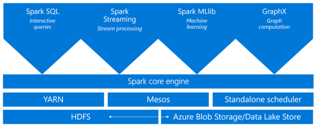
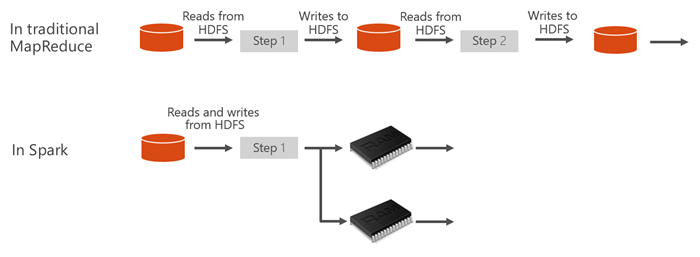
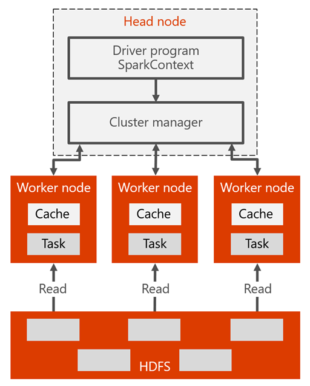

# Apache Spark in Azure HDInsight overview

This article provides you with an overview to Apache Spark in Azure HDInsight. <a href="http://spark.apache.org/" target="_blank">Apache Spark</a> is an open-source parallel processing framework that supports in-memory processing to boost the performance of big-data analytic applications. Spark cluster in HDInsight is compatible with Azure Storage (WASB) and Azure Data Lake Store. So you can use HDInsight Spark clusters to process your data stored in Azure.

## What is Spark?

Spark provides primitives for in-memory cluster computing. A Spark job can load and cache data into memory and query it repeatedly. In-memory computer is much more quickly than disk-based systems, such as Hadoop, which shares data through HDFS. Spark also integrates into the Scala programming language to let you manipulate distributed data sets like local collections. There's no need to structure everything as map and reduce operations.

Spark clusters in HDInsight offer a fully managed Spark service. Benefits of creating a Spark cluster in HDInsight are listed here.

| Feature | Description |
| --- | --- |
| Ease of creating Spark clusters |You can create a new Spark cluster in HDInsight in minutes using the Azure portal, Azure PowerShell, or the HDInsight .NET SDK. See [Get started with Spark cluster in HDInsight](apache-spark-jupyter-spark-sql.md) |
| Ease of use |Spark cluster in HDInsight include Jupyter and Zeppelin notebooks. You can use these notebooks for interactive data processing and visualization.|
| REST APIs |Spark clusters in HDInsight include [Livy](https://github.com/cloudera/hue/tree/master/apps/spark/java#welcome-to-livy-the-rest-spark-server), a REST API-based Spark job server to remotely submit and monitor jobs. |
| Support for Azure Data Lake Store | Spark cluster in HDInsight can use Azure Data Lake Store as both the primary storage or additional storage. For more information on Data Lake Store, see [Overview of Azure Data Lake Store](../../data-lake-store/data-lake-store-overview.md). |
| Integration with Azure services |Spark cluster in HDInsight comes with a connector to Azure Event Hubs. Customers can build streaming applications using the Event Hubs, in addition to [Kafka](http://kafka.apache.org/), which is already available as part of Spark. |
| Support for R Server | You can set up an R Server in HDInsight Spark cluster to run distributed R computations with the speeds promised with a Spark cluster. For more information, see [Get started using R Server in HDInsight](../r-server/r-server-get-started.md). |
| Integration with third-party IDEs | HDInsight provides IDE plugins to be used to create and submit applications to an HDInsight Spark cluster. For more information, see [Use Azure Toolkit for IntelliJ IDEA](apache-spark-intellij-tool-plugin.md) and [Use Azure Toolkit for Eclipse](apache-spark-eclipse-tool-plugin.md).|
| Concurrent Queries |Spark clusters in HDInsight support concurrent queries. This capability enables multiple queries from one user or multiple queries from various users and applications to share the same cluster resources. |
| Caching on SSDs |You can choose to cache data either in memory or in SSDs attached to the cluster nodes. Caching in memory provides the best query performance but could be expensive. Caching in SSDs provides a great option for improving query performance without the need to create a cluster of a size that is required to fit the entire dataset in memory. |
| Integration with BI Tools |Spark clusters in HDInsight provide connectors for  BI tools such as [Power BI](http://www.powerbi.com/) for data analytics. |
| Pre-loaded Anaconda libraries |Spark clusters in HDInsight come with Anaconda libraries pre-installed. [Anaconda](http://docs.continuum.io/anaconda/) provides close to 200 libraries for machine learning, data analysis, visualization, etc. |
| Scalability | HDInsight allow you to change the number of cluster nodes. Also, Spark clusters can be dropped with no loss of data since all the data is stored in Azure Storage or Data Lake Store. |
| 24/7 Support |Spark clusters in HDInsight come with  enterprise-level 24/7 support and an SLA of 99.9% up-time. |

Spark clusters in HDInsight include the following components that are available on the clusters by default.

* [Spark Core](https://spark.apache.org/docs/1.5.1/). Includes Spark Core, Spark SQL, Spark streaming APIs, GraphX, and MLlib.
* [Anaconda](http://docs.continuum.io/anaconda/)
* [Livy](https://github.com/cloudera/hue/tree/master/apps/spark/java#welcome-to-livy-the-rest-spark-server)
* [Jupyter notebook](https://jupyter.org)
* [Zeppelin notebook](http://zeppelin-project.org/)

Spark clusters in HDInsight also provide an [ODBC driver](http://go.microsoft.com/fwlink/?LinkId=616229) for connectivity to Spark clusters in HDInsight from BI tools such as Microsoft Power BI.

## Spark cluster architecture

It is easier to understand the components involved by understanding how Spark runs on clusters.

Spark applications run as independent sets of processes on a cluster, coordinated by the SparkContext object in your main program (called the driver program).

The SparkContext can connect to several types of cluster managers, which allocate resources across applications. These cluster managers include Apache Mesos, Apache YARN, or the Spark cluster manager. In HDInsight, Spark runs using the YARN cluster manager. Once connected, Spark acquires executors on workers nodes in the cluster, which are processes that run computations and store data for your application. Next, it sends your application code (defined by JAR or Python files passed to SparkContext) to the executors. Finally, SparkContext sends tasks to the executors to run.

The SparkContext runs the user's main function and executes the various parallel operations on the worker nodes. Then, the SparkContext collects the results of the operations. The worker nodes read and write data from and to the Hadoop distributed file system (HDFS). The worker nodes also cache transformed data in-memory as Resilient Distributed Datasets (RDDs).

The SparkContext connects to the Spark master and is responsible for converting an application to a directed graph (DAG) of individual tasks that get executed within an executor process on the worker nodes. Each application gets its own executor processes, which stay up for the duration of the whole application and run tasks in multiple threads.

## Spark in HDInsight use cases

Spark clusters in HDInsight enable the following key scenarios:

- Interactive data analysis and BI

    Apache Spark in HDInsight stores data in Azure Storage or Azure Data Lake Store. Business experts and key decision makers can analyze and build reports over that data and use Microsoft Power BI to build interactive reports from the analyzed data. Analysts can start from unstructured/semi structured data in cluster storage, define a schema for the data using notebooks, and then build data models using Microsoft Power BI. Spark clusters in HDInsight also support a number of third-party BI tools such as Tableau making it an ideal platform for data analysts, business experts, and key decision makers.

    [Look at a tutorial: Visualize Spark data using Power BI](apache-spark-use-bi-tools.md)
- Spark Machine Learning

    Apache Spark comes with [MLlib](http://spark.apache.org/mllib/), a machine learning library built on top of Spark that you can use from a Spark cluster in HDInsight. Spark cluster in HDInsight also includes Anaconda, a Python distribution with a variety of packages for machine learning. Couple this with a built-in support for Jupyter and Zeppelin notebooks, and you have a top-of-the-line environment for creating machine learning applications.

    [Look at a tutorial: Predict building temperatures using HVAC data](apache-spark-ipython-notebook-machine-learning.md)

    [Look at a tutorial: Predict food inspection results](apache-spark-machine-learning-mllib-ipython.md)    
- Spark streaming and real-time data analysis

    Spark clusters in HDInsight offer a rich support for building real-time analytics solutions. While Spark already has connectors to ingest data from many sources like Kafka, Flume, Twitter, ZeroMQ, or TCP sockets, Spark in HDInsight adds first-class support for ingesting data from Azure Event Hubs. Event Hubs is the most widely used queuing service on Azure. Having an out-of-the-box support for Event Hubs makes Spark clusters in HDInsight an ideal platform for building real-time analytics pipeline.
    
## Where do I start?

Start with [QuickStart: create a Spark cluster in HDInsight and run interactive query using Jupyter](./apache-spark-jupyter-spark-sql.md). 

## Next Steps

In this overview, you get some basic understanding of Apache Spark in Azure HDInsight. Advance to the next article to learn how to create an HDInsight Spark cluster and run some simple Spark SQL queries:

> [!div class="nextstepaction"]
>[Create an Spark cluster in HDInsight](./apache-spark-jupyter-spark-sql.md)