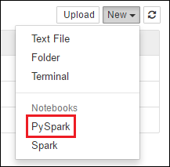
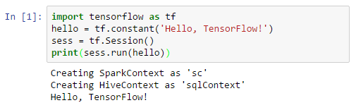

# Use Script Action to install external Python packages for Jupyter notebooks in Apache Spark clusters on HDInsight
> [!div class="op_single_selector"]
> * [Using cell magic](apache-spark-jupyter-notebook-use-external-packages.md)
> * [Using Script Action](apache-spark-python-package-installation.md)
>
>

Learn how to use Script Actions to configure an Apache Spark cluster on HDInsight (Linux) to use external, community-contributed **python** packages that are not included out-of-the-box in the cluster.

> [!NOTE]
> You can also configure a Jupyter notebook by using `%%configure` magic to use external packages. For instructions, see [Use external packages with Jupyter notebooks in Apache Spark clusters on HDInsight](apache-spark-jupyter-notebook-use-external-packages.md).
> 
> 

You can search the [package index](https://pypi.python.org/pypi) for the complete list of packages that are available. You can also get a list of available packages from other sources. For example, you can install packages made available through [Anaconda](https://docs.continuum.io/anaconda/pkg-docs) or [conda-forge](https://conda-forge.org/feedstocks/).

In this article, you learn how to install the [TensorFlow](https://www.tensorflow.org/) package using Script Action on your cluster and use it via the Jupyter notebook.

## Prerequisites
You must have the following:

* An Azure subscription. See [Get Azure free trial](https://azure.microsoft.com/documentation/videos/get-azure-free-trial-for-testing-hadoop-in-hdinsight/).
* An Apache Spark cluster on HDInsight. For instructions, see [Create Apache Spark clusters in Azure HDInsight](apache-spark-jupyter-spark-sql.md).

   > [!NOTE]
   > If you do not already have a Spark cluster on HDInsight Linux, you can run script actions during cluster creation. Visit the documentation on [how to use custom script actions](https://docs.microsoft.com/azure/hdinsight/hdinsight-hadoop-customize-cluster-linux).
   > 
   > 

## Use external packages with Jupyter notebooks

1. From the [Azure Portal](https://portal.azure.com/), from the startboard, click the tile for your Spark cluster (if you pinned it to the startboard). You can also navigate to your cluster under **Browse All** > **HDInsight Clusters**.   

2. From the Spark cluster blade, click **Script Actions** from the left pane. Run the custom action that installs TensorFlow in the head nodes and the worker nodes. The bash script can be referenced from: https://hdiconfigactions.blob.core.windows.net/linuxtensorflow/tensorflowinstall.sh
Visit the documentation on [how to use custom script actions](https://docs.microsoft.com/azure/hdinsight/hdinsight-hadoop-customize-cluster-linux).

   > [!NOTE]
   > There are two python installations in the cluster. Spark will use the Anaconda python installation located at `/usr/bin/anaconda/bin`. Reference that installation in your custom actions via `/usr/bin/anaconda/bin/pip` and `/usr/bin/anaconda/bin/conda`.
   > 
   > 

3. Open a PySpark Jupyter notebook

    

4. A new notebook is created and opened with the name Untitled.pynb. Click the notebook name at the top, and enter a friendly name.

    

5. You will now `import tensorflow` and run a hello world example. 

    Code to copy:

	    import tensorflow as tf
	    hello = tf.constant('Hello, TensorFlow!')
	    sess = tf.Session()
	    print(sess.run(hello))

	The result looks like this:
	
	

## See also
* [Overview: Apache Spark on Azure HDInsight](apache-spark-overview.md)

### Scenarios
* [Spark with BI: Perform interactive data analysis using Spark in HDInsight with BI tools](apache-spark-use-bi-tools.md)
* [Spark with Machine Learning: Use Spark in HDInsight for analyzing building temperature using HVAC data](apache-spark-ipython-notebook-machine-learning.md)
* [Spark with Machine Learning: Use Spark in HDInsight to predict food inspection results](apache-spark-machine-learning-mllib-ipython.md)
* [Website log analysis using Spark in HDInsight](apache-spark-custom-library-website-log-analysis.md)

### Create and run applications
* [Create a standalone application using Scala](apache-spark-create-standalone-application.md)
* [Run jobs remotely on a Spark cluster using Livy](apache-spark-livy-rest-interface.md)

### Tools and extensions
* [Use external packages with Jupyter notebooks in Apache Spark clusters on HDInsight](apache-spark-jupyter-notebook-use-external-packages.md)
* [Use HDInsight Tools Plugin for IntelliJ IDEA to create and submit Spark Scala applications](apache-spark-intellij-tool-plugin.md)
* [Use HDInsight Tools Plugin for IntelliJ IDEA to debug Spark applications remotely](apache-spark-intellij-tool-plugin-debug-jobs-remotely.md)
* [Use Zeppelin notebooks with a Spark cluster on HDInsight](apache-spark-zeppelin-notebook.md)
* [Kernels available for Jupyter notebook in Spark cluster for HDInsight](apache-spark-jupyter-notebook-kernels.md)
* [Install Jupyter on your computer and connect to an HDInsight Spark cluster](apache-spark-jupyter-notebook-install-locally.md)

### Manage resources
* [Manage resources for the Apache Spark cluster in Azure HDInsight](apache-spark-resource-manager.md)
* [Track and debug jobs running on an Apache Spark cluster in HDInsight](apache-spark-job-debugging.md)
