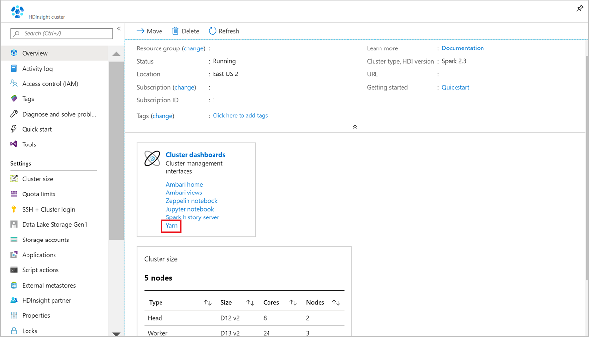

# Manage resources for Apache Spark cluster on Azure HDInsight

Learn how to access the interfaces like [Apache Ambari](https://ambari.apache.org/) UI, [Apache Hadoop YARN](https://hadoop.apache.org/docs/current/hadoop-yarn/hadoop-yarn-site/YARN.html) UI, and the [Spark History Server](./apache-azure-spark-history-server.md) associated with your [Apache Spark](https://spark.apache.org/) cluster, and how to tune the cluster configuration for optimal performance.

## Open the Spark History Server

Spark History Server is the web UI for completed and running Spark applications. It's an extension of Spark's Web UI. For complete information, see [Spark History Server](./apache-azure-spark-history-server.md).

## Open the Yarn UI

You can use the YARN UI to monitor applications that are currently running on the Spark cluster.

1. From the [Azure portal](https://portal.azure.com/), open the Spark cluster. For more information, see [List and show clusters](../hdinsight-administer-use-portal-linux.md#showClusters).

2. From **Cluster dashboards**, select **Yarn**. When prompted, enter the admin credentials for the Spark cluster.

    

   > [!TIP]  
   > Alternatively, you can also launch the YARN UI from the Ambari UI. From the Ambari UI, navigate to **YARN** > **Quick Links** > **Active** > **Resource Manager UI**.

## Optimize clusters for Spark applications

The three key parameters that can be used for Spark configuration depending on application requirements are `spark.executor.instances`, `spark.executor.cores`, and `spark.executor.memory`. An Executor is a process launched for a Spark application. It runs on the worker node and is responsible to carry out the tasks for the application. The default number of executors and the executor sizes for each cluster is calculated based on the number of worker nodes and the worker node size. This information is stored in `spark-defaults.conf` on the cluster head nodes.

The three configuration parameters can be configured at the cluster level (for all applications that run on the cluster) or can be specified for each individual application as well.

### Change the parameters using Ambari UI

1. From the Ambari UI navigate to **Spark2** > **Configs** > **Custom spark2-defaults**.

    

1. The default values are good to have four Spark applications run concurrently on the cluster. You can change these values from the user interface, as shown in the following screenshot:

    

1. Select **Save** to save the configuration changes. At the top of the page, you're prompted to restart all the affected services. Select **Restart**.

    

### Change the parameters for an application running in Jupyter notebook

For applications running in the Jupyter notebook, you can use the `%%configure` magic to make the configuration changes. Ideally, you must make such changes at the beginning of the application, before you run your first code cell. Doing this ensures that the configuration is applied to the Livy session, when it gets created. If you want to change the configuration at a later stage in the application, you must use the `-f` parameter. However, by doing so all progress in the application is lost.

The following snippet shows how to change the configuration for an application running in Jupyter.

    %%configure
    {"executorMemory": "3072M", "executorCores": 4, "numExecutors":10}

Configuration parameters must be passed in as a JSON string and must be on the next line after the magic, as shown in the example column.

### Change the parameters for an application submitted using spark-submit

Following command is an example of how to change the configuration parameters for a batch application that is submitted using `spark-submit`.

    spark-submit --class <the application class to execute> --executor-memory 3072M --executor-cores 4 –-num-executors 10 <location of application jar file> <application parameters>

### Change the parameters for an application submitted using cURL

The following command is an example of how to change the configuration parameters for a batch application that is submitted using cURL.

    curl -k -v -H 'Content-Type: application/json' -X POST -d '{"file":"<location of application jar file>", "className":"<the application class to execute>", "args":[<application parameters>], "numExecutors":10, "executorMemory":"2G", "executorCores":5' localhost:8998/batches

### Change these parameters on a Spark Thrift Server

Spark Thrift Server provides JDBC/ODBC access to a Spark cluster and is used to service Spark SQL queries. Tools like Power BI, Tableau, and so on, use ODBC protocol to communicate with Spark Thrift Server to execute Spark SQL queries as a Spark Application. When a Spark cluster is created, two instances of the Spark Thrift Server are started, one on each head node. Each Spark Thrift Server is visible as a Spark application in the YARN UI.

Spark Thrift Server uses Spark dynamic executor allocation and hence the `spark.executor.instances` isn't used. Instead, Spark Thrift Server uses `spark.dynamicAllocation.maxExecutors` and `spark.dynamicAllocation.minExecutors` to specify the executor count. The configuration parameters `spark.executor.cores`, and `spark.executor.memory` are used to modify the executor size. You can change these parameters as shown in the following steps:

* Expand the **Advanced spark2-thrift-sparkconf** category to update the parameters `spark.dynamicAllocation.maxExecutors`, and `spark.dynamicAllocation.minExecutors`.

    

* Expand the **Custom spark2-thrift-sparkconf** category to update the parameters `spark.executor.cores`, and `spark.executor.memory`.

    

### Change the driver memory of the Spark Thrift Server

Spark Thrift Server driver memory is configured to 25% of the head node RAM size, provided the total RAM size of the head node is greater than 14 GB. You can use the Ambari UI to change the driver memory configuration, as shown in the following screenshot:

From the Ambari UI, navigate to **Spark2** > **Configs** > **Advanced spark2-env**. Then provide the value for **spark_thrift_cmd_opts**.

## Reclaim Spark cluster resources

Because of Spark dynamic allocation, the only resources that are consumed by thrift server are the resources for the two application masters. To reclaim these resources, you must stop the Thrift Server services running on the cluster.

1. From the Ambari UI, from the left pane, select **Spark2**.

2. In the next page, select **Spark2 Thrift Servers**.

    

3. You should see the two headnodes on which the Spark2 Thrift Server is running. Select one of the headnodes.

    

4. The next page lists all the services running on that headnode. From the list, select the drop-down button next to Spark2 Thrift Server, and then select **Stop**.

    
5. Repeat these steps on the other headnode as well.

## Restart the Jupyter service

Launch the Ambari Web UI as shown in the beginning of the article. From the left navigation pane, select **Jupyter**, select **Service Actions**, and then select **Restart All**. This starts the Jupyter service on all the headnodes.

## Monitor resources

Launch the Yarn UI as shown in the beginning of the article. In Cluster Metrics table on top of the screen, check values of **Memory Used** and **Memory Total** columns. If the two values are close, there might not be enough resources to start the next application. The same applies to the **VCores Used** and **VCores Total** columns. Also, in the main view, if there's an application stayed in **ACCEPTED** state and not transitioning into **RUNNING** nor **FAILED** state, this could also be an indication that it isn't getting enough resources to start.

## Kill running applications

1. In the Yarn UI, from the left panel, select **Running**. From the list of running applications, determine the application to be killed and select the **ID**.

    

2. Select **Kill Application** on the top-right corner, then select **OK**.

    

## See also

* [Track and debug jobs running on an Apache Spark cluster in HDInsight](apache-spark-job-debugging.md)

### For data analysts

* [Apache Spark with Machine Learning: Use Spark in HDInsight for analyzing building temperature using HVAC data](apache-spark-ipython-notebook-machine-learning.md)
* [Apache Spark with Machine Learning: Use Spark in HDInsight to predict food inspection results](apache-spark-machine-learning-mllib-ipython.md)
* [Website log analysis using Apache Spark in HDInsight](apache-spark-custom-library-website-log-analysis.md)
* [Application Insight telemetry data analysis using Apache Spark in HDInsight](apache-spark-analyze-application-insight-logs.md)

### For Apache Spark developers

* [Create a standalone application using Scala](apache-spark-create-standalone-application.md)
* [Run jobs remotely on an Apache Spark cluster using Apache Livy](apache-spark-livy-rest-interface.md)
* [Use HDInsight Tools Plugin for IntelliJ IDEA to create and submit Spark Scala applications](apache-spark-intellij-tool-plugin.md)
* [Use HDInsight Tools Plugin for IntelliJ IDEA to debug Apache Spark applications remotely](apache-spark-intellij-tool-plugin-debug-jobs-remotely.md)
* [Use Apache Zeppelin notebooks with an Apache Spark cluster on HDInsight](apache-spark-zeppelin-notebook.md)
* [Kernels available for Jupyter notebook in Apache Spark cluster for HDInsight](apache-spark-jupyter-notebook-kernels.md)
* [Use external packages with Jupyter notebooks](apache-spark-jupyter-notebook-use-external-packages.md)
* [Install Jupyter on your computer and connect to an HDInsight Spark cluster](apache-spark-jupyter-notebook-install-locally.md)
