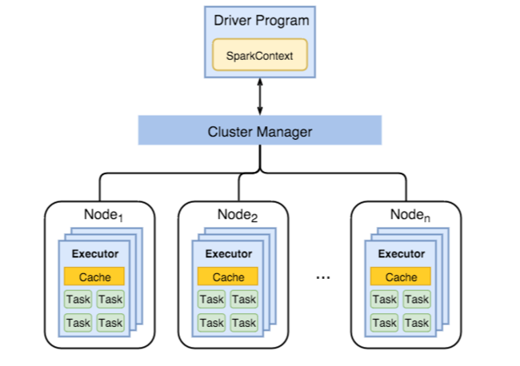
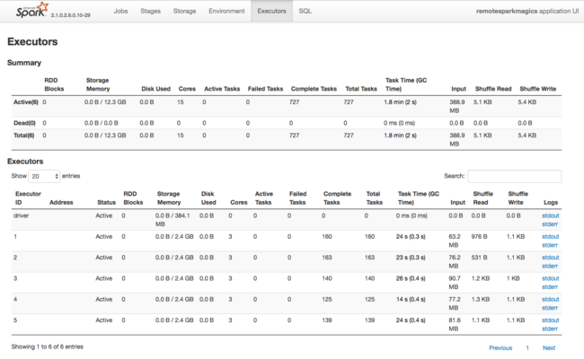
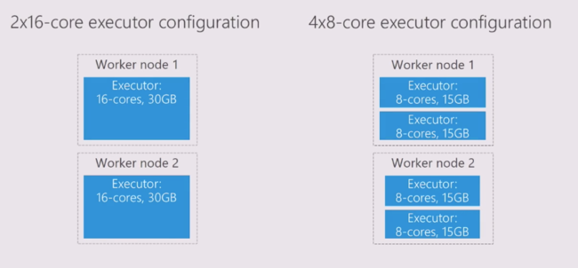

# Configure Apache Spark settings

An HDInsight Spark cluster includes an installation of the Apache Spark library.  Each HDInsight cluster includes default configuration parameters for all its installed services, including Spark.  A key aspect of managing an HDInsight Apache Hadoop cluster is monitoring workload, including Spark Jobs. To best run Spark jobs, consider the physical cluster configuration when determining the cluster's logical configuration.

The default HDInsight Apache Spark cluster includes the following nodes: three Apache ZooKeeper nodes, two head nodes, and one or more worker nodes:


The number of VMs, and VM sizes, for the nodes in your HDInsight cluster can affect your Spark configuration. Non-default HDInsight configuration values often require non-default Spark configuration values. When you create an HDInsight Spark cluster, you're shown suggested VM sizes for each of the components. Currently the [Memory-optimized Linux VM sizes](../../virtual-machines/linux/sizes-memory.md) for Azure are D12 v2 or greater.

## Apache Spark versions

Use the best Spark version for your cluster.  The HDInsight service includes several versions of both Spark and HDInsight itself.  Each version of Spark includes a set of default cluster settings.  

When you create a new cluster, there are multiple Spark versions to choose from. To see the full list,  [HDInsight Components and Versions](https://docs.microsoft.com/azure/hdinsight/hdinsight-component-versioning).

> [!NOTE]  
> The default version of Apache Spark in the HDInsight service may change without notice. If you have a version dependency, Microsoft recommends that you specify that particular version when you create clusters using .NET SDK, Azure PowerShell, and Azure Classic CLI.

Apache Spark has three system configuration locations:

* Spark properties control most application parameters and can be set by using a `SparkConf` object, or through Java system properties.
* Environment variables can be used to set per-machine settings, such as the IP address, through the `conf/spark-env.sh` script on each node.
* Logging can be configured through `log4j.properties`.

When you select a particular version of Spark, your cluster includes the default configuration settings.  You can change the default Spark configuration values by using a custom Spark configuration file.  An example is shown below.

```
spark.hadoop.io.compression.codecs org.apache.hadoop.io.compress.GzipCodec
spark.hadoop.mapreduce.input.fileinputformat.split.minsize 1099511627776
spark.hadoop.parquet.block.size 1099511627776
spark.sql.files.maxPartitionBytes 1099511627776
spark.sql.files.openCostInBytes 1099511627776
```

The example shown above overrides several default values for five Spark configuration parameters.  These values are the compression codec, Apache Hadoop MapReduce split minimum size and parquet block sizes. Also, the Spar SQL partition and open file sizes default values.  These configuration changes are chosen because the associated data and jobs (in this example, genomic data) have particular characteristics. These characteristics will do better using these custom configuration settings.

---

## View cluster configuration settings

Verify the current HDInsight cluster configuration settings before you do performance optimization on the cluster. Launch the HDInsight Dashboard from the Azure portal by clicking the **Dashboard** link on the Spark cluster pane. Sign in with the cluster administrator's username and password.

The Apache Ambari Web UI appears, with a dashboard of key cluster resource usage metrics.  The Ambari Dashboard shows you the Apache Spark configuration, and other installed services. The Dashboard includes a **Config History** tab, where you view information for installed services, including Spark.

To see configuration values for Apache Spark, select **Config History**, then select **Spark2**.  Select the **Configs** tab, then select the `Spark` (or `Spark2`, depending on your version) link in the service list.  You see a list of configuration values for your cluster:


To see and change individual Spark configuration values, select any link with "spark" in the title.  Configurations for Spark include both custom and advanced configuration values in these categories:

* Custom Spark2-defaults
* Custom Spark2-metrics-properties
* Advanced Spark2-defaults
* Advanced Spark2-env
* Advanced spark2-hive-site-override

If you create a non-default set of configuration values, your update history is visible.  This configuration history can be helpful to see which non-default configuration has optimal performance.

> [!NOTE]  
> To see, but not change, common Spark cluster configuration settings, select the **Environment** tab on the top-level **Spark Job UI** interface.

## Configuring Spark executors

The following diagram shows key Spark objects: the driver program and its associated Spark Context, and the cluster manager and its *n* worker nodes.  Each worker node includes an Executor, a cache, and *n* task instances.



Spark jobs use worker resources, particularly memory, so it's common to adjust Spark configuration values for worker node Executors.

Three key parameters that are often adjusted to tune Spark configurations to improve application requirements are `spark.executor.instances`, `spark.executor.cores`, and `spark.executor.memory`. An Executor is a process launched for a Spark application. An Executor runs on the worker node and is responsible for the tasks for the application. The number of worker nodes and worker node size determines the number of executors, and executor sizes. These values are stored in `spark-defaults.conf` on the cluster head nodes.  You can edit these values in a running cluster by selecting **Custom spark-defaults** in the Ambari web UI.  After you make changes, you're prompted by the UI to **Restart** all the affected services.

> [!NOTE]  
> These three configuration parameters can be configured at the cluster level (for all applications that run on the cluster) and also specified for each individual application.

Another source of information about resources used by Spark Executors is the Spark Application UI.  In the UI,  **Executors** displays Summary and Detail views of the configuration and consumed resources.  Determine whether to change executors values for entire cluster, or particular set of job executions.



Or you can use the Ambari REST API to programmatically verify HDInsight and Spark cluster configuration settings.  More information is available at the [Apache Ambari API reference on GitHub](https://github.com/apache/ambari/blob/trunk/ambari-server/docs/api/v1/index.md).

Depending on your Spark workload, you may determine that a non-default Spark configuration provides more optimized Spark job executions.  Do benchmark testing with sample workloads to validate any non-default cluster configurations.  Some of the common parameters that you may consider adjusting are:

|Parameter |Description|
|---|---|
|--num-executors|Sets the number of executors.|
|--executor-cores|Sets the number of cores for each executor. We recommend using middle-sized executors, as other processes also consume some portion of the available memory.|
|--executor-memory|Controls the memory size (heap size) of each executor on Apache Hadoop YARN, and you'll need to leave some memory for execution overhead.|

Here is an example of two worker nodes with different configuration values:



The following list shows key Spark executor memory parameters.

|Parameter |Description|
|---|---|
|spark.executor.memory|Defines the total amount of memory available for an executor.|
|spark.storage.memoryFraction|(default ~60%) defines the amount of memory available for storing persisted RDDs.|
|spark.shuffle.memoryFraction|(default ~20%) defines the amount of memory reserved for shuffle.|
|spark.storage.unrollFraction and spark.storage.safetyFraction|(totaling ~30% of total memory) - these values are used internally by Spark and shouldn't be changed.|

YARN controls the maximum sum of memory used by the containers on each Spark node. The following diagram shows the per-node relationships between YARN configuration objects and Spark objects.


## Change parameters for an application running in Jupyter notebook

Spark clusters in HDInsight include a number of components by default. Each of these components includes default configuration values, which can be overridden as needed.

|Component |Description|
|---|---|
|Spark Core|Spark Core, Spark SQL, Spark streaming APIs, GraphX, and Apache Spark MLlib.|
|Anaconda|A python package manager.|
|Apache Livy|The Apache Spark REST API, used to submit remote jobs to an HDInsight Spark cluster.|
|Jupyter and Apache Zeppelin notebooks|Interactive browser-based UI for interacting with your Spark cluster.|
|ODBC driver|Connects Spark clusters in HDInsight to business intelligence (BI) tools such as Microsoft Power BI and Tableau.|

For applications running in the Jupyter notebook, use the `%%configure` command to make configuration changes from within the notebook itself. These configuration changes will be applied to the Spark jobs run from your notebook instance. Make such changes at the beginning of the application, before you run your first code cell. The changed configuration is applied to the Livy session when it gets created.

> [!NOTE]  
> To change the configuration at a later stage in the application, use the `-f` (force) parameter. However, all progress in the application will be lost.

The code below shows how to change the configuration for an application running in a Jupyter notebook.

```
%%configure
{"executorMemory": "3072M", "executorCores": 4, "numExecutors":10}
```

## Conclusion

Monitor core configuration settings to ensure your Spark jobs run in a predictable and performant way. These settings help determine the best Spark cluster configuration for your particular workloads.  You'll also need to monitor the execution of long-running and, or resource-consuming Spark job executions.  The most common challenges center around memory pressure from improper configurations, such as incorrectly sized executors. Also, long-running operations, and tasks, which result in Cartesian operations.

## Next steps

* [Apache Hadoop components and versions available with HDInsight?](../hdinsight-component-versioning.md)
* [Manage resources for an Apache Spark cluster on HDInsight](apache-spark-resource-manager.md)
* [Apache Spark Configuration](https://spark.apache.org/docs/latest/configuration.html)
* [Running Apache Spark on Apache Hadoop YARN](https://spark.apache.org/docs/latest/running-on-yarn.html)
