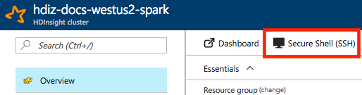
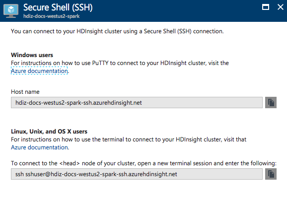

# Run Apache Spark from the Spark Shell

An interactive [Apache Spark](https://spark.apache.org/) Shell provides a REPL (read-execute-print loop) environment for running Spark commands one at a time and seeing the results. This process is useful for development and debugging. Spark provides one shell for each of its supported languages: Scala, Python, and R.

## Get to an Apache Spark Shell with SSH

Access an Apache Spark Shell on HDInsight by connecting to the primary head node of the cluster using SSH:

     ssh <sshusername>@<clustername>-ssh.azurehdinsight.net

You can get the complete SSH command for your cluster from the Azure portal:

1. Log in to the [Azure portal](https://portal.azure.com).
2. Navigate to the pane for your HDInsight Spark cluster.
3. Select Secure Shell (SSH).

    

4. Copy the displayed SSH command and run it in your terminal.

    

For details on using SSH to connect to HDInsight, see [Use SSH with HDInsight](../hdinsight-hadoop-linux-use-ssh-unix.md).

## Run an Apache Spark Shell

Spark provides shells for Scala (spark-shell), Python (pyspark), and R (sparkR). In your SSH session at the head node of your HDInsight cluster, enter one of the following commands:

    ./bin/spark-shell
    ./bin/pyspark
    ./bin/sparkR

Now you can enter Spark commands in the appropriate language.

## SparkSession and SparkContext instances

By default when you run the Spark Shell, instances of SparkSession and SparkContext are automatically instantiated for you.

To access the SparkSession instance, enter `spark`. To access the SparkContext instance, enter `sc`.

## Important shell parameters

The Spark Shell command (`spark-shell`, `pyspark`, or `sparkR`) supports many command-line parameters. To see a full list of parameters, start the Spark Shell with the switch `--help`. Note that some of these parameters may only apply to `spark-submit`, which the Spark Shell wraps.

| switch | description | example |
| --- | --- | --- |
| --master MASTER_URL | Specifies the master URL. In HDInsight, this value is always `yarn`. | `--master yarn`|
| --jars JAR_LIST | Comma-separated list of local jars to include on the driver and executor classpaths. In HDInsight, this list is composed of paths to the default filesystem in Azure Storage or Data Lake Storage. | `--jars /path/to/examples.jar` |
| --packages MAVEN_COORDS | Comma-separated list of maven coordinates of jars to include on the driver and executor classpaths. Searches the local maven repo, then maven central, then any additional remote repositories specified with `--repositories`. The format for the coordinates is *groupId*:*artifactId*:*version*. | `--packages "com.microsoft.azure:azure-eventhubs:0.14.0"`|
| --py-files LIST | For Python only, a comma-separated list of .zip, .egg, or .py files to place on the PYTHONPATH. | `--pyfiles "samples.py"` |

## Next steps

- See [Introduction to Apache Spark on Azure HDInsight](apache-spark-overview.md) for an overview.
- See [Create an Apache Spark cluster in Azure HDInsight](apache-spark-jupyter-spark-sql.md) to work with Spark clusters and SparkSQL.
- See [What is Apache Spark Structured Streaming?](apache-spark-streaming-overview.md) to write applications that process streaming data with Spark.
