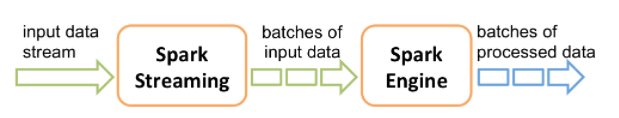
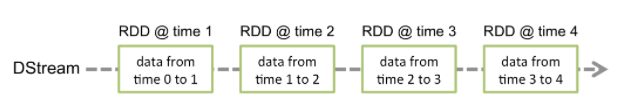
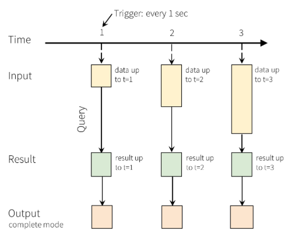
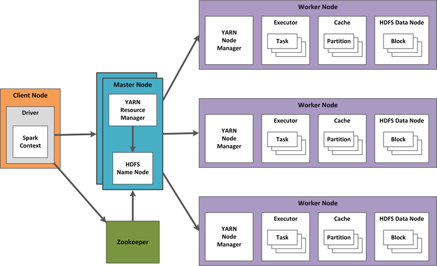

# Create high-availability Apache Spark Streaming jobs with YARN

[Apache Spark](https://spark.apache.org/) Streaming enables you to implement scalable, high-throughput, fault-tolerant applications for data streams processing. You can connect Spark Streaming applications on a HDInsight Spark cluster to a variety of data sources, such as Azure Event Hubs, Azure IoT Hub, [Apache Kafka](https://kafka.apache.org/), [Apache Flume](https://flume.apache.org/), Twitter, [ZeroMQ](http://zeromq.org/), raw TCP sockets, or by monitoring the [Apache Hadoop HDFS](https://hadoop.apache.org/docs/r1.2.1/hdfs_design.html) filesystem for changes. Spark Streaming supports fault tolerance with the guarantee that any given event is processed exactly once, even with a node failure.

Spark Streaming creates long-running jobs during which you are able to apply transformations to the data and then push the results out to filesystems, databases, dashboards, and the console. Spark Streaming processes micro-batches of data, by first collecting a batch of events over a defined time interval. Next, that batch is sent on for processing and output. Batch time intervals are typically defined in fractions of a second.



## DStreams

Spark Streaming represents a continuous stream of data using a *discretized stream* (DStream). This DStream can be created from input sources like Event Hubs or Kafka, or by applying transformations on another DStream. When an event arrives at your Spark Streaming application, the event is stored in a reliable way. That is, the event data is replicated so that multiple nodes have a copy of it. This ensures that the failure of any single node will not result in the loss of your event.

The Spark core uses *resilient distributed datasets* (RDDs). RDDs distribute data across multiple nodes in the cluster, where each node generally maintains its data completely in-memory for best performance. Each RDD represents events collected over a batch interval. When the batch interval elapses, Spark Streaming produces a new RDD containing all the data in that interval. This continuous set of RDDs is collected into a DStream. A Spark Streaming application processes the data stored in each batch's RDD.



## Spark Structured Streaming jobs

Spark Structured Streaming was introduced in Spark 2.0 as an analytic engine for use on streaming structured data. Spark Structured Streaming uses the SparkSQL batching engine APIs. As with Spark Streaming, Spark Structured Streaming runs its computations over continuously-arriving micro-batches of data. Spark Structured Streaming represents a stream of data as an Input Table with unlimited rows. That is, the Input Table continues to grow as new data arrives. This Input Table is continuously processed by a long running query, and the results are written out to an Output Table.



In Structured Streaming, data arrives at the system and is immediately ingested into the Input Table. You write queries that perform operations against this Input Table. The query output yields another table, called the Results Table. The Results Table contains results of your query, from which you draw data to send to an external datastore such a relational database. The *trigger interval* sets the timing for when data is processed from the Input Table. By default, Structured Streaming processes the data as soon as it arrives. However, you can also configure the trigger to run on a longer interval, so the streaming data is processed in time-based batches. The data in the Results Table may be completely refreshed each time there is new data so that it includes all of the output data since the streaming query began (*complete mode*), or it may only contain just the data that is new since the last time the query was processed (*append mode*).

## Create fault-tolerant Spark Streaming jobs

To create a highly-available environment for your Spark Streaming jobs, start by coding your individual jobs for recovery in the event of failure. Such self-recovering jobs are fault-tolerant.

RDDs have several properties that assist highly-available and fault-tolerant Spark Streaming jobs:

* Batches of input data stored in RDDs as a DStream are automatically replicated in memory for fault-tolerance.
* Data lost due to worker failure can be recomputed from replicated input data on different workers, as long as those worker nodes are available.
* Fast Fault Recovery can occur within one second, as recovery from faults/stragglers happens via computation in memory.

### Exactly-once semantics with Spark Streaming

To create an application that processes each event once (and only once), consider how all system points of failure restart after having an issue, and how you can avoid data loss. Exactly-once semantics require that no data is lost at any point, and that message processing is restartable, regardless of where the failure occurs. See [Create Spark Streaming jobs with exactly-once event processing](apache-spark-streaming-exactly-once.md).

## Spark Streaming and Apache Hadoop YARN

In HDInsight, cluster work is coordinated by *Yet Another Resource Negotiator* (YARN). Designing high availability for Spark Streaming includes techniques for Spark Streaming, and also for YARN components.  An example configuration using YARN is shown below. 



The following sections describe design considerations for this configuration.

### Plan for failures

To create a YARN configuration for high-availability, you should plan for a possible executor or driver failure. Some Spark Streaming jobs also include data guarantee requirements that need additional configuration and setup. For example, a streaming application may have a business requirement for a zero-data-loss guarantee despite any error that occurs in the hosting streaming system or HDInsight cluster.

If an **executor** fails, its tasks and receivers are restarted by Spark automatically, so there is no configuration change needed.

However, if a **driver** fails, then all of its associated executors fail, and all received blocks and computation results are lost. To recover from a driver failure, use *DStream checkpointing* as described in [Create Spark Streaming jobs with exactly-once event processing](apache-spark-streaming-exactly-once.md#use-checkpoints-for-drivers). DStream checkpointing periodically saves the *directed acyclic graph* (DAG) of DStreams to fault-tolerant storage such as Azure Storage.  Checkpointing allows Spark Structured Streaming to restart the failed driver from the checkpoint information.  This driver restart launches new executors and also restarts receivers.

To recover drivers with DStream checkpointing:

* Configure automatic driver restart on YARN with the configuration setting `yarn.resourcemanager.am.max-attempts`.
* Set a checkpoint directory in an HDFS-compatible file system with `streamingContext.checkpoint(hdfsDirectory)`.
* Restructure source code to use checkpoints for recovery, for example:

    ```scala
        def creatingFunc() : StreamingContext = {
            val context = new StreamingContext(...)
            val lines = KafkaUtils.createStream(...)
            val words = lines.flatMap(...)
            ...
            context.checkpoint(hdfsDir)
        }

        val context = StreamingContext.getOrCreate(hdfsDir, creatingFunc)
        context.start()
    ```

* Configure lost data recovery by enabling the write-ahead log (WAL) with `sparkConf.set("spark.streaming.receiver.writeAheadLog.enable","true")`, and disable in-memory replication for input DStreams with `StorageLevel.MEMORY_AND_DISK_SER`.

To summarize, using checkpointing + WAL + reliable receivers, you will be able to deliver "at least once" data recovery:

* Exactly once, so long as received data is not lost and the outputs are either idempotent or transactional.
* Exactly once, with the new Kafka Direct approach which uses Kafka as a replicated log, rather than using receivers or WALs.

### Typical concerns for high availability

* It is more difficult to monitor streaming jobs than batch jobs. Spark Streaming jobs are typically long-running, and YARN doesn't aggregate logs until a job finishes.  Spark checkpoints are lost during application or Spark upgrades, and you'll need to clear the checkpoint directory during an upgrade.

* Configure your YARN cluster mode to run drivers even if a client fails. To set up automatic restart for drivers:

    ```
    spark.yarn.maxAppAttempts = 2
    spark.yarn.am.attemptFailuresValidityInterval=1h
    ```

* Spark and the Spark Streaming UI have a configurable metrics system. You can also use additional libraries, such as Graphite/Grafana to download dashboard metrics such as 'num records processed', 'memory/GC usage on driver & executors', 'total delay', 'utilization of the cluster' and so forth. In Structured Streaming version 2.1 or greater, you can use `StreamingQueryListener` to gather additional metrics.

* You should segment long-running jobs.  When a Spark Streaming application is submitted to the cluster, the YARN queue where the job runs must be defined. You can use a [YARN Capacity Scheduler](https://hadoop.apache.org/docs/stable/hadoop-yarn/hadoop-yarn-site/CapacityScheduler.html) to submit long-running jobs to separate queues.

* Shut down your streaming application gracefully. If your offsets are known, and all application state is stored externally, then you can programmatically stop your streaming application at the appropriate place. One technique is to use "thread hooks" in Spark, by checking for an external flag every *n* seconds. You can also use a *marker file* that is created on HDFS when starting the application, then removed when you want to stop. For a marker file approach, use a separate thread in your Spark application that calls code similar to this:

    ```scala
    streamingContext.stop(stopSparkContext = true, stopGracefully = true)
    // to be able to recover on restart, store all offsets in an external database
    ```

## Next steps

* [Apache Spark Streaming Overview](apache-spark-streaming-overview.md)
* [Create Apache Spark Streaming jobs with exactly-once event processing](apache-spark-streaming-exactly-once.md)
* [Long-running Apache Spark Streaming Jobs on YARN](https://mkuthan.github.io/blog/2016/09/30/spark-streaming-on-yarn/) 
* [Structured Streaming: Fault Tolerant Semantics](https://spark.apache.org/docs/2.1.0/structured-streaming-programming-guide.html#fault-tolerance-semantics)
* [Discretized Streams: A Fault-Tolerant Model for Scalable Stream Processing](https://www2.eecs.berkeley.edu/Pubs/TechRpts/2012/EECS-2012-259.pdf)
