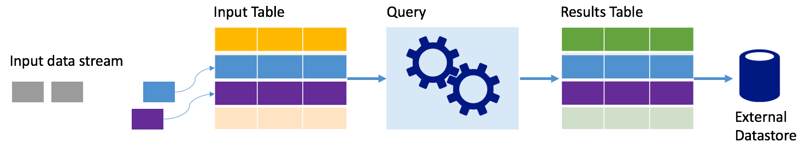
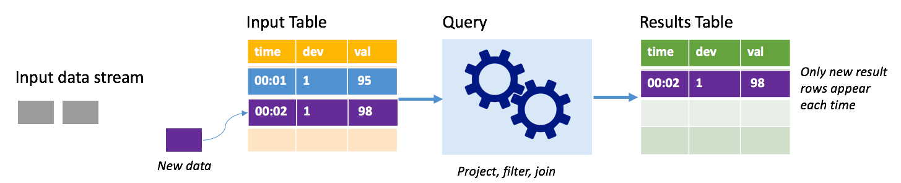
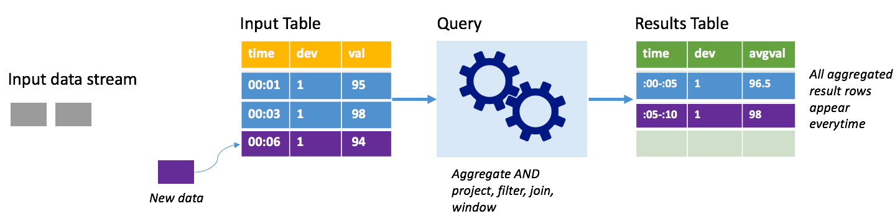
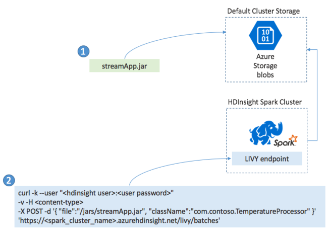

# Overview of Apache Spark Structured Streaming

[Apache Spark](https://spark.apache.org/) Structured Streaming enables you to implement scalable, high-throughput, fault-tolerant applications for  processing  data streams. Structured Streaming is built upon the Spark SQL engine, and improves upon the constructs from Spark SQL Data Frames and Datasets so  you can write streaming queries in the same way you would write batch queries.  

Structured Streaming applications run on HDInsight Spark clusters, and connect  to  streaming data from [Apache Kafka](https://kafka.apache.org/), a TCP socket (for debugging purposes), Azure Storage, or Azure Data Lake Storage. The latter two options, which rely on external storage services, enable you to watch for new files added into storage and process their contents as if they were streamed. 

Structured Streaming creates a long-running query during which you  apply operations to the input data, such as selection, projection, aggregation, windowing, and joining the streaming DataFrame with reference DataFrames. Next, you output the results to file storage (Azure Storage Blobs or Data Lake Storage) or to any datastore by using custom code (such as SQL Database or Power BI). Structured Streaming also provides output to the console for debugging locally, and to an in-memory table so you can see the data generated for debugging in HDInsight. 

> [!NOTE]  
> Spark Structured Streaming is  replacing Spark Streaming (DStreams). Going forward, Structured Streaming will receive enhancements and maintenance, while DStreams will be in maintenance mode only. Structured Streaming is currently not as feature-complete as DStreams for the sources and sinks that it supports out of the box, so evaluate your requirements to choose the appropriate Spark stream processing option. 

## Streams as tables

Spark Structured Streaming represents a stream of data  as a table that is unbounded in depth, that is, the table  continues to grow as new data arrives. This *input table* is continuously processed by a long-running query, and the results sent to an *output table*:

In Structured Streaming, data arrives at the system and is immediately ingested into an input table. You write queries (using the DataFrame and Dataset APIs) that perform operations against this input table. The query output yields another table,  the *results table*. The results table contains the results of your query, from which you draw data for an external datastore, such a relational database. The timing of when data is processed from the input table is controlled by the *trigger interval*. By default, the trigger interval is zero, so Structured Streaming tries to process the data as soon as it arrives. In practice, this means that as soon as Structured Streaming is done processing the run of the previous query, it starts another processing run against any newly received data. You can configure the trigger to run at an interval, so that the streaming data is processed in time-based batches. 

The data in the results tables  may  contain only the data that is new since the last time the query was processed (*append mode*), or the table may be completely refreshed every time there is new data so the table includes all of the output data since the streaming query began (*complete mode*).

### Append mode

In append mode, only the rows added to the results table since the last query run are present in the results table and written to external storage. For example,  the simplest query  just copies all data from the input table to the results table unaltered. Each time a trigger interval elapses, the new data is processed and the rows representing that new data appear in the results table. 

Consider a scenario where you are processing telemetry from temperature sensors, such as a  thermostat. Assume the first trigger processed one event at time 00:01 for device 1 with a temperature reading of 95 degrees. In the first trigger of the query, only the row with time 00:01  appears in the results table. At time 00:02 when another event arrives,  the only new row is the row with time 00:02 and so the results table would contain only that one row.

When using append mode, your query would be applying projections (selecting the columns it cares about), filtering (picking only rows that match certain conditions) or joining (augmenting the data with data from a static lookup table). Append mode  makes it easy to push only the relevant new data points out to external storage.

### Complete mode

Consider the same scenario, this time using  complete mode. In complete mode, the entire output table is refreshed on every trigger so the table includes data not just from the most recent trigger run, but from all runs. You could use  complete mode to copy the data unaltered from the input table to the results table. On every triggered run, the new result rows  appear along with all the previous rows. The output results table will end up storing all of the data collected since the query began, and  you would eventually run out of memory. Complete mode is intended for use with aggregate queries that  summarize the incoming data in some way, and so on every trigger the results table is updated with a new summary. 

Assume so far there are five seconds' worth of data already processed, and it is time to   process the data for the sixth second. The input table has  events for time 00:01 and time 00:03. The goal of this example query is to give the average temperature of the device every five seconds. The implementation of this query  applies an aggregate that takes all of the values that fall within each 5-second window,  averages the temperature, and produces a row for  the average temperature over that interval. At the end of the first 5-second window, there are two tuples: (00:01, 1, 95) and (00:03, 1, 98). So for the window 00:00-00:05 the aggregation produces  a tuple with the average temperature of 96.5 degrees. In the next 5-second window, there is only  one data point at time 00:06, so the resulting average temperature is 98 degrees. At time 00:10, using complete mode, the results table has the rows for both windows 00:00-00:05 and 00:05-00:10 because the query  outputs all the aggregated rows, not just the new ones. Therefore the results table continues to grow as new windows are added.    

Not all queries using complete mode will  cause the table to grow without bounds.  Consider in the previous example that rather than averaging the temperature by time window, it averaged instead by device ID. The result table  contains a fixed number of rows (one per device) with the average temperature for the device across all data points received from that device. As new temperatures are received, the results table is updated so that the averages in the table are always current. 

## Components of a Spark Structured Streaming application

A simple example query can summarize the temperature readings by hour-long windows. In this case, the data  is stored in JSON files in Azure Storage (attached as the default storage for the HDInsight cluster):

    {"time":1469501107,"temp":"95"}
    {"time":1469501147,"temp":"95"}
    {"time":1469501202,"temp":"95"}
    {"time":1469501219,"temp":"95"}
    {"time":1469501225,"temp":"95"}

These JSON files are stored in the `temps` subfolder underneath  the HDInsight cluster's container. 

### Define the input source

First configure a DataFrame that describes the source of the data and any settings required by that source. This example draws from the JSON files in Azure Storage and applies a schema to them at read time.

    import org.apache.spark.sql.types._
    import org.apache.spark.sql.functions._

    //Cluster-local path to the folder containing the JSON files
    val inputPath = "/temps/" 

    //Define the schema of the JSON files as having the "time" of type TimeStamp and the "temp" field of type String
    val jsonSchema = new StructType().add("time", TimestampType).add("temp", StringType)

    //Create a Streaming DataFrame by calling readStream and configuring it with the schema and path
    val streamingInputDF = spark.readStream.schema(jsonSchema).json(inputPath) 

#### Apply the query

Next,  apply a query that contains the desired operations against the Streaming DataFrame. In this case, an aggregation groups all the rows into 1-hour windows, and then computes the minimum, average, and maximum temperatures in that 1-hour window.

    val streamingAggDF = streamingInputDF.groupBy(window($"time", "1 hour")).agg(min($"temp"), avg($"temp"), max($"temp"))

### Define the output sink

Next,  define the destination for the rows that are added to the results table within each trigger interval. This example  just outputs all  rows to an in-memory table `temps` that you can later query with SparkSQL. Complete  output mode ensures that all rows for all windows are output every time.

    val streamingOutDF = streamingAggDF.writeStream.format("memory").queryName("temps").outputMode("complete") 

### Start the query

Start the streaming query and run until a termination signal is received. 

    val query = streamingOutDF.start()  

### View the results

While the query is running, in the same SparkSession, you can run a SparkSQL query against the `temps` table where the query results are stored. 

    select * from temps

This query  yields results similar to the following:

| window |	min(temp) |	avg(temp) |	max(temp) |
| --- | --- | --- | --- |
|{u'start': u'2016-07-26T02:00:00.000Z', u'end'... |	95 |	95.231579 |	99 |
|{u'start': u'2016-07-26T03:00:00.000Z', u'end'...	|95 |	96.023048 |	99 |
|{u'start': u'2016-07-26T04:00:00.000Z', u'end'...	|95 |	96.797133 |	99 |
|{u'start': u'2016-07-26T05:00:00.000Z', u'end'...	|95 |	96.984639 |	99 |
|{u'start': u'2016-07-26T06:00:00.000Z', u'end'...	|95 |	97.014749 |	99 |
|{u'start': u'2016-07-26T07:00:00.000Z', u'end'...	|95 |	96.980971 |	99 |
|{u'start': u'2016-07-26T08:00:00.000Z', u'end'...	|95 |	96.965997 |	99 |  

For details on the Spark Structured Stream API, along with the input data sources, operations, and output sinks it supports, see [Apache Spark Structured Streaming Programming Guide](https://spark.apache.org/docs/2.1.0/structured-streaming-programming-guide.html).

## Checkpointing and write-ahead logs

To deliver resiliency and fault tolerance, Structured Streaming relies on *checkpointing* to ensure that stream processing can continue uninterrupted, even with node failures. In HDInsight, Spark creates checkpoints to durable storage, either Azure Storage or Data Lake Storage. These checkpoints store the progress information about the streaming query. In addition, Structured Streaming uses a *write-ahead log* (WAL). The  WAL  captures ingested data that has been received but not yet processed by a query. If  a failure occurs and processing is restarted from the WAL, any events received from the source are not lost.

## Deploying Spark Streaming applications

You typically build a Spark Streaming application locally into a JAR file and then deploy it to Spark on HDInsight by copying the JAR file  to the default storage attached to your HDInsight cluster. You can start your application  with the [Apache Livy](https://livy.incubator.apache.org/) REST APIs available from your cluster using  a POST operation. The body of the POST includes a JSON document that provides the path to your JAR, the name of the class whose main method defines and runs the streaming application, and optionally the resource requirements of the job (such as the number of executors, memory and cores), and any configuration settings your application code requires.

The status of all applications can also be checked with a GET request against a LIVY endpoint. Finally, you can terminate a running application by issuing a DELETE request against the LIVY endpoint. For details on the LIVY API, see [Remote jobs with Apache LIVY](apache-spark-livy-rest-interface.md)

## Next steps

* [Create an Apache Spark cluster in HDInsight](../hdinsight-hadoop-create-linux-clusters-portal.md)
* [Apache Spark Structured Streaming Programming Guide](https://spark.apache.org/docs/2.1.0/structured-streaming-programming-guide.html)
* [Launch Apache Spark jobs remotely with Apache LIVY](apache-spark-livy-rest-interface.md)
